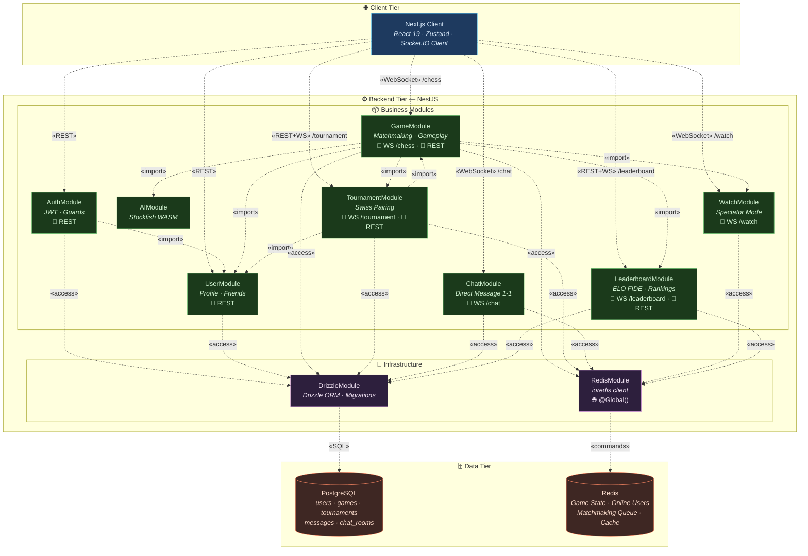
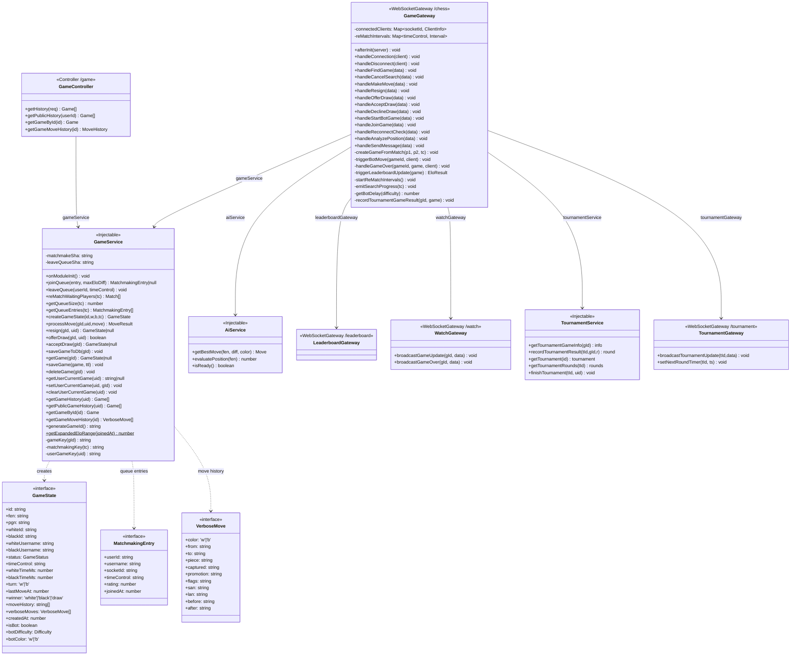
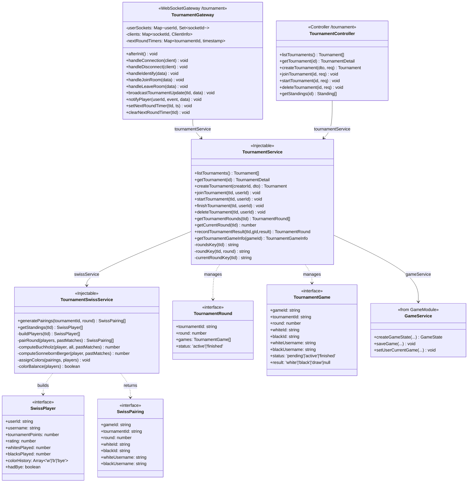
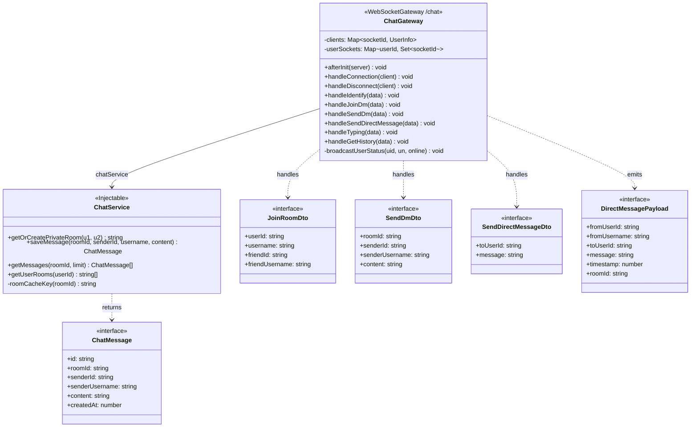
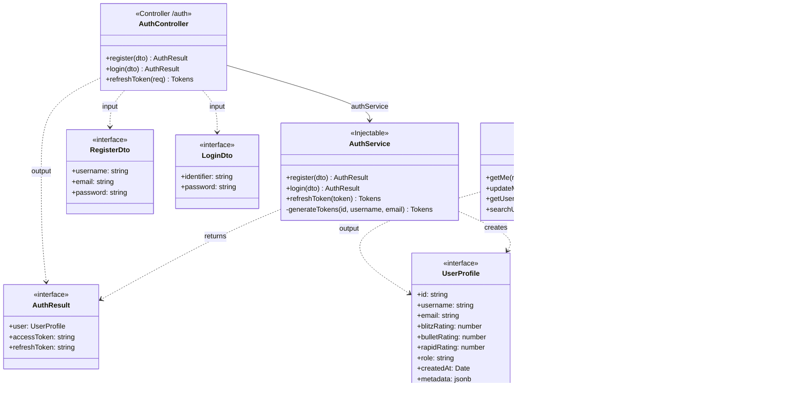
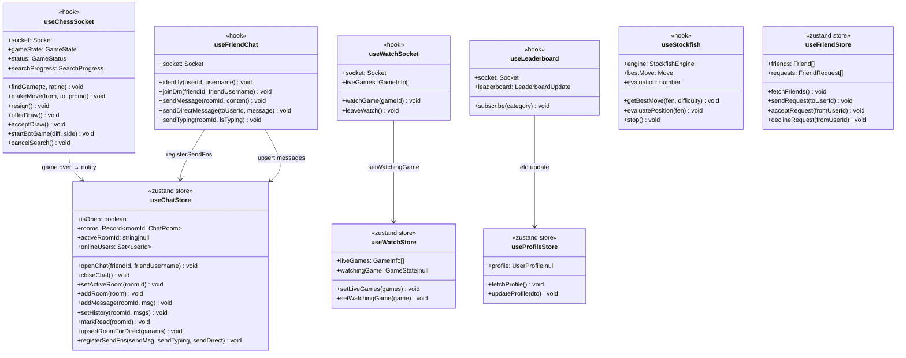
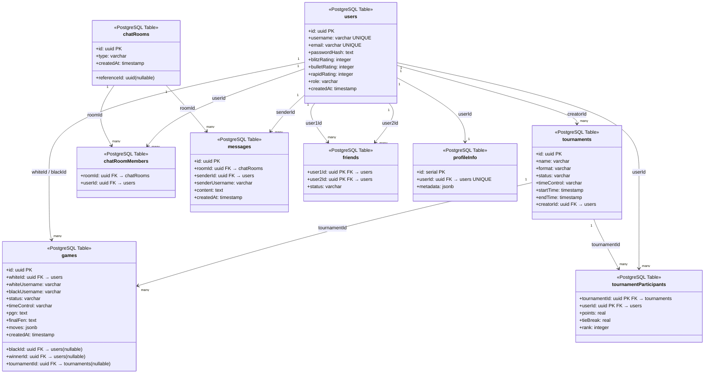

# Sơ Đồ Hệ Thống (Subsystem / Package Diagram)

## ✅ Kết Quả Kiểm Tra Khớp Code (2026-06-12)

| Module trong Sơ Đồ | File code tương ứng | Trạng thái |
|---|---|---|
| `Auth_Module` | `backend/src/auth/auth.module.ts` | ✅ Khớp |
| `User_Module` | `backend/src/user/user.module.ts` | ✅ Khớp |
| `Matchmaking_Module` | `backend/src/game/game.service.ts` (Lua scripts + queue) | ✅ Khớp (nằm trong GameModule) |
| `Gameplay_Module` | `backend/src/game/game.service.ts` (processMove, resign, draw) | ✅ Khớp (nằm trong GameModule) |
| `Tournament_Module` | `backend/src/tournament/tournament.module.ts` | ✅ Khớp |
| `Chat_Module` | `backend/src/chat/chat.module.ts` | ✅ Khớp |
| `Watch_Module` | `backend/src/watch/watch.module.ts` | ✅ Khớp |
| `AI_Module` | `backend/src/ai/ai.module.ts` | ✅ Khớp (import bởi GameModule) |
| `Leaderboard_Module` | `backend/src/leaderboard/leaderboard.module.ts` | ✅ Khớp |
| `Redis_Module` | `backend/src/redis/redis.module.ts` | ✅ Khớp (`@Global()`) |
| `Database_Access_Layer` | `backend/src/drizzle/drizzle.module.ts` | ✅ Khớp |

> **Kết luận**: Sơ đồ subsystem **đã được hiệu chỉnh** (2026-06-12): sửa chiều phụ thuộc, bổ sung Gateway namespaces, trình bày lại theo chuẩn UML Package Diagram với `«stereotype»`.

---

## 1. Subsystem / Package Diagram (Tổng Quan Hệ Thống)

---

> **Ghi chú:**
> - **`«stereotype»`** trên mũi tên thể hiện **kiểu quan hệ** trong UML Package Diagram.
> - **`«REST»`** = HTTP REST API (Controller); **`«WebSocket» /ns`** = Real-time Gateway với namespace.
> - **`«import»`** = Module A import Module B (A phụ thuộc vào B). VD: `GameModule` import `AiModule`.
> - **`«access»`** = Module truy cập vào tầng Infrastructure (Database / Cache).
> - **`«commands»`** / **`«SQL»`** = Giao tiếp ở mức protocol tới Data Store.
> - `📡 REST` / `🔌 WS` / `🌐 @Global()` trong label là icon chỉ **kênh giao tiếp** của từng module.
> - `Matchmaking` + `Gameplay` được gộp trong `GameModule` để giản lược; trong code chúng nằm trong `game.service.ts` + `game.gateway.ts`.
> - `AiModule` được import **duy nhất** bởi `GameModule` (không có trong `app.module.ts`), nên có mũi tên `«import»` từ `GameModule` → `AiModule`.
> - Gateway namespaces: `/chess` (GameGateway), `/watch` (WatchGateway), `/chat` (ChatGateway), `/tournament` (TournamentGateway), `/leaderboard` (LeaderboardGateway).
> - `RedisModule` được đánh dấu `@Global()` → tự động khả dụng trong mọi module, nhưng sơ đồ vẫn thể hiện `«access»` để làm rõ module nào **thực sự sử dụng** Redis.

---

## 2. Class Diagram Tổng Quan (Backend Core)

```mermaid
classDiagram
    direction TB

    %% ── Styles ──
    classDef gateway fill:#1b5e20,stroke:#66bb6a,color:#e8f5e9
    classDef service fill:#0d47a1,stroke:#42a5f5,color:#e3f2fd
    classDef controller fill:#e65100,stroke:#ff9800,color:#fff3e0
    classDef dto fill:#4a148c,stroke:#ce93d8,color:#f3e5f5
    classDef schema fill:#3e2723,stroke:#ff8a65,color:#ffe0d0

    %% ═══════════════════════════════════════════════════════
    %% Game Module
    %% ═══════════════════════════════════════════════════════
    class GameGateway {
        -connectedClients: Map
        -reMatchIntervals: Map
        +handleFindGame(data) void
        +handleMakeMove(data) void
        +handleResign(data) void
        +handleOfferDraw(data) void
        +handleAcceptDraw(data) void
        +handleStartBotGame(data) void
        +handleReconnectCheck(data) void
        -createGameFromMatch(p1,p2,tc) void
        -triggerBotMove(gameId, client) void
        -handleGameOver(gameId, game) void
        -triggerLeaderboardUpdate(game) object
        -startReMatchIntervals() void
        -emitSearchProgress(tc) void
    }

    class GameService {
        -matchmakeSha: string
        -leaveQueueSha: string
        +joinQueue(entry, maxDiff) MatchmakingEntry
        +leaveQueue(userId, tc) void
        +reMatchWaitingPlayers(tc) array
        +createGameState(id,w,b,tc) GameState
        +processMove(gameId,userId,move) result
        +resign(gameId, userId) GameState
        +offerDraw(gameId, userId) boolean
        +acceptDraw(gameId) GameState
        +saveGameToDb(gameId) void
        +getGame(gameId) GameState
        +saveGame(game, ttl) void
        +getGameHistory(userId) array
        +getExpandedEloRange(joinedAt)$ number
    }

    class GameController {
        +getHistory(req) array
        +getPublicHistory(userId) array
        +getGameById(id) game
        +getGameMoveHistory(id) moves
    }

    class GameState {
        +id: string
        +fen: string
        +pgn: string
        +whiteId: string
        +blackId: string
        +status: string
        +timeControl: string
        +whiteTimeMs: number
        +blackTimeMs: number
        +turn: 'w'|'b'
        +moveHistory: string[]
        +verboseMoves: VerboseMove[]
        +isBot: boolean
        +botDifficulty: string
        +botColor: 'w'|'b'
    }

    class MatchmakingEntry {
        +userId: string
        +username: string
        +socketId: string
        +timeControl: string
        +rating: number
        +joinedAt: number
    }

    %% ═══════════════════════════════════════════════════════
    %% Tournament Module
    %% ═══════════════════════════════════════════════════════
    class TournamentGateway {
        -userSockets: Map
        -clients: Map
        -nextRoundTimers: Map
        +handleJoinRoom(data) void
        +handleLeaveRoom(data) void
        +broadcastTournamentUpdate(tId, data) void
        +notifyPlayer(userId, event, data) void
        +setNextRoundTimer(tId, ts) void
    }

    class TournamentService {
        +listTournaments() array
        +getTournament(id) tournament
        +createTournament(creatorId, dto) tournament
        +joinTournament(tId, userId) void
        +startTournament(tId, userId) void
        +finishTournament(tId, userId) void
        +getTournamentRounds(tId) array
        +recordTournamentResult(tId,gId,result) round
        +getTournamentGameInfo(gameId) info
    }

    class TournamentSwissService {
        +generatePairings(tournamentId, round) SwissPairing[]
        -buildPlayers(tId) SwissPlayer[]
        -pairRound(players, pastMatches) SwissPairing[]
        -computeBuchholz(player, allPlayers, pastMatches) number
        -computeSonnebornBerger(player, pastMatches) number
        +getStandings(tId) SwissPlayer[]
    }

    class TournamentController {
        +listTournaments() array
        +getTournament(id) tournament
        +createTournament(dto, req) tournament
        +joinTournament(id, req) void
        +startTournament(id, req) void
        +deleteTournament(id, req) void
        +getStandings(id) array
    }

    %% ═══════════════════════════════════════════════════════
    %% Chat Module
    %% ═══════════════════════════════════════════════════════
    class ChatGateway {
        -clients: Map
        -userSockets: Map
        +handleIdentify(data) void
        +handleJoinDm(data) void
        +handleSendDm(data) void
        +handleSendDirectMessage(data) void
        +handleTyping(data) void
        -broadcastUserStatus(uid,un,online) void
    }

    class ChatService {
        +getOrCreatePrivateRoom(u1,u2) string
        +saveMessage(roomId,senderId,username,content) ChatMessage
        +getMessages(roomId, limit) ChatMessage[]
        +getUserRooms(userId) string[]
    }

    %% ═══════════════════════════════════════════════════════
    %% Auth + User Module
    %% ═══════════════════════════════════════════════════════
    class AuthService {
        +register(dto) AuthResult
        +login(dto) AuthResult
        +refreshToken(token) Tokens
        -generateTokens(id,un,email) Tokens
        -hashPassword(pw) string
        -comparePassword(pw, hash) boolean
    }

    class AuthController {
        +register(dto) AuthResult
        +login(dto) AuthResult
        +refreshToken(req) Tokens
    }

    class UserService {
        +getProfile(userId) UserProfile
        +updateProfile(userId, dto) UserProfile
        +getUserById(id) User
        +searchUsers(query) User[]
        +sendFriendRequest(from,to) void
        +acceptFriendRequest(from,to) void
        +getFriends(userId) Friend[]
    }

    class UserController {
        +getMe(req) UserProfile
        +updateMe(req, dto) UserProfile
        +getUserById(id) User
        +searchUsers(query) User[]
        +getFriends(req) Friend[]
        +sendFriendRequest(req, toId) void
        +acceptFriendRequest(req, fromId) void
    }

    class JwtAuthGuard {
        +canActivate(context) boolean
        -validateToken(token) payload
    }

    %% ═══════════════════════════════════════════════════════
    %% Leaderboard Module
    %% ═══════════════════════════════════════════════════════
    class LeaderboardGateway {
        -subscribedClients: Map
        +handleSubscribe(data) void
        +handleUnsubscribe() void
        +broadcastUpdate(category, data) void
    }

    class LeaderboardService {
        +updateElo(dto) void
        +getTopPlayers(category, limit, offset) LeaderboardUpdate
        +getPlayerRank(userId, category) rank
        +seedDemoData() void
    }

    %% ═══════════════════════════════════════════════════════
    %% Watch Module
    %% ═══════════════════════════════════════════════════════
    class WatchGateway {
        -spectators: Map
        +handleWatchGame(data) void
        +handleLeaveWatch(data) void
        +broadcastGameUpdate(gameId, data) void
        +broadcastGameOver(gameId, data) void
        -handleLeaveInternal(client, gameId) void
    }

    class WatchService {
        +getLiveGames() array
        +getGameInfo(gameId) info
    }

    %% ═══════════════════════════════════════════════════════
    %% AI Module
    %% ═══════════════════════════════════════════════════════
    class AiService {
        +getBestMove(fen, difficulty, color) Move
        +evaluatePosition(fen) number
        +isReady() boolean
        -initEngine() void
    }

    %% ═══════════════════════════════════════════════════════
    %% Infrastructure
    %% ═══════════════════════════════════════════════════════
    class DrizzleModule {
        +provide: DRIZZLE
        +useFactory(config) NodePgDatabase
    }

    class RedisModule {
        +provide: REDIS_CLIENT
        +useFactory(config) Redis
    }

    %% ═══════════════════════════════════════════════════════
    %% Relationships
    %% ═══════════════════════════════════════════════════════
    GameGateway ..> GameService : uses
    GameGateway ..> AiService : bot moves
    GameGateway ..> LeaderboardGateway : elo update
    GameGateway ..> WatchGateway : broadcast
    GameGateway ..> TournamentService : record result
    GameGateway ..> TournamentGateway : broadcast update
    GameController ..> GameService : uses
    GameService ..> DrizzleModule : persist
    GameService ..> RedisModule : state/queue
    GameService ..> GameState : creates
    GameService ..> MatchmakingEntry : queue entries

    TournamentGateway ..> TournamentService : uses
    TournamentController ..> TournamentService : uses
    TournamentService ..> TournamentSwissService : pairing
    TournamentService ..> GameService : create game
    TournamentService ..> DrizzleModule : persist
    TournamentService ..> RedisModule : rounds cache

    ChatGateway ..> ChatService : uses
    ChatGateway ..> RedisModule : online users
    ChatService ..> DrizzleModule : persist
    ChatService ..> RedisModule : cache messages

    AuthController ..> AuthService : uses
    AuthService ..> DrizzleModule : users table
    UserController ..> UserService : uses
    UserService ..> DrizzleModule : users/profile
    JwtAuthGuard ..> UserService : validate

    LeaderboardGateway ..> LeaderboardService : uses
    LeaderboardService ..> RedisModule : sorted sets
    LeaderboardService ..> DrizzleModule : persist elo

    WatchGateway ..> WatchService : uses
    WatchGateway ..> GameService : game state

    %% Apply styles
    class GameGateway gateway
    class TournamentGateway gateway
    class ChatGateway gateway
    class LeaderboardGateway gateway
    class WatchGateway gateway
    
    class GameService service
    class TournamentService service
    class TournamentSwissService service
    class ChatService service
    class AuthService service
    class UserService service
    class LeaderboardService service
    class WatchService service
    class AiService service

    class GameController controller
    class TournamentController controller
    class AuthController controller
    class UserController controller

    class GameState dto
    class MatchmakingEntry dto

    class DrizzleModule schema
    class RedisModule schema
```

---

## 3. Class Diagram Chi Tiết — Game Module (Matchmaking + Gameplay)

---

## 4. Class Diagram Chi Tiết — Tournament Module

---

## 5. Class Diagram Chi Tiết — Chat Module (Direct Message 1-1)

---

## 6. Class Diagram — Auth & User Module

---

## 7. Class Diagram — Frontend (Zustand Stores + Hooks)

---

## 8. Class Diagram — Database Schema (Drizzle ORM)

---

## Tóm Tắt Kiểm Tra & Class Diagram

| # | Sơ đồ | Nội dung | Trạng thái |
|---|-------|---------|------------|
| 1 | **Subsystem Diagram** | 11 modules backend + Client + Data tier | ✅ Khớp code |
| 2 | **Class Diagram Tổng Quan** | 18 classes: Gateways, Services, Controllers, DTOs | ✅ Khớp code |
| 3 | **Game Module** | GameGateway + GameService + GameController + DTOs | ✅ Khớp code |
| 4 | **Tournament Module** | TournamentGateway + Service + SwissService + Controller | ✅ Khớp code |
| 5 | **Chat Module** | ChatGateway + ChatService + DTOs (Room-based & Direct) | ✅ Khớp code |
| 6 | **Auth & User** | AuthController/Service + UserController/Service + Guard | ✅ Khớp code |
| 7 | **Frontend** | 4 hooks + 4 Zustand stores | ✅ Khớp code |
| 8 | **Database Schema** | 9 tables với relationships | ✅ Khớp Drizzle schema |

> **Ghi chú kiểm tra**:
> - `AiModule` **không** được import trực tiếp trong `app.module.ts` mà được import bởi `GameModule`. Trong sơ đồ subsystem vẫn thể hiện là module độc lập — đúng với kiến trúc thực tế.
> - `RedisModule` được đánh dấu `@Global()` → mọi module đều có thể inject `REDIS_CLIENT` mà không cần import explicit. Sơ đồ vẫn vẽ dependency để rõ ràng.
> - `Matchmaking_Module` và `Gameplay_Module` được tách làm 2 subgraph trong subsystem diagram nhưng thực tế nằm chung `GameModule` — đã ghi chú rõ trong sơ đồ.
> - Tất cả class diagram đều phản ánh đúng các method/field có trong code hiện tại (checked ngày 2026-06-12).
