# Sơ Đồ Hệ Thống (Subsystem / Package Diagram)

```mermaid
graph TB
    %% ── Style ──────────────────────────────────────────────
    classDef client fill:#1e3a5f,stroke:#4fc3f7,color:#e0f0ff
    classDef backend fill:#1b3a1b,stroke:#66bb6a,color:#d4f5d4
    classDef data fill:#3e2723,stroke:#ff8a65,color:#ffe0d0
    classDef infra fill:#2d1f3d,stroke:#ce93d8,color:#f3e5f5

    %% ======================================================
    %% CLIENT
    %% ======================================================
    subgraph Client_Tier["🌐 Client Tier"]
        NEXT["NextJS_Client_Application<br/><i>React 19 · Zustand · Socket.IO Client</i>"]
    end

    %% ======================================================
    %% BACKEND (NestJS)
    %% ======================================================
    subgraph Backend_Tier["⚙️ Backend Tier — NestJS"]
        direction TB

        subgraph Auth_Sub["🔐 Authentication"]
            AUTH["&gt; Auth_Module<br/><i>JWT · Guards · Login/Register</i>"]
        end

        subgraph User_Sub["👤 User"]
            USER["&gt; User_Module<br/><i>Profile · Friends · Manage</i>"]
        end

        subgraph Game_Sub["♟️ Game Core"]
            MATCH["&gt; Matchmaking_Module<br/><i>ELO Queue · Lua Scripts</i>"]
            GAMEPLAY["&gt; Gameplay_Module<br/><i>Moves · Clock · Validation</i>"]
        end

        subgraph Tour_Sub["🏆 Tournament"]
            TOUR["&gt; Tournament_Module<br/><i>Swiss Pairing · Standings</i>"]
        end

        subgraph Social_Sub["💬 Social"]
            CHAT["&gt; Chat_Module<br/><i>Direct Message 1-1</i>"]
            WATCH["&gt; Watch_Module<br/><i>Spectator Mode</i>"]
        end

        subgraph AI_Sub["🤖 AI"]
            AI["&gt; AI_Module<br/><i>Stockfish WASM</i>"]
        end

        subgraph Rank_Sub["📊 Ranking"]
            LB["&gt; Leaderboard_Module<br/><i>ELO FIDE · Rankings</i>"]
        end

        subgraph Infra_Sub["🔧 Infrastructure"]
            REDIS_M["&gt; Redis_Module<br/><i>Client · Lua Scripts</i>"]
        end
    end

    %% ======================================================
    %% DATA LAYER
    %% ======================================================
    subgraph Data_Tier["🗄️ Data Tier"]
        DRIZZLE["&gt; Database_Access_Layer<br/><i>Drizzle ORM · Migrations</i>"]
        PG[("PostgreSQL<br/><i>users · games · tournaments<br/>messages · chat_rooms</i>")]
        REDIS_D[("Redis<br/><i>Game State · Online Users<br/>Matchmaking Queue · Cache</i>")]
    end

    %% ======================================================
    %% RELATIONSHIPS — Client → Backend
    %% ======================================================
    NEXT -.->|"REST / WS"| AUTH
    NEXT -.->|"REST / WS"| USER
    NEXT -.->|"Socket.IO"| MATCH
    NEXT -.->|"Socket.IO"| GAMEPLAY
    NEXT -.->|"REST / WS"| TOUR
    NEXT -.->|"Socket.IO"| CHAT
    NEXT -.->|"Socket.IO"| WATCH
    NEXT -.->|"REST"| LB

    %% ======================================================
    %% RELATIONSHIPS — Backend Module Inter-dependencies
    %% ======================================================
    AUTH -.->|"validate"| USER
    USER -.->|"read/write"| DRIZZLE
    AUTH -.->|"read/write"| DRIZZLE

    MATCH -.->|"find opponent"| GAMEPLAY
    MATCH -.->|"queue ops"| REDIS_M
    GAMEPLAY -.->|"state r/w"| REDIS_M
    GAMEPLAY -.->|"elo update"| LB
    GAMEPLAY -.->|"bot move"| AI
    GAMEPLAY -.->|"broadcast"| WATCH
    GAMEPLAY -.->|"tour game"| TOUR
    GAMEPLAY -.->|"persist game"| DRIZZLE

    TOUR -.->|"pairing · standings"| DRIZZLE
    TOUR -.->|"create game"| GAMEPLAY

    CHAT -.->|"online users"| REDIS_M
    CHAT -.->|"history"| DRIZZLE

    WATCH -.->|"live state"| REDIS_M

    LB -.->|"read/write elo"| DRIZZLE

    AI -.->|"analyze"| GAMEPLAY

    %% ======================================================
    %% RELATIONSHIPS — Infra → Data
    %% ======================================================
    REDIS_M -.->|"commands"| REDIS_D
    DRIZZLE -.->|"SQL"| PG

    %% ======================================================
    %% APPLY STYLES
    %% ======================================================
    class NEXT client
    class AUTH,USER,MATCH,GAMEPLAY,TOUR,CHAT,WATCH,AI,LB,REDIS_M backend
    class DRIZZLE,PG,REDIS_D data
    class REDIS_M infra
```

---

> **Ghi chú:**
> - `&gt;` biểu thị **Subsystem Stereotype** (phân hệ con trong UML Package Diagram).
> - Mũi tên nét đứt `-.->` thể hiện quan hệ **phụ thuộc** (dependency).
> - `REST / WS` = Giao tiếp qua HTTP REST API; `Socket.IO` = Giao tiếp WebSocket thời gian thực.
> - Mọi module backend đều import `DrizzleModule` để truy cập PostgreSQL (mũi tên tới `Database_Access_Layer`).
> - `Gameplay_Module` và `Matchmaking_Module` được tách riêng trong sơ đồ để làm rõ trách nhiệm; trong code, cả hai nằm trong `GameModule`.
