# Chess App — Tài Liệu Hệ Thống

Tài liệu này mô tả toàn bộ hệ thống cờ vua trực tuyến: use case, sơ đồ tuần tự (Sequence Diagram), ERD, và cấu trúc dữ liệu Redis.

---

## Mục Lục

1. [Tổng Quan Use Case](#tổng-quan-use-case)
2. [Đặc Tả Chi Tiết Use Case](#đặc-tả-chi-tiết-use-case)
   - [UC-01: Đăng Ký Tài Khoản](#uc-01-đăng-ký-tài-khoản)
   - [UC-02: Đăng Nhập](#uc-02-đăng-nhập)
   - [UC-03: Tìm Trận (Matchmaking)](#uc-03-tìm-trận-matchmaking)
   - [UC-04: Chơi Với Bot/AI](#uc-04-chơi-với-botai)
   - [UC-05: Đi Cờ (Make Move)](#uc-05-đi-cờ-make-move)
   - [UC-06: Kết Thúc Trận Đấu](#uc-06-kết-thúc-trận-đấu)
   - [UC-07: Xem Trận Đấu Trực Tiếp (Spectator)](#uc-07-xem-trận-đấu-trực-tiếp-spectator)
   - [UC-08: Xem Lịch Sử Trận Đấu](#uc-08-xem-lịch-sử-trận-đấu)
   - [UC-09: Tạo & Quản Lý Giải Đấu](#uc-09-tạo--quản-lý-giải-đấu)
   - [UC-10: Tham Gia & Rời Giải Đấu](#uc-10-tham-gia--rời-giải-đấu)
   - [UC-11: Thi Đấu Trong Giải Đấu](#uc-11-thi-đấu-trong-giải-đấu)
   - [UC-12: Chat Trực Tiếp 1-1 (Direct Message)](#uc-12-chat-trực-tiếp-1-1-direct-message)
   - [UC-13: Xem Bảng Xếp Hạng (Leaderboard)](#uc-13-xem-bảng-xếp-hạng-leaderboard)
   - [UC-14: Quản Lý Hồ Sơ Cá Nhân](#uc-14-quản-lý-hồ-sơ-cá-nhân)
   - [UC-15: Hệ Thống Bạn Bè (Friend)](#uc-15-hệ-thống-bạn-bè-friend)
   - [UC-16: Tính & Hiển Thị ELO Sau Trận](#uc-16-tính--hiển-thị-elo-sau-trận)
3. [Sơ Đồ Use Case Tổng Quan](#sơ-đồ-use-case-tổng-quan)
4. [Sequence Diagrams](#sequence-diagrams)
5. [ERD & Redis Data Structures](#erd--redis-data-structures)
6. [Deployment Architecture — Kiến Trúc Triển Khai Production](#9-deployment-architecture--kiến-trúc-triển-khai-production)
   - [Sơ đồ Triển Khai](#91-deployment-diagram)
   - [Port Mapping](#92-port-mapping--tránh-xung-đột-vps)
   - [Luồng Request](#93-luồng-request--chi-tiết)
   - [Cấu Hình Nginx](#94-cấu-hình-nginx-tham-khảo)
   - [Biến Môi Trường Production](#95-biến-môi-trường-cho-deploy-production)
   - [Cài Đặt HTTPS](#96-cài-đặt-https-với-certbot)
   - [Quy Trình Deploy](#97-quy-trình-deploy)
   - [File Liên Quan](#98-các-file-liên-quan-đến-deploy)

---

## Tổng Quan Use Case

Hệ thống cờ vua trực tuyến hỗ trợ **16 use case chính**, phục vụ 3 nhóm người dùng:

| Actor | Vai trò |
|-------|--------|
| **Khách (Guest)** | Người dùng chưa đăng nhập |
| **Người chơi (Player)** | Người dùng đã đăng nhập |
| **Admin** | Quản trị viên hệ thống |

### Bảng Tổng Quan Use Case

| ID | Use Case | Actor | Mô tả ngắn |
|----|----------|-------|------------|
| UC-01 | Đăng Ký Tài Khoản | Khách | Tạo tài khoản mới với email, username, password |
| UC-02 | Đăng Nhập | Khách | Xác thực bằng JWT, nhận access token + refresh token |
| UC-03 | Tìm Trận (Matchmaking) | Người chơi | Ghép cặp tự động với người chơi khác cùng time control |
| UC-04 | Chơi Với Bot/AI | Người chơi | Đấu với máy ở 3 mức độ khó (Easy/Medium/Hard) |
| UC-05 | Đi Cờ (Make Move) | Người chơi | Thực hiện nước đi, validate server-side, đồng bộ real-time |
| UC-06 | Kết Thúc Trận Đấu | Người chơi | Chiếu hết, hết giờ, đầu hàng, hòa — lưu lịch sử vào DB |
| UC-07 | Xem Trận Trực Tiếp | Người chơi | Xem các trận đấu đang diễn ra (spectator mode) |
| UC-08 | Xem Lịch Sử Trận | Người chơi | Tra cứu các trận đã chơi, xem lại PGN, nước đi |
| UC-09 | Tạo & Quản Lý Giải Đấu | Người chơi, Admin | Tạo giải đấu Swiss, quản lý vòng đấu, kết thúc, xóa |
| UC-10 | Tham Gia & Rời Giải Đấu | Người chơi | Đăng ký / hủy đăng ký tham gia giải đấu |
| UC-11 | Thi Đấu Trong Giải Đấu | Người chơi | Đấu các trận trong giải, tính điểm, xếp hạng |
| UC-12 | Chat Trực Tiếp 1-1 | Người chơi | Nhắn tin riêng tư với người chơi khác qua WebSocket |
| UC-13 | Xem Bảng Xếp Hạng | Người chơi, Khách | Xem top người chơi theo ELO Blitz/Bullet/Rapid |
| UC-14 | Quản Lý Hồ Sơ Cá Nhân | Người chơi | Xem/sửa thông tin cá nhân, avatar, bio, stats |
| UC-15 | Hệ Thống Bạn Bè | Người chơi | Gửi/nhận lời mời kết bạn, quản lý danh sách bạn |
| UC-16 | Tính & Hiển Thị ELO | Hệ thống | Tự động tính ELO chuẩn FIDE sau mỗi trận, hiển thị +/- |

---

## Đặc Tả Chi Tiết Use Case

### UC-01: Đăng Ký Tài Khoản

| Mục | Nội dung |
|-----|----------|
| **Tên Use Case** | Đăng Ký Tài Khoản |
| **Tác nhân (Actor)** | Khách (Guest) |
| **Mô tả** | Tạo tài khoản mới với email, username, password để truy cập hệ thống |
| **Tiền điều kiện** | Người dùng chưa có tài khoản trong hệ thống |
| **Luồng sự kiện chính (Basic Flow)** | 1. Khách truy cập trang `/register`<br/>2. Khách nhập **email**, **username**, **password**<br/>3. Hệ thống kiểm tra email/username chưa tồn tại<br/>4. Hệ thống mã hóa password bằng **bcrypt**<br/>5. Hệ thống tạo user mới trong PostgreSQL (`users` table) với ELO mặc định 1200 cho cả 3 loại (Blitz/Rapid/Bullet)<br/>6. Hệ thống trả về thông báo thành công, chuyển hướng sang `/login` |
| **Luồng ngoại lệ (Alternative Flow)** | • **A1**: Email hoặc username đã tồn tại → Thông báo lỗi "Email/Username already exists" (409 Conflict)<br/>• **A2**: Password không đủ mạnh → Yêu cầu nhập lại |
| **Hậu điều kiện** | Tài khoản được tạo thành công, người dùng có thể đăng nhập |

**Trang/API**: `POST /auth/register` → `AuthController.register()`

---

### UC-02: Đăng Nhập

| Mục | Nội dung |
|-----|----------|
| **Tên Use Case** | Đăng Nhập |
| **Tác nhân (Actor)** | Khách (Guest) |
| **Mô tả** | Xác thực người dùng bằng email/password, nhận JWT token để truy cập hệ thống |
| **Tiền điều kiện** | Người dùng đã có tài khoản (đã thực hiện UC-01) |
| **Luồng sự kiện chính (Basic Flow)** | 1. Khách truy cập trang `/login`<br/>2. Khách nhập **email** và **password**<br/>3. Hệ thống tra cứu user trong PostgreSQL<br/>4. Hệ thống so sánh password với hash (bcrypt)<br/>5. Nếu hợp lệ, hệ thống tạo **Access Token** (15 phút) và **Refresh Token** (7 ngày)<br/>6. Token được lưu vào Redis và trả về client<br/>7. Client lưu token vào `localStorage`, chuyển hướng sang `/home` |
| **Luồng ngoại lệ (Alternative Flow)** | • **A1**: Sai email/password → 401 Unauthorized<br/>• **A2**: Token hết hạn → Client tự động dùng Refresh Token để lấy Access Token mới |
| **Hậu điều kiện** | Người dùng được xác thực, có JWT token hợp lệ để gọi API và kết nối WebSocket |

**Trang/API**: `POST /auth/login` → `AuthController.login()`

**Cơ chế bảo mật**:
- JWT Access Token (15 phút) — dùng cho API calls và WebSocket auth
- JWT Refresh Token (7 ngày) — dùng để renew access token
- WebSocket Guard kiểm tra token khi kết nối

---

### UC-03: Tìm Trận (Matchmaking)

| Mục | Nội dung |
|-----|----------|
| **Tên Use Case** | Tìm Trận (Matchmaking) |
| **Tác nhân (Actor)** | Người chơi (Player) |
| **Mô tả** | Ghép cặp tự động với người chơi khác có cùng time control qua Redis Lua script atomic |
| **Tiền điều kiện** | Người dùng đã đăng nhập, không đang trong trận đấu nào khác |
| **Luồng sự kiện chính (Basic Flow)** | 1. Người chơi vào trang `/play`, chọn **Time Control** (Bullet 1|0, Blitz 3|0, 5|0, Rapid 10|0, 15|10, v.v.)<br/>2. Client emit `join_queue` qua WebSocket (`/chess` namespace)<br/>3. Server gọi **Redis Lua Script** (`JOIN_QUEUE_LUA`) — thao tác atomic:<br/>&nbsp;&nbsp;&nbsp;&nbsp;• Quét hàng đợi tìm đối thủ cùng time control<br/>&nbsp;&nbsp;&nbsp;&nbsp;• Nếu tìm thấy: Lấy đối thủ ra, trả về `"MATCHED:{opponent}"`<br/>&nbsp;&nbsp;&nbsp;&nbsp;• Nếu không: Thêm người chơi vào hàng đợi, trả về `"QUEUED"`<br/>4. **Nếu MATCHED**: Server tạo game state trong Redis, cả 2 join Socket.IO room, emit `game_started`<br/>5. **Nếu QUEUED**: Server emit `queue_joined`, client hiển thị "Đang tìm trận..." |
| **Luồng ngoại lệ (Alternative Flow)** | • **A1**: Người chơi đã trong hàng đợi → Cập nhật socketId, trả về `"ALREADY_QUEUED"`<br/>• **A2**: Người chơi hủy tìm trận → `LEAVE_QUEUE_LUA` xóa khỏi hàng đợi<br/>• **A3**: Người chơi đang trong trận khác → Từ chối, emit lỗi |
| **Hậu điều kiện** | Người chơi được ghép cặp thành công và trận đấu bắt đầu, hoặc được xếp vào hàng đợi chờ đối thủ |

**Đảm bảo nhất quán**:
- Lua script chạy **atomic** trong Redis — không race condition
- Mỗi cặp chỉ được ghép **đúng một lần**
- Time Control matching: chỉ ghép người cùng loại (bullet/bullet, blitz/blitz, rapid/rapid)

**Trang/API**: WebSocket `/chess` → `GameGateway.joinQueue()` + `GameService.joinQueue()`

---

### UC-04: Chơi Với Bot/AI

| Mục | Nội dung |
|-----|----------|
| **Tên Use Case** | Chơi Với Bot/AI |
| **Tác nhân (Actor)** | Người chơi (Player) |
| **Mô tả** | Đấu với máy (AI) ở 3 mức độ khó: Easy, Medium, Hard. Bot sử dụng thuật toán Minimax + Alpha-Beta Pruning |
| **Tiền điều kiện** | Người dùng đã đăng nhập |
| **Luồng sự kiện chính (Basic Flow)** | 1. Người chơi vào trang `/play-bot`<br/>2. Chọn **màu quân** (Trắng/Đen) và **mức độ khó** (Easy/Medium/Hard)<br/>3. Client emit `start_bot_game` qua WebSocket<br/>4. Server tạo game state với `blackId = BOT_USER_ID`<br/>5. Server emit `game_started`, client hiển thị bàn cờ<br/>6. Nếu bot đi trước (người chơi chọn Đen), server gọi `AiService.getBestMove()` để sinh nước đi đầu tiên<br/><br/>**Cách Bot Sinh Nước Đi**:<br/>• Gọi `AiService.getBestMove(fen, difficulty, botColor)`<br/>• Sử dụng **Minimax + Alpha-Beta Pruning** với độ sâu tương ứng (Easy=1, Medium=3, Hard=5)<br/>• Các tối ưu: MVV-LVA Move Ordering, Piece-Square Tables, Quiescence Search, Mobility Bonus<br/>• Ở chế độ Easy: 35% xác suất đi nước **ngẫu nhiên**<br/>• Khi persist vào DB: `blackId` được **nullify** (không tạo user record cho bot) |
| **Luồng ngoại lệ (Alternative Flow)** | • **A1**: Người chơi chọn Đen → Bot (Trắng) đi trước, gọi `AiService` ngay sau khi game bắt đầu |
| **Hậu điều kiện** | Trận đấu với bot được tạo, bot tự động sinh nước đi khi đến lượt |

**Trang/API**: `/play-bot` → WebSocket `start_bot_game` → `GameGateway` + `AiService.getBestMove()`

**Tài liệu chi tiết**: Xem [`docs/minimax-algorithm.md`](docs/minimax-algorithm.md)

---

### UC-05: Đi Cờ (Make Move)

| Mục | Nội dung |
|-----|----------|
| **Tên Use Case** | Đi Cờ (Make Move) |
| **Tác nhân (Actor)** | Người chơi (Player) |
| **Mô tả** | Thực hiện một nước đi hợp lệ trong trận đấu. Mọi nước đi đều được validate server-side bằng chess.js để chống gian lận |
| **Tiền điều kiện** | Người chơi đang trong trận đấu active, đúng lượt của mình |
| **Luồng sự kiện chính (Basic Flow)** | 1. Người chơi kéo/thả quân cờ trên bàn cờ (react-chessboard)<br/>2. Client validate sơ bộ bằng chess.js (UX only — highlight legal moves)<br/>3. Client emit `make_move` với `{from, to, promotion?}` qua WebSocket<br/>4. **Server validate** (bắt buộc — chống cheat):<br/>&nbsp;&nbsp;&nbsp;&nbsp;• Có phải lượt của người chơi không?<br/>&nbsp;&nbsp;&nbsp;&nbsp;• Game có đang active không?<br/>&nbsp;&nbsp;&nbsp;&nbsp;• Nước đi có hợp lệ theo luật cờ vua không? (chess.js)<br/>5. Nếu hợp lệ:<br/>&nbsp;&nbsp;&nbsp;&nbsp;• Tính và trừ thời gian (server-side clock)<br/>&nbsp;&nbsp;&nbsp;&nbsp;• Cập nhật game state trong Redis (FEN, PGN, moves[])<br/>&nbsp;&nbsp;&nbsp;&nbsp;• Broadcast `move_made` tới Socket.IO room (gameId)<br/>&nbsp;&nbsp;&nbsp;&nbsp;• Broadcast `game_update` tới spectators (WatchGateway)<br/>&nbsp;&nbsp;&nbsp;&nbsp;• Kiểm tra điều kiện kết thúc (chiếu hết, hết giờ, hòa)<br/>6. Nếu không hợp lệ: emit `error` về client |
| **Luồng ngoại lệ (Alternative Flow)** | • **A1**: Đi nước không hợp lệ → Server từ chối, emit lỗi<br/>• **A2**: Không phải lượt → Server từ chối<br/>• **A3**: Game đã kết thúc → Server từ chối |
| **Hậu điều kiện** | Nước đi được thực hiện thành công, đồng hồ được cập nhật, trạng thái được broadcast tới đối thủ và khán giả |

**Nguyên tắc quan trọng**:
- **Server là nguồn chân lý duy nhất** — mọi validation phải thực hiện ở server
- Client validation chỉ để cải thiện UX, không được tin tưởng
- Đồng hồ được thực thi **hoàn toàn ở server-side**

**Trang/API**: WebSocket `/chess` → `GameGateway.handleMove()` + `GameService.processMove()`

---

### UC-06: Kết Thúc Trận Đấu

| Mục | Nội dung |
|-----|----------|
| **Tên Use Case** | Kết Thúc Trận Đấu |
| **Tác nhân (Actor)** | Người chơi (Player), Hệ thống |
| **Mô tả** | Kết thúc trận đấu khi có chiếu hết, hết giờ, đầu hàng hoặc hòa; lưu lịch sử vào PostgreSQL và cập nhật ELO |
| **Tiền điều kiện** | Trận đấu đang ở trạng thái active |
| **Luồng sự kiện chính (Basic Flow)** | **Các trường hợp kết thúc:**<br/><br/>| Trường hợp | Trigger | Kết quả |<br/>|------------|---------|---------|<br/>| **Chiếu hết** (Checkmate) | Nước đi dẫn đến checkmate | Bên chiếu hết thắng |<br/>| **Hết giờ** (Timeout) | Đồng hồ về 0 | Bên còn thời gian thắng |<br/>| **Đầu hàng** (Resign) | Người chơi emit `resign` | Đối thủ thắng |<br/>| **Hòa** (Draw) | 2 bên đồng ý / Stalemate / 50 nước / Không đủ quân | Hòa |<br/><br/>**Quy trình xử lý:**<br/>1. Xác định kết quả (winner, loser, hoặc draw)<br/>2. Gọi `LeaderboardGateway.triggerEloUpdate()` — tính ELO chuẩn FIDE<br/>3. Emit `game_over` tới cả 2 người chơi + spectators, kèm `whiteEloChange`, `blackEloChange`, `whiteNewElo`, `blackNewElo`<br/>4. Lưu game vào PostgreSQL (`games` table): PGN, FEN, moves[], status, winnerId<br/>5. Nullify bot ID nếu là bot game<br/>6. Xóa game state khỏi Redis (sau TTL)<br/>7. Clear `currentGameId` của cả 2 người chơi<br/>8. Nếu là tournament game → gọi `recordTournamentGameResult()` để cập nhật điểm |
| **Luồng ngoại lệ (Alternative Flow)** | • **A1**: Game đã được lưu trước đó → Bỏ qua, không lưu trùng lặp |
| **Hậu điều kiện** | Trận đấu được lưu vào PostgreSQL, ELO được cập nhật trong Redis + DB, trạng thái game bị xóa khỏi Redis |

**Trang/API**: WebSocket `/chess` → `GameGateway.handleGameOver()` + `GameService.saveGameToDb()`

---

### UC-07: Xem Trận Đấu Trực Tiếp (Spectator)

| Mục | Nội dung |
|-----|----------|
| **Tên Use Case** | Xem Trận Đấu Trực Tiếp (Spectator) |
| **Tác nhân (Actor)** | Người chơi (Player) |
| **Mô tả** | Xem trực tiếp (spectator mode) các trận đấu đang diễn ra, nhận real-time updates qua WebSocket |
| **Tiền điều kiện** | Người dùng đã đăng nhập |
| **Luồng sự kiện chính (Basic Flow)** | 1. Người chơi vào trang `/watch` — hiển thị danh sách các trận đang active<br/>2. Chọn một trận để xem<br/>3. Client emit `watch_game` với `{gameId}` qua WebSocket (`/watch` namespace)<br/>4. Server kiểm tra game có tồn tại và đang active không<br/>5. Nếu có: Spectator join Socket.IO room (gameId), emit `game_state` (trạng thái hiện tại)<br/>6. Trong suốt trận: mỗi khi có nước đi mới, `GameGateway` gọi `WatchGateway.broadcastGameUpdate()` — emit `game_update` tới tất cả spectators<br/>7. Khi game kết thúc: emit `game_over` tới spectators |
| **Luồng ngoại lệ (Alternative Flow)** | • **A1**: Game không tồn tại hoặc đã kết thúc → Emit lỗi "Game not found" |
| **Hậu điều kiện** | Người xem nhận được real-time updates của trận đấu đã chọn cho đến khi trận đấu kết thúc |

**Trang/API**: `/watch` → WebSocket `/watch` → `WatchGateway`

---

### UC-08: Xem Lịch Sử Trận Đấu

| Mục | Nội dung |
|-----|----------|
| **Tên Use Case** | Xem Lịch Sử Trận Đấu |
| **Tác nhân (Actor)** | Người chơi (Player) |
| **Mô tả** | Tra cứu các trận đấu đã chơi, xem chi tiết PGN, danh sách nước đi và bàn cờ finale |
| **Tiền điều kiện** | Người dùng đã đăng nhập |
| **Luồng sự kiện chính (Basic Flow)** | 1. Người chơi vào trang `/archives`<br/>2. Hệ thống query PostgreSQL lấy danh sách game của user (làm trắng hoặc đen), sắp xếp theo thời gian giảm dần<br/>3. Hiển thị: đối thủ, kết quả (thắng/thua/hòa), time control, ngày giờ<br/>4. Click vào một trận để xem chi tiết: PGN, danh sách nước đi, bàn cờ finale, thời gian còn lại |
| **Luồng ngoại lệ (Alternative Flow)** | • **A1**: Người chơi chưa có trận đấu nào → Hiển thị "Chưa có trận đấu nào" |
| **Hậu điều kiện** | Danh sách lịch sử trận đấu được hiển thị, người chơi có thể xem chi tiết từng trận |

**Trang/API**: `/archives` → `GET /game/history` → `GameController.getHistory()`

---

### UC-09: Tạo & Quản Lý Giải Đấu

| Mục | Nội dung |
|-----|----------|
| **Tên Use Case** | Tạo & Quản Lý Giải Đấu |
| **Tác nhân (Actor)** | Người chơi (Player), Admin |
| **Mô tả** | Tạo và quản lý giải đấu cờ vua theo thể thức Swiss. Hỗ trợ tạo, bắt đầu, kết thúc, chuyển vòng và xóa giải đấu |
| **Tiền điều kiện** | Người dùng đã đăng nhập |
| **Luồng sự kiện chính (Basic Flow)** | 1. Người chơi vào trang `/tournaments`, click "Tạo Giải Đấu"<br/>2. Nhập thông tin: **Tên giải**, **Thể thức** (Swiss), **Time Control**, **Số vòng tối đa** (mặc định 7)<br/>3. Hệ thống tạo tournament trong PostgreSQL với `status = 'upcoming'`<br/>4. Creator có thể bắt đầu giải đấu → `status → 'ongoing'`<br/>5. Hệ thống tự động chạy các vòng đấu với Swiss Pairing<br/>6. Creator/Admin có thể:<br/>&nbsp;&nbsp;&nbsp;&nbsp;• **Kết thúc giải sớm**: `PATCH /tournament/:id/finish`<br/>&nbsp;&nbsp;&nbsp;&nbsp;• **Xóa giải đấu**: `DELETE /tournament/:id` (chỉ khi status != 'ongoing')<br/>&nbsp;&nbsp;&nbsp;&nbsp;• **Chuyển vòng thủ công**: `PATCH /tournament/:id/next-round`<br/><br/>**Swiss Pairing Algorithm** (`TournamentSwissService`):<br/>• Vòng 1: Ghép cặp ngẫu nhiên hoặc theo rating<br/>• Các vòng sau: Ghép cặp dựa trên **điểm số** (win=1, draw=0.5, loss=0) và **tiebreaks** (Buchholz, Sonneborn-Berger)<br/>• Tối đa 7 vòng |
| **Luồng ngoại lệ (Alternative Flow)** | • **A1**: Không phải creator/admin → 403 Forbidden<br/>• **A2**: Giải đang ongoing → Không thể xóa, phải finish trước<br/>• **A3**: Dưới 2 người tham gia → Không thể bắt đầu |
| **Hậu điều kiện** | Giải đấu được tạo thành công, người chơi có thể tham gia và thi đấu |

**Tài liệu chi tiết**: Xem [`docs/swiss-pairing-algorithm.md`](docs/swiss-pairing-algorithm.md)

**Trang/API**: `/tournaments` → `POST /tournament` → `TournamentController`

---

### UC-10: Tham Gia & Rời Giải Đấu

| Mục | Nội dung |
|-----|----------|
| **Tên Use Case** | Tham Gia & Rời Giải Đấu |
| **Tác nhân (Actor)** | Người chơi (Player) |
| **Mô tả** | Đăng ký tham gia hoặc hủy đăng ký khỏi một giải đấu. Chỉ có thể tham gia/rời khi giải chưa bắt đầu |
| **Tiền điều kiện** | Người dùng đã đăng nhập, giải đấu tồn tại và có trạng thái `upcoming` |
| **Luồng sự kiện chính (Basic Flow)** | 1. Người chơi vào trang chi tiết giải đấu (`/tournaments/[id]`)<br/>2. Click **"Tham Gia"** → `POST /tournament/:id/join`<br/>3. Hệ thống thêm user vào `tournament_participants`<br/>4. Cập nhật real-time: `TournamentGateway` broadcast `tournament_update` tới tất cả participants<br/>5. Khi giải đấu đã bắt đầu, nút "Tham Gia" bị ẩn (không thể join giữa chừng)<br/><br/>**Rời Giải Đấu**:<br/>• Chỉ có thể rời khi `status = 'upcoming'` (chưa bắt đầu)<br/>• `POST /tournament/:id/leave` → Xóa khỏi `tournament_participants` |
| **Luồng ngoại lệ (Alternative Flow)** | • **A1**: Giải đã ongoing → Không thể tham gia hoặc rời<br/>• **A2**: Đã tham gia rồi → Không thể join lại |
| **Hậu điều kiện** | Người chơi được thêm vào (hoặc xóa khỏi) danh sách thi đấu của giải |

**Trang/API**: `/tournaments/[id]` → `POST /tournament/:id/join`, `POST /tournament/:id/leave`

---

### UC-11: Thi Đấu Trong Giải Đấu

| Mục | Nội dung |
|-----|----------|
| **Tên Use Case** | Thi Đấu Trong Giải Đấu |
| **Tác nhân (Actor)** | Người chơi (Player) |
| **Mô tả** | Thi đấu các trận trong giải đấu theo thể thức Swiss, tích lũy điểm số và xếp hạng. Hệ thống tự động chuyển vòng sau mỗi 30 giây khi tất cả các trận trong vòng kết thúc |
| **Tiền điều kiện** | Người dùng đã tham gia giải đấu (UC-10), giải đang ở trạng thái `ongoing` |
| **Luồng sự kiện chính (Basic Flow)** | 1. Khi giải đấu bắt đầu, hệ thống sinh **pairings vòng 1** bằng Swiss algorithm<br/>2. Tạo game state trong Redis cho mỗi cặp đấu với `tournamentId`<br/>3. Người chơi nhận event `tournament_update` → thấy pairing của mình<br/>4. Người chơi vào trang `/tournament-game/[gameId]` để thi đấu<br/>5. Luồng đi cờ giống UC-05, nhưng game có gắn `tournamentId`<br/>6. Khi game kết thúc → `recordTournamentGameResult()`:<br/>&nbsp;&nbsp;&nbsp;&nbsp;• Cập nhật kết quả vào Redis round data<br/>&nbsp;&nbsp;&nbsp;&nbsp;• Tính điểm (win=1, draw=0.5, loss=0)<br/>&nbsp;&nbsp;&nbsp;&nbsp;• Kiểm tra nếu **tất cả game trong vòng đã finished**<br/>7. **Chuyển vòng tự động**:<br/>&nbsp;&nbsp;&nbsp;&nbsp;• Nếu tất cả game finished + round < 7: Bắt đầu **countdown 30 giây**<br/>&nbsp;&nbsp;&nbsp;&nbsp;• Sau 30 giây: `nextRound()` → Swiss pairing vòng mới → broadcast `next_round`<br/>&nbsp;&nbsp;&nbsp;&nbsp;• Nếu round >= 7: `finishTournament()` → broadcast `tournament_finished`<br/>8. Kết thúc giải: Xác định người thắng dựa trên điểm số và tiebreaks<br/><br/>**Real-time Updates**:<br/>• `round_countdown`: Đếm ngược 30 giây trước vòng mới<br/>• `next_round`: Pairings vòng mới<br/>• `game_result`: Kết quả từng trận<br/>• `tournament_finished`: Giải đấu kết thúc |
| **Luồng ngoại lệ (Alternative Flow)** | • **A1**: Người chơi disconnect giữa trận → Hệ thống tự động xử lý timeout<br/>• **A2**: Chỉ còn 1 người trong giải → Không thể tiếp tục, giải kết thúc sớm |
| **Hậu điều kiện** | Kết quả trận đấu được ghi nhận vào bảng xếp hạng giải, điểm số và tiebreaks được cập nhật |

**Trang/API**: `/tournament-game/[id]` → WebSocket `/tournament` → `TournamentGateway`

---

### UC-12: Chat Trực Tiếp 1-1 (Direct Message)

| Mục | Nội dung |
|-----|----------|
| **Tên Use Case** | Chat Trực Tiếp 1-1 (Direct Message) |
| **Tác nhân (Actor)** | Người chơi (Player) |
| **Mô tả** | Nhắn tin riêng tư thời gian thực với người chơi khác qua WebSocket. Hỗ trợ 2 luồng gửi: Room-based (Socket.IO rooms) và Direct-based (Redis Hash mapping) |
| **Tiền điều kiện** | Người dùng đã đăng nhập |
| **Luồng sự kiện chính (Basic Flow)** | 1. Người chơi mở **ChatDrawer** (thanh chat bên phải)<br/>2. Chọn một người bạn từ danh sách để bắt đầu chat<br/>3. Client emit `join_dm` qua WebSocket (`/chat` namespace)<br/>4. Server tạo (hoặc lấy) **private chat room** trong DB, trả về lịch sử tin nhắn (từ Redis cache hoặc DB)<br/>5. Người chơi gõ tin nhắn, client emit `send_dm` hoặc `send_direct_message`<br/>6. Server lưu tin nhắn vào PostgreSQL + Redis cache (50 tin nhắn gần nhất), broadcast tới người nhận<br/>7. Người nhận nhận event `dm_message` hoặc `receive_direct_message` → hiển thị trong ChatDrawer hoặc badge Unread<br/><br/>**Hai Luồng Gửi Tin Nhắn**:<br/>| Luồng | Event | Cơ chế | Dùng khi |<br/>|-------|-------|--------|----------|<br/>| Room-based | `send_dm` | Socket.IO room broadcast | Cả 2 đã mở chat |<br/>| Direct-based | `send_direct_message` | Redis `chess:online_users` → tìm socketId → emit trực tiếp | Người nhận chưa mở chat |<br/><br/>**Tính năng bổ trợ**:<br/>• **Typing indicator**: Emit `typing` → `user_typing`<br/>• **Online status**: Redis Hash `chess:online_users` → `user_status`<br/>• **Multi-tab support**: Tin nhắn đồng bộ trên nhiều tab<br/>• **Message cache**: Redis List `chat:room:{roomId}:messages` (50 tin gần nhất, TTL 1h) |
| **Luồng ngoại lệ (Alternative Flow)** | • **A1**: Mất kết nối WebSocket → Hiển thị cảnh báo, tự động reconnect<br/>• **A2**: Gửi tin nhắn thất bại → Hiển thị error toast, cho phép thử lại |
| **Hậu điều kiện** | Tin nhắn được gửi thành công, lưu vào DB, hiển thị real-time cho người nhận |

**Trang/API**: ChatDrawer UI → WebSocket `/chat` → `ChatGateway` + `ChatService`

---

### UC-13: Xem Bảng Xếp Hạng (Leaderboard)

| Mục | Nội dung |
|-----|----------|
| **Tên Use Case** | Xem Bảng Xếp Hạng (Leaderboard) |
| **Tác nhân (Actor)** | Người chơi (Player), Khách (Guest) |
| **Mô tả** | Xem bảng xếp hạng người chơi theo ELO cho từng loại time control (Blitz/Bullet/Rapid). Dữ liệu từ Redis Sorted Set, có real-time updates |
| **Tiền điều kiện** | Không yêu cầu đăng nhập (public) |
| **Luồng sự kiện chính (Basic Flow)** | 1. Người chơi vào trang `/ranks`<br/>2. Chọn **category**: Blitz / Bullet / Rapid<br/>3. Hệ thống query Redis Sorted Set `chess:leaderboard:{category}` bằng `ZREVRANGE` (ELO giảm dần)<br/>4. Với mỗi userId, lấy thêm thông tin từ Redis Hash `chess:player:{userId}:{category}` (wins, losses, draws, gamesPlayed, trend)<br/>5. Hiển thị bảng: Rank, Username, ELO, Win/Loss/Draw, Games Played, Trend (↑↓→)<br/><br/>**Real-time Updates**:<br/>• `LeaderboardGateway` broadcast `leaderboard_update` mỗi khi ELO thay đổi<br/>• Client listen để cập nhật bảng xếp hạng động<br/><br/>**Data Source**:<br/>• **Redis Sorted Set**: Xếp hạng theo ELO (O(log N) update, O(log N + K) query top K)<br/>• **Redis Hash**: Thông tin chi tiết người chơi (TTL 7 ngày)<br/>• **PostgreSQL fallback**: Khi Redis data hết hạn, query từ DB |
| **Luồng ngoại lệ (Alternative Flow)** | • **A1**: Redis data hết hạn → Fallback query từ PostgreSQL |
| **Hậu điều kiện** | Bảng xếp hạng được hiển thị với dữ liệu ELO mới nhất |

**Trang/API**: `/ranks` → WebSocket `/leaderboard` → `LeaderboardGateway`

---

### UC-14: Quản Lý Hồ Sơ Cá Nhân

| Mục | Nội dung |
|-----|----------|
| **Tên Use Case** | Quản Lý Hồ Sơ Cá Nhân |
| **Tác nhân (Actor)** | Người chơi (Player) |
| **Mô tả** | Xem và chỉnh sửa thông tin cá nhân: avatar, bio, preferences. Hiển thị stats (tổng số trận, thắng/thua/hòa, ELO, rank) |
| **Tiền điều kiện** | Người dùng đã đăng nhập |
| **Luồng sự kiện chính (Basic Flow)** | 1. Người chơi click vào avatar → vào trang Profile<br/>2. Hệ thống gọi `GET /user/me` → Trả về thông tin từ PostgreSQL:<br/>&nbsp;&nbsp;&nbsp;&nbsp;• username, email, ELO (Blitz/Rapid/Bullet), role, createdAt<br/>&nbsp;&nbsp;&nbsp;&nbsp;• Profile metadata (avatar, bio, preferences) từ `profileInfo` JSONB<br/>3. Người chơi có thể chỉnh sửa: Avatar, Bio, Preferences<br/>4. `PATCH /user/profile` → Cập nhật `profileInfo.metadata` JSONB<br/><br/>**Hiển thị stats** (từ Redis Leaderboard):<br/>• Tổng số trận, Thắng/Thua/Hòa<br/>• ELO hiện tại, ELO change gần nhất<br/>• Rank trong bảng xếp hạng |
| **Luồng ngoại lệ (Alternative Flow)** | • **A1**: User không tồn tại → 404 Not Found |
| **Hậu điều kiện** | Thông tin hồ sơ được hiển thị hoặc cập nhật thành công |

**Trang/API**: Trang Profile → `GET /user/me`, `PATCH /user/profile`

---

### UC-15: Hệ Thống Bạn Bè (Friend)

| Mục | Nội dung |
|-----|----------|
| **Tên Use Case** | Hệ Thống Bạn Bè (Friend) |
| **Tác nhân (Actor)** | Người chơi (Player) |
| **Mô tả** | Gửi/nhận lời mời kết bạn, chấp nhận/từ chối lời mời, quản lý danh sách bạn bè. Bạn bè có thể chat 1-1 với nhau |
| **Tiền điều kiện** | Người dùng đã đăng nhập |
| **Luồng sự kiện chính (Basic Flow)** | 1. Người chơi vào trang `/friends`<br/>2. **Gửi lời mời**: Tìm kiếm username → Gửi lời mời kết bạn → `POST /user/friends/request`<br/>3. Hệ thống tạo record trong `friends` table với `status = 'pending'`<br/>4. Người nhận thấy thông báo lời mời<br/>5. **Chấp nhận/Từ chối**: `PUT /user/friends/respond` → `status → 'accepted'` hoặc xóa record<br/>6. Danh sách bạn bè hiển thị trong ChatDrawer để bắt đầu chat<br/><br/>**Trạng thái**:<br/>• `pending`: Đã gửi lời mời, chưa phản hồi<br/>• `accepted`: Đã là bạn bè<br/>• `blocked`: Đã chặn |
| **Luồng ngoại lệ (Alternative Flow)** | • **A1**: Đã gửi lời mời trước đó → Không thể gửi lại<br/>• **A2**: Đã là bạn bè → Không thể gửi lời mời<br/>• **A3**: Người dùng không tồn tại → 404 Not Found |
| **Hậu điều kiện** | Quan hệ bạn bè được thiết lập, người chơi có thể chat 1-1 với bạn |

**Trang/API**: `/friends` → `POST /user/friends/request`, `PUT /user/friends/respond`, `GET /user/friends`

---

### UC-16: Tính & Hiển Thị ELO Sau Trận

| Mục | Nội dung |
|-----|----------|
| **Tên Use Case** | Tính & Hiển Thị ELO Sau Trận |
| **Tác nhân (Actor)** | Hệ thống (tự động) |
| **Mô tả** | Tự động tính ELO chuẩn FIDE sau mỗi trận đấu, cập nhật vào Redis + PostgreSQL, và hiển thị +/- ELO cho người chơi |
| **Tiền điều kiện** | Trận đấu vừa kết thúc (UC-06) |
| **Luồng sự kiện chính (Basic Flow)** | 1. Game kết thúc → `GameGateway` gọi `LeaderboardGateway.triggerEloUpdate()`<br/>2. Tính `winnerChange`, `loserChange`, `winnerNewElo`, `loserNewElo` theo công thức FIDE (K=32)<br/>3. Cập nhật Redis Sorted Set (ELO ranking) + Redis Hash (player stats)<br/>4. Persist vào PostgreSQL `users` table (`blitzRating` / `bulletRating` / `rapidRating`)<br/>5. Emit `game_over` kèm `whiteEloChange`, `blackEloChange`, `whiteNewElo`, `blackNewElo`<br/>6. Frontend hiển thị Game Over Modal:<br/>&nbsp;&nbsp;&nbsp;&nbsp;• 🏆 **Thắng**: +X ELO (glow xanh)<br/>&nbsp;&nbsp;&nbsp;&nbsp;• 💔 **Thua**: -Y ELO (glow đỏ)<br/>&nbsp;&nbsp;&nbsp;&nbsp;• 🤝 **Hòa**: ±Z ELO (glow vàng)<br/>&nbsp;&nbsp;&nbsp;&nbsp;• Hiển thị: `ELO cũ → ELO mới`<br/>7. Cập nhật `localStorage authUser` để UI (bottom panel, profile) hiển thị ELO mới ngay<br/><br/>**Công Thức ELO (FIDE)**:<br/><br/>$$E_A = \\frac{1}{1 + 10^{(R_B - R_A) / 400}}$$<br/><br/>$$R'_A = R_A + K \\times (S_A - E_A)$$<br/><br/>Trong đó:<br/>• $R_A, R_B$: ELO hiện tại của 2 người chơi<br/>• $E_A$: Điểm kỳ vọng của người chơi A (xác suất thắng dự kiến)<br/>• $S_A$: Kết quả thực tế (1 = thắng, 0.5 = hòa, 0 = thua)<br/>• $K = 32$: Hệ số K (tốc độ thay đổi ELO)<br/>• $R'_A$: ELO mới của người chơi A |
| **Luồng ngoại lệ (Alternative Flow)** | • **A1**: Lỗi khi persist vào PostgreSQL → Retry, log lỗi, ELO vẫn được lưu trong Redis |
| **Hậu điều kiện** | ELO được cập nhật trong Redis + PostgreSQL, người chơi thấy +/- ELO trên giao diện |

**Trang/API**: WebSocket `/chess` → `GameGateway.handleGameOver()` + `LeaderboardGateway.triggerEloUpdate()`

---

## Sơ Đồ Use Case Tổng Quan

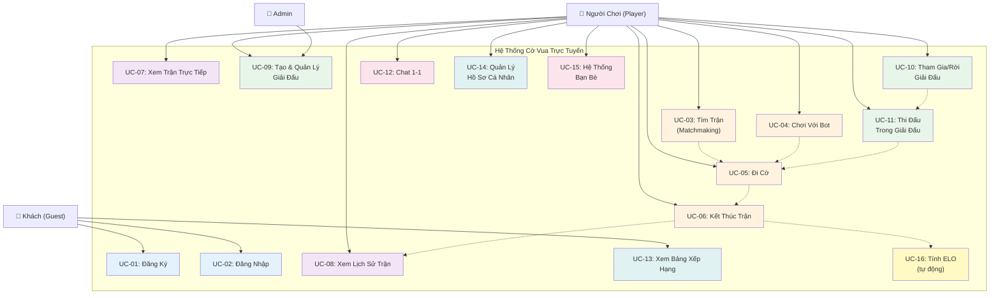
```mermaid
graph TB
    subgraph "Hệ Thống Cờ Vua Trực Tuyến"
        UC01["UC-01: Đăng Ký"]
        UC02["UC-02: Đăng Nhập"]
        UC03["UC-03: Tìm Trận<br/>(Matchmaking)"]
        UC04["UC-04: Chơi Với Bot"]
        UC05["UC-05: Đi Cờ"]
        UC06["UC-06: Kết Thúc Trận"]
        UC07["UC-07: Xem Trận Trực Tiếp"]
        UC08["UC-08: Xem Lịch Sử Trận"]
        UC09["UC-09: Tạo & Quản Lý<br/>Giải Đấu"]
        UC10["UC-10: Tham Gia/Rời<br/>Giải Đấu"]
        UC11["UC-11: Thi Đấu<br/>Trong Giải Đấu"]
        UC12["UC-12: Chat 1-1"]
        UC13["UC-13: Xem Bảng Xếp Hạng"]
        UC14["UC-14: Quản Lý<br/>Hồ Sơ Cá Nhân"]
        UC15["UC-15: Hệ Thống<br/>Bạn Bè"]
        UC16["UC-16: Tính ELO<br/>(tự động)"]
    end

    Guest["👤 Khách (Guest)"] --> UC01
    Guest --> UC02
    Guest --> UC13

    Player["👤 Người Chơi (Player)"] --> UC03
    Player --> UC04
    Player --> UC05
    Player --> UC06
    Player --> UC07
    Player --> UC08
    Player --> UC09
    Player --> UC10
    Player --> UC11
    Player --> UC12
    Player --> UC14
    Player --> UC15

    Admin["👤 Admin"] --> UC09

    UC05 -.-> UC06
    UC06 -.-> UC16
    UC03 -.-> UC05
    UC04 -.-> UC05
    UC11 -.-> UC05
    UC10 -.-> UC11
    UC06 -.-> UC08

    style UC01 fill:#e3f2fd
    style UC02 fill:#e3f2fd
    style UC03 fill:#fff3e0
    style UC04 fill:#fff3e0
    style UC05 fill:#fff3e0
    style UC06 fill:#fff3e0
    style UC07 fill:#f3e5f5
    style UC08 fill:#f3e5f5
    style UC09 fill:#e8f5e9
    style UC10 fill:#e8f5e9
    style UC11 fill:#e8f5e9
    style UC12 fill:#fce4ec
    style UC13 fill:#e0f2f1
    style UC14 fill:#e0f2f1
    style UC15 fill:#fce4ec
    style UC16 fill:#fff9c4
```

---

## Sequence Diagrams

Các sơ đồ tuần tự (Sequence Diagram) và ERD mô tả toàn bộ luồng nghiệp vụ cốt lõi của hệ thống: Game, Tournament, Chat, ELO, và Authentication. Bạn có thể dùng [Mermaid Live Editor](https://mermaid.live/) hoặc plugin Markdown Preview trên IDE để xem.

## 1. Luồng Tìm Trận (Matchmaking) - Sử dụng Lua Script Atomic

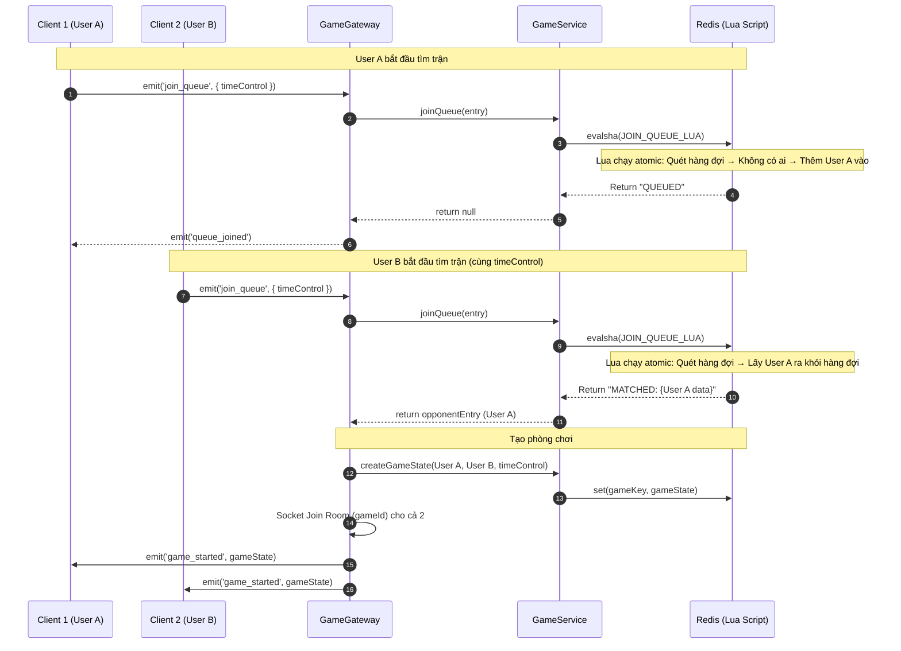
```mermaid
sequenceDiagram
    autonumber
    participant C1 as Client 1 (User A)
    participant C2 as Client 2 (User B)
    participant GW as GameGateway
    participant Svc as GameService
    participant Redis as Redis (Lua Script)

    Note over C1,Redis: User A bắt đầu tìm trận
    C1->>GW: emit('join_queue', { timeControl })
    GW->>Svc: joinQueue(entry)
    Svc->>Redis: evalsha(JOIN_QUEUE_LUA)
    Note over Redis: Lua chạy atomic: Quét hàng đợi → Không có ai → Thêm User A vào
    Redis-->>Svc: Return "QUEUED"
    Svc-->>GW: return null
    GW-->>C1: emit('queue_joined')
    
    Note over C2,Redis: User B bắt đầu tìm trận (cùng timeControl)
    C2->>GW: emit('join_queue', { timeControl })
    GW->>Svc: joinQueue(entry)
    Svc->>Redis: evalsha(JOIN_QUEUE_LUA)
    Note over Redis: Lua chạy atomic: Quét hàng đợi → Lấy User A ra khỏi hàng đợi
    Redis-->>Svc: Return "MATCHED: {User A data}"
    Svc-->>GW: return opponentEntry (User A)
    
    Note over GW,Redis: Tạo phòng chơi
    GW->>Svc: createGameState(User A, User B, timeControl)
    Svc->>Redis: set(gameKey, gameState)
    GW->>GW: Socket Join Room (gameId) cho cả 2
    GW->>C1: emit('game_started', gameState)
    GW->>C2: emit('game_started', gameState)
```

---

## 2. Luồng Đi Cờ (Make Move)

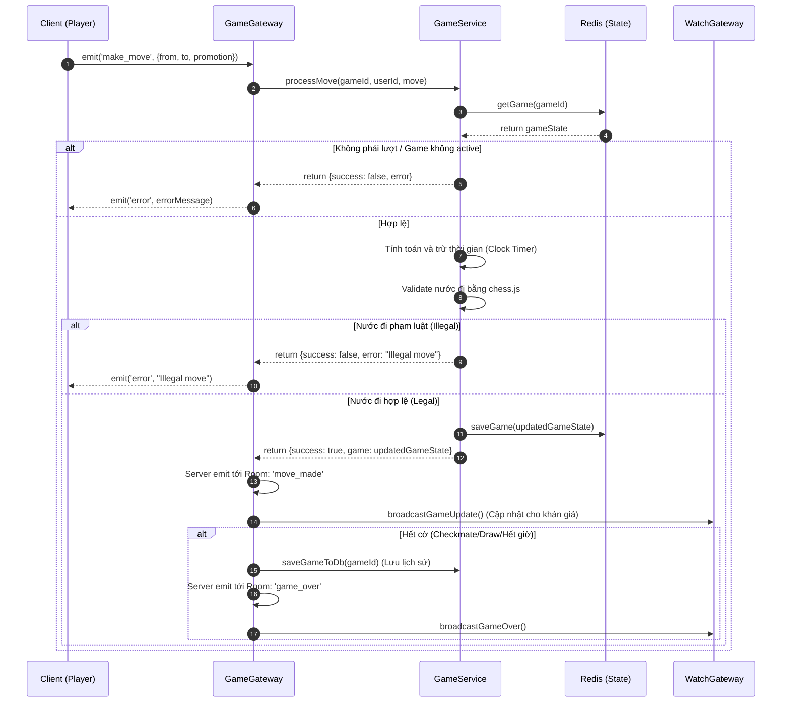
```mermaid
sequenceDiagram
    autonumber
    participant C as Client (Player)
    participant GW as GameGateway
    participant Svc as GameService
    participant Redis as Redis (State)
    participant W as WatchGateway
    
    C->>GW: emit('make_move', {from, to, promotion})
    GW->>Svc: processMove(gameId, userId, move)
    Svc->>Redis: getGame(gameId)
    Redis-->>Svc: return gameState
    
    alt Không phải lượt / Game không active
        Svc-->>GW: return {success: false, error}
        GW-->>C: emit('error', errorMessage)
    else Hợp lệ
        Svc->>Svc: Tính toán và trừ thời gian (Clock Timer)
        Svc->>Svc: Validate nước đi bằng chess.js
        
        alt Nước đi phạm luật (Illegal)
            Svc-->>GW: return {success: false, error: "Illegal move"}
            GW-->>C: emit('error', "Illegal move")
        else Nước đi hợp lệ (Legal)
            Svc->>Redis: saveGame(updatedGameState)
            Svc-->>GW: return {success: true, game: updatedGameState}
            GW->>GW: Server emit tới Room: 'move_made'
            GW->>W: broadcastGameUpdate() (Cập nhật cho khán giả)
            
            alt Hết cờ (Checkmate/Draw/Hết giờ)
                GW->>Svc: saveGameToDb(gameId) (Lưu lịch sử)
                GW->>GW: Server emit tới Room: 'game_over'
                GW->>W: broadcastGameOver()
            end
        end
    end
```

---

## 3. Luồng Lưu Trữ Lịch Sử Trận Đấu (Persistence)

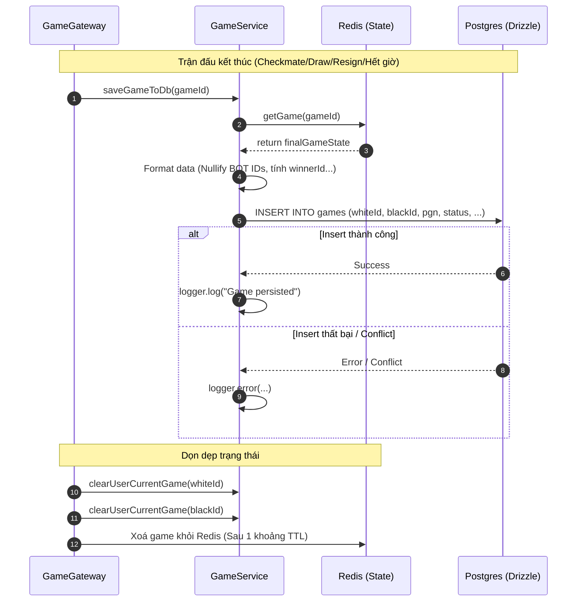
```mermaid
sequenceDiagram
    autonumber
    participant GW as GameGateway
    participant Svc as GameService
    participant Redis as Redis (State)
    participant DB as Postgres (Drizzle)
    
    Note over GW,DB: Trận đấu kết thúc (Checkmate/Draw/Resign/Hết giờ)
    GW->>Svc: saveGameToDb(gameId)
    Svc->>Redis: getGame(gameId)
    Redis-->>Svc: return finalGameState
    
    Svc->>Svc: Format data (Nullify BOT IDs, tính winnerId...)
    Svc->>DB: INSERT INTO games (whiteId, blackId, pgn, status, ...)
    
    alt Insert thành công
        DB-->>Svc: Success
        Svc->>Svc: logger.log("Game persisted")
    else Insert thất bại / Conflict
        DB-->>Svc: Error / Conflict
        Svc->>Svc: logger.error(...)
    end
    
    Note over GW,Redis: Dọn dẹp trạng thái
    GW->>Svc: clearUserCurrentGame(whiteId)
    GW->>Svc: clearUserCurrentGame(blackId)
    GW->>Redis: Xoá game khỏi Redis (Sau 1 khoảng TTL)
```

---

## 4. Luồng Đăng Nhập (Login)

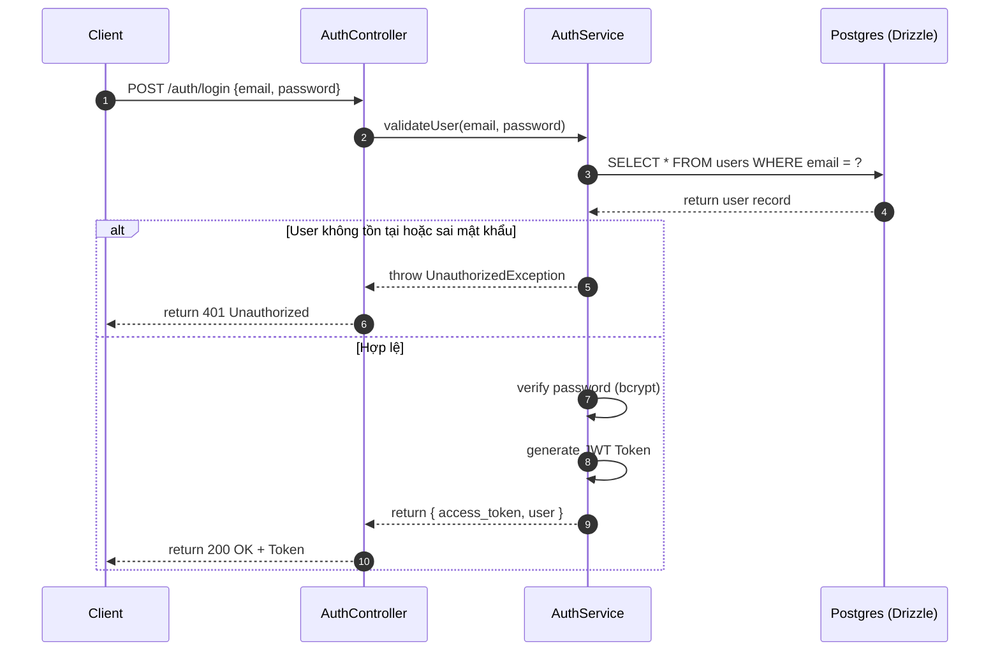
```mermaid
sequenceDiagram
    autonumber
    participant C as Client
    participant AuthCtrl as AuthController
    participant AuthSvc as AuthService
    participant DB as Postgres (Drizzle)

    C->>AuthCtrl: POST /auth/login {email, password}
    AuthCtrl->>AuthSvc: validateUser(email, password)
    AuthSvc->>DB: SELECT * FROM users WHERE email = ?
    DB-->>AuthSvc: return user record
    
    alt User không tồn tại hoặc sai mật khẩu
        AuthSvc-->>AuthCtrl: throw UnauthorizedException
        AuthCtrl-->>C: return 401 Unauthorized
    else Hợp lệ
        AuthSvc->>AuthSvc: verify password (bcrypt)
        AuthSvc->>AuthSvc: generate JWT Token
        AuthSvc-->>AuthCtrl: return { access_token, user }
        AuthCtrl-->>C: return 200 OK + Token
    end
```

---

## 5. Luồng Đăng Kí (Register)

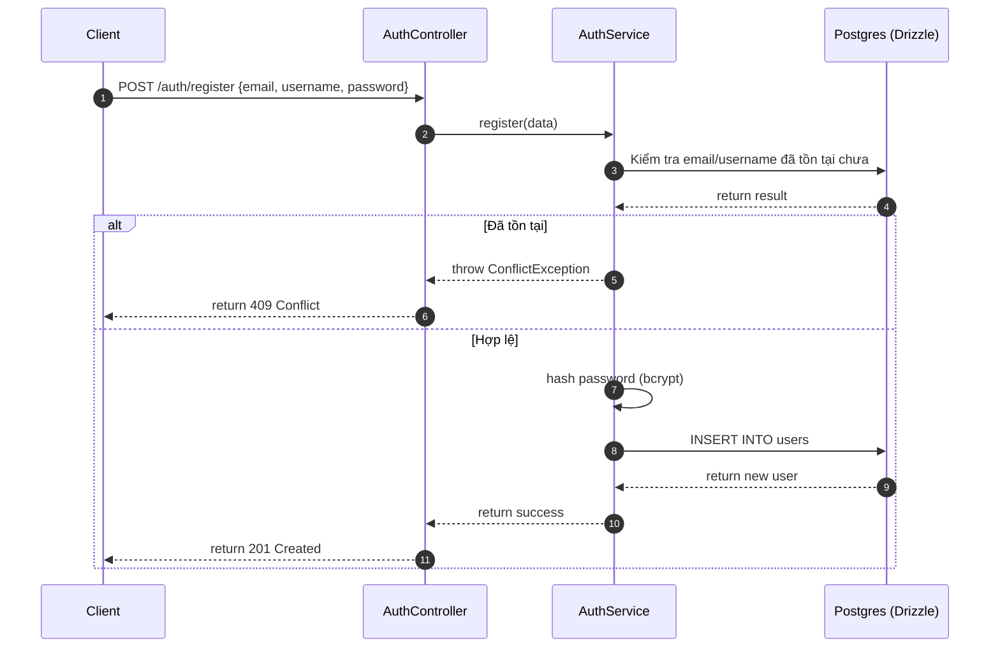
```mermaid
sequenceDiagram
    autonumber
    participant C as Client
    participant AuthCtrl as AuthController
    participant AuthSvc as AuthService
    participant DB as Postgres (Drizzle)

    C->>AuthCtrl: POST /auth/register {email, username, password}
    AuthCtrl->>AuthSvc: register(data)
    AuthSvc->>DB: Kiểm tra email/username đã tồn tại chưa
    DB-->>AuthSvc: return result
    
    alt Đã tồn tại
        AuthSvc-->>AuthCtrl: throw ConflictException
        AuthCtrl-->>C: return 409 Conflict
    else Hợp lệ
        AuthSvc->>AuthSvc: hash password (bcrypt)
        AuthSvc->>DB: INSERT INTO users
        DB-->>AuthSvc: return new user
        AuthSvc-->>AuthCtrl: return success
        AuthCtrl-->>C: return 201 Created
    end
```

---

## 6. Luồng Xem Trận Đấu (Spectator / Watch)

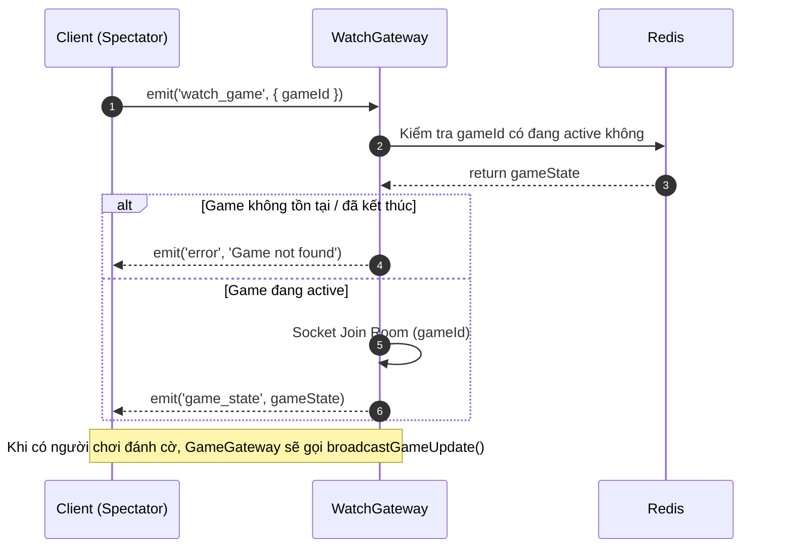
```mermaid
sequenceDiagram
    autonumber
    participant C as Client (Spectator)
    participant W as WatchGateway
    participant Redis as Redis
    
    C->>W: emit('watch_game', { gameId })
    W->>Redis: Kiểm tra gameId có đang active không
    Redis-->>W: return gameState
    
    alt Game không tồn tại / đã kết thúc
        W-->>C: emit('error', 'Game not found')
    else Game đang active
        W->>W: Socket Join Room (gameId)
        W-->>C: emit('game_state', gameState)
    end
    
    Note over C,W: Khi có người chơi đánh cờ, GameGateway sẽ gọi broadcastGameUpdate()
```

---

## 7. Luồng Chat Trong Trận Đấu

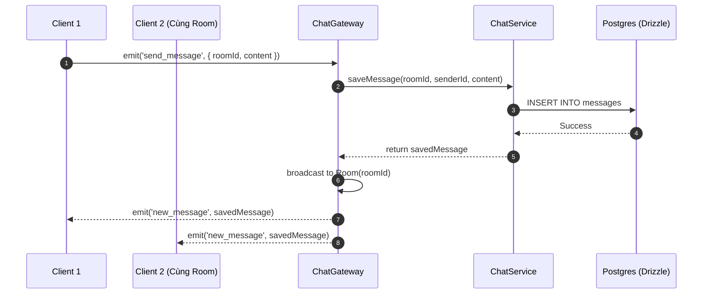
```mermaid
sequenceDiagram
    autonumber
    participant C1 as Client 1
    participant C2 as Client 2 (Cùng Room)
    participant ChatGW as ChatGateway
    participant ChatSvc as ChatService
    participant DB as Postgres (Drizzle)
    
    C1->>ChatGW: emit('send_message', { roomId, content })
    ChatGW->>ChatSvc: saveMessage(roomId, senderId, content)
    ChatSvc->>DB: INSERT INTO messages
    DB-->>ChatSvc: Success
    ChatSvc-->>ChatGW: return savedMessage
    
    ChatGW->>ChatGW: broadcast to Room(roomId)
    ChatGW-->>C1: emit('new_message', savedMessage)
    ChatGW-->>C2: emit('new_message', savedMessage)
```

---

## 8. Sơ đồ Thực Thể Kết Hợp (ERD)


```mermaid
erDiagram
    USERS ||--o{ GAMES : "plays (white)"
    USERS ||--o{ GAMES : "plays (black)"
    USERS ||--o{ GAMES : "wins"
    USERS ||--o{ TOURNAMENT_PARTICIPANTS : "participates"
    USERS ||--o{ TOURNAMENTS : "creates"
    USERS ||--o{ FRIENDS : "adds"
    USERS ||--o{ MESSAGES : "sends"
    USERS ||--o{ CHAT_ROOM_MEMBERS : "joins"
    USERS ||--|| PROFILE_INFO : "has"

    TOURNAMENTS ||--o{ TOURNAMENT_PARTICIPANTS : "has participants"
    TOURNAMENTS ||--o{ GAMES : "contains"
    
    CHAT_ROOMS ||--o{ CHAT_ROOM_MEMBERS : "contains"
    CHAT_ROOMS ||--o{ MESSAGES : "has"

    USERS {
        uuid id PK
        varchar username
        varchar email
        text passwordHash
        integer blitzRating
        integer rapidRating
        integer bulletRating
        varchar role
        timestamp createdAt
    }

    PROFILE_INFO {
        serial id PK
        jsonb metadata
        uuid userId FK
    }

    FRIENDS {
        uuid user1Id PK, FK
        uuid user2Id PK, FK
        varchar status
    }

    GAMES {
        uuid id PK
        uuid whiteId FK
        uuid blackId FK
        uuid winnerId FK
        varchar status
        varchar timeControl
        text pgn
        text finalFen
        jsonb moves
        uuid tournamentId FK
        timestamp createdAt
    }

    TOURNAMENTS {
        uuid id PK
        varchar name
        varchar format
        varchar status
        varchar timeControl
        timestamp startTime
        timestamp endTime
        uuid creatorId FK
    }

    TOURNAMENT_PARTICIPANTS {
        uuid tournamentId PK, FK
        uuid userId PK, FK
        real points
        real tieBreak
        integer rank
    }

    CHAT_ROOMS {
        uuid id PK
        varchar type
        uuid referenceId
        timestamp createdAt
    }

    CHAT_ROOM_MEMBERS {
        uuid roomId PK, FK
        uuid userId PK, FK
    }

    MESSAGES {
        uuid id PK
        uuid roomId FK
        uuid senderId FK
        varchar senderUsername
        text content
        timestamp createdAt
    }
```

---

## 9. Luồng Tính & Hiển Thị ELO Sau Trận Đấu (NEW)

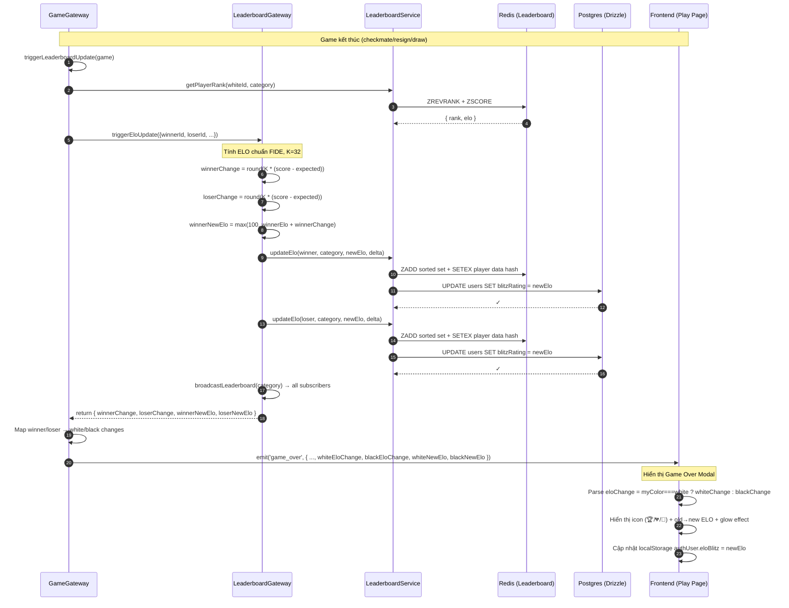
```mermaid
sequenceDiagram
    autonumber
    participant GW as GameGateway
    participant LB as LeaderboardGateway
    participant LBSvc as LeaderboardService
    participant Redis as Redis (Leaderboard)
    participant DB as Postgres (Drizzle)
    participant FE as Frontend (Play Page)

    Note over GW,FE: Game kết thúc (checkmate/resign/draw)
    GW->>GW: triggerLeaderboardUpdate(game)
    GW->>LBSvc: getPlayerRank(whiteId, category)
    LBSvc->>Redis: ZREVRANK + ZSCORE
    Redis-->>LBSvc: { rank, elo }
    GW->>LB: triggerEloUpdate({winnerId, loserId, ...})

    Note over LB: Tính ELO chuẩn FIDE, K=32
    LB->>LB: winnerChange = round(K * (score - expected))
    LB->>LB: loserChange = round(K * (score - expected))
    LB->>LB: winnerNewElo = max(100, winnerElo + winnerChange)

    LB->>LBSvc: updateElo(winner, category, newElo, delta)
    LBSvc->>Redis: ZADD sorted set + SETEX player data hash
    LBSvc->>DB: UPDATE users SET blitzRating = newElo
    DB-->>LBSvc: ✓

    LB->>LBSvc: updateElo(loser, category, newElo, delta)
    LBSvc->>Redis: ZADD sorted set + SETEX player data hash
    LBSvc->>DB: UPDATE users SET blitzRating = newElo
    DB-->>LBSvc: ✓

    LB->>LB: broadcastLeaderboard(category) → all subscribers
    LB-->>GW: return { winnerChange, loserChange, winnerNewElo, loserNewElo }
    
    GW->>GW: Map winner/loser → white/black changes
    GW->>FE: emit('game_over', { ..., whiteEloChange, blackEloChange, whiteNewElo, blackNewElo })
    
    Note over FE: Hiển thị Game Over Modal
    FE->>FE: Parse eloChange = myColor===white ? whiteChange : blackChange
    FE->>FE: Hiển thị icon (🏆/💔/🤝) + old→new ELO + glow effect
    FE->>FE: Cập nhật localStorage authUser.eloBlitz = newElo
```

---

## 10. Luồng Tự Động Chuyển Vòng Trong Giải Đấu (NEW)

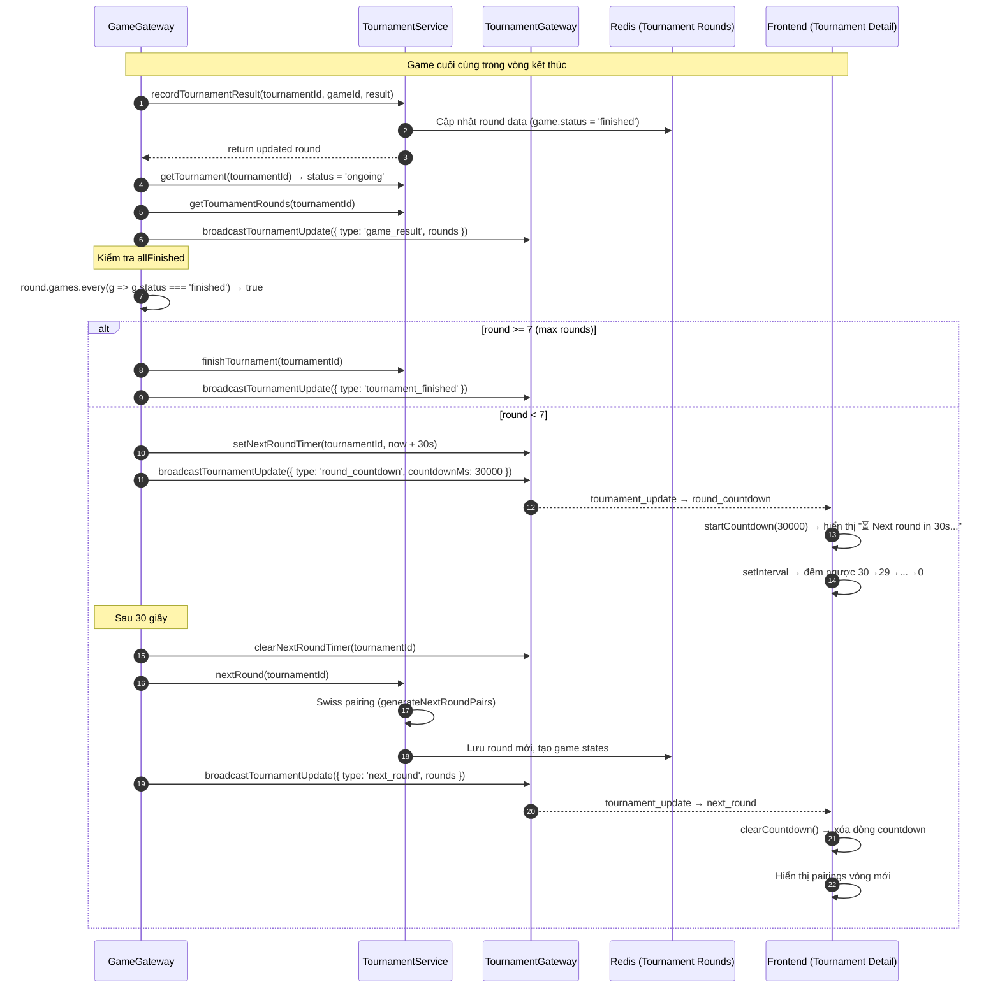
```mermaid
sequenceDiagram
    autonumber
    participant GW as GameGateway
    participant TSvc as TournamentService
    participant TGW as TournamentGateway
    participant Redis as Redis (Tournament Rounds)
    participant FE as Frontend (Tournament Detail)

    Note over GW,FE: Game cuối cùng trong vòng kết thúc
    GW->>TSvc: recordTournamentResult(tournamentId, gameId, result)
    TSvc->>Redis: Cập nhật round data (game.status = 'finished')
    TSvc-->>GW: return updated round

    GW->>TSvc: getTournament(tournamentId) → status = 'ongoing'
    GW->>TSvc: getTournamentRounds(tournamentId)
    GW->>TGW: broadcastTournamentUpdate({ type: 'game_result', rounds })

    Note over GW: Kiểm tra allFinished
    GW->>GW: round.games.every(g => g.status === 'finished') → true

    alt round >= 7 (max rounds)
        GW->>TSvc: finishTournament(tournamentId)
        GW->>TGW: broadcastTournamentUpdate({ type: 'tournament_finished' })
    else round < 7
        GW->>TGW: setNextRoundTimer(tournamentId, now + 30s)
        GW->>TGW: broadcastTournamentUpdate({ type: 'round_countdown', countdownMs: 30000 })
        TGW-->>FE: tournament_update → round_countdown
        FE->>FE: startCountdown(30000) → hiển thị "⏳ Next round in 30s..."
        FE->>FE: setInterval → đếm ngược 30→29→...→0

        Note over GW: Sau 30 giây
        GW->>TGW: clearNextRoundTimer(tournamentId)
        GW->>TSvc: nextRound(tournamentId)
        TSvc->>TSvc: Swiss pairing (generateNextRoundPairs)
        TSvc->>Redis: Lưu round mới, tạo game states
        GW->>TGW: broadcastTournamentUpdate({ type: 'next_round', rounds })
        TGW-->>FE: tournament_update → next_round
        FE->>FE: clearCountdown() → xóa dòng countdown
        FE->>FE: Hiển thị pairings vòng mới
    end
```

---

## 11. Luồng Xóa Giải Đấu (NEW)

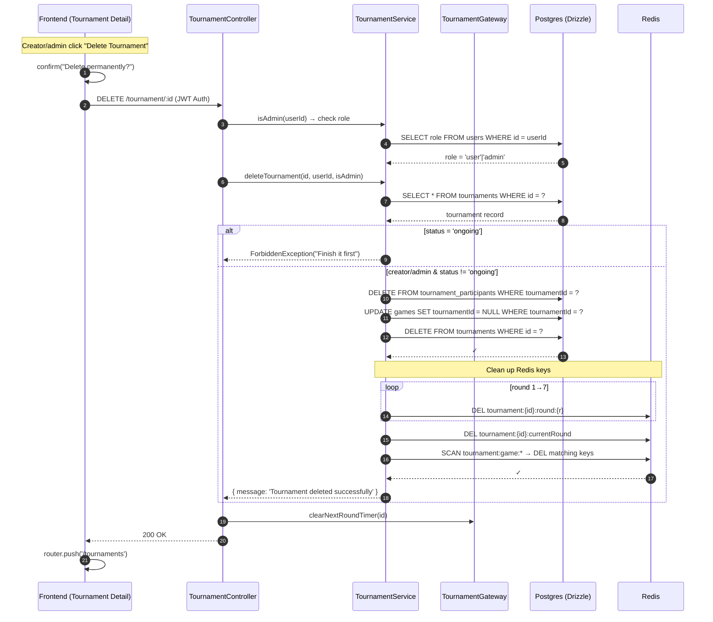
```mermaid
sequenceDiagram
    autonumber
    participant FE as Frontend (Tournament Detail)
    participant Ctrl as TournamentController
    participant TSvc as TournamentService
    participant TGW as TournamentGateway
    participant DB as Postgres (Drizzle)
    participant Redis as Redis

    Note over FE: Creator/admin click "Delete Tournament"
    FE->>FE: confirm("Delete permanently?")
    FE->>Ctrl: DELETE /tournament/:id (JWT Auth)
    Ctrl->>TSvc: isAdmin(userId) → check role
    TSvc->>DB: SELECT role FROM users WHERE id = userId
    DB-->>TSvc: role = 'user'|'admin'

    Ctrl->>TSvc: deleteTournament(id, userId, isAdmin)
    TSvc->>DB: SELECT * FROM tournaments WHERE id = ?
    DB-->>TSvc: tournament record

    alt status = 'ongoing'
        TSvc-->>Ctrl: ForbiddenException("Finish it first")
    else creator/admin & status != 'ongoing'
        TSvc->>DB: DELETE FROM tournament_participants WHERE tournamentId = ?
        TSvc->>DB: UPDATE games SET tournamentId = NULL WHERE tournamentId = ?
        TSvc->>DB: DELETE FROM tournaments WHERE id = ?
        DB-->>TSvc: ✓

        Note over TSvc,Redis: Clean up Redis keys
        loop round 1→7
            TSvc->>Redis: DEL tournament:{id}:round:{r}
        end
        TSvc->>Redis: DEL tournament:{id}:currentRound
        TSvc->>Redis: SCAN tournament:game:* → DEL matching keys
        Redis-->>TSvc: ✓

        TSvc-->>Ctrl: { message: 'Tournament deleted successfully' }
    end

    Ctrl->>TGW: clearNextRoundTimer(id)
    Ctrl-->>FE: 200 OK
    FE->>FE: router.push('/tournaments')
```

---

## 12. ERD Cập Nhật — Redis Data Structures (NEW)

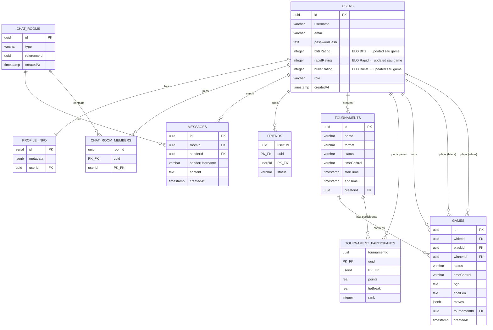
```mermaid
erDiagram
    USERS ||--o{ GAMES : "plays (white)"
    USERS ||--o{ GAMES : "plays (black)"
    USERS ||--o{ GAMES : "wins"
    USERS ||--o{ TOURNAMENT_PARTICIPANTS : "participates"
    USERS ||--o{ TOURNAMENTS : "creates"
    USERS ||--o{ FRIENDS : "adds"
    USERS ||--o{ MESSAGES : "sends"
    USERS ||--o{ CHAT_ROOM_MEMBERS : "joins"
    USERS ||--|| PROFILE_INFO : "has"

    TOURNAMENTS ||--o{ TOURNAMENT_PARTICIPANTS : "has participants"
    TOURNAMENTS ||--o{ GAMES : "contains"
    
    CHAT_ROOMS ||--o{ CHAT_ROOM_MEMBERS : "contains"
    CHAT_ROOMS ||--o{ MESSAGES : "has"

    USERS {
        uuid id PK
        varchar username
        varchar email
        text passwordHash
        integer blitzRating "ELO Blitz ← updated sau game"
        integer rapidRating "ELO Rapid ← updated sau game"
        integer bulletRating "ELO Bullet ← updated sau game"
        varchar role
        timestamp createdAt
    }

    PROFILE_INFO {
        serial id PK
        jsonb metadata
        uuid userId FK
    }

    FRIENDS {
        uuid user1Id PK_FK
        uuid user2Id PK_FK
        varchar status
    }

    GAMES {
        uuid id PK
        uuid whiteId FK
        uuid blackId FK
        uuid winnerId FK
        varchar status
        varchar timeControl
        text pgn
        text finalFen
        jsonb moves
        uuid tournamentId FK
        timestamp createdAt
    }

    TOURNAMENTS {
        uuid id PK
        varchar name
        varchar format
        varchar status
        varchar timeControl
        timestamp startTime
        timestamp endTime
        uuid creatorId FK
    }

    TOURNAMENT_PARTICIPANTS {
        uuid tournamentId PK_FK
        uuid userId PK_FK
        real points
        real tieBreak
        integer rank
    }

    CHAT_ROOMS {
        uuid id PK
        varchar type
        uuid referenceId
        timestamp createdAt
    }

    CHAT_ROOM_MEMBERS {
        uuid roomId PK_FK
        uuid userId PK_FK
    }

    MESSAGES {
        uuid id PK
        uuid roomId FK
        uuid senderId FK
        varchar senderUsername
        text content
        timestamp createdAt
    }
```

### Redis Data Structures (In-Memory / Cache)

| Key Pattern | Type | Purpose |
|---|---|---|
| `chess:leaderboard:{blitz\|bullet\|rapid}` | Sorted Set | ELO ranking (score=ELO, member=userId) |
| `chess:player:{userId}:{blitz\|bullet\|rapid}` | Hash | Player stats: `{elo, wins, losses, draws, gamesPlayed, eloChange, trend}` |
| `chess:online_users` | Hash | userId → socketId mapping |
| `tournament:{id}:round:{1-7}` | String (JSON) | Tournament round data (pairings, results) |
| `tournament:{id}:currentRound` | String | Current round number |
| `tournament:game:{gameId}` | String (JSON) | Reverse lookup: { tournamentId, round } |
| `chat:room:{roomId}:messages` | List | Last 50 messages (cache) |
| `game:{gameId}` | Hash | Active game state (FEN, PGN, clocks, etc.) |

---

## Class Diagrams — Sơ Đồ Lớp Chi Tiết

> **Mục đích**: Class Diagram mô tả **cấu trúc tĩnh** của hệ thống — có những class nào, mỗi class có thuộc tính & phương thức gì, và chúng quan hệ với nhau ra sao.
>
> **Cách đọc**: 
> - `+method()` = Public method (ai cũng gọi được)
> - `-method()` / `-field` = Private (chỉ nội bộ class dùng)
> - `-->` = Association (class này dùng class kia)
> - `..>` = Dependency (phụ thuộc lỏng, truyền qua tham số)
> - Mỗi **hộp** là một class, chia làm 3 phần: Tên class | Thuộc tính | Phương thức

---

### 1. Backend Class Diagram — Tổng Quan Toàn Bộ Hệ Thống

Sơ đồ này cho thấy **toàn bộ class chính** trong backend NestJS và mối quan hệ giữa chúng.


```mermaid
classDiagram
    direction TB

    %% ──────────────── GATEWAYS (WebSocket) ────────────────
    class GameGateway {
        -Map~string~ connectedClients
        -Map~string~ matchmakingTimers
        +handleConnection(client)
        +handleDisconnect(client)
        +joinQueue(data)
        +leaveQueue()
        +makeMove(data)
        +resign()
        +offerDraw()
        +respondDraw(data)
        +startBotGame(data)
        +triggerEloUpdate(gameId)
    }

    class WatchGateway {
        -Map~string~ spectators
        -Map~string~ spectatorMeta
        +handleWatchGame(data)
        +handleLeaveWatch()
        +broadcastGameUpdate(gameId, move)
        +broadcastGameOver(gameId, result)
    }

    class ChatGateway {
        -Map~string~ clients
        -Map~string~ userSockets
        +identify(data)
        +joinDm(data)
        +sendDm(data)
        +sendDirectMessage(data)
        +typing(data)
        +getDmHistory(data)
        +broadcastUserStatus(userId, username, online)
    }

    class TournamentGateway {
        -Map~string~ userSockets
        -Map~string~ clients
        -Map~string~ nextRoundTimers
        +tournamentIdentify(data)
        +joinTournamentRoom(data)
        +leaveTournamentRoom(data)
        +setNextRoundTimer(tournamentId, ts)
        +clearNextRoundTimer(tournamentId)
        +notifyGameResult(data)
        +notifyNextRound(data)
        +notifyTournamentFinished(data)
    }

    class LeaderboardGateway {
        -Map~string~ subscribedClients
        +handleSubscribe(data)
        +triggerEloUpdate(matchResult)
        +broadcastUpdate(category, data)
    }

    %% ──────────────── SERVICES (Business Logic) ────────────────
    class GameService {
        -Redis redis
        -NodePgDatabase db
        +joinQueue(entry) MatchmakingEntry
        +createGame(whiteId, blackId, timeControl) GameState
        +processMove(gameId, userId, move) GameState
        +getGame(gameId) GameState
        +saveGameToDb(gameId) void
        +clearUserCurrentGame(userId) void
        +getGameHistory(userId) Game[]
    }

    class AiService {
        -Logger logger
        +getBestMove(fen, difficulty, botColor) Move
        -evaluateBoard(chess) number
        -minimax(chess, depth, alpha, beta, isMax) number
        -orderMoves(moves) Move[]
        -quiescenceSearch(chess, alpha, beta) number
    }

    class AuthService {
        -NodePgDatabase db
        +validateUser(email, password) User
        +register(data) User
        +login(data) AuthTokens
        +refreshToken(token) AuthTokens
        -generateTokens(user) AuthTokens
    }

    class ChatService {
        -NodePgDatabase db
        -Redis redis
        +getOrCreateDmRoom(user1Id, user2Id) Room
        +saveMessage(roomId, senderId, content) Message
        +getMessageHistory(roomId, limit) Message[]
        +cacheMessage(roomId, message) void
    }

    class TournamentService {
        -NodePgDatabase db
        -Redis redis
        -TournamentSwissService swiss
        -GameService gameService
        +createTournament(data) Tournament
        +joinTournament(tournamentId, userId) void
        +leaveTournament(tournamentId, userId) void
        +startTournament(tournamentId) void
        +nextRound(tournamentId) void
        +finishTournament(tournamentId) void
        +deleteTournament(tournamentId) void
        +recordGameResult(gameId, result) void
    }

    class TournamentSwissService {
        -NodePgDatabase db
        +generatePairings(tournamentId, round) SwissPairing[]
        -buildPlayerList(tournamentId) SwissPlayer[]
        -pairPlayers(players, pastMatches) SwissPairing[]
        -calculateTiebreaks(player) number
    }

    class LeaderboardService {
        -Redis redis
        -NodePgDatabase db
        +updateElo(dto) void
        +getTopPlayers(category, limit) LeaderboardEntry[]
        +getPlayerStats(userId, category) PlayerStats
        -leaderboardKey(category) string
        -playerDataKey(userId, category) string
    }

    class UserService {
        -NodePgDatabase db
        +getProfile(userId) UserProfile
        +updateProfile(userId, data) void
        +sendFriendRequest(fromId, toUsername) void
        +respondFriendRequest(requestId, accept) void
        +getFriendList(userId) Friend[]
    }

    %% ──────────────── CONTROLLERS (REST API) ────────────────
    class AuthController {
        +POST /auth/register
        +POST /auth/login
        +POST /auth/refresh
    }

    class GameController {
        +GET /game/history
        +GET /game/:id
    }

    class TournamentController {
        +GET /tournament
        +POST /tournament
        +GET /tournament/:id
        +POST /tournament/:id/join
        +POST /tournament/:id/leave
        +PATCH /tournament/:id/start
        +PATCH /tournament/:id/next-round
        +PATCH /tournament/:id/finish
        +DELETE /tournament/:id
    }

    class UserController {
        +GET /user/me
        +PATCH /user/profile
        +POST /user/friends/request
        +PUT /user/friends/respond
        +GET /user/friends
    }

    %% ──────────────── DTOS ────────────────
    class MatchmakingEntry {
        +string userId
        +string username
        +number rating
        +string timeControl
        +string socketId
        +number queuedAt
    }

    class GameState {
        +string gameId
        +string whiteId
        +string blackId
        +string fen
        +string pgn
        +Move[] moves
        +number whiteTime
        +number blackTime
        +string status
        +string timeControl
    }

    class MakeMoveDto {
        +string from
        +string to
        +string? promotion
    }

    class SwissPairing {
        +string gameId
        +string whiteId
        +string blackId
        +number round
        +string type
    }

    class LeaderboardEntry {
        +string userId
        +string username
        +number elo
        +number wins
        +number losses
        +number draws
        +string trend
    }

    %% ──────────────── MODULES ────────────────
    class RedisModule {
        +provide REDIS_CLIENT
    }

    class DrizzleModule {
        +provide DRIZZLE
    }

    %% ═══════════════════════════════════════════════════════
    %% RELATIONSHIPS
    %% ═══════════════════════════════════════════════════════

    %% Gateway → Service dependencies
    GameGateway ..> GameService : uses
    GameGateway ..> LeaderboardGateway : notify ELO
    GameGateway ..> WatchGateway : broadcast updates
    GameGateway ..> TournamentGateway : notify result
    GameGateway ..> AiService : bot moves

    WatchGateway ..> GameService : read game state
    WatchGateway ..> WatchService : manage spectators

    ChatGateway ..> ChatService : persist messages

    TournamentGateway ..> TournamentService : manage tournament

    LeaderboardGateway ..> LeaderboardService : ELO operations

    %% Service → Service dependencies
    GameService ..> LeaderboardService : update ELO
    TournamentService ..> TournamentSwissService : pairings
    TournamentService ..> GameService : create games

    %% Service → Infrastructure dependencies
    GameService ..> RedisModule : game state
    GameService ..> DrizzleModule : persist games
    AuthService ..> DrizzleModule : user CRUD
    AuthService ..> RedisModule : token store
    ChatService ..> DrizzleModule : messages
    ChatService ..> RedisModule : message cache + online users
    TournamentService ..> RedisModule : round data
    TournamentService ..> DrizzleModule : tournament CRUD
    LeaderboardService ..> RedisModule : ranking (ZSET)
    LeaderboardService ..> DrizzleModule : persist ELO
    UserService ..> DrizzleModule : user/profile CRUD

    %% Controller → Service dependencies
    AuthController ..> AuthService
    GameController ..> GameService
    TournamentController ..> TournamentService
    UserController ..> UserService

    %% DTO usage
    GameService ..> MatchmakingEntry : queue entries
    GameService ..> GameState : game management
    GameService ..> MakeMoveDto : move validation
    TournamentSwissService ..> SwissPairing : pairings
    LeaderboardService ..> LeaderboardEntry : rankings

    note for GameGateway "namespace: /chess"
    note for WatchGateway "namespace: /watch"
    note for ChatGateway "namespace: /chat"
    note for TournamentGateway "namespace: /tournament"
    note for LeaderboardGateway "namespace: /leaderboard"
```

#### 🔍 Giải thích chi tiết từng thành phần

| Nhóm | Class | Vai trò trong hệ thống |
|------|-------|------------------------|
| **🟠 Gateway** (WebSocket) | `GameGateway` | **Cổng giao tiếp chính** qua WebSocket namespace `/chess`. Nhận các event từ client như `join_queue` (tìm trận), `make_move` (đi cờ), `resign` (đầu hàng), `offerDraw` (xin hòa), `startBotGame` (chơi với máy). Sau đó **ủy thác** (delegate) xuống `GameService` để xử lý logic. Ngoài ra còn broadcast kết quả tới `WatchGateway` (khán giả), `LeaderboardGateway` (cập nhật ELO), `TournamentGateway` (nếu là trận giải đấu). |
| **🟠 Gateway** | `WatchGateway` | Cho phép người dùng **xem trận đấu trực tiếp** (spectator mode) qua namespace `/watch`. Quản lý danh sách khán giả (`spectators`) và broadcast `game_update` mỗi khi có nước đi mới, `game_over` khi trận kết thúc. |
| **🟠 Gateway** | `ChatGateway` | **Chat 1-1** qua namespace `/chat`. Hỗ trợ 2 luồng: `send_dm` (gửi vào room khi cả 2 đã mở chat) và `send_direct_message` (gửi trực tiếp qua Redis Hash `chess:online_users` khi người nhận chưa mở chat). Có typing indicator và multi-tab support. |
| **🟠 Gateway** | `TournamentGateway` | **Real-time giải đấu** qua namespace `/tournament`. Quản lý `nextRoundTimers` (countdown 30s giữa các vòng), broadcast `tournament_update` khi có game result, `next_round` khi chuyển vòng, `tournament_finished` khi kết thúc. |
| **🟠 Gateway** | `LeaderboardGateway` | **Bảng xếp hạng real-time** qua namespace `/leaderboard`. Nhận subscribe từ client, broadcast `leaderboard_update` mỗi khi ELO thay đổi sau trận đấu. |
| **🔵 Service** | `GameService` | **Trái tim của hệ thống** — xử lý toàn bộ logic game: matchmaking (Redis Lua script atomic), tạo game state, validate nước đi (chess.js), quản lý đồng hồ (server-side clock), lưu game vào PostgreSQL khi kết thúc. |
| **🔵 Service** | `AiService` | **Engine cờ vua AI** — sử dụng thuật toán **Minimax + Alpha-Beta Pruning** để sinh nước đi cho bot. Hỗ trợ 3 mức độ khó (Easy/Medium/Hard) tương ứng với độ sâu tìm kiếm 1/3/5. Có các tối ưu: MVV-LVA Move Ordering, Piece-Square Tables, Quiescence Search. |
| **🔵 Service** | `AuthService` | **Xác thực người dùng** — đăng ký (hash password bcrypt), đăng nhập (tạo JWT access token 15 phút + refresh token 7 ngày), refresh token. Token được lưu trong Redis. |
| **🔵 Service** | `ChatService` | **Quản lý chat** — tạo/lấy private chat room giữa 2 user, lưu tin nhắn vào PostgreSQL, cache 50 tin nhắn gần nhất vào Redis List. |
| **🔵 Service** | `TournamentService` | **Quản lý giải đấu** — CRUD tournament, join/leave, start/finish, chuyển vòng (next round). Ủy thác việc ghép cặp cho `TournamentSwissService` và tạo game cho `GameService`. |
| **🔵 Service** | `TournamentSwissService` | **Thuật toán Swiss Pairing** — ghép cặp người chơi trong giải đấu dựa trên điểm số và tiebreaks (Buchholz, Sonneborn-Berger). Vòng 1 ghép ngẫu nhiên/theo rating, các vòng sau ghép theo điểm. |
| **🔵 Service** | `LeaderboardService` | **Bảng xếp hạng ELO** — cập nhật ELO vào Redis Sorted Set (ranking) + Redis Hash (stats) + PostgreSQL (persist). Hỗ trợ 3 category: Blitz, Bullet, Rapid. |
| **🔵 Service** | `UserService` | **Quản lý người dùng** — lấy/cập nhật profile, gửi/nhận lời mời kết bạn, quản lý danh sách bạn bè. |
| **🟢 Controller** (REST API) | `AuthController` | REST endpoints: `POST /auth/register`, `POST /auth/login`, `POST /auth/refresh` |
| **🟢 Controller** | `GameController` | REST endpoints: `GET /game/history` (lịch sử trận), `GET /game/:id` (chi tiết trận) |
| **🟢 Controller** | `TournamentController` | REST endpoints: CRUD tournaments, join/leave, start/next-round/finish/delete |
| **🟢 Controller** | `UserController` | REST endpoints: `GET /user/me`, `PATCH /user/profile`, friends API |
| **📦 DTO** | `GameState` | **Cấu trúc dữ liệu** lưu trạng thái một ván cờ: `gameId`, `whiteId`, `blackId`, `fen` (thế cờ), `pgn` (lịch sử nước đi), `moves[]`, `whiteTime`/`blackTime` (đồng hồ), `status` |
| **📦 DTO** | `MatchmakingEntry` | **Cấu trúc dữ liệu** cho một người chơi trong hàng đợi: `userId`, `rating` (ELO), `timeControl`, `socketId` |
| **📦 DTO** | `SwissPairing` | **Cấu trúc dữ liệu** cho một cặp đấu trong giải: `whiteId`, `blackId`, `round`, `type` |
| **📦 DTO** | `LeaderboardEntry` | **Cấu trúc dữ liệu** cho một entry trong bảng xếp hạng: `elo`, `wins`, `losses`, `draws`, `trend` |

---

### 2. Module Game — Chi Tiết

Sơ đồ này **phóng to** vào module Game, cho thấy mối quan hệ giữa `GameGateway`, `GameService`, `AiService` và các Gateway khác.

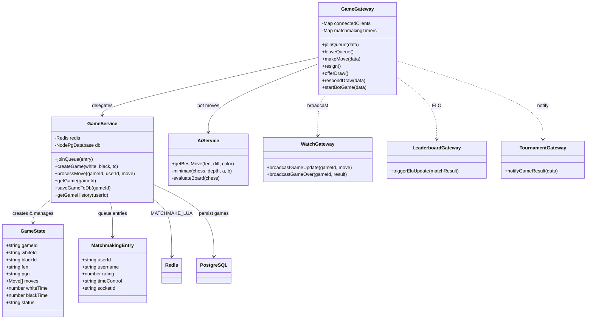
```mermaid
classDiagram
    direction TB

    class GameGateway {
        -Map connectedClients
        -Map matchmakingTimers
        +joinQueue(data)
        +leaveQueue()
        +makeMove(data)
        +resign()
        +offerDraw()
        +respondDraw(data)
        +startBotGame(data)
    }

    class GameService {
        -Redis redis
        -NodePgDatabase db
        +joinQueue(entry)
        +createGame(white, black, tc)
        +processMove(gameId, userId, move)
        +getGame(gameId)
        +saveGameToDb(gameId)
        +getGameHistory(userId)
    }

    class AiService {
        +getBestMove(fen, diff, color)
        -minimax(chess, depth, a, b)
        -evaluateBoard(chess)
    }

    class WatchGateway {
        +broadcastGameUpdate(gameId, move)
        +broadcastGameOver(gameId, result)
    }

    class LeaderboardGateway {
        +triggerEloUpdate(matchResult)
    }

    class TournamentGateway {
        +notifyGameResult(data)
    }

    class GameState {
        +string gameId
        +string whiteId
        +string blackId
        +string fen
        +string pgn
        +Move[] moves
        +number whiteTime
        +number blackTime
        +string status
    }

    class MatchmakingEntry {
        +string userId
        +string username
        +number rating
        +string timeControl
        +string socketId
    }

    GameGateway --> GameService : delegates
    GameGateway --> AiService : bot moves
    GameGateway ..> WatchGateway : broadcast
    GameGateway ..> LeaderboardGateway : ELO
    GameGateway ..> TournamentGateway : notify
    GameService --> GameState : creates & manages
    GameService --> MatchmakingEntry : queue entries
    GameService --> Redis : MATCHMAKE_LUA
    GameService --> PostgreSQL : persist games
```

#### 🔍 Giải thích

- **`GameGateway`** là **cổng vào duy nhất** cho mọi thao tác game. Nó KHÔNG tự xử lý logic mà **ủy thác** (delegates) cho `GameService`.
- **`GameService`** là **não bộ** — chạy Lua script atomic trong Redis để ghép trận, validate nước đi bằng chess.js, quản lý đồng hồ server-side. Nó tạo ra đối tượng `GameState` và quản lý vòng đời của game.
- **`AiService`** được gọi khi người chơi chọn chơi với bot — `GameGateway` gọi trực tiếp `AiService.getBestMove()`.
- **`WatchGateway`** nhận broadcast từ `GameGateway` mỗi khi có nước đi mới để cập nhật cho khán giả.
- **`LeaderboardGateway`** nhận thông báo khi game kết thúc để cập nhật ELO.
- **`TournamentGateway`** nhận thông báo nếu game thuộc về một giải đấu.
- **`GameState`** là cấu trúc dữ liệu lưu trong Redis (Hash) — mỗi game active có một `GameState`.

---

### 3. Module Tournament — Chi Tiết

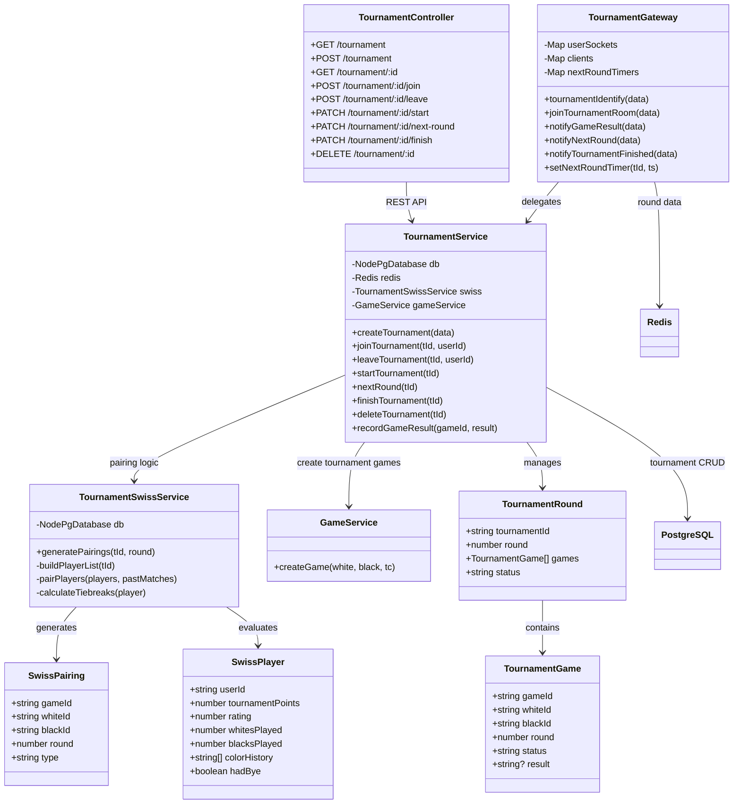
```mermaid
classDiagram
    direction TB

    class TournamentGateway {
        -Map userSockets
        -Map clients
        -Map nextRoundTimers
        +tournamentIdentify(data)
        +joinTournamentRoom(data)
        +notifyGameResult(data)
        +notifyNextRound(data)
        +notifyTournamentFinished(data)
        +setNextRoundTimer(tId, ts)
    }

    class TournamentService {
        -NodePgDatabase db
        -Redis redis
        -TournamentSwissService swiss
        -GameService gameService
        +createTournament(data)
        +joinTournament(tId, userId)
        +leaveTournament(tId, userId)
        +startTournament(tId)
        +nextRound(tId)
        +finishTournament(tId)
        +deleteTournament(tId)
        +recordGameResult(gameId, result)
    }

    class TournamentSwissService {
        -NodePgDatabase db
        +generatePairings(tId, round)
        -buildPlayerList(tId)
        -pairPlayers(players, pastMatches)
        -calculateTiebreaks(player)
    }

    class GameService {
        +createGame(white, black, tc)
    }

    class TournamentController {
        +GET /tournament
        +POST /tournament
        +GET /tournament/:id
        +POST /tournament/:id/join
        +POST /tournament/:id/leave
        +PATCH /tournament/:id/start
        +PATCH /tournament/:id/next-round
        +PATCH /tournament/:id/finish
        +DELETE /tournament/:id
    }

    class TournamentRound {
        +string tournamentId
        +number round
        +TournamentGame[] games
        +string status
    }

    class TournamentGame {
        +string gameId
        +string whiteId
        +string blackId
        +number round
        +string status
        +string? result
    }

    class SwissPairing {
        +string gameId
        +string whiteId
        +string blackId
        +number round
        +string type
    }

    class SwissPlayer {
        +string userId
        +number tournamentPoints
        +number rating
        +number whitesPlayed
        +number blacksPlayed
        +string[] colorHistory
        +boolean hadBye
    }

    TournamentGateway --> TournamentService : delegates
    TournamentService --> TournamentSwissService : pairing logic
    TournamentService --> GameService : create tournament games
    TournamentController --> TournamentService : REST API
    TournamentSwissService --> SwissPairing : generates
    TournamentSwissService --> SwissPlayer : evaluates
    TournamentService --> TournamentRound : manages
    TournamentRound --> TournamentGame : contains

    TournamentGateway --> Redis : round data
    TournamentService --> PostgreSQL : tournament CRUD
```

#### 🔍 Giải thích

- **`TournamentGateway`** là cổng WebSocket (`/tournament`) — nhận event từ client và broadcast real-time updates.
- **`TournamentService`** là **điều phối viên** của giải đấu — quản lý toàn bộ vòng đời: tạo, join/leave, start, next round, finish, delete. Nó gọi `TournamentSwissService` để ghép cặp và `GameService` để tạo các trận đấu.
- **`TournamentSwissService`** chứa **thuật toán Swiss Pairing** — ghép cặp người chơi dựa trên điểm số. Các phương thức private (`-`) như `buildPlayerList`, `pairPlayers`, `calculateTiebreaks` là chi tiết nội bộ của thuật toán.
- **`TournamentController`** cung cấp REST API cho CRUD giải đấu.
- **`TournamentRound`** và **`TournamentGame`** là các cấu trúc dữ liệu lưu trong Redis (String JSON) cho mỗi vòng đấu.
- **`SwissPlayer`** lưu thông tin người chơi trong giải: điểm (`tournamentPoints`), rating, lịch sử màu quân (`colorHistory`), đã được bye chưa.

---

### 4. Module Chat — Chi Tiết

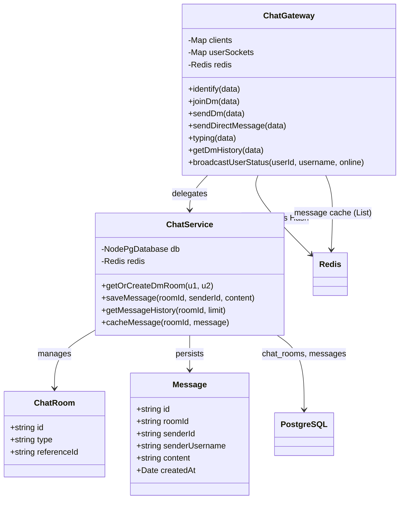
```mermaid
classDiagram
    direction TB

    class ChatGateway {
        -Map clients
        -Map userSockets
        -Redis redis
        +identify(data)
        +joinDm(data)
        +sendDm(data)
        +sendDirectMessage(data)
        +typing(data)
        +getDmHistory(data)
        +broadcastUserStatus(userId, username, online)
    }

    class ChatService {
        -NodePgDatabase db
        -Redis redis
        +getOrCreateDmRoom(u1, u2)
        +saveMessage(roomId, senderId, content)
        +getMessageHistory(roomId, limit)
        +cacheMessage(roomId, message)
    }

    class ChatRoom {
        +string id
        +string type
        +string referenceId
    }

    class Message {
        +string id
        +string roomId
        +string senderId
        +string senderUsername
        +string content
        +Date createdAt
    }

    ChatGateway --> ChatService : delegates
    ChatGateway --> Redis : online_users Hash
    ChatService --> ChatRoom : manages
    ChatService --> Message : persists
    ChatService --> PostgreSQL : chat_rooms, messages
    ChatGateway --> Redis : message cache (List)
```

#### 🔍 Giải thích

- **`ChatGateway`** vừa là WebSocket gateway (`/chat`), vừa **tương tác trực tiếp với Redis** (không qua Service) cho 2 việc: đọc/ghi `chess:online_users` Hash (theo dõi ai đang online) và đọc/ghi message cache List.
- **`ChatService`** lo việc **lưu trữ bền vững**: tạo phòng chat (`ChatRoom`), lưu tin nhắn (`Message`) vào PostgreSQL, cache 50 tin nhắn gần nhất.
- **2 luồng gửi tin nhắn**: `sendDm()` gửi qua Socket.IO room (khi cả 2 đã join room), `sendDirectMessage()` gửi trực tiếp tới socket của người nhận (dùng `userSockets` map được duy trì qua Redis Hash).
- **`ChatRoom`** và **`Message`** là các entity tương ứng với bảng `chat_rooms` và `messages` trong PostgreSQL.

---

### 5. Module Auth & User — Chi Tiết

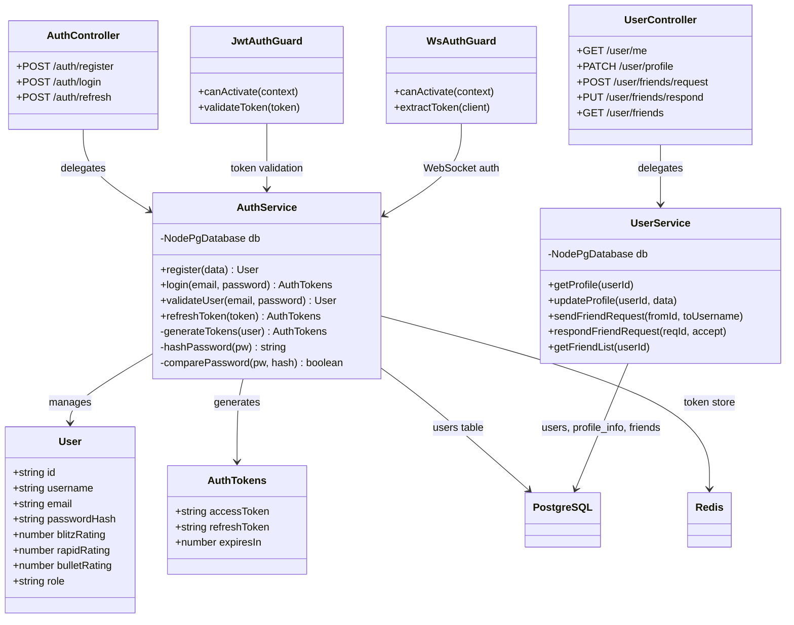
```mermaid
classDiagram
    direction TB

    class AuthController {
        +POST /auth/register
        +POST /auth/login
        +POST /auth/refresh
    }

    class AuthService {
        -NodePgDatabase db
        +register(data) User
        +login(email, password) AuthTokens
        +validateUser(email, password) User
        +refreshToken(token) AuthTokens
        -generateTokens(user) AuthTokens
        -hashPassword(pw) string
        -comparePassword(pw, hash) boolean
    }

    class UserController {
        +GET /user/me
        +PATCH /user/profile
        +POST /user/friends/request
        +PUT /user/friends/respond
        +GET /user/friends
    }

    class UserService {
        -NodePgDatabase db
        +getProfile(userId)
        +updateProfile(userId, data)
        +sendFriendRequest(fromId, toUsername)
        +respondFriendRequest(reqId, accept)
        +getFriendList(userId)
    }

    class JwtAuthGuard {
        +canActivate(context)
        +validateToken(token)
    }

    class WsAuthGuard {
        +canActivate(context)
        +extractToken(client)
    }

    class User {
        +string id
        +string username
        +string email
        +string passwordHash
        +number blitzRating
        +number rapidRating
        +number bulletRating
        +string role
    }

    class AuthTokens {
        +string accessToken
        +string refreshToken
        +number expiresIn
    }

    AuthController --> AuthService : delegates
    UserController --> UserService : delegates
    AuthService --> User : manages
    AuthService --> AuthTokens : generates
    AuthService --> PostgreSQL : users table
    AuthService --> Redis : token store
    UserService --> PostgreSQL : users, profile_info, friends
    JwtAuthGuard --> AuthService : token validation
    WsAuthGuard --> AuthService : WebSocket auth
```

#### 🔍 Giải thích

- **`AuthController`** + **`AuthService`** = hệ thống đăng nhập/đăng ký. `AuthService` có các phương thức private `-hashPassword` và `-comparePassword` (không lộ ra ngoài).
- **`UserController`** + **`UserService`** = quản lý profile và bạn bè.
- **`User`** là entity chính — ánh xạ vào bảng `users`. Chứa 3 loại ELO: `blitzRating`, `rapidRating`, `bulletRating`.
- **`AuthTokens`** là DTO chứa `accessToken` (15 phút) và `refreshToken` (7 ngày).
- **`JwtAuthGuard`** bảo vệ REST API endpoints — kiểm tra JWT token trong header.
- **`WsAuthGuard`** bảo vệ WebSocket events — kiểm tra token khi client connect.
- Cả 2 Guard đều phụ thuộc vào `AuthService` để validate token.

---

### 6. Module Leaderboard — Chi Tiết

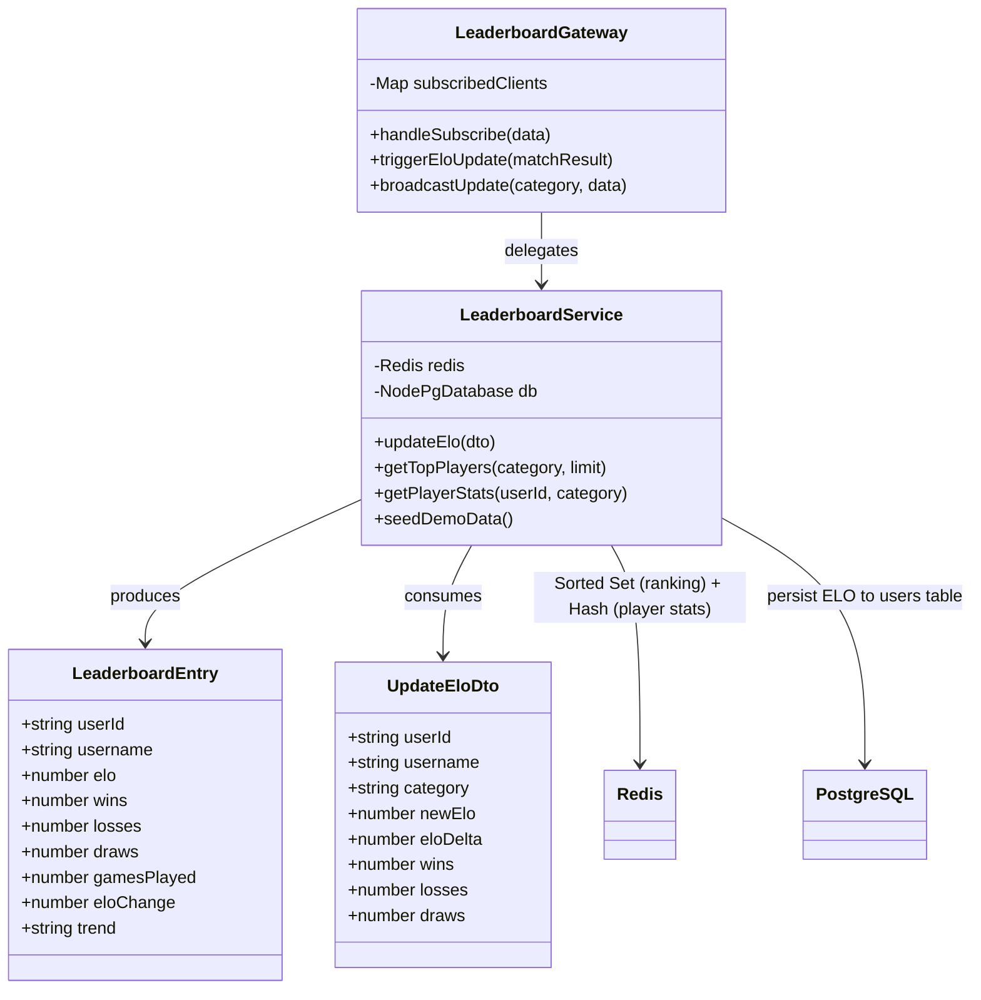
```mermaid
classDiagram
    direction TB

    class LeaderboardGateway {
        -Map subscribedClients
        +handleSubscribe(data)
        +triggerEloUpdate(matchResult)
        +broadcastUpdate(category, data)
    }

    class LeaderboardService {
        -Redis redis
        -NodePgDatabase db
        +updateElo(dto)
        +getTopPlayers(category, limit)
        +getPlayerStats(userId, category)
        +seedDemoData()
    }

    class LeaderboardEntry {
        +string userId
        +string username
        +number elo
        +number wins
        +number losses
        +number draws
        +number gamesPlayed
        +number eloChange
        +string trend
    }

    class UpdateEloDto {
        +string userId
        +string username
        +string category
        +number newElo
        +number eloDelta
        +number wins
        +number losses
        +number draws
    }

    LeaderboardGateway --> LeaderboardService : delegates
    LeaderboardService --> LeaderboardEntry : produces
    LeaderboardService --> UpdateEloDto : consumes
    LeaderboardService --> Redis : Sorted Set (ranking) + Hash (player stats)
    LeaderboardService --> PostgreSQL : persist ELO to users table
```

#### 🔍 Giải thích

- **`LeaderboardGateway`** là WebSocket gateway (`/leaderboard`) — nhận subscribe từ client, broadcast cập nhật khi ELO thay đổi.
- **`LeaderboardService`** sử dụng **Redis Sorted Set** để xếp hạng (ZADD/ZREVRANGE) — O(log N) update, rất nhanh. Ngoài ra còn dùng Redis Hash để lưu stats chi tiết (wins/losses/draws/gamesPlayed/trend).
- **`LeaderboardEntry`** là DTO trả về cho client — chứa đầy đủ thông tin một dòng trong bảng xếp hạng.
- **`UpdateEloDto`** là DTO đầu vào — nhận từ `GameGateway` sau mỗi trận đấu.
- ELO được **persist vào PostgreSQL** (`users` table) để không bị mất khi Redis restart.

---

### 7. Frontend Class Diagram — Kiến Trúc Tổng Quan

Sơ đồ này thể hiện **toàn bộ cấu trúc frontend** — từ Zustand Stores (quản lý state), Custom Hooks (giao tiếp WebSocket), đến UI Components (giao diện).


```mermaid
classDiagram
    direction TB

    %% ──────────────── ZUSTAND STORES ────────────────
    class UserStore {
        +User user
        +boolean isAuthenticated
        +login(email, password)
        +register(data)
        +logout()
        +fetchProfile()
        +updateLocalElo(newElo)
    }

    class GameStore {
        +GameState currentGame
        +boolean isSearching
        +number searchTime
        +GameOverResult gameOver
        +setGame(game)
        +updateMove(move)
        +setGameOver(result)
        +setSearching(bool)
        +reset()
    }

    class TournamentStore {
        +Tournament[] tournaments
        +Tournament currentTournament
        +SwissPairing[] myPairings
        +number currentRound
        +number countdownSeconds
        +fetchTournaments()
        +setCurrentTournament(t)
        +setPairings(pairings)
        +startCountdown(ms)
        +clearCountdown()
    }

    class ChatStore {
        +Map~string, ChatRoom~ rooms
        +number totalUnread
        +string activeRoomId
        +upsertRoomForDirect(msg)
        +addMessage(roomId, msg)
        +setActiveRoom(roomId)
        +markRead(roomId)
        +setTyping(roomId, userId, bool)
    }

    class FriendStore {
        +Friend[] friendList
        +FriendRequest[] pendingRequests
        +fetchFriends()
        +sendRequest(username)
        +respondRequest(reqId, accept)
    }

    class ProfileStore {
        +UserProfile profile
        +PlayerStats stats
        +fetchProfile()
        +updateProfile(data)
    }

    %% ──────────────── CUSTOM HOOKS ────────────────
    class UseChessSocket {
        -Socket socket
        -GameStore gameStore
        -UserStore userStore
        +connect()
        +disconnect()
        +joinQueue(timeControl)
        +makeMove(from, to, promotion)
        +resign()
        +offerDraw()
        +respondDraw(accept)
        +startBotGame(difficulty, color)
        -onGameStarted(data)
        -onMoveMade(data)
        -onGameOver(data)
        -onSearchProgress(data)
    }

    class UseFriendChat {
        -Socket socket
        -ChatStore chatStore
        +connect(userId)
        +sendMessage(roomId, content)
        +sendDirectMessage(toUserId, content)
        +joinDm(friendId)
        +sendTyping(roomId)
        -onDmMessage(data)
        -onReceiveDirectMessage(data)
        -onUserTyping(data)
        -onUserStatus(data)
    }

    class UseWatchSocket {
        -Socket socket
        -WatchStore watchStore
        +connect()
        +watchGame(gameId)
        +leaveWatch()
        -onGameState(data)
        -onGameUpdate(data)
    }

    class UseLeaderboard {
        -Socket socket
        +subscribe(category)
        +unsubscribe()
        -onLeaderboardData(data)
        -onLeaderboardUpdate(data)
    }

    class UseStockfish {
        -Worker stockfish
        +load()
        +getBestMove(fen, difficulty)
        +terminate()
    }

    %% ──────────────── UI COMPONENTS ────────────────
    class ChessBoard {
        +render()
        +onPieceDrop(source, target)
        +highlightLegalMoves(square)
        +flipBoard()
        +showPromotionDialog(callback)
    }

    class ChatDrawer {
        +render()
        +selectRoom(roomId)
        +sendMessage(content)
        +showTypingIndicator()
        +showUnreadBadge(count)
    }

    class GameOverModal {
        +render(result, eloChange)
        +showWinner(winner)
        +showEloChange(delta, oldElo, newElo)
        +actionButtons(rematch, newGame)
    }

    class TournamentBracket {
        +render(pairings)
        +showStandings(players)
        +showCountdown(seconds)
    }

    class MatchmakingPanel {
        +render()
        +selectTimeControl(tc)
        +showSearchingAnimation()
        +showEloRange(eloRange)
        +cancelSearch()
    }

    class LiveGamesList {
        +render(games)
        +selectGame(gameId)
        +showPlayerInfo(players)
    }

    class LeaderboardTable {
        +render(entries)
        +sortByCategory(category)
        +showTrendIcon(trend)
    }

    class ProfilePage {
        +render(profile, stats)
        +editAvatar()
        +editBio()
        +showEloChart()
    }

    %% ──────────────── LIB ────────────────
    class ApiFetch {
        +get(url, params)
        +post(url, data)
        +patch(url, data)
        +delete(url)
        +setAuthToken(token)
    }

    class AuthUtils {
        +getToken()
        +setToken(token)
        +removeToken()
        +isTokenExpired(token)
        +decodeToken(token)
    }

    class ChessUtils {
        +getLegalMoves(fen, square)
        +isCheck(fen)
        +isCheckmate(fen)
        +isStalemate(fen)
        +getGameResult(fen)
    }

    %% ═══════════════════════════════════════════════════════
    %% RELATIONSHIPS
    %% ═══════════════════════════════════════════════════════

    UseChessSocket --> GameStore : updates
    UseChessSocket --> UserStore : reads/auth
    UseFriendChat --> ChatStore : updates
    UseWatchSocket --> WatchStore : updates
    UseLeaderboard --> LeaderboardTable : data binding

    ChessBoard --> UseChessSocket : emits moves
    ChessBoard --> ChessUtils : validation

    ChatDrawer --> UseFriendChat : emits messages
    ChatDrawer --> ChatStore : reads

    GameOverModal --> GameStore : reads result
    TournamentBracket --> TournamentStore : reads pairings
    MatchmakingPanel --> UseChessSocket : emits queue
    LiveGamesList --> UseWatchSocket : emits watch
    LeaderboardTable --> UseLeaderboard : subscribes
    ProfilePage --> ProfileStore : reads/writes

    UseStockfish --> ChessBoard : AI moves

    ApiFetch ..> AuthUtils : token management

    note for UseChessSocket "namespace: /chess"
    note for UseFriendChat "namespace: /chat"
    note for UseWatchSocket "namespace: /watch"
    note for UseLeaderboard "namespace: /leaderboard"
```

#### 🔍 Giải thích chi tiết từng thành phần

**🏪 Zustand Stores (Quản lý State)**

| Store | Vai trò |
|-------|---------|
| **`UserStore`** | Lưu thông tin user hiện tại (`user`, `isAuthenticated`). Xử lý login, register, logout, fetch profile. Có `updateLocalElo()` để cập nhật ELO mới vào localStorage ngay sau khi game kết thúc. |
| **`GameStore`** | Lưu trạng thái game hiện tại: `currentGame` (GameState), `isSearching` (đang tìm trận?), `searchTime` (thời gian đã chờ), `gameOver` (kết quả khi kết thúc). |
| **`TournamentStore`** | Lưu danh sách giải đấu, giải đấu hiện tại, pairings của người chơi, `countdownSeconds` (đếm ngược 30s giữa các vòng). |
| **`ChatStore`** | Quản lý tất cả phòng chat (`rooms`), tổng số tin nhắn chưa đọc (`totalUnread`), phòng đang mở (`activeRoomId`). `upsertRoomForDirect()` cho phép hiển thị badge Unread ngay cả khi chưa mở cửa sổ chat. |
| **`FriendStore`** | Danh sách bạn bè và lời mời kết bạn đang chờ. |
| **`ProfileStore`** | Thông tin profile và stats (wins/losses/draws) của user. |

**🪝 Custom Hooks (Giao tiếp WebSocket)**

| Hook | Namespace | Vai trò |
|------|-----------|---------|
| **`UseChessSocket`** | `/chess` | Kết nối WebSocket tới GameGateway. Các method public (`+`) là action người dùng gọi (joinQueue, makeMove, resign...). Các method private (`-`) là handler lắng nghe event từ server (onGameStarted, onMoveMade, onGameOver...). |
| **`UseFriendChat`** | `/chat` | Kết nối WebSocket tới ChatGateway. Gửi tin nhắn (sendMessage/sendDirectMessage), join phòng chat, gửi typing indicator. |
| **`UseWatchSocket`** | `/watch` | Kết nối WebSocket tới WatchGateway. Xem trận đấu trực tiếp. |
| **`UseLeaderboard`** | `/leaderboard` | Kết nối WebSocket tới LeaderboardGateway. Nhận real-time ranking updates. |
| **`UseStockfish`** | (local) | Chạy Stockfish engine trong Web Worker trên browser — không cần backend call cho AI moves. |

**🧩 UI Components**

| Component | Vai trò |
|-----------|---------|
| **`ChessBoard`** | Bàn cờ tương tác — kéo thả quân, highlight nước đi hợp lệ, lật bàn cờ, dialog phong cấp. Gọi `UseChessSocket.makeMove()` khi người dùng thả quân. Dùng `ChessUtils` để validate phía client. |
| **`ChatDrawer`** | Khung chat trượt từ bên phải — chọn bạn để chat, gửi tin nhắn, hiển thị typing indicator và badge Unread. |
| **`GameOverModal`** | Popup hiển thị khi game kết thúc — kết quả (thắng/thua/hòa), thay đổi ELO (+X/-Y), icon (🏆/💔/🤝), glow effect. |
| **`TournamentBracket`** | Hiển thị cặp đấu trong giải đấu, bảng xếp hạng, đồng hồ countdown. |
| **`MatchmakingPanel`** | Giao diện tìm trận — chọn time control, animation "Đang tìm...", hiển thị phạm vi ELO đang tìm, nút hủy. |
| **`LiveGamesList`** | Danh sách các trận đang diễn ra — click để vào xem (spectator mode). |
| **`LeaderboardTable`** | Bảng xếp hạng — sắp xếp theo category (Blitz/Bullet/Rapid), hiển thị trend (↑↓→). |
| **`ProfilePage`** | Trang hồ sơ cá nhân — avatar, bio, biểu đồ ELO. |

**📚 Lib (Thư viện)**

| Lib | Vai trò |
|-----|---------|
| **`ApiFetch`** | Wrapper cho HTTP requests — tự động gắn JWT token vào header, xử lý refresh token khi hết hạn. |
| **`AuthUtils`** | Quản lý JWT token trong localStorage — lấy/lưu/xóa token, kiểm tra hết hạn, decode payload. |
| **`ChessUtils`** | Wrapper cho chess.js — lấy nước đi hợp lệ, kiểm tra chiếu/chiếu hết/hòa. Dùng cho client-side validation (UX only). |

---

### 8. Package/Subsystem Diagram — Kiến Trúc Phân Tầng

Sơ đồ này cho thấy **toàn bộ hệ thống được tổ chức thành các tầng** (layers) — từ Frontend, qua WebSocket/REST, tới Backend và Data Layer.

```mermaid
graph TB
    subgraph "🎨 FRONTEND — Next.js 16 (React 19)"
        direction TB

        subgraph "Presentation Layer"
            PAGES["📄 Pages<br/>(App Router)"]
            COMPONENTS["🧩 Components<br/>ChessBoard, ChatDrawer,<br/>GameOverModal, TournamentBracket"]
        end

        subgraph "State Management"
            STORES["🏪 Zustand Stores<br/>UserStore, GameStore,<br/>ChatStore, TournamentStore"]
        end

        subgraph "Communication Layer"
            HOOKS["🪝 Custom Hooks<br/>useChessSocket, useFriendChat,<br/>useWatchSocket, useLeaderboard,<br/>useStockfish"]
            LIB["📚 Lib<br/>apiFetch, authUtils, chessUtils"]
        end

        PAGES --> COMPONENTS
        COMPONENTS --> HOOKS
        COMPONENTS --> STORES
        HOOKS --> STORES
        HOOKS --> LIB
    end

    subgraph "🔌 REAL-TIME COMMUNICATION"
        SOCKET_IO["Socket.IO<br/>━━━━━━━━━━━━━━━━<br/>Namespaces:<br/> /chess · /chat<br/> /watch · /tournament<br/> /leaderboard"]
    end

    subgraph "⚙️ BACKEND — NestJS"
        direction TB

        subgraph "Gateway Layer (WebSocket)"
            GAME_GW["🎮 GameGateway<br/>matchmaking, moves, resign"]
            WATCH_GW["👁️ WatchGateway<br/>spectator mode"]
            CHAT_GW["💬 ChatGateway<br/>DM 1-1, typing"]
            TOURN_GW["🏆 TournamentGateway<br/>rounds, standings"]
            LB_GW["📊 LeaderboardGateway<br/>ELO updates"]
        end

---

## 9. Deployment Architecture — Kiến Trúc Triển Khai Production

Sơ đồ này mô tả **toàn bộ hạ tầng triển khai** trên VPS production: Nginx reverse proxy, HTTPS/SSL, Docker Compose, và cách các service giao tiếp với nhau.

### 9.1 Deployment Diagram

```mermaid
graph TB
    subgraph "🌍 INTERNET"
        USER["👤 Người dùng<br/>(Browser)"]
    end

    subgraph "🔒 VPS — Ubuntu Server"
        
        subgraph "🔀 NGINX Reverse Proxy (Port 80/443)"
            NGINX["📄 nginx.conf<br/>━━━━━━━━━━━━━━━━<br/>• SSL Termination (Certbot/Let's Encrypt)<br/>• HTTP → HTTPS redirect<br/>• Reverse Proxy: /api/* → backend:9080<br/>• Reverse Proxy: / → frontend:9300<br/>• WebSocket Upgrade: /chess, /chat,<br/>  /watch, /tournament, /leaderboard"]
        end

        subgraph "🐳 Docker Compose (chess-network bridge)"
            subgraph "Frontend Container"
                FE["🎨 Next.js 16<br/>Container: chess_frontend<br/>Internal Port: 3000<br/>Host Port: 9300"]
            end
            subgraph "Backend Container"
                BE["⚙️ NestJS<br/>Container: chess_backend<br/>Internal Port: 8080<br/>Host Port: 9080"]
            end
            subgraph "Database Containers"
                PG["🐘 PostgreSQL 17<br/>Container: chess_postgres<br/>Internal Port: 5432<br/>Host Port: 9432"]
                RD["🧠 Redis 7 Alpine<br/>Container: chess_redis<br/>Internal Port: 6379<br/>Host Port: 9379"]
            end
        end
    end

    USER -->|"HTTPS :443"| NGINX
    NGINX -->|"/api/* REST"| BE
    NGINX -->|"/* Static + SSR"| FE
    NGINX -.->|"WebSocket Upgrade"| BE
    BE --> PG
    BE --> RD
    FE -->|"Client-side API calls<br/>(browser → public IP)"| NGINX

    style USER fill:#e3f2fd,stroke:#1565c0
    style NGINX fill:#fff3e0,stroke:#ef6c00
    style FE fill:#e8f5e9,stroke:#2e7d32
    style BE fill:#fce4ec,stroke:#c2185b
    style PG fill:#f3e5f5,stroke:#7b1fa2
    style RD fill:#ffebee,stroke:#c62828
```

### 9.2 Port Mapping — Tránh Xung Đột VPS

| Service | Internal Port (Docker) | Host Port (VPS) | Ghi chú |
|---------|----------------------|-----------------|---------|
| **Nginx** | — | **80** (HTTP), **443** (HTTPS) | Cổng duy nhất mở ra internet |
| **Frontend** (Next.js) | 3000 | 9300 | Nginx proxy `/` → `:9300` |
| **Backend** (NestJS) | 8080 | 9080 | Nginx proxy `/api/*` + WebSocket → `:9080` |
| **PostgreSQL** | 5432 | 9432 | Chỉ mở nội bộ (không expose ra internet) |
| **Redis** | 6379 | 9379 | Chỉ mở nội bộ (không expose ra internet) |

> **Tất cả các port đều dùng đầu số 9** để né các port phổ biến đã bị chiếm trên VPS công ty (3000, 4000, 5432, 6379, 27017...).

### 9.3 Luồng Request — Chi Tiết

```
1. Browser → https://chess.yourdomain.com (hoặc IP VPS)
   │
2. DNS phân giải → VPS Public IP (VD: 103.226.249.248)
   │
3. Nginx nhận request trên port 443 (HTTPS)
   │
   ├── /api/auth/* (REST)
   │   └── proxy_pass http://chess_backend:9080
   │
   ├── /socket.io/* (WebSocket handshake)
   │   └── proxy_pass http://chess_backend:9080
   │   └── Upgrade: websocket header → giữ kết nối WebSocket
   │
   └── /* (Frontend pages + static assets)
       └── proxy_pass http://chess_frontend:9300
```

### 9.4 Cấu Hình Nginx Tham Khảo

```nginx
# /etc/nginx/sites-available/chess-app

server {
    listen 80;
    server_name chess.yourdomain.com;  # hoặc IP VPS
    return 301 https://$host$request_uri;  # Force HTTPS
}

server {
    listen 443 ssl http2;
    server_name chess.yourdomain.com;

    # SSL Certificate (Certbot / Let's Encrypt)
    ssl_certificate     /etc/letsencrypt/live/chess.yourdomain.com/fullchain.pem;
    ssl_certificate_key /etc/letsencrypt/live/chess.yourdomain.com/privkey.pem;

    # WebSocket Upgrade map
    map $http_upgrade $connection_upgrade {
        default upgrade;
        ''      close;
    }

    # ─── Frontend (Next.js) ──────────────────────────────────
    location / {
        proxy_pass http://127.0.0.1:9300;
        proxy_http_version 1.1;
        proxy_set_header Host $host;
        proxy_set_header X-Real-IP $remote_addr;
        proxy_set_header X-Forwarded-For $proxy_add_x_forwarded_for;
        proxy_set_header X-Forwarded-Proto $scheme;
    }

    # ─── Backend REST API ────────────────────────────────────
    location /api/ {
        proxy_pass http://127.0.0.1:9080;
        proxy_http_version 1.1;
        proxy_set_header Host $host;
        proxy_set_header X-Real-IP $remote_addr;
        proxy_set_header X-Forwarded-For $proxy_add_x_forwarded_for;
        proxy_set_header X-Forwarded-Proto $scheme;
    }

    # ─── WebSocket (Socket.IO) ───────────────────────────────
    # Phải để riêng location để Nginx upgrade connection
    location /socket.io/ {
        proxy_pass http://127.0.0.1:9080;
        proxy_http_version 1.1;
        proxy_set_header Upgrade $http_upgrade;
        proxy_set_header Connection $connection_upgrade;
        proxy_set_header Host $host;
        proxy_set_header X-Forwarded-For $proxy_add_x_forwarded_for;
        proxy_read_timeout 86400s;  # WebSocket long-lived
        proxy_send_timeout 86400s;
    }
}
```

### 9.5 Biến Môi Trường Cho Deploy Production

| Biến | Giá trị Production | Mục đích |
|------|-------------------|----------|
| `VPS_PUBLIC_IP` | `103.226.249.248` | IP công khai của VPS |
| `FRONTEND_URL` | `http://103.226.249.248:9300` | CORS origin cho backend |
| `NEXT_PUBLIC_API_URL` | `http://103.226.249.248:9080/api` | Browser gọi REST API (nhúng vào JS) |
| `NEXT_PUBLIC_BACKEND_URL` | `http://103.226.249.248:9080` | Browser kết nối WebSocket (nhúng vào JS) |

> ⚠️ **Quan trọng**: `NEXT_PUBLIC_*` được nhúng cứng vào JavaScript khi `npm run build`. Nếu để `localhost`, browser người dùng sẽ gọi API về chính máy họ → lỗi 404. Phải dùng IP/hostname công khai của VPS.

### 9.6 Cài Đặt HTTPS Với Certbot

```bash
# 1. Cài Certbot + Nginx plugin
sudo apt update
sudo apt install certbot python3-certbot-nginx -y

# 2. Lấy chứng chỉ SSL (tự động cấu hình Nginx)
sudo certbot --nginx -d chess.yourdomain.com

# 3. Kiểm tra tự động renew
sudo certbot renew --dry-run

# 4. Auto-renew được cài tự động qua systemd timer
systemctl status certbot.timer
```

### 9.7 Quy Trình Deploy

```bash
# ─── 1. Pull code mới nhất ──────────────────────────────────
cd /opt/web-datn      # hoặc thư mục dự án trên VPS
git pull

# ─── 2. Build lại Docker images (nếu code thay đổi) ──────────
docker-compose build --no-cache backend
docker-compose build --no-cache frontend

# ─── 3. Khởi động toàn bộ stack ─────────────────────────────
docker-compose up -d

# ─── 4. Reload Nginx (nếu cấu hình thay đổi) ────────────────
sudo nginx -t && sudo systemctl reload nginx

# ─── 5. Kiểm tra logs ──────────────────────────────────────
docker-compose logs -f backend
docker-compose logs -f frontend
```

### 9.8 Các File Liên Quan Đến Deploy

| File | Mục đích |
|------|----------|
| `.env` | Biến môi trường Docker Compose (secrets, ports, URLs) — **không commit** |
| `.env.example` | Template biến môi trường (placeholder) — **được commit** |
| `docker-compose.yml` | Định nghĩa toàn bộ Docker stack (4 services + network + volumes) |
| `backend/Dockerfile` | Multi-stage build cho NestJS (deps → builder → runner Alpine) |
| `frontend/Dockerfile` | Multi-stage build cho Next.js (deps → builder → runner standalone) |
| `/etc/nginx/sites-available/chess-app` | Cấu hình Nginx reverse proxy + SSL (trên VPS, thủ công) |

        subgraph "Controller Layer (REST)"
            AUTH_CTRL["🔐 AuthController<br/>register, login, refresh"]
            GAME_CTRL["🎮 GameController<br/>history, detail"]
            TOURN_CTRL["🏆 TournamentController<br/>CRUD, join/leave"]
            USER_CTRL["👤 UserController<br/>profile, friends"]
        end

        subgraph "Service Layer (Business Logic)"
            GAME_SVC["🎮 GameService<br/>ELO matchmaking,<br/>move validation, clock"]
            AI_SVC["🤖 AiService<br/>Minimax + Alpha-Beta<br/>Piece-Square Tables"]
            AUTH_SVC["🔐 AuthService<br/>JWT, bcrypt"]
            CHAT_SVC["💬 ChatService<br/>DM rooms, messages"]
            TOURN_SVC["🏆 TournamentService<br/>round management"]
            SWISS_SVC["📐 TournamentSwissService<br/>Swiss pairing algorithm"]
            LB_SVC["📊 LeaderboardService<br/>ELO ranking, stats"]
            USER_SVC["👤 UserService<br/>profile, friends"]
        end

        GAME_GW --> GAME_SVC
        WATCH_GW --> GAME_SVC
        CHAT_GW --> CHAT_SVC
        TOURN_GW --> TOURN_SVC
        LB_GW --> LB_SVC

        AUTH_CTRL --> AUTH_SVC
        GAME_CTRL --> GAME_SVC
        TOURN_CTRL --> TOURN_SVC
        USER_CTRL --> USER_SVC

        GAME_SVC --> AI_SVC
        GAME_SVC --> LB_SVC
        TOURN_SVC --> SWISS_SVC
        TOURN_SVC --> GAME_SVC
    end

    subgraph "💾 DATA LAYER"
        direction LR

        subgraph "Cache / Real-time State"
            REDIS[( "🧠 Redis<br/>━━━━━━━━━━<br/>Game State (Hash)<br/>Matchmaking Queue (ZSET)<br/>Leaderboard (ZSET)<br/>Online Users (Hash)<br/>Message Cache (List)<br/>Tournament Rounds (Hash)" )]
        end

        subgraph "Persistent Storage"
            POSTGRES[( "🐘 PostgreSQL<br/>━━━━━━━━━━<br/>users, games<br/>tournaments, participants<br/>chat_rooms, messages<br/>friends, profile_info" )]
        end
    end

    subgraph "🌐 EXTERNAL"
        STOCKFISH["♟️ Stockfish<br/>Chess Engine<br/>(Minimax AI)"]
    end

    %% Connections
    FRONTEND <==>|"WebSocket<br/>Socket.IO"| SOCKET_IO
    FRONTEND -->|"HTTP REST"| BACKEND
    SOCKET_IO <==> BACKEND

    BACKEND --> REDIS
    BACKEND --> POSTGRES
    AI_SVC --> STOCKFISH

    style FRONTEND fill:#e3f2fd,stroke:#1565c0
    style BACKEND fill:#fff3e0,stroke:#ef6c00
    style REDIS fill:#ffebee,stroke:#c62828
    style POSTGRES fill:#e8f5e9,stroke:#2e7d32
    style SOCKET_IO fill:#f3e5f5,stroke:#7b1fa2
    style STOCKFISH fill:#fce4ec,stroke:#c2185b
```

#### 🔍 Giải thích kiến trúc phân tầng

Hệ thống được chia thành **4 tầng chính**:

| Tầng | Màu | Mô tả |
|------|------|-------|
| **🎨 Frontend** | Xanh dương | Next.js 16 + React 19. Gồm 3 sub-layer: **Pages** (App Router — định tuyến), **Components** (UI — bàn cờ, chat, modal...), và **Communication Layer** (Hooks + Lib — gọi WebSocket và REST API). |
| **🔌 Socket.IO** | Tím | Lớp **giao tiếp thời gian thực** trung gian giữa Frontend và Backend. 5 namespace: `/chess`, `/chat`, `/watch`, `/tournament`, `/leaderboard`. |
| **⚙️ Backend** | Cam | NestJS với 3 sub-layer: **Gateway Layer** (WebSocket — nhận real-time events), **Controller Layer** (REST API — CRUD), **Service Layer** (Business Logic — xử lý nghiệp vụ). |
| **💾 Data Layer** | Đỏ + Xanh lá | **Redis** (cache + real-time state: game state, queue, leaderboard, online users) và **PostgreSQL** (persistent storage: users, games, tournaments, chat). |

**Luồng dữ liệu điển hình**:
1. Người dùng tương tác với **Component** (VD: kéo thả quân cờ trên `ChessBoard`)
2. Component gọi **Hook** (VD: `UseChessSocket.makeMove()`)
3. Hook emit event qua **Socket.IO** tới **Gateway** (VD: `GameGateway`)
4. Gateway ủy thác cho **Service** xử lý (VD: `GameService.processMove()`)
5. Service đọc/ghi vào **Redis** (real-time state) và **PostgreSQL** (persist)

---

### Bảng Mapping: Class Diagram ↔ Sequence Diagram

| Class | Vai trò | Sequence Diagram liên quan |
|-------|---------|---------------------------|
| **GameGateway** | WebSocket `/chess` | UC-G01 (Matchmaking), UC-G02 (Đi cờ), UC-G03 (Đầu hàng), UC-G04 (Hòa), UC-G05 (Timeout), UC-B01 (Play Bot) |
| **GameService** | Business logic game | Tất cả UC-Gxx và UC-B01 |
| **AiService** | AI engine | UC-B01 (Play Bot) |
| **WatchGateway** | WebSocket `/watch` | UC-W01 (Spectator) |
| **ChatGateway** | WebSocket `/chat` | UC-C01 (Room-based), UC-C02 (Direct/Redis-based), UC-C03 (In-game chat) |
| **ChatService** | Chat business logic | UC-C01, UC-C02, UC-C03 |
| **TournamentGateway** | WebSocket `/tournament` | UC-T02 (Join), UC-T03 (Start), UC-T04 (Play), UC-T05 (Countdown), UC-T06 (Finish) |
| **TournamentService** | Tournament business logic | Tất cả UC-Txx |
| **TournamentSwissService** | Swiss pairing | UC-T01, UC-T03, UC-T05 |
| **LeaderboardGateway** | WebSocket `/leaderboard` | UC-L01 (Xem BXH) |
| **LeaderboardService** | ELO ranking | UC-L01, UC-16 (Tính ELO) |
| **AuthController** | REST API auth | UC-A01 (Register), UC-A02 (Login), UC-A03 (Refresh) |
| **AuthService** | JWT, bcrypt | UC-A01, UC-A02, UC-A03 |
| **UserController** | REST API user | UC-14 (Profile), UC-15 (Friends) |
| **UserService** | Profile & friends | UC-14, UC-15 |
| **GameController** | REST API game history | UC-08 (Lịch sử trận) |
| **TournamentController** | REST API tournament | UC-09, UC-10 |

---

## Cấu Trúc Codebase

```
web-datn/
├── README.md                          # Tài liệu hệ thống (file này)
├── CLAUDE.md                          # Hướng dẫn phát triển cho AI Agent
├── docker-compose.yml                 # Docker Compose cho toàn bộ stack
│
├── backend/                           # ⚙️ NestJS Backend (TypeScript)
│   ├── package.json                   # Dependencies & scripts
│   ├── tsconfig.json                  # TypeScript config
│   ├── tsconfig.build.json            # TypeScript build config
│   ├── nest-cli.json                  # NestJS CLI config
│   ├── drizzle.config.ts              # Drizzle ORM config
│   ├── Dockerfile                     # Docker image cho backend
│   ├── docker-compose.yml             # Docker Compose override
│   ├── Procfile                       # Railway deploy config
│   ├── railway.toml                   # Railway settings
│   │
│   ├── drizzle/                       # Database Migrations
│   │   ├── 0000_fearless_betty_brant.sql
│   │   └── meta/
│   │       ├── _journal.json
│   │       └── 0000_snapshot.json
│   │
│   ├── migrations/                    # SQL Migrations (thủ công)
│   │   └── add_moves_column.sql
│   │
│   ├── src/                           # 🧩 Source Code
│   │   ├── main.ts                    # Entry point — bootstrap NestJS app
│   │   ├── app.module.ts              # Root module
│   │   ├── app.controller.ts          # Root controller
│   │   ├── app.service.ts             # Root service
│   │   │
│   │   ├── auth/                      # 🔐 Xác thực (JWT)
│   │   │   ├── auth.module.ts
│   │   │   ├── auth.controller.ts     # POST /auth/login, /auth/register
│   │   │   ├── auth.service.ts        # Hash password, tạo/verify JWT
│   │   │   └── dto/                   # Data Transfer Objects
│   │   │
│   │   ├── user/                      # 👤 Quản lý người dùng
│   │   │   ├── user.module.ts
│   │   │   ├── user.controller.ts     # GET/PATCH /user/me, friends API
│   │   │   ├── user.service.ts
│   │   │   ├── dto/
│   │   │   └── guards/                # Auth guards (JWT, WebSocket)
│   │   │
│   │   ├── game/                      # ♟️ Logic game & matchmaking
│   │   │   ├── game.module.ts
│   │   │   ├── game.gateway.ts        # WebSocket /chess — join_queue, make_move, resign
│   │   │   ├── game.controller.ts     # REST API — GET /game/history, /game/:id
│   │   │   ├── game.service.ts        # Lua scripts, game state, clock, persistence
│   │   │   ├── README.md
│   │   │   └── dto/
│   │   │
│   │   ├── tournament/                # 🏆 Giải đấu (Swiss System)
│   │   │   ├── tournament.module.ts
│   │   │   ├── tournament.controller.ts  # CRUD tournaments, join/leave
│   │   │   ├── tournament.gateway.ts     # WebSocket /tournament — real-time updates
│   │   │   ├── tournament.service.ts     # Tournament CRUD, round management
│   │   │   └── tournament-swiss.service.ts  # Swiss pairing algorithm
│   │   │
│   │   ├── chat/                      # 💬 Chat 1-1 (Direct Message)
│   │   │   ├── chat.module.ts
│   │   │   ├── chat.gateway.ts        # WebSocket /chat — send_dm, send_direct_message
│   │   │   ├── chat.service.ts        # Message persistence, cache
│   │   │   └── dto/
│   │   │
│   │   ├── watch/                     # 👁️ Spectator Mode
│   │   │   ├── watch.module.ts
│   │   │   ├── watch.gateway.ts       # WebSocket /watch — watch_game, game_update
│   │   │   └── watch.service.ts
│   │   │
│   │   ├── ai/                        # 🤖 Stockfish AI Integration
│   │   │   ├── ai.module.ts
│   │   │   └── ai.service.ts          # Minimax + Alpha-Beta, gọi Stockfish
│   │   │
│   │   ├── leaderboard/               # 📊 Bảng xếp hạng ELO
│   │   │   ├── leaderboard.module.ts
│   │   │   ├── leaderboard.gateway.ts # WebSocket /leaderboard — real-time rankings
│   │   │   ├── leaderboard.service.ts # Redis Sorted Set, ELO FIDE calculation
│   │   │   └── dto/
│   │   │
│   │   ├── redis/                     # 🗄️ Redis Module
│   │   │   └── redis.module.ts        # Redis client provider (ioredis)
│   │   │
│   │   └── drizzle/                   # 🗃️ Database Layer (Drizzle ORM)
│   │       ├── drizzle.module.ts      # Drizzle provider
│   │       ├── seed.ts                # Database seeder
│   │       ├── schema/                # Table definitions
│   │       │   ├── schema.ts          # Re-export all schemas
│   │       │   ├── users.schema.ts
│   │       │   ├── game.schema.ts
│   │       │   ├── tournament.schema.ts
│   │       │   ├── chat.schema.ts
│   │       │   └── profileInfo.schema.ts
│   │       └── types/                 # Generated TypeScript types
│   │
│   └── test/                          # 🧪 E2E Tests
│       ├── app.e2e-spec.ts
│       └── jest-e2e.json
│
├── frontend/                          # 🎨 Next.js 16 Frontend (React 19)
│   ├── package.json                   # Dependencies & scripts
│   ├── tsconfig.json                  # TypeScript config
│   ├── next.config.ts                 # Next.js configuration
│   ├── middleware.ts                  # Auth middleware (route protection)
│   ├── components.json                # shadcn/ui config
│   ├── postcss.config.mjs             # PostCSS config
│   ├── eslint.config.mjs              # ESLint config
│   ├── Dockerfile                     # Docker image cho frontend
│   ├── ecosystem.config.js            # PM2 config
│   │
│   ├── app/                           # 📄 Next.js App Router
│   │   ├── layout.tsx                 # Root layout
│   │   ├── page.tsx                   # Landing page
│   │   ├── globals.css                # Global styles
│   │   ├── favicon.ico
│   │   │
│   │   ├── (auth)/                    # 🔓 Unauthenticated routes
│   │   │   ├── login/                 # Trang đăng nhập
│   │   │   └── register/              # Trang đăng ký
│   │   │
│   │   ├── (dashboard)/               # 🔒 Authenticated routes
│   │   │   ├── layout.tsx             # Dashboard layout (Navbar + Footer)
│   │   │   ├── dashboard.css          # Dashboard styles
│   │   │   ├── home/                  # Trang chủ
│   │   │   ├── play/                  # Chơi cờ — matchmaking
│   │   │   ├── play-bot/              # Chơi với AI
│   │   │   ├── tournaments/           # Danh sách giải đấu
│   │   │   ├── tournament-game/       # Trận đấu trong giải
│   │   │   ├── watch/                 # Xem trận trực tiếp
│   │   │   ├── archives/              # Lịch sử trận đấu
│   │   │   ├── ranks/                 # Bảng xếp hạng
│   │   │   ├── live/                  # Các trận đang diễn ra
│   │   │   └── friends/               # Quản lý bạn bè
│   │   │
│   │   └── api/                       # API Routes (Next.js)
│   │       └── auth/                  # Auth proxy routes
│   │
│   ├── components/                    # 🧱 UI Components
│   │   ├── chess/                     # Bàn cờ & logic cờ vua
│   │   │   ├── chessboard.tsx         # react-chessboard wrapper
│   │   │   ├── ChessReplay.tsx        # Xem lại ván cờ (PGN replay)
│   │   │   ├── EvaluationBar.tsx      # Thanh đánh giá (Stockfish eval)
│   │   │   └── OpponentProfilePopup.tsx  # Popup thông tin đối thủ
│   │   │
│   │   ├── common/                    # Shared components
│   │   │   ├── Navbar.tsx             # Thanh điều hướng
│   │   │   ├── Footer.tsx             # Chân trang
│   │   │   ├── ChatDrawer.tsx         # Khung chat 1-1
│   │   │   ├── ClientOnly.tsx         # Wrapper render chỉ ở client
│   │   │   ├── ProfilePanel.tsx       # Panel hồ sơ cá nhân
│   │   │   ├── ProfilePanel.css
│   │   │   ├── PublicProfilePanel.tsx # Hồ sơ công khai
│   │   │   └── PublicProfilePanel.css
│   │   │
│   │   └── ui/                        # shadcn/ui primitives (Button, Input, Dialog...)
│   │
│   ├── hooks/                         # 🪝 Custom React Hooks
│   │   ├── useChessSocket.ts          # WebSocket /chess — game real-time
│   │   ├── useFriendChat.ts           # WebSocket /chat — direct message
│   │   ├── useWatchSocket.ts          # WebSocket /watch — spectator mode
│   │   ├── useLeaderboard.ts          # WebSocket /leaderboard — rankings
│   │   └── useStockfish.ts            # Stockfish WASM trong browser
│   │
│   ├── store/                         # 🏪 Zustand State Stores
│   │   ├── useChatStore.ts            # Chat rooms, messages, unread count
│   │   ├── useFriendStore.ts          # Friend list, friend requests
│   │   ├── useProfileStore.ts         # User profile, stats
│   │   └── useWatchStore.ts           # Spectator state
│   │
│   ├── lib/                           # 📚 Utility Libraries
│   │   ├── api.ts                     # API fetch wrapper (auth headers)
│   │   ├── auth.ts                    # Auth helpers (token management)
│   │   └── utils.ts                   # General utilities
│   │
│   ├── types/                         # 📐 TypeScript Type Definitions
│   │
│   └── public/                        # 🌐 Static Assets
│       ├── stockfish.js               # Stockfish engine (non-WASM fallback)
│       └── stockfish-worker.js        # Stockfish Web Worker
```

### Mô Tả Kiến Trúc Tổng Quan

| Lớp | Công Nghệ | Vai Trò |
|-----|-----------|---------|
| **Frontend** | Next.js 16 + React 19 | UI, routing, client-side state (Zustand), Socket.IO client |
| **Backend** | NestJS + TypeScript | REST API, WebSocket gateways, business logic, validation |
| **Database** | PostgreSQL + Drizzle ORM | Persistent storage: users, games, tournaments, chat |
| **Cache** | Redis (ioredis) | Real-time game state, matchmaking queues, leaderboard, online users |
| **Real-time** | Socket.IO | WebSocket communication: game, chat, tournament, watch, leaderboard |
| **AI** | Stockfish + Minimax | Bot opponent — Stockfish WASM (frontend) + Minimax (backend fallback) |
| **Chess Logic** | chess.js | Move validation, FEN/PGN parsing, game status detection |

### Luồng Dữ Liệu Chính

```mermaid
graph LR
    subgraph "Frontend (Next.js)"
        UI[React Components]
        Store[Zustand Stores]
        Hooks[Custom Hooks]
        Socket[Socket.IO Client]
    end

    subgraph "Backend (NestJS)"
        GW[WebSocket Gateways]
        SVC[Services]
        CTRL[Controllers]
    end

    subgraph "Data Layer"
        Redis[(Redis Cache)]
        PG[(PostgreSQL)]
    end

    UI <--> Store
    Store <--> Hooks
    Hooks <--> Socket
    Socket <-->|WebSocket| GW
    UI -->|REST API| CTRL
    CTRL --> SVC
    GW --> SVC
    SVC <--> Redis
    SVC <--> PG
```

### Các WebSocket Namespace

| Namespace | Gateway | Chức Năng |
|-----------|---------|-----------|
| `/chess` | `GameGateway` | Matchmaking, đi cờ, đầu hàng, game events |
| `/chat` | `ChatGateway` | Direct message 1-1, typing indicator |
| `/tournament` | `TournamentGateway` | Real-time tournament updates, countdown |
| `/watch` | `WatchGateway` | Spectator mode, live game updates |
| `/leaderboard` | `LeaderboardGateway` | Bảng xếp hạng ELO real-time |

### Các Redis Key Pattern

| Key Pattern | Type | TTL | Purpose |
|---|---|---|---|
| `chess:queue:{timeControl}` | ZSET | — | Hàng đợi matchmaking (score = ELO) |
| `game:{gameId}` | Hash | 24h | Active game state |
| `chess:leaderboard:{category}` | ZSET | — | ELO ranking |
| `chess:player:{userId}:{category}` | Hash | 7d | Player stats cache |
| `chess:online_users` | Hash | — | userId → socketId mapping |
| `tournament:{id}:round:{n}` | String | — | Tournament round data (JSON) |
| `tournament:{id}:currentRound` | String | — | Current round number |
| `chat:room:{roomId}:messages` | List | 1h | Last 50 messages cache |
