# Chess App — Sequence Diagrams & Architecture

Tài liệu này chứa các sơ đồ tuần tự (Sequence Diagram) và ERD mô tả toàn bộ luồng nghiệp vụ cốt lõi của hệ thống: Game, Tournament, Chat, ELO, và Authentication. Bạn có thể dùng [Mermaid Live Editor](https://mermaid.live/) hoặc plugin Markdown Preview trên IDE để xem.

## 1. Luồng Tìm Trận (Matchmaking) - Sử dụng Lua Script Atomic

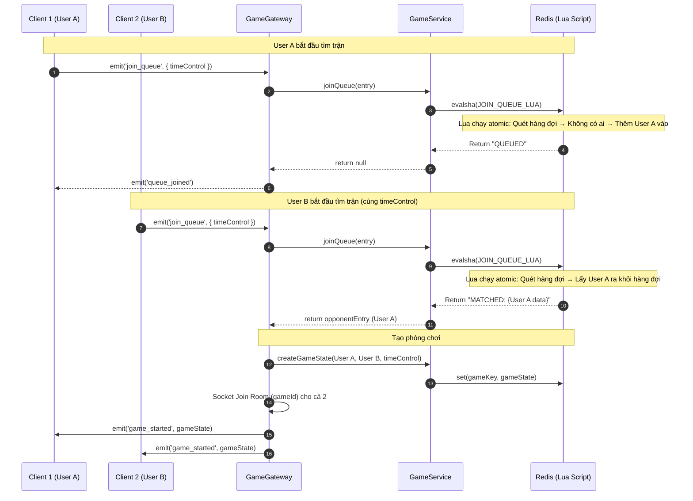

---

## 2. Luồng Đi Cờ (Make Move)

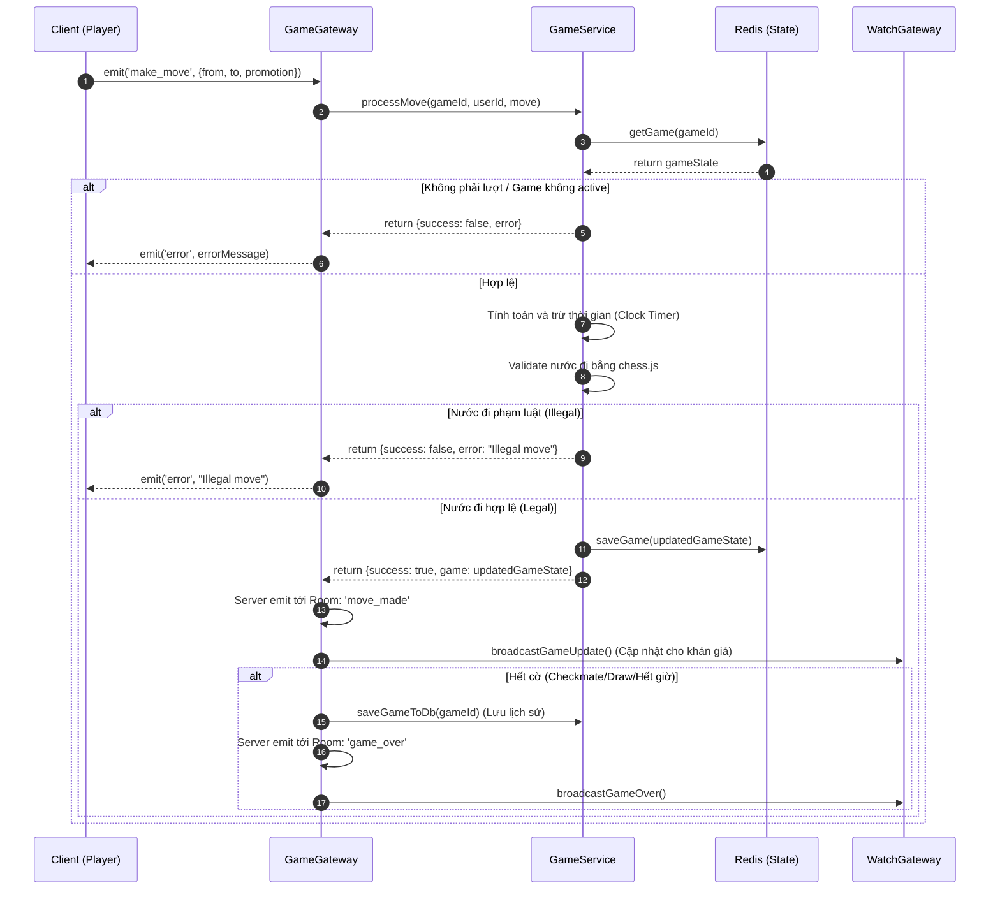

---

## 3. Luồng Lưu Trữ Lịch Sử Trận Đấu (Persistence)

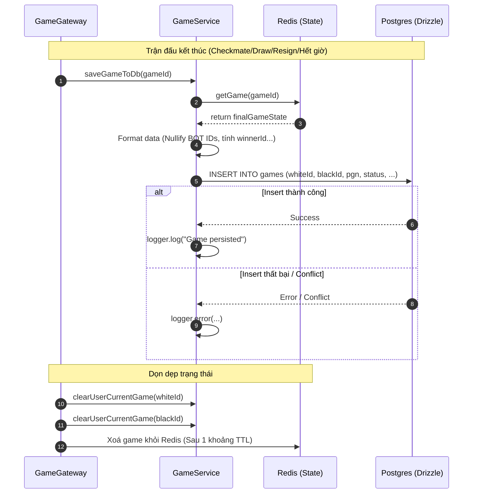

---

## 4. Luồng Đăng Nhập (Login)

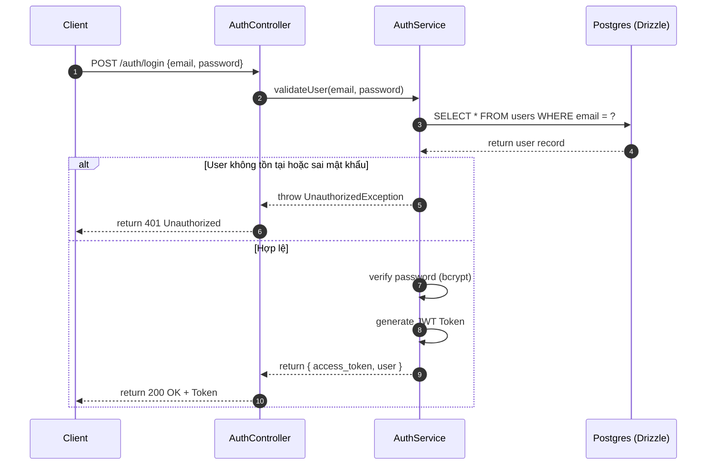

---

## 5. Luồng Đăng Kí (Register)

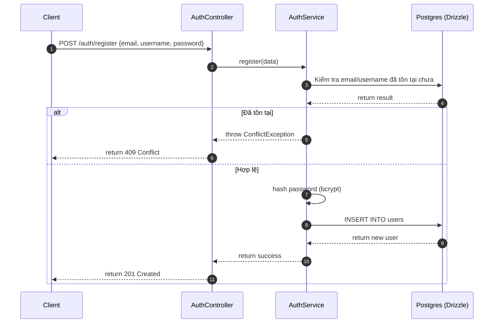

---

## 6. Luồng Xem Trận Đấu (Spectator / Watch)

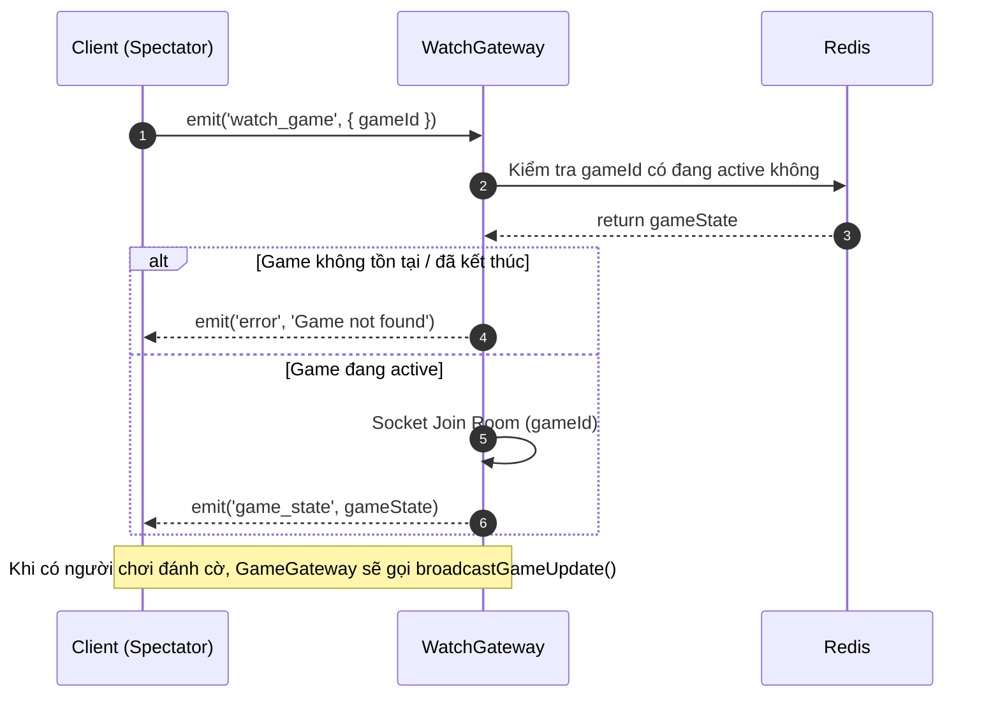

---

## 7. Luồng Chat Trong Trận Đấu

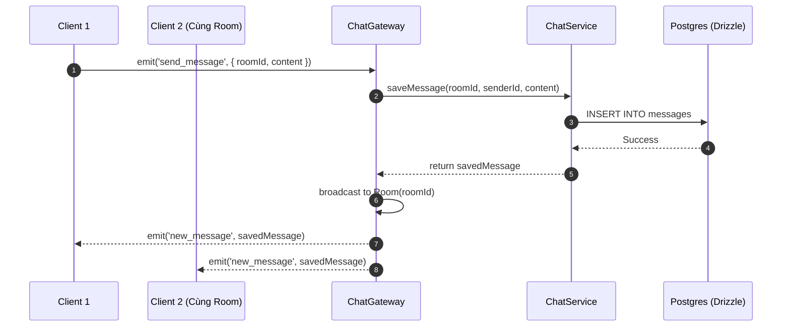

---

## 8. Sơ đồ Thực Thể Kết Hợp (ERD)

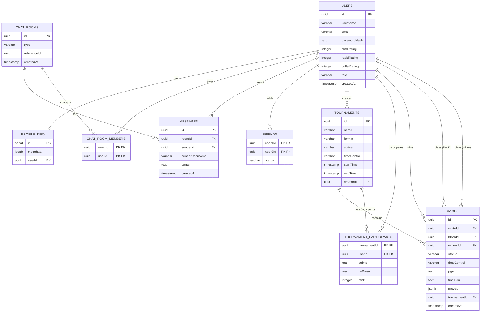

---

## 9. Luồng Tính & Hiển Thị ELO Sau Trận Đấu (NEW)

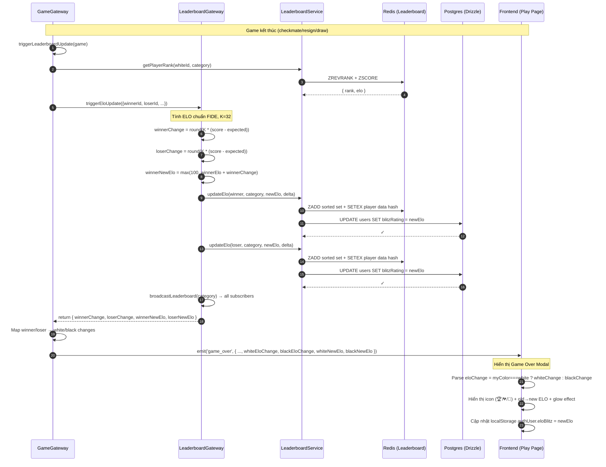

---

## 10. Luồng Tự Động Chuyển Vòng Trong Giải Đấu (NEW)

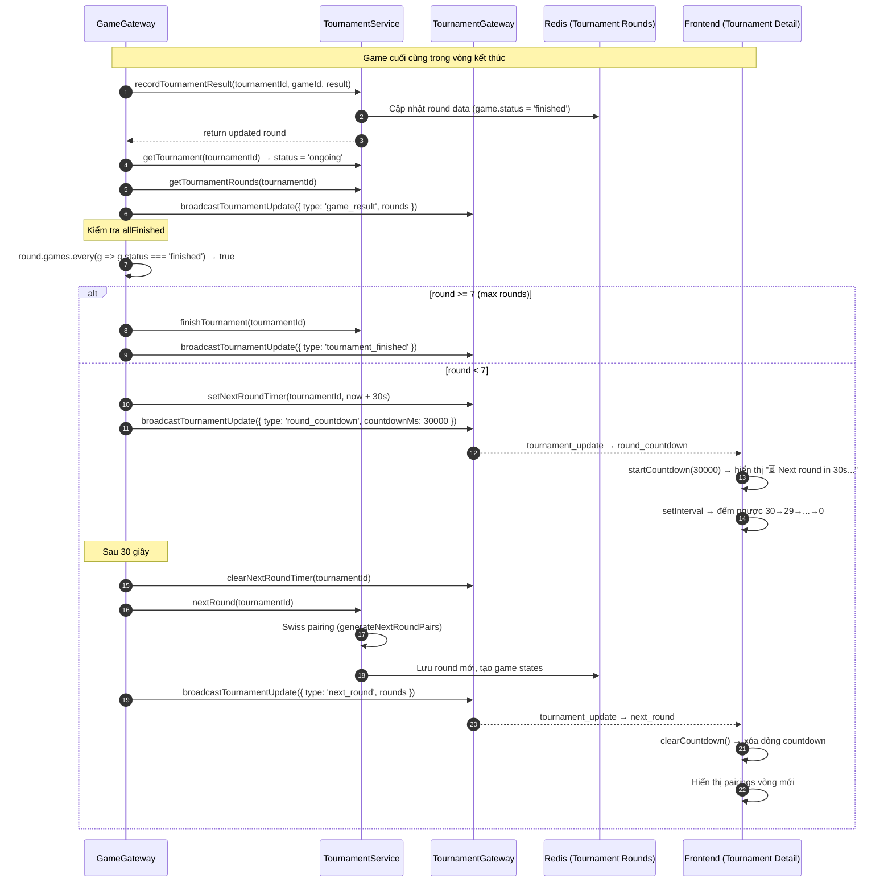

---

## 11. Luồng Xóa Giải Đấu (NEW)

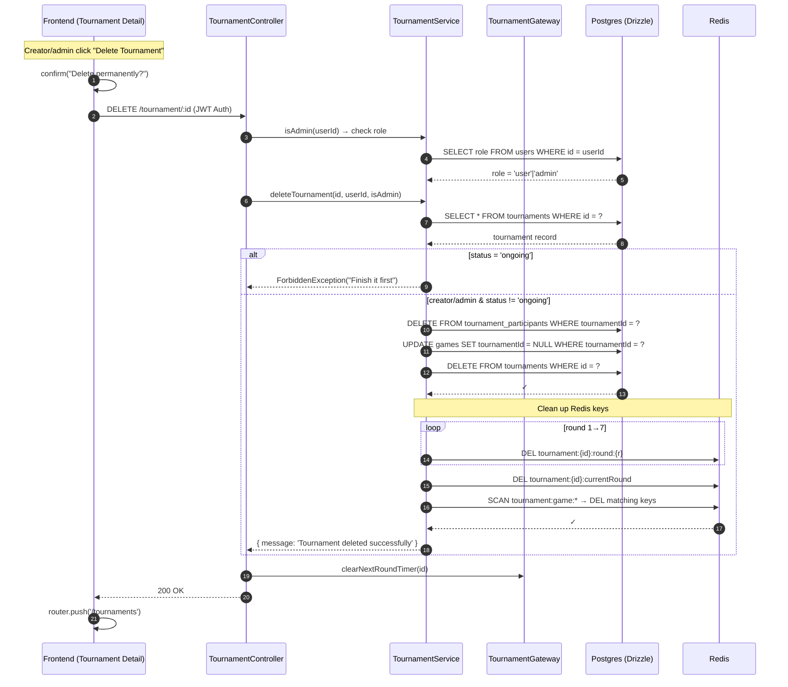

---

## 12. ERD Cập Nhật — Redis Data Structures (NEW)

### Redis Data Structures (In-Memory / Cache)

| Key Pattern | Type | Purpose |
|---|---|---|
| `chess:leaderboard:{blitz\|bullet\|rapid}` | Sorted Set | ELO ranking (score=ELO, member=userId) |
| `chess:player:{userId}:{blitz\|bullet\|rapid}` | Hash | Player stats: `{elo, wins, losses, draws, gamesPlayed, eloChange, trend}` |
| `chess:online_users` | Hash | userId → socketId mapping |
| `tournament:{id}:round:{1-7}` | String (JSON) | Tournament round data (pairings, results) |
| `tournament:{id}:currentRound` | String | Current round number |
| `tournament:game:{gameId}` | String (JSON) | Reverse lookup: { tournamentId, round } |
| `chat:room:{roomId}:messages` | List | Last 50 messages (cache) |
| `game:{gameId}` | Hash | Active game state (FEN, PGN, clocks, etc.) |
