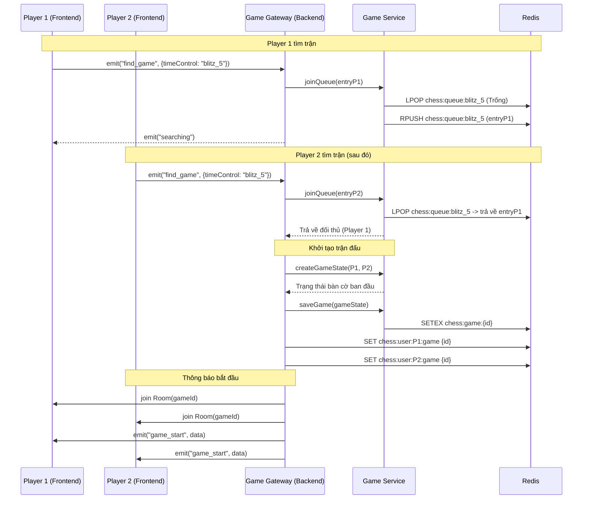
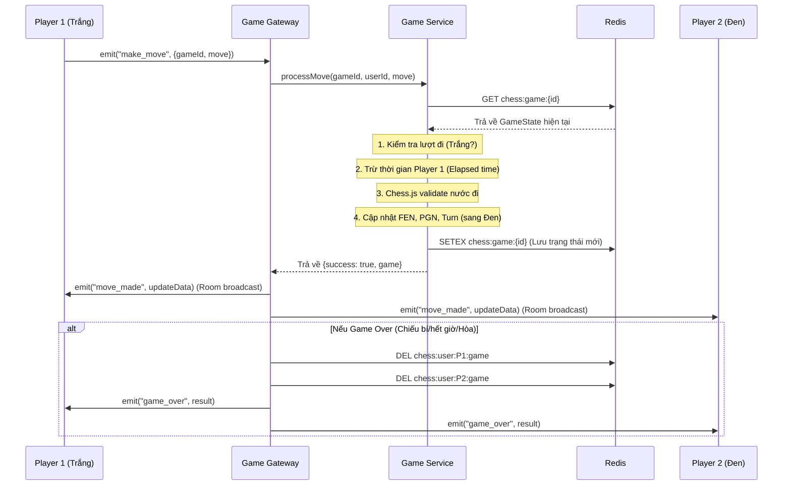
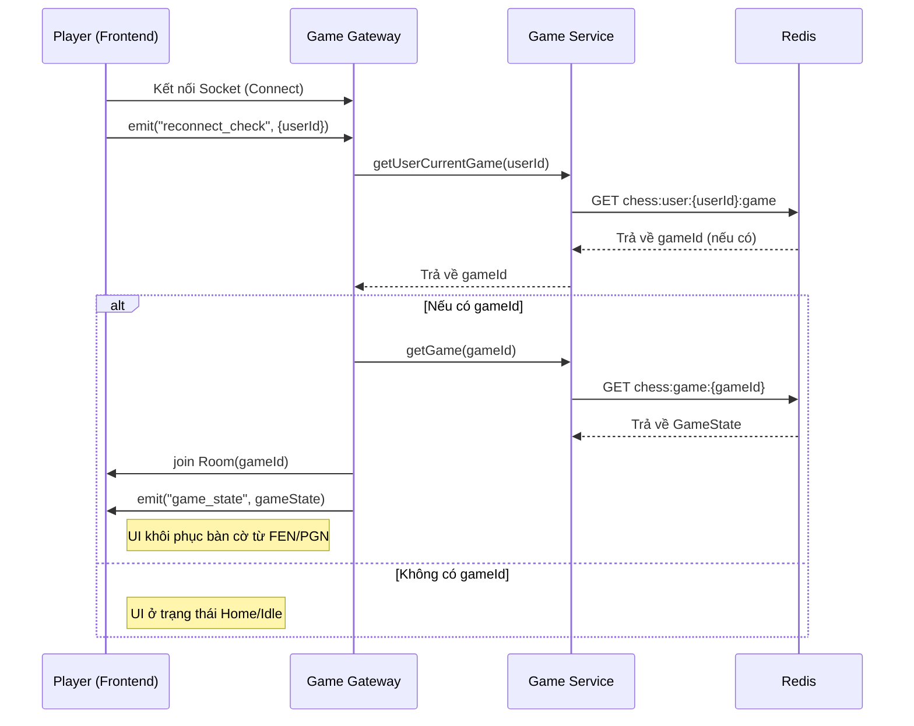

# ♟️ Chess Real-time System - Project Documentation

Dự án này là một ứng dụng cờ vua trực tuyến thời gian thực, được xây dựng với kiến trúc hiện đại sử dụng NestJS, Socket.io, và Redis. Dưới đây là tài liệu chi tiết về luồng logic của hệ thống.

## 🏗️ Kiến trúc Công nghệ
- **Frontend**: Next.js, Socket.io-client, react-chessboard, chess.js.
- **Backend**: NestJS, Socket.io Gateway, Redis (lưu trữ GameState và Matchmaking Queue).
- **Trạng thái**: Đồng bộ hóa thời gian thực qua WebSocket.

---

## 🛰️ Luồng Luồng Logic Hệ thống

### 1. Luồng Tìm trận (Matchmaking)
Sử dụng Redis List làm hàng đợi (Queue) để ghép cặp người chơi có cùng chế độ thời gian (Time Control).

### 2. Luồng Nước đi (Make Move)
Xử lý logic cờ vua, tính toán thời gian (Time Management) và đồng bộ hóa trạng thái bàn cờ.

### 3. Luồng Kết nối lại (Reconnection)
Đảm bảo người chơi không bị mất ván đấu khi F5 hoặc mạng chập chờn.

---

## 🛠️ Quản lý Trạng thái (Redis)
- `chess:game:{gameId}`: Lưu trữ `GameState` (JSON) bao gồm FEN, PGN, thời gian còn lại, lượt đi.
- `chess:queue:{timeControl}`: Redis List lưu các người chơi đang đợi.
- `chess:user:{userId}:game`: Lưu `gameId` hiện tại của User để phục vụ tính năng kết nối lại.

---

## 🕹️ Các Tính năng bổ trợ
- **Resign**: Kết thúc trận đấu lập tức, người bỏ cuộc bị xử thua.
- **Draw Offer**: Đề nghị hòa có thời hạn 60 giây, được lưu trong Redis.
- **Chat**: Gửi tin nhắn thời gian thực trong phòng đấu.
- **Time Controls**: Hỗ trợ nhiều chế độ: Bullet (1+0, 1+1), Blitz (3+0, 3+2, 5+0), Rapid (10+0, 15+10).
