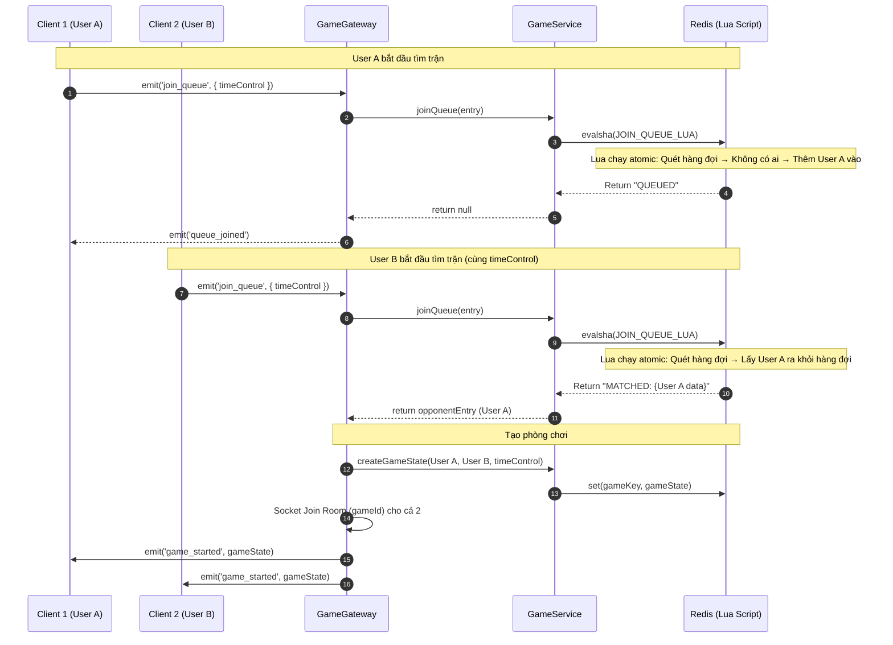
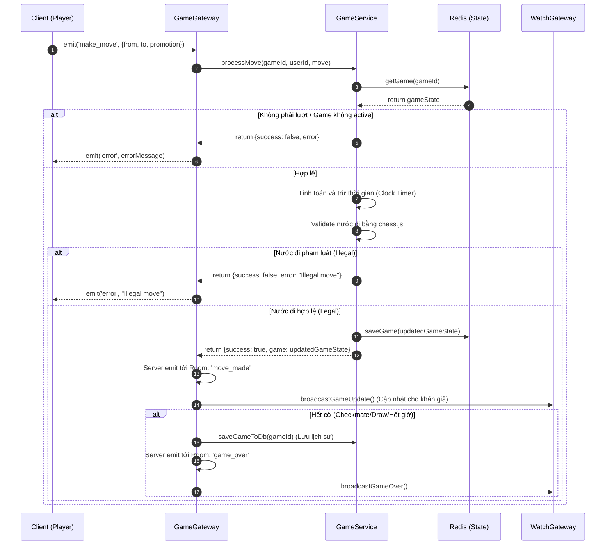
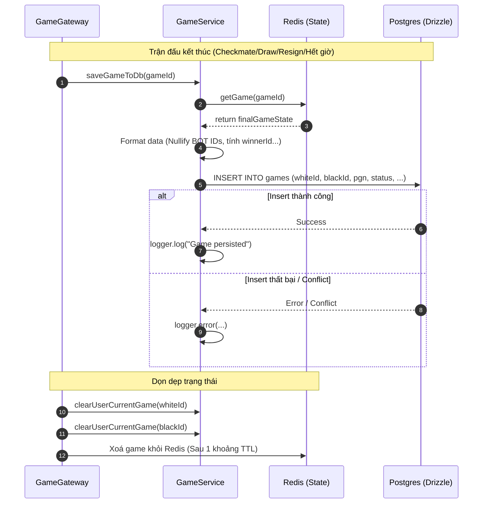
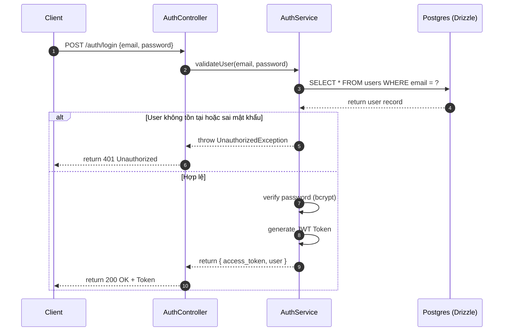
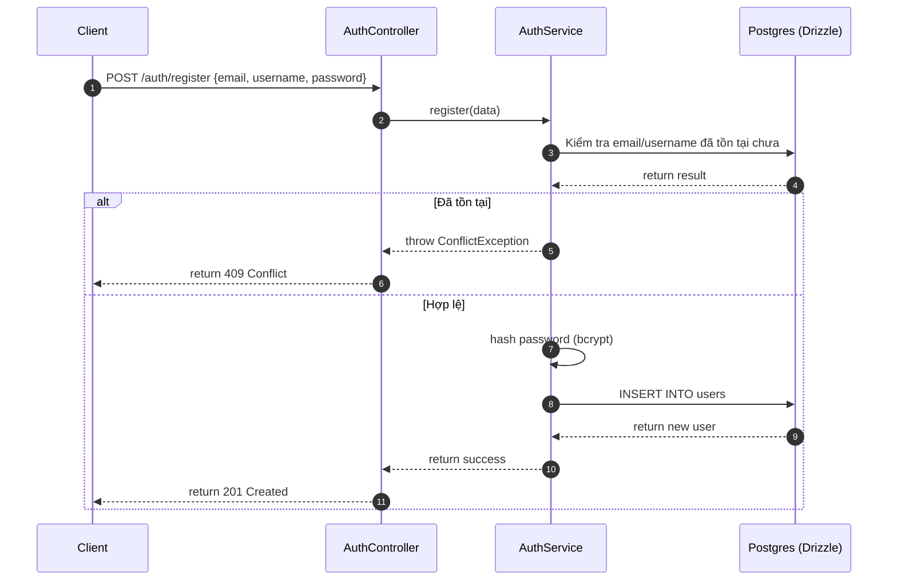
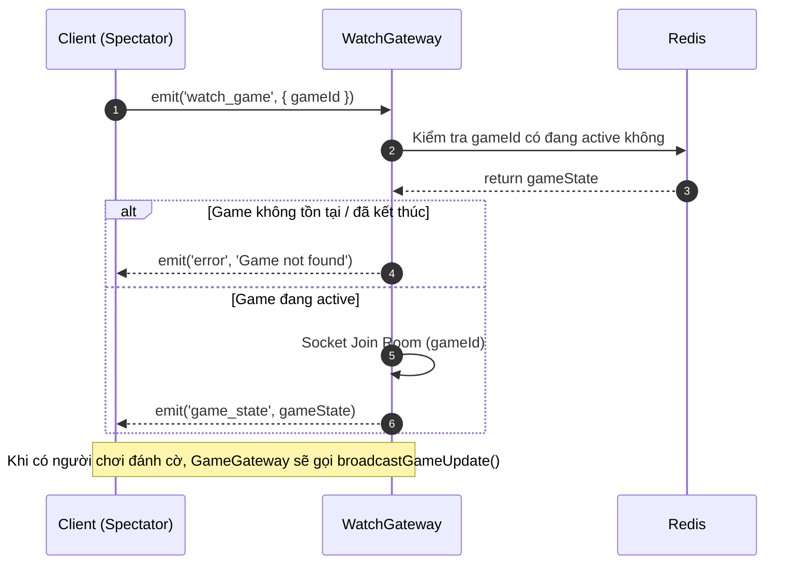
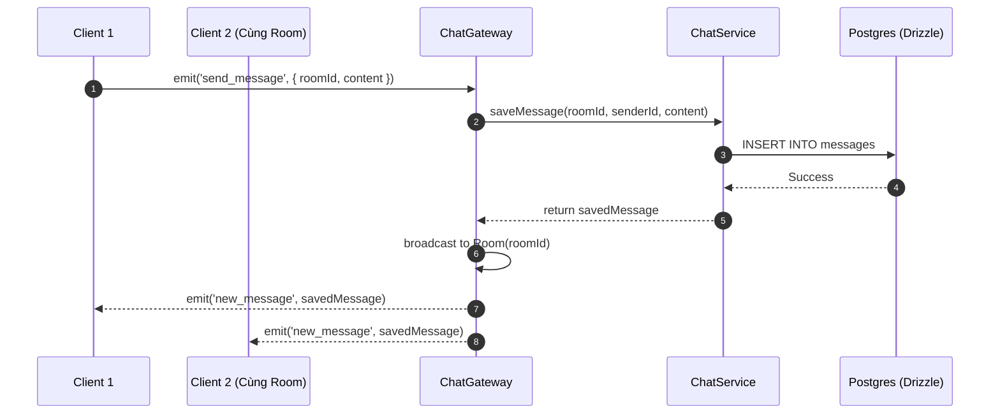

# Game Module - Sequence Diagrams

File này chứa các sơ đồ tuần tự (Sequence Diagram) mô tả các luồng nghiệp vụ cốt lõi của module Game, bao gồm tìm trận (Matchmaking), đánh cờ (Make Move), và lưu trữ lịch sử (Archiving). Bạn có thể dùng các tool như [Mermaid Live Editor](https://mermaid.live/) hoặc plugin Markdown Preview trên IDE để xem.

## 1. Luồng Tìm Trận (Matchmaking) - Sử dụng Lua Script Atomic

---

## 2. Luồng Đi Cờ (Make Move)

---

## 3. Luồng Lưu Trữ Lịch Sử Trận Đấu (Persistence)

---

## 4. Luồng Đăng Nhập (Login)

---

## 5. Luồng Đăng Kí (Register)

---

## 6. Luồng Xem Trận Đấu (Spectator / Watch)

---

## 7. Luồng Chat Trong Trận Đấu

---

## 8. Sơ đồ Thực Thể Kết Hợp (ERD)

