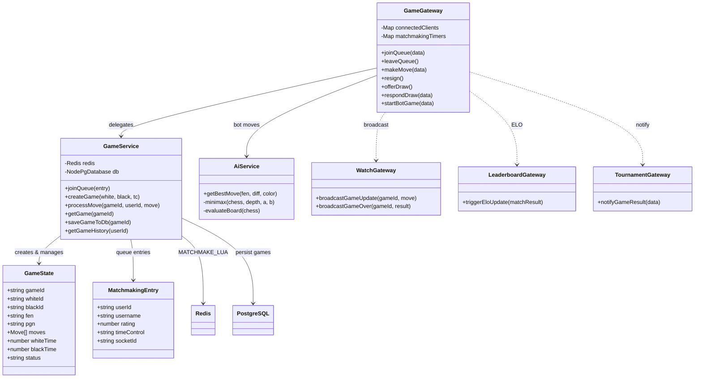
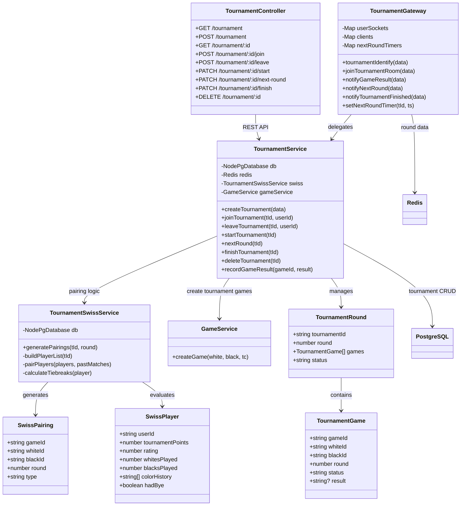
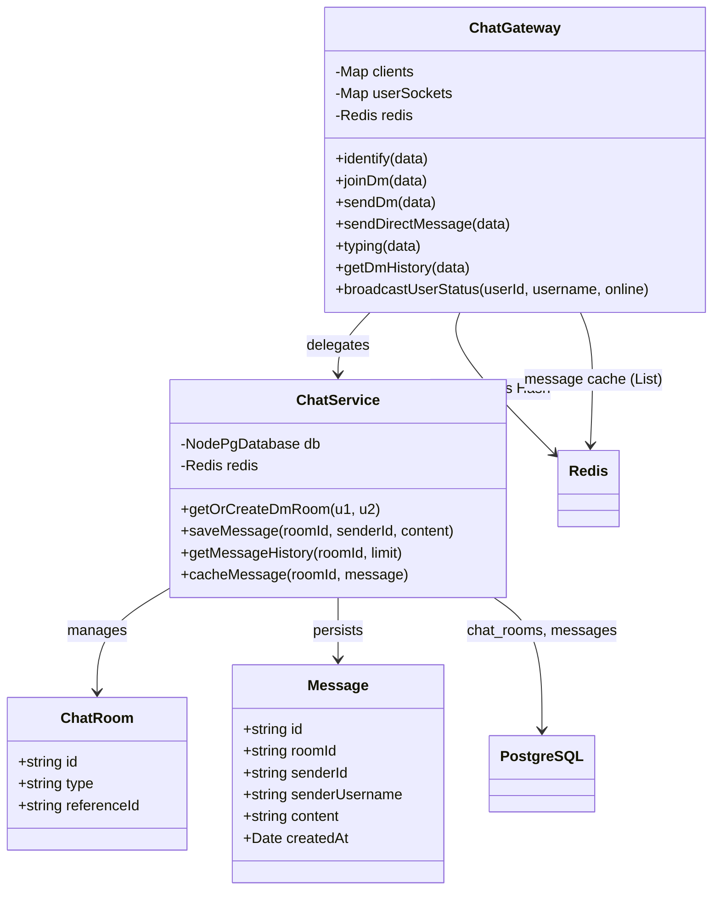
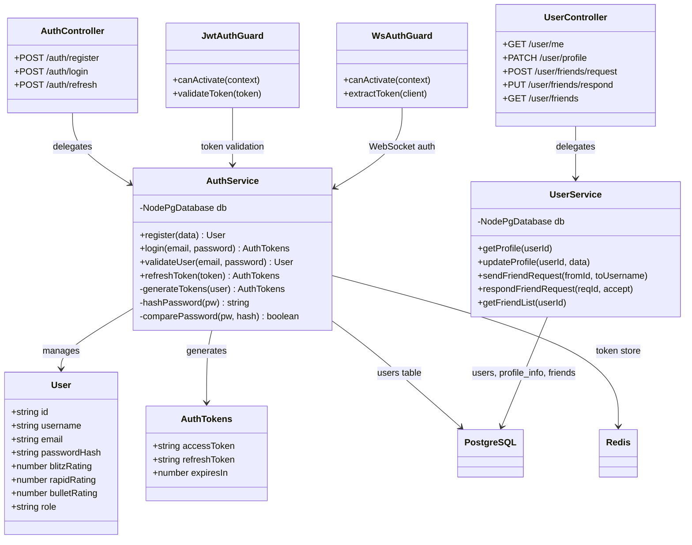
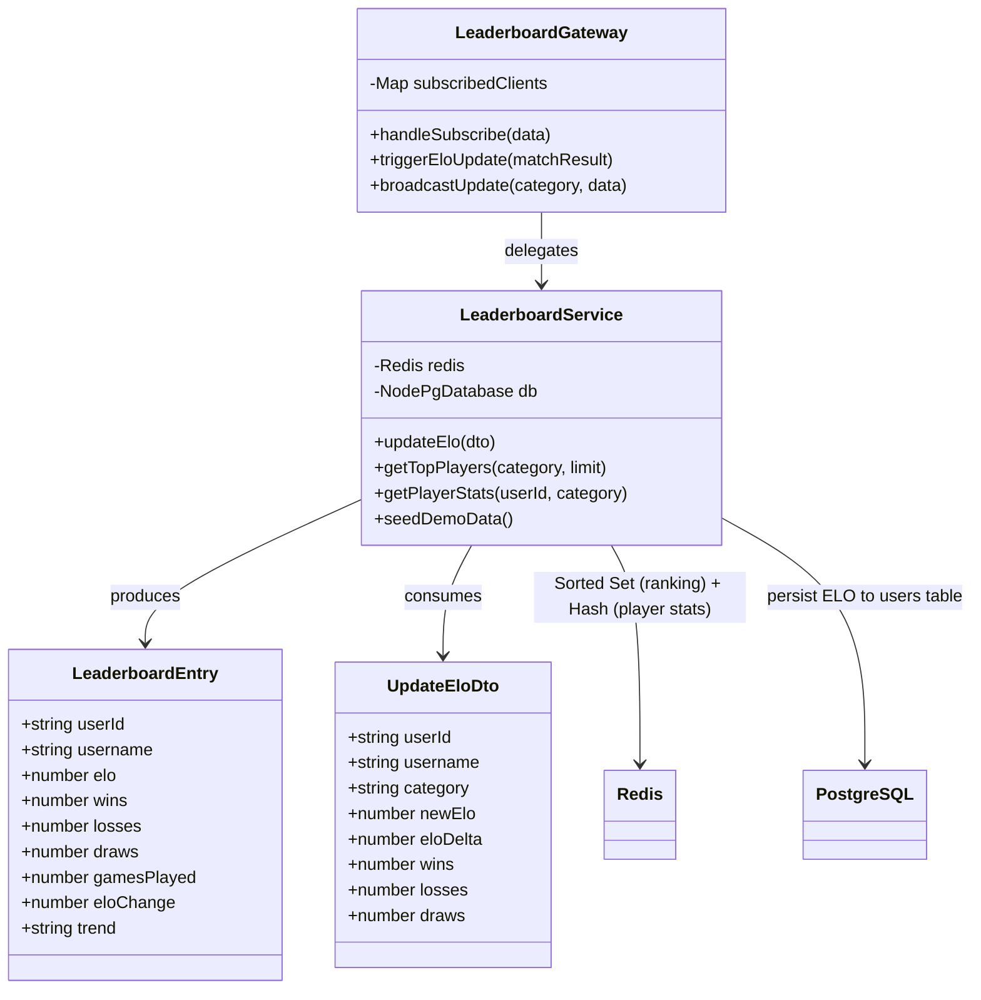
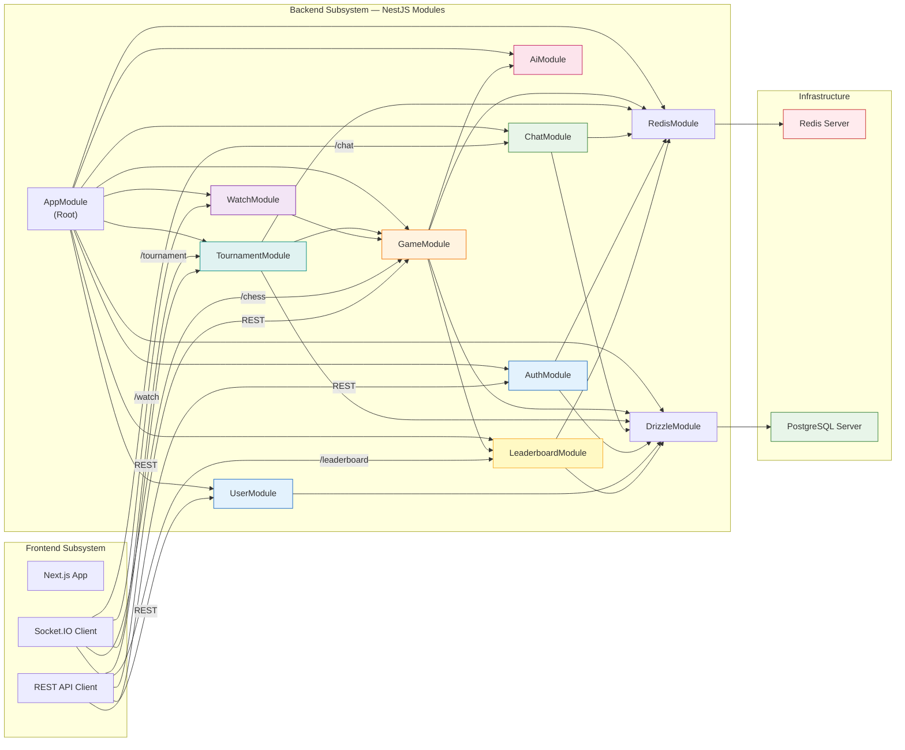

# Class Diagram & Package/Subsystem Diagram — Hệ Thống Cờ Vua Trực Tuyến

> Tài liệu này bổ sung Class Diagram và Package/Subsystem Diagram dựa trên các [Sequence Diagram](sequence-diagrams.md) đã có.  
> Dùng [Mermaid Live Editor](https://mermaid.live/) hoặc Markdown Preview trên IDE để xem trực quan.

---

## Mục Lục

1. [Backend Class Diagram](#1-backend-class-diagram)
   - [Tổng quan toàn bộ class backend](#11-tổng-quan-toàn-bộ-class-backend)
   - [Module Game — Chi tiết](#12-module-game--chi-tiết)
   - [Module Tournament — Chi tiết](#13-module-tournament--chi-tiết)
   - [Module Chat — Chi tiết](#14-module-chat--chi-tiết)
   - [Module Auth & User — Chi tiết](#15-module-auth--user--chi-tiết)
   - [Module Leaderboard — Chi tiết](#16-module-leaderboard--chi-tiết)
2. [Frontend Class Diagram](#2-frontend-class-diagram)
   - [Kiến trúc Frontend tổng quan](#21-kiến-trúc-frontend-tổng-quan)
3. [Package/Subsystem Diagram](#3-packagesubsystem-diagram)
   - [Kiến trúc phân tầng hệ thống](#31-kiến-trúc-phân-tầng-hệ-thống)
   - [Subsystem Dependencies](#32-subsystem-dependencies)
4. [Mối liên hệ với Sequence Diagram](#4-mối-liên-hệ-với-sequence-diagram)

---

## 1. Backend Class Diagram

### 1.1 Tổng quan toàn bộ class backend

Sơ đồ dưới đây thể hiện **tất cả các class chính** trong backend NestJS, bao gồm Gateways (WebSocket), Services (Business Logic), Controllers (REST API), và DTOs.

```mermaid
classDiagram
    direction TB

    %% ──────────────── GATEWAYS (WebSocket) ────────────────
    class GameGateway {
        -Map~string~ connectedClients
        -Map~string~ matchmakingTimers
        +handleConnection(client)
        +handleDisconnect(client)
        +joinQueue(data)
        +leaveQueue()
        +makeMove(data)
        +resign()
        +offerDraw()
        +respondDraw(data)
        +startBotGame(data)
        +triggerEloUpdate(gameId)
    }

    class WatchGateway {
        -Map~string~ spectators
        -Map~string~ spectatorMeta
        +handleWatchGame(data)
        +handleLeaveWatch()
        +broadcastGameUpdate(gameId, move)
        +broadcastGameOver(gameId, result)
    }

    class ChatGateway {
        -Map~string~ clients
        -Map~string~ userSockets
        +identify(data)
        +joinDm(data)
        +sendDm(data)
        +sendDirectMessage(data)
        +typing(data)
        +getDmHistory(data)
        +broadcastUserStatus(userId, username, online)
    }

    class TournamentGateway {
        -Map~string~ userSockets
        -Map~string~ clients
        -Map~string~ nextRoundTimers
        +tournamentIdentify(data)
        +joinTournamentRoom(data)
        +leaveTournamentRoom(data)
        +setNextRoundTimer(tournamentId, ts)
        +clearNextRoundTimer(tournamentId)
        +notifyGameResult(data)
        +notifyNextRound(data)
        +notifyTournamentFinished(data)
    }

    class LeaderboardGateway {
        -Map~string~ subscribedClients
        +handleSubscribe(data)
        +triggerEloUpdate(matchResult)
        +broadcastUpdate(category, data)
    }

    %% ──────────────── SERVICES (Business Logic) ────────────────
    class GameService {
        -Redis redis
        -NodePgDatabase db
        +joinQueue(entry) MatchmakingEntry
        +createGame(whiteId, blackId, timeControl) GameState
        +processMove(gameId, userId, move) GameState
        +getGame(gameId) GameState
        +saveGameToDb(gameId) void
        +clearUserCurrentGame(userId) void
        +getGameHistory(userId) Game[]
    }

    class AiService {
        -Logger logger
        +getBestMove(fen, difficulty, botColor) Move
        -evaluateBoard(chess) number
        -minimax(chess, depth, alpha, beta, isMax) number
        -orderMoves(moves) Move[]
        -quiescenceSearch(chess, alpha, beta) number
    }

    class AuthService {
        -NodePgDatabase db
        +validateUser(email, password) User
        +register(data) User
        +login(data) AuthTokens
        +refreshToken(token) AuthTokens
        -generateTokens(user) AuthTokens
    }

    class ChatService {
        -NodePgDatabase db
        -Redis redis
        +getOrCreateDmRoom(user1Id, user2Id) Room
        +saveMessage(roomId, senderId, content) Message
        +getMessageHistory(roomId, limit) Message[]
        +cacheMessage(roomId, message) void
    }

    class TournamentService {
        -NodePgDatabase db
        -Redis redis
        -TournamentSwissService swiss
        -GameService gameService
        +createTournament(data) Tournament
        +joinTournament(tournamentId, userId) void
        +leaveTournament(tournamentId, userId) void
        +startTournament(tournamentId) void
        +nextRound(tournamentId) void
        +finishTournament(tournamentId) void
        +deleteTournament(tournamentId) void
        +recordGameResult(gameId, result) void
    }

    class TournamentSwissService {
        -NodePgDatabase db
        +generatePairings(tournamentId, round) SwissPairing[]
        -buildPlayerList(tournamentId) SwissPlayer[]
        -pairPlayers(players, pastMatches) SwissPairing[]
        -calculateTiebreaks(player) number
    }

    class LeaderboardService {
        -Redis redis
        -NodePgDatabase db
        +updateElo(dto) void
        +getTopPlayers(category, limit) LeaderboardEntry[]
        +getPlayerStats(userId, category) PlayerStats
        -leaderboardKey(category) string
        -playerDataKey(userId, category) string
    }

    class UserService {
        -NodePgDatabase db
        +getProfile(userId) UserProfile
        +updateProfile(userId, data) void
        +sendFriendRequest(fromId, toUsername) void
        +respondFriendRequest(requestId, accept) void
        +getFriendList(userId) Friend[]
    }

    %% ──────────────── CONTROLLERS (REST API) ────────────────
    class AuthController {
        +POST /auth/register
        +POST /auth/login
        +POST /auth/refresh
    }

    class GameController {
        +GET /game/history
        +GET /game/:id
    }

    class TournamentController {
        +GET /tournament
        +POST /tournament
        +GET /tournament/:id
        +POST /tournament/:id/join
        +POST /tournament/:id/leave
        +PATCH /tournament/:id/start
        +PATCH /tournament/:id/next-round
        +PATCH /tournament/:id/finish
        +DELETE /tournament/:id
    }

    class UserController {
        +GET /user/me
        +PATCH /user/profile
        +POST /user/friends/request
        +PUT /user/friends/respond
        +GET /user/friends
    }

    %% ──────────────── DTOS ────────────────
    class MatchmakingEntry {
        +string userId
        +string username
        +number rating
        +string timeControl
        +string socketId
        +number queuedAt
    }

    class GameState {
        +string gameId
        +string whiteId
        +string blackId
        +string fen
        +string pgn
        +Move[] moves
        +number whiteTime
        +number blackTime
        +string status
        +string timeControl
    }

    class MakeMoveDto {
        +string from
        +string to
        +string? promotion
    }

    class SwissPairing {
        +string gameId
        +string whiteId
        +string blackId
        +number round
        +string type
    }

    class LeaderboardEntry {
        +string userId
        +string username
        +number elo
        +number wins
        +number losses
        +number draws
        +string trend
    }

    %% ──────────────── MODULES ────────────────
    class RedisModule {
        +provide REDIS_CLIENT
    }

    class DrizzleModule {
        +provide DRIZZLE
    }

    %% ═══════════════════════════════════════════════════════
    %% RELATIONSHIPS
    %% ═══════════════════════════════════════════════════════

    %% Gateway → Service dependencies
    GameGateway ..> GameService : uses
    GameGateway ..> LeaderboardGateway : notify ELO
    GameGateway ..> WatchGateway : broadcast updates
    GameGateway ..> TournamentGateway : notify result
    GameGateway ..> AiService : bot moves

    WatchGateway ..> GameService : read game state
    WatchGateway ..> WatchService : manage spectators

    ChatGateway ..> ChatService : persist messages

    TournamentGateway ..> TournamentService : manage tournament

    LeaderboardGateway ..> LeaderboardService : ELO operations

    %% Service → Service dependencies
    GameService ..> LeaderboardService : update ELO
    TournamentService ..> TournamentSwissService : pairings
    TournamentService ..> GameService : create games

    %% Service → Infrastructure dependencies
    GameService ..> RedisModule : game state
    GameService ..> DrizzleModule : persist games
    AuthService ..> DrizzleModule : user CRUD
    AuthService ..> RedisModule : token store
    ChatService ..> DrizzleModule : messages
    ChatService ..> RedisModule : message cache + online users
    TournamentService ..> RedisModule : round data
    TournamentService ..> DrizzleModule : tournament CRUD
    LeaderboardService ..> RedisModule : ranking (ZSET)
    LeaderboardService ..> DrizzleModule : persist ELO
    UserService ..> DrizzleModule : user/profile CRUD

    %% Controller → Service dependencies
    AuthController ..> AuthService
    GameController ..> GameService
    TournamentController ..> TournamentService
    UserController ..> UserService

    %% DTO usage
    GameService ..> MatchmakingEntry : queue entries
    GameService ..> GameState : game management
    GameService ..> MakeMoveDto : move validation
    TournamentSwissService ..> SwissPairing : pairings
    LeaderboardService ..> LeaderboardEntry : rankings

    %% Inheritance / Implementation
    GameGateway ..|> OnGatewayInit
    GameGateway ..|> OnGatewayConnection
    GameGateway ..|> OnGatewayDisconnect

    note for GameGateway "namespace: /chess"
    note for WatchGateway "namespace: /watch"
    note for ChatGateway "namespace: /chat"
    note for TournamentGateway "namespace: /tournament"
    note for LeaderboardGateway "namespace: /leaderboard"
```



---

### 1.2 Module Game — Chi tiết

Mô tả mối quan hệ giữa các class trong module Game (matchmaking, đi cờ, kết thúc trận).



---

### 1.3 Module Tournament — Chi tiết



---

### 1.4 Module Chat — Chi tiết



---

### 1.5 Module Auth & User — Chi tiết



---

### 1.6 Module Leaderboard — Chi tiết



---

## 2. Frontend Class Diagram

### 2.1 Kiến trúc Frontend tổng quan

```mermaid
classDiagram
    direction TB

    %% ──────────────── ZUSTAND STORES ────────────────
    class UserStore {
        +User user
        +boolean isAuthenticated
        +login(email, password)
        +register(data)
        +logout()
        +fetchProfile()
        +updateLocalElo(newElo)
    }

    class GameStore {
        +GameState currentGame
        +boolean isSearching
        +number searchTime
        +GameOverResult gameOver
        +setGame(game)
        +updateMove(move)
        +setGameOver(result)
        +setSearching(bool)
        +reset()
    }

    class TournamentStore {
        +Tournament[] tournaments
        +Tournament currentTournament
        +SwissPairing[] myPairings
        +number currentRound
        +number countdownSeconds
        +fetchTournaments()
        +setCurrentTournament(t)
        +setPairings(pairings)
        +startCountdown(ms)
        +clearCountdown()
    }

    class ChatStore {
        +Map~string, ChatRoom~ rooms
        +number totalUnread
        +string activeRoomId
        +upsertRoomForDirect(msg)
        +addMessage(roomId, msg)
        +setActiveRoom(roomId)
        +markRead(roomId)
        +setTyping(roomId, userId, bool)
    }

    class FriendStore {
        +Friend[] friendList
        +FriendRequest[] pendingRequests
        +fetchFriends()
        +sendRequest(username)
        +respondRequest(reqId, accept)
    }

    class ProfileStore {
        +UserProfile profile
        +PlayerStats stats
        +fetchProfile()
        +updateProfile(data)
    }

    %% ──────────────── CUSTOM HOOKS ────────────────
    class UseChessSocket {
        -Socket socket
        -GameStore gameStore
        -UserStore userStore
        +connect()
        +disconnect()
        +joinQueue(timeControl)
        +makeMove(from, to, promotion)
        +resign()
        +offerDraw()
        +respondDraw(accept)
        +startBotGame(difficulty, color)
        -onGameStarted(data)
        -onMoveMade(data)
        -onGameOver(data)
        -onSearchProgress(data)
    }

    class UseFriendChat {
        -Socket socket
        -ChatStore chatStore
        +connect(userId)
        +sendMessage(roomId, content)
        +sendDirectMessage(toUserId, content)
        +joinDm(friendId)
        +sendTyping(roomId)
        -onDmMessage(data)
        -onReceiveDirectMessage(data)
        -onUserTyping(data)
        -onUserStatus(data)
    }

    class UseWatchSocket {
        -Socket socket
        -WatchStore watchStore
        +connect()
        +watchGame(gameId)
        +leaveWatch()
        -onGameState(data)
        -onGameUpdate(data)
    }

    class UseLeaderboard {
        -Socket socket
        +subscribe(category)
        +unsubscribe()
        -onLeaderboardData(data)
        -onLeaderboardUpdate(data)
    }

    class UseStockfish {
        -Worker stockfish
        +load()
        +getBestMove(fen, difficulty)
        +terminate()
    }

    %% ──────────────── UI COMPONENTS ────────────────
    class ChessBoard {
        +render()
        +onPieceDrop(source, target)
        +highlightLegalMoves(square)
        +flipBoard()
        +showPromotionDialog(callback)
    }

    class ChatDrawer {
        +render()
        +selectRoom(roomId)
        +sendMessage(content)
        +showTypingIndicator()
        +showUnreadBadge(count)
    }

    class GameOverModal {
        +render(result, eloChange)
        +showWinner(winner)
        +showEloChange(delta, oldElo, newElo)
        +actionButtons(rematch, newGame)
    }

    class TournamentBracket {
        +render(pairings)
        +showStandings(players)
        +showCountdown(seconds)
    }

    class MatchmakingPanel {
        +render()
        +selectTimeControl(tc)
        +showSearchingAnimation()
        +showEloRange(eloRange)
        +cancelSearch()
    }

    class LiveGamesList {
        +render(games)
        +selectGame(gameId)
        +showPlayerInfo(players)
    }

    class LeaderboardTable {
        +render(entries)
        +sortByCategory(category)
        +showTrendIcon(trend)
    }

    class ProfilePage {
        +render(profile, stats)
        +editAvatar()
        +editBio()
        +showEloChart()
    }

    %% ──────────────── LIB ────────────────
    class ApiFetch {
        +get(url, params)
        +post(url, data)
        +patch(url, data)
        +delete(url)
        +setAuthToken(token)
    }

    class AuthUtils {
        +getToken()
        +setToken(token)
        +removeToken()
        +isTokenExpired(token)
        +decodeToken(token)
    }

    class ChessUtils {
        +getLegalMoves(fen, square)
        +isCheck(fen)
        +isCheckmate(fen)
        +isStalemate(fen)
        +getGameResult(fen)
    }

    %% ═══════════════════════════════════════════════════════
    %% RELATIONSHIPS
    %% ═══════════════════════════════════════════════════════

    UseChessSocket --> GameStore : updates
    UseChessSocket --> UserStore : reads/auth
    UseFriendChat --> ChatStore : updates
    UseWatchSocket --> WatchStore : updates
    UseLeaderboard --> LeaderboardTable : data binding

    ChessBoard --> UseChessSocket : emits moves
    ChessBoard --> ChessUtils : validation

    ChatDrawer --> UseFriendChat : emits messages
    ChatDrawer --> ChatStore : reads

    GameOverModal --> GameStore : reads result
    TournamentBracket --> TournamentStore : reads pairings
    MatchmakingPanel --> UseChessSocket : emits queue
    LiveGamesList --> UseWatchSocket : emits watch
    LeaderboardTable --> UseLeaderboard : subscribes
    ProfilePage --> ProfileStore : reads/writes

    UseStockfish --> ChessBoard : AI moves

    ApiFetch ..> AuthUtils : token management

    note for UseChessSocket "namespace: /chess"
    note for UseFriendChat "namespace: /chat"
    note for UseWatchSocket "namespace: /watch"
    note for UseLeaderboard "namespace: /leaderboard"
```



---

## 3. Package/Subsystem Diagram

### 3.1 Kiến trúc phân tầng hệ thống

Sơ đồ thể hiện **phân tầng kiến trúc** (Layered Architecture) của toàn hệ thống, bao gồm cả backend và frontend.

```mermaid
graph TB
    subgraph "🎨 FRONTEND — Next.js 16 (React 19)"
        direction TB

        subgraph "Presentation Layer"
            PAGES["📄 Pages<br/>(App Router)"]
            COMPONENTS["🧩 Components<br/>ChessBoard, ChatDrawer,<br/>GameOverModal, TournamentBracket"]
        end

        subgraph "State Management"
            STORES["🏪 Zustand Stores<br/>UserStore, GameStore,<br/>ChatStore, TournamentStore"]
        end

        subgraph "Communication Layer"
            HOOKS["🪝 Custom Hooks<br/>useChessSocket, useFriendChat,<br/>useWatchSocket, useLeaderboard,<br/>useStockfish"]
            LIB["📚 Lib<br/>apiFetch, authUtils, chessUtils"]
        end

        PAGES --> COMPONENTS
        COMPONENTS --> HOOKS
        COMPONENTS --> STORES
        HOOKS --> STORES
        HOOKS --> LIB
    end

    subgraph "🔌 REAL-TIME COMMUNICATION"
        SOCKET_IO["Socket.IO<br/>━━━━━━━━━━━━━━━━<br/>Namespaces:<br/> /chess · /chat<br/> /watch · /tournament<br/> /leaderboard"]
    end

    subgraph "⚙️ BACKEND — NestJS"
        direction TB

        subgraph "Gateway Layer (WebSocket)"
            GAME_GW["🎮 GameGateway<br/>matchmaking, moves, resign"]
            WATCH_GW["👁️ WatchGateway<br/>spectator mode"]
            CHAT_GW["💬 ChatGateway<br/>DM 1-1, typing"]
            TOURN_GW["🏆 TournamentGateway<br/>rounds, standings"]
            LB_GW["📊 LeaderboardGateway<br/>ELO updates"]
        end

        subgraph "Controller Layer (REST)"
            AUTH_CTRL["🔐 AuthController<br/>register, login, refresh"]
            GAME_CTRL["🎮 GameController<br/>history, detail"]
            TOURN_CTRL["🏆 TournamentController<br/>CRUD, join/leave"]
            USER_CTRL["👤 UserController<br/>profile, friends"]
        end

        subgraph "Service Layer (Business Logic)"
            GAME_SVC["🎮 GameService<br/>ELO matchmaking,<br/>move validation, clock"]
            AI_SVC["🤖 AiService<br/>Minimax + Alpha-Beta<br/>Piece-Square Tables"]
            AUTH_SVC["🔐 AuthService<br/>JWT, bcrypt"]
            CHAT_SVC["💬 ChatService<br/>DM rooms, messages"]
            TOURN_SVC["🏆 TournamentService<br/>round management"]
            SWISS_SVC["📐 TournamentSwissService<br/>Swiss pairing algorithm"]
            LB_SVC["📊 LeaderboardService<br/>ELO ranking, stats"]
            USER_SVC["👤 UserService<br/>profile, friends"]
        end

        GAME_GW --> GAME_SVC
        WATCH_GW --> GAME_SVC
        CHAT_GW --> CHAT_SVC
        TOURN_GW --> TOURN_SVC
        LB_GW --> LB_SVC

        AUTH_CTRL --> AUTH_SVC
        GAME_CTRL --> GAME_SVC
        TOURN_CTRL --> TOURN_SVC
        USER_CTRL --> USER_SVC

        GAME_SVC --> AI_SVC
        GAME_SVC --> LB_SVC
        TOURN_SVC --> SWISS_SVC
        TOURN_SVC --> GAME_SVC
    end

    subgraph "💾 DATA LAYER"
        direction LR

        subgraph "Cache / Real-time State"
            REDIS[( "🧠 Redis<br/>━━━━━━━━━━<br/>Game State (Hash)<br/>Matchmaking Queue (ZSET)<br/>Leaderboard (ZSET)<br/>Online Users (Hash)<br/>Message Cache (List)<br/>Tournament Rounds (Hash)" )]
        end

        subgraph "Persistent Storage"
            POSTGRES[( "🐘 PostgreSQL<br/>━━━━━━━━━━<br/>users, games<br/>tournaments, participants<br/>chat_rooms, messages<br/>friends, profile_info" )]
        end
    end

    subgraph "🌐 EXTERNAL"
        STOCKFISH["♟️ Stockfish<br/>Chess Engine<br/>(Minimax AI)"]
    end

    %% Connections
    FRONTEND <==>|"WebSocket<br/>Socket.IO"| SOCKET_IO
    FRONTEND -->|"HTTP REST"| BACKEND
    SOCKET_IO <==> BACKEND

    BACKEND --> REDIS
    BACKEND --> POSTGRES
    AI_SVC --> STOCKFISH

    style FRONTEND fill:#e3f2fd,stroke:#1565c0
    style BACKEND fill:#fff3e0,stroke:#ef6c00
    style REDIS fill:#ffebee,stroke:#c62828
    style POSTGRES fill:#e8f5e9,stroke:#2e7d32
    style SOCKET_IO fill:#f3e5f5,stroke:#7b1fa2
    style STOCKFISH fill:#fce4ec,stroke:#c2185b
```

---

### 3.2 Subsystem Dependencies

Sơ đồ thể hiện **quan hệ phụ thuộc** (dependency) giữa các module/sub-system trong backend NestJS.



---

## 4. Mối liên hệ với Sequence Diagram

### Bảng Mapping: Class Diagram ↔ Sequence Diagram

Bảng dưới đây ánh xạ các class trong Class Diagram với các Sequence Diagram đã được mô tả trong [`sequence-diagrams.md`](sequence-diagrams.md):

| Class | Vai trò | Sequence Diagram liên quan |
|-------|---------|---------------------------|
| **GameGateway** | WebSocket gateway cho `/chess` | UC-G01 (Matchmaking), UC-G02 (Đi cờ), UC-G03 (Đầu hàng), UC-G04 (Hòa), UC-G05 (Timeout), UC-B01 (Play Bot) |
| **GameService** | Business logic game, Lua script matchmaking | Tất cả UC-Gxx và UC-B01 |
| **AiService** | AI engine (Minimax + Alpha-Beta) | UC-B01 (Play Bot) |
| **WatchGateway** | WebSocket gateway cho `/watch` | UC-W01 (Spectator) |
| **ChatGateway** | WebSocket gateway cho `/chat` | UC-C01 (Room-based), UC-C02 (Direct/Redis-based), UC-C03 (In-game chat) |
| **ChatService** | Chat business logic | UC-C01, UC-C02, UC-C03 |
| **TournamentGateway** | WebSocket gateway cho `/tournament` | UC-T02 (Join), UC-T03 (Start), UC-T04 (Play), UC-T05 (Countdown), UC-T06 (Finish) |
| **TournamentService** | Tournament business logic | Tất cả UC-Txx |
| **TournamentSwissService** | Swiss pairing algorithm | UC-T01 (Create), UC-T03 (Start), UC-T05 (Next round) |
| **LeaderboardGateway** | WebSocket gateway cho `/leaderboard` | UC-L01 (Xem BXH) |
| **LeaderboardService** | ELO ranking & stats | UC-L01, UC-16 (Tính ELO) |
| **AuthController** | REST API cho auth | UC-A01 (Register), UC-A02 (Login), UC-A03 (Refresh) |
| **AuthService** | JWT, bcrypt logic | UC-A01, UC-A02, UC-A03 |
| **UserController** | REST API cho user | UC-14 (Profile), UC-15 (Friends) |
| **UserService** | Profile & friends logic | UC-14, UC-15 |
| **GameController** | REST API cho game history | UC-08 (Lịch sử trận) |
| **TournamentController** | REST API cho tournament CRUD | UC-09 (Tạo & quản lý giải đấu), UC-10 (Join/Leave) |

### Cách đọc kết hợp 2 loại sơ đồ

1. **Sequence Diagram** mô tả luồng thời gian: "Ai gọi ai, theo thứ tự nào, với dữ liệu gì?"
2. **Class Diagram** mô tả cấu trúc tĩnh: "Có những class nào, thuộc tính & phương thức gì, quan hệ ra sao?"
3. **Package Diagram** mô tả tổ chức: "Các module được nhóm như thế nào, phụ thuộc ra sao?"

Khi đọc kết hợp:
- Mỗi **lifeline** trong Sequence Diagram tương ứng với một **class** trong Class Diagram
- Mỗi **mũi tên gọi hàm** trong Sequence Diagram tương ứng với một **method** của class đích trong Class Diagram
- Mỗi **nhóm participant** (BE, Redis, PostgreSQL) trong Sequence Diagram tương ứng với một **subsystem** trong Package Diagram

---

## Phụ lục: Các ký hiệu trong Class Diagram

| Ký hiệu | Ý nghĩa |
|---------|---------|
| `ClassName` | Tên class |
| `+method()` | Public method |
| `-method()` | Private method |
| `-field` | Private field |
| `-->`  | Association (uses/depends on) |
| `..>`  | Dependency (loose coupling) |
| `..\|>` | Implementation (implements interface) |
| `*--`  | Composition (contains, strong ownership) |
| `o--`  | Aggregation (contains, weak ownership) |
