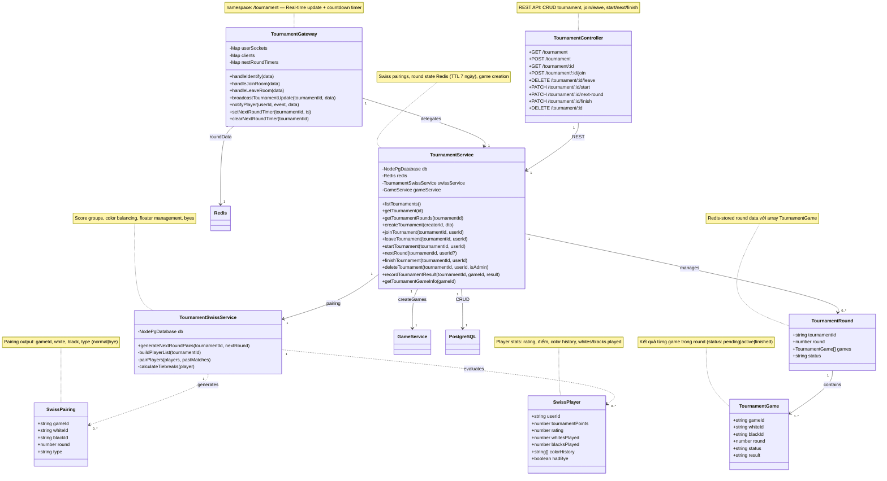
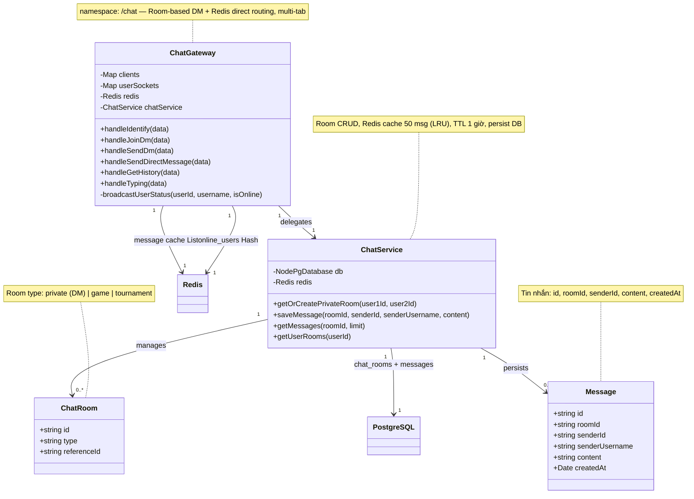
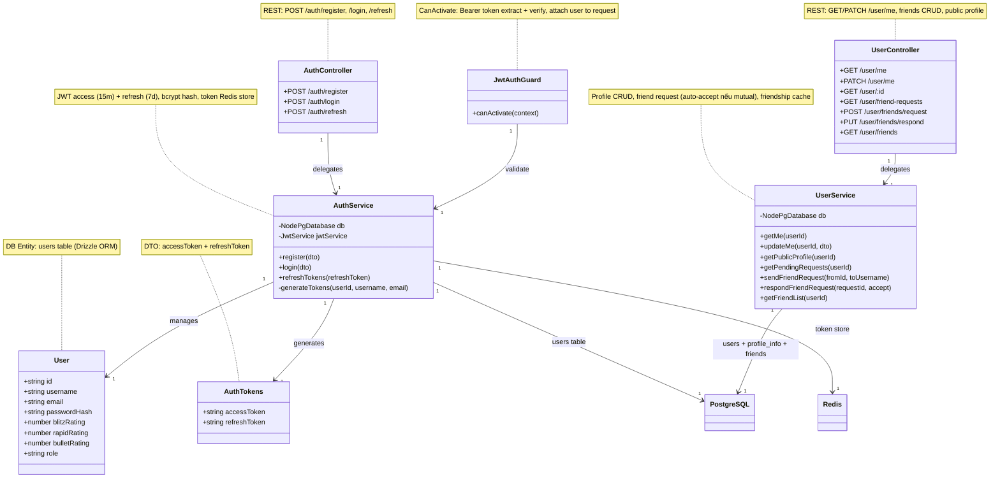
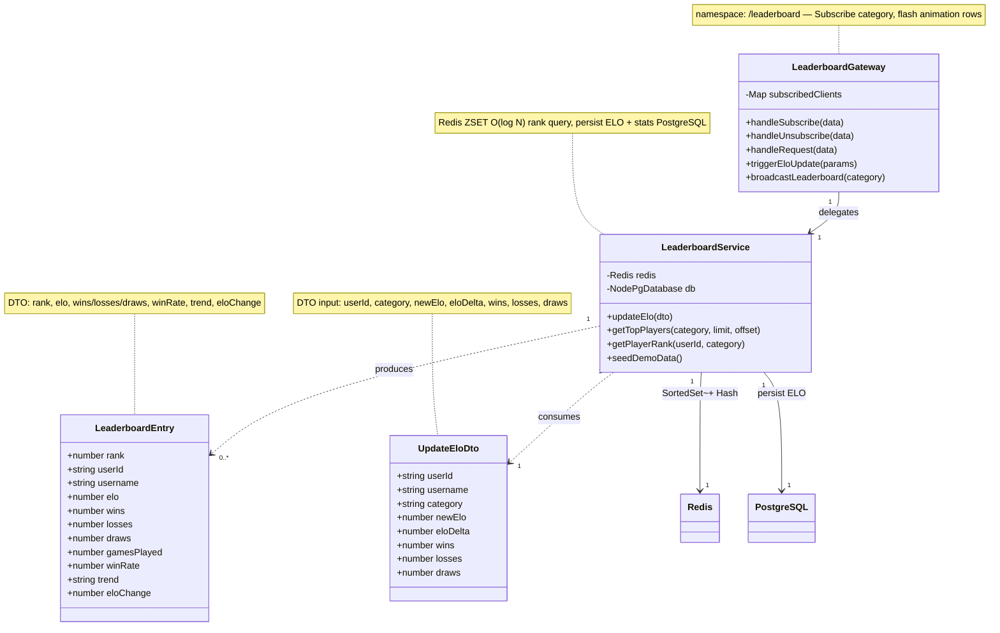
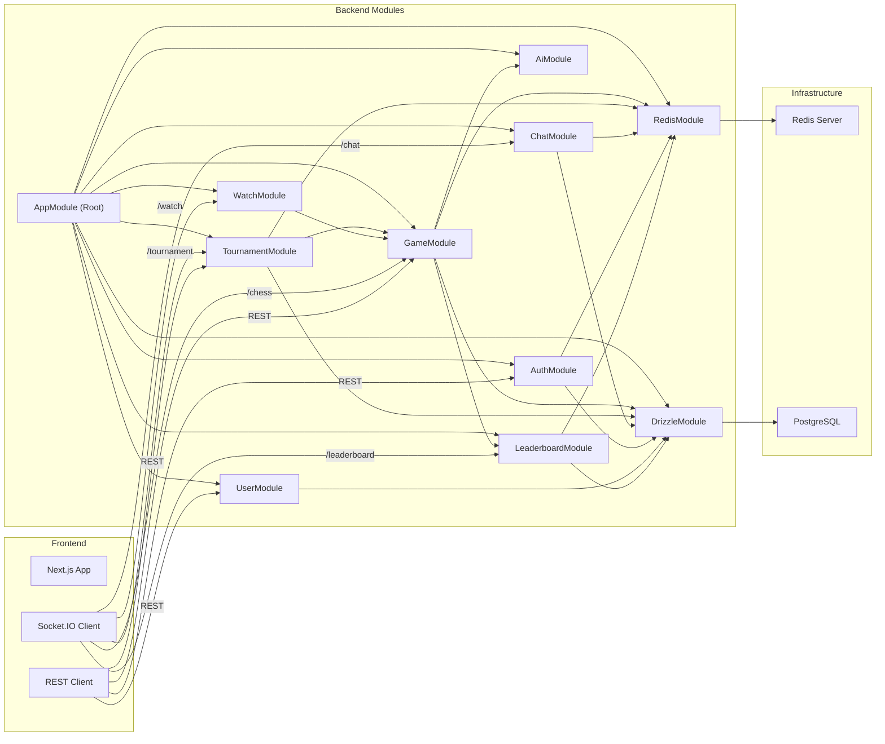

# Class Diagram & Package/Subsystem Diagram — Hệ Thống Cờ Vua Trực Tuyến

> Tài liệu này bổ sung Class Diagram và Package/Subsystem Diagram dựa trên các [Sequence Diagram](sequence-diagrams.md) đã có.  
> **Đã cập nhật (15/06/2026)**: Tên method chính xác theo source code + quan hệ multiplicity (1-1, 1-n, n-m).  
> Dùng [Mermaid Live Editor](https://mermaid.live/) hoặc Markdown Preview trên IDE để xem trực quan.

---

## Mục Lục

1. [Backend Class Diagram — Tổng quan](#1-backend-class-diagram--tổng-quan)
   - [1.1 Toàn bộ class backend (với Multiplicity)](#11-toàn-bộ-class-backend-với-multiplicity)
   - [1.2 Database Entities — Quan hệ ERD (với Multiplicity)](#12-database-entities--quan-hệ-erd-với-multiplicity)
2. [Module Game — Chi tiết](#2-module-game--chi-tiết)
3. [Module Tournament — Chi tiết](#3-module-tournament--chi-tiết)
4. [Module Chat — Chi tiết](#4-module-chat--chi-tiết)
5. [Module Auth & User — Chi tiết](#5-module-auth--user--chi-tiết)
6. [Module Leaderboard — Chi tiết](#6-module-leaderboard--chi-tiết)
7. [Frontend Class Diagram](#7-frontend-class-diagram)
8. [Package/Subsystem Diagram](#8-packagesubsystem-diagram)
9. [Mối liên hệ với Sequence Diagram](#9-mối-liên-hệ-với-sequence-diagram)

---

## 1. Backend Class Diagram — Tổng quan

### 1.1 Backend Class Diagram — Gateways & Services (Đầy đủ thuộc tính + phương thức)

Sơ đồ **tinh gọn** chỉ thể hiện quan hệ giữa **Gateways (WebSocket)** và **Services (Business Logic)**.  
Controllers, Redis, PostgreSQL, DTOs đã được lược bỏ để tập trung vào kiến trúc cốt lõi.

> 📘 **Giải thích ký hiệu mũi tên**: Xem [UML Relationship Arrows — Toàn Tập](uml-relationship-arrows.md)

```mermaid
classDiagram
    direction TB

    %% ═══════════════════════════════════════════════════════
    %% GATEWAYS (WebSocket)
    %% ═══════════════════════════════════════════════════════
    class GameGateway {
        -Server server
        -Logger logger
        -Map connectedClients
        -Map reMatchIntervals
        -GameService gameService
        -AiService aiService
        -LeaderboardGateway leaderboardGateway
        -WatchGateway watchGateway
        -TournamentGateway tournamentGateway
        +afterInit(server)
        +handleConnection(client)
        +handleDisconnect(client)
        +handleReconnectCheck(data)
        +handleFindGame(data)
        +handleCancelSearch(data)
        +handleMakeMove(data)
        +handleResign(data)
        +handleOfferDraw(data)
        +handleAcceptDraw(data)
        +handleDeclineDraw(data)
        +handleStartBotGame(data)
        +handleJoinGame(data)
        +handleClaimTimeout(data)
        -startReMatchIntervals()
        -emitSearchProgress(timeControl)
        -createGameFromMatch(p1, p2, tc)
    }

    class WatchGateway {
        -Server server
        -Logger logger
        -Map spectators
        -WatchService watchService
        -GameService gameService
        +afterInit(server)
        +handleConnection(client)
        +handleDisconnect(client)
        +handleWatchGame(data)
        +handleLeaveWatch(data)
        +handleListLiveGames(client)
        +broadcastGameUpdate(gameId, data)
        +broadcastGameOver(gameId, data)
        -handleLeaveInternal(client, gameId)
    }

    class ChatGateway {
        -Server server
        -Logger logger
        -Map clients
        -Map userSockets
        -Redis redis
        -ChatService chatService
        +afterInit(server)
        +handleConnection(client)
        +handleDisconnect(client)
        +handleIdentify(data)
        +handleJoinDm(data)
        +handleSendDm(data)
        +handleSendDirectMessage(data)
        +handleGetHistory(data)
        +handleTyping(data)
        +emitToUser(userId, event, data)
        -broadcastUserStatus(userId, username, isOnline)
    }

    class TournamentGateway {
        -Server server
        -Logger logger
        -Map userSockets
        -Map clients
        -Map nextRoundTimers
        -TournamentService tournamentService
        +afterInit()
        +handleConnection(client)
        +handleDisconnect(client)
        +handleIdentify(data)
        +handleJoinRoom(data)
        +handleLeaveRoom(data)
        +broadcastTournamentUpdate(tournamentId, data)
        +notifyPlayer(userId, event, data)
        +setNextRoundTimer(tournamentId, ts)
        +clearNextRoundTimer(tournamentId)
    }

    class LeaderboardGateway {
        -Server server
        -Logger logger
        -Map subscribedClients
        -LeaderboardService leaderboardService
        +afterInit()
        +handleConnection(client)
        +handleDisconnect(client)
        +handleSubscribe(data)
        +handleUnsubscribe(data)
        +handleRequest(data)
        +triggerEloUpdate(params)
        +broadcastLeaderboard(category, limit)
    }

    %% ═══════════════════════════════════════════════════════
    %% SERVICES (Business Logic)
    %% ═══════════════════════════════════════════════════════
    class GameService {
        -Logger logger
        -Redis redisClient
        -NodePgDatabase db
        -string matchmakeSha
        -string leaveQueueSha
        +onModuleInit()
        +joinQueue(entry, maxEloDiff) MatchmakingEntry|null
        +leaveQueue(userId, timeControl) void
        +getQueueSize(timeControl) number
        +getQueueEntries(timeControl) MatchmakingEntry[]
        +reMatchWaitingPlayers(tc) Match[]
        +getExpandedEloRange(joinedAt) number
        +generateGameId() string
        +createGameState(gameId, white, black, tc) GameState
        +processMove(gameId, userId, move) MoveResult|null
        +resign(gameId, userId) GameState
        +offerDraw(gameId, userId) boolean
        +acceptDraw(gameId) GameState
        +getGame(gameId) GameState|null
        +saveGame(game, ttl) void
        +deleteGame(gameId) void
        +getUserCurrentGame(userId) string|null
        +setUserCurrentGame(userId, gameId) void
        +clearUserCurrentGame(userId) void
        +saveGameToDb(gameId) void
        +getGameHistory(userId) Game[]
        -gameKey(gameId) string
        -matchmakingKey(timeControl) string
        -userGameKey(userId) string
    }

    class AiService {
        -Logger logger
        +getBestMove(fen, difficulty, botColor) Move|null
        +evaluatePosition(fen) number
        -minimax(chess, depth, alpha, beta, maximizing) number
        -quiescence(chess, alpha, beta, maximizing) number
        -evaluate(chess) number
        -evaluateMaterial(chess) number
        -evaluatePst(chess) number
        -evaluateMobility(chess) number
        -orderMoves(moves, chess) Move[]
        -getRandomMove(chess) Move|null
    }

    class AuthService {
        -NodePgDatabase db
        -JwtService jwtService
        -ConfigService configService
        +register(dto) AuthResponse
        +login(dto) AuthResponse
        +refreshTokens(refreshToken) AuthTokens
        -generateTokens(userId, username, email) AuthTokens
    }

    class ChatService {
        -Logger logger
        -Redis redis
        -NodePgDatabase db
        +getOrCreatePrivateRoom(user1Id, user2Id) string
        +saveMessage(roomId, senderId, senderUsername, content) ChatMessage
        +getMessages(roomId, limit) ChatMessage[]
        +getUserRooms(userId) string[]
        -roomCacheKey(roomId) string
    }

    class TournamentService {
        -NodePgDatabase db
        -Redis redis
        -TournamentSwissService swissService
        -GameService gameService
        +listTournaments() Tournament[]
        +getTournament(id) Tournament
        +getTournamentRounds(tournamentId) TournamentRound[]
        +getCurrentRound(tournamentId) number
        +createTournament(creatorId, dto) Tournament
        +joinTournament(tournamentId, userId) void
        +leaveTournament(tournamentId, userId) void
        +startTournament(tournamentId, userId) RoundResult
        +nextRound(tournamentId, userId?) RoundResult
        +finishTournament(tournamentId, userId) void
        +deleteTournament(tournamentId, userId, isAdmin) void
        +recordTournamentResult(tournamentId, gameId, result) TournamentRound
        +getTournamentGameInfo(gameId) GameInfo
        +getMyTournaments(userId) Tournament[]
        -roundsKey(tournamentId) string
        -roundKey(tournamentId, round) string
        -currentRoundKey(tournamentId) string
        -generateSwissPairings(tournamentId, round) TournamentRound
        -applyRoundResults(tournamentId, games) void
    }

    class TournamentSwissService {
        -NodePgDatabase db
        +generateNextRoundPairs(tournamentId, nextRound) SwissRoundResult
        -resolveResult(whiteId, blackId, winnerId, status) string
        -buildPlayerStats(tournamentId) SwissPlayer[]
        -runSwissPairing(players, pastMatches, tournamentId, round) SwissPairing[]
        -buildScoreGroups(players) SwissPlayer[][]
        -pairGroup(players, pastMatches, round) SwissPairing[]
        -assignColor(p1, p2) SwissPairing
        -pairKey(id1, id2) string
    }

    class LeaderboardService {
        -Logger logger
        -Redis redis
        -NodePgDatabase db
        +updateElo(dto) void
        +getTopPlayers(category, limit, offset) LeaderboardUpdate
        +getPlayerRank(userId, category) RankResult
        +seedDemoData() void
        -leaderboardKey(category) string
        -playerDataKey(userId, category) string
    }

    class UserService {
        -NodePgDatabase db
        +getMe(userId) UserProfile
        +updateMe(userId, dto) void
        +getPublicProfile(userId) PublicProfile
        +getFriendshipStatus(myId, targetId) FriendshipStatus
        +sendFriendRequest(myId, targetId) void
        +acceptFriendRequest(myId, requesterId) void
        +removeFriend(myId, targetId) void
        +getPendingRequests(userId) FriendRequest[]
        +getFriendList(userId) Friend[]
        +respondFriendRequest(requestId, accept) void
    }

    class WatchService {
        -Logger logger
        -Redis redis
        +addSpectator(gameId) number
        +removeSpectator(gameId) number
        +getSpectatorCount(gameId) number
        +listActiveGames() LiveGameSummary[]
        -spectatorKey(gameId) string
    }

    %% ═══════════════════════════════════════════════════════
    %% RELATIONSHIPS
    %% ═══════════════════════════════════════════════════════

    %% ─── [ASSOCIATION] Gateway ──Service: Gateway GIỮ reference đến Service ───
    GameGateway        "1" --> "1" GameService         : delegates
    GameGateway        "1" --> "1" AiService           : botMoves
    WatchGateway       "1" --> "1" GameService         : reads
    WatchGateway       "1" --> "1" WatchService        : manages
    ChatGateway        "1" --> "1" ChatService         : delegates
    TournamentGateway  "1" --> "1" TournamentService   : delegates
    LeaderboardGateway "1" --> "1" LeaderboardService  : delegates

    %% ─── [ASSOCIATION] Service ──Service: Service gọi Service khác ───
    GameService        "1" --> "1" LeaderboardService     : updateELO
    TournamentService  "1" --> "1" TournamentSwissService : pairings
    TournamentService  "1" --> "1" GameService            : createGames

    %% ─── [DEPENDENCY] Gateway ──Gateway: Giao tiếp GIÁN TIẾP qua event (không giữ ref) ───
    GameGateway "1" ..> "0..1" WatchGateway       : broadcastGameUpdate
    GameGateway "1" ..> "0..1" LeaderboardGateway : notifyELO
    GameGateway "1" ..> "0..1" TournamentGateway  : notifyResult

    %% ─── [IMPLEMENTATION] Gateway implements NestJS interfaces ───
    GameGateway ..|> OnGatewayInit
    GameGateway ..|> OnGatewayConnection
    GameGateway ..|> OnGatewayDisconnect

    %% ─── Chú thích từng class ───
    note for GameGateway "namespace: /chess — Xử lý matchmaking, nước đi, đầu hàng, hòa, bot game"
    note for WatchGateway "namespace: /watch — Chế độ khán giả xem trận đấu trực tiếp"
    note for ChatGateway "namespace: /chat — DM 1-1: room-based + Redis direct routing"
    note for TournamentGateway "namespace: /tournament — Cập nhật giải đấu + countdown timer"
    note for LeaderboardGateway "namespace: /leaderboard — Bảng xếp hạng + cập nhật ELO real-time"
    
    note for GameService "Lua script matchmaking, quản lý game state Redis, persist PostgreSQL"
    note for AiService "Minimax Alpha-Beta + Quiescence Search + PST evaluation"
    note for AuthService "JWT access/refresh token + bcrypt password hashing"
    note for ChatService "Quản lý room, cache 50 msg gần nhất, TTL 1 giờ"
    note for TournamentService "Swiss pairing, quản lý vòng đấu, round state Redis"
    note for TournamentSwissService "Thuật toán Swiss: score groups, color balancing, byes"
    note for LeaderboardService "Redis ZSET ranking O(log N), persist ELO PostgreSQL"
    note for UserService "Profile, friend request, friendship status cache"
    note for WatchService "Spectator counter Redis INCR/DECR, live game discovery SCAN"
```



| Loại quan hệ | Mũi tên | Ý nghĩa | Áp dụng trong hệ thống |
|-------------|---------|---------|----------------------|
| **Association** | `-->` (liền →) | 🔵 Giữ reference trực tiếp, quan hệ mạnh | Gateway→Service, Service→Service |
| **Dependency** | `..>` (đứt →) | 🟠 Dùng tạm thời, không giữ reference | Gateway→Gateway (event-based) |
| **Implementation** | `..\|>` (đứt ▷) | 🟢 Implements interface | Gateway→OnGatewayInit/Connection/Disconnect |

| Ký hiệu thành viên | Ý nghĩa |
|-------------------|---------|
| `+method()` | Public method |
| `-method()` | Private method |
| `-field` | Private attribute (dependency injection) |

> 🔗 **Đọc thêm**: [UML Relationship Arrows — Toàn Tập](uml-relationship-arrows.md) — giải thích chi tiết 6 loại mũi tên, kèm cây quyết định chọn đúng loại quan hệ.

---

### 1.2 Database Entities — Quan hệ ERD (với Multiplicity)

Sơ đồ này thể hiện **quan hệ giữa các bảng database** với multiplicity đầy đủ.

```mermaid
erDiagram
    USERS ||--o{ GAMES : "1 user — 0..* games (white)"
    USERS ||--o{ GAMES : "1 user — 0..* games (black)"
    USERS ||--o{ GAMES : "1 user — 0..* games (winner)"
    USERS ||--o{ TOURNAMENT_PARTICIPANTS : "1 user — 0..* tournaments"
    USERS ||--o{ TOURNAMENTS : "1 user — 0..* tournaments (creator)"
    USERS ||--o{ FRIENDS : "1 user — 0..* friends (user1)"
    USERS ||--o{ FRIENDS : "1 user — 0..* friends (user2)"
    USERS ||--o{ MESSAGES : "1 user — 0..* messages"
    USERS ||--o{ CHAT_ROOM_MEMBERS : "1 user — 0..* rooms"
    USERS ||--|| PROFILE_INFO : "1 user — 1 profile"

    TOURNAMENTS ||--o{ TOURNAMENT_PARTICIPANTS : "1 tournament — 2..* participants"
    TOURNAMENTS ||--o{ GAMES : "1 tournament — 0..* games"

    CHAT_ROOMS ||--o{ CHAT_ROOM_MEMBERS : "1 room — 2 members"
    CHAT_ROOMS ||--o{ MESSAGES : "1 room — 0..* messages"

    USERS {
        uuid id PK
        varchar username UK
        varchar email UK
        text passwordHash
        integer blitzRating
        integer rapidRating
        integer bulletRating
        varchar role
        timestamp createdAt
    }

    PROFILE_INFO {
        serial id PK
        uuid userId FK_UK
        jsonb metadata
    }

    FRIENDS {
        uuid user1Id PK_FK
        uuid user2Id PK_FK
        varchar status
    }

    GAMES {
        uuid id PK
        uuid whiteId FK_nullable
        uuid blackId FK_nullable
        uuid winnerId FK_nullable
        varchar whiteUsername
        varchar blackUsername
        varchar status
        varchar timeControl
        text pgn
        text finalFen
        jsonb moves
        uuid tournamentId FK_nullable
        timestamp createdAt
    }

    TOURNAMENTS {
        uuid id PK
        varchar name
        varchar format
        varchar status
        varchar timeControl
        timestamp startTime
        timestamp endTime
        uuid creatorId FK
    }

    TOURNAMENT_PARTICIPANTS {
        uuid tournamentId PK_FK
        uuid userId PK_FK
        real points
        real tieBreak
        integer rank
    }

    CHAT_ROOMS {
        uuid id PK
        varchar type
        uuid referenceId_nullable
        timestamp createdAt
    }

    CHAT_ROOM_MEMBERS {
        uuid roomId PK_FK
        uuid userId PK_FK
    }

    MESSAGES {
        uuid id PK
        uuid roomId FK
        uuid senderId FK
        varchar senderUsername
        text content
        timestamp createdAt
    }
```

**Bảng multiplicity tổng hợp:**

| Entity A | Quan hệ | Entity B | Multiplicity | Giải thích |
|----------|---------|----------|-------------|------------|
| User | ← chơi trắng → | Game | 1 : 0..* | Một user chơi nhiều game làm trắng |
| User | ← chơi đen → | Game | 1 : 0..* | Một user chơi nhiều game làm đen |
| User | ← thắng → | Game | 1 : 0..* | Một user thắng nhiều game |
| User | ← có → | ProfileInfo | 1 : 1 | Mỗi user có đúng 1 profile |
| User | ← gửi → | Message | 1 : 0..* | Một user gửi nhiều tin nhắn |
| User | ← tham gia → | Tournament | n : m | Qua bảng `tournament_participants` |
| User | ← tạo → | Tournament | 1 : 0..* | Một user tạo nhiều giải |
| User | ← kết bạn → | User | n : m | Qua bảng `friends` |
| Tournament | ← có → | Game | 1 : 0..* | Một giải chứa nhiều game |
| Tournament | ← có → | Participant | 1 : 2..* | Một giải có ít nhất 2 người |
| ChatRoom | ← có → | Message | 1 : 0..* | Một room có nhiều tin nhắn |
| ChatRoom | ← có → | Member | 1 : 2 | Một room có đúng 2 thành viên (DM) |

---

## 2. Module Game — Chi tiết

```mermaid
classDiagram
    direction TB

    class GameGateway {
        -Server server
        -Logger logger
        -Map connectedClients
        -Map reMatchIntervals
        -GameService gameService
        -AiService aiService
        +afterInit(server)
        +handleConnection(client)
        +handleDisconnect(client)
        +handleReconnectCheck(data)
        +handleFindGame(data)
        +handleCancelSearch(data)
        +handleMakeMove(data)
        +handleResign(data)
        +handleOfferDraw(data)
        +handleAcceptDraw(data)
        +handleDeclineDraw(data)
        +handleStartBotGame(data)
        +handleJoinGame(data)
        +handleClaimTimeout(data)
        +handleSendMessage(data)
        -startReMatchIntervals()
        -emitSearchProgress(timeControl)
        -createGameFromMatch(p1, p2, tc)
        -handleGameOver(gameId, game)
        -triggerBotMove(gameId)
        -triggerLeaderboardUpdate(game)
    }

    class GameService {
        -Logger logger
        -Redis redisClient
        -NodePgDatabase db
        -string matchmakeSha
        -string leaveQueueSha
        +onModuleInit()
        +joinQueue(entry, maxEloDiff) MatchmakingEntry|null
        +leaveQueue(userId, timeControl) void
        +getQueueSize(timeControl) number
        +getQueueEntries(timeControl) MatchmakingEntry[]
        +reMatchWaitingPlayers(tc) Match[]
        +getExpandedEloRange(joinedAt) number
        +generateGameId() string
        +createGameState(gameId, white, black, tc) GameState
        +processMove(gameId, userId, move) MoveResult|null
        +resign(gameId, userId) GameState
        +offerDraw(gameId, userId) boolean
        +acceptDraw(gameId) GameState
        +getGame(gameId) GameState|null
        +saveGame(game, ttl) void
        +deleteGame(gameId) void
        +getUserCurrentGame(userId) string|null
        +setUserCurrentGame(userId, gameId) void
        +clearUserCurrentGame(userId) void
        +saveGameToDb(gameId) void
        +getGameHistory(userId) Game[]
        -gameKey(gameId) string
        -matchmakingKey(timeControl) string
        -userGameKey(userId) string
    }

    class AiService {
        -Logger logger
        +getBestMove(fen, difficulty, botColor) Move|null
        +evaluatePosition(fen) number
        -minimax(chess, depth, alpha, beta, maximizing) number
        -quiescence(chess, alpha, beta, maximizing) number
        -evaluate(chess) number
        -evaluateMaterial(chess) number
        -evaluatePst(chess) number
        -evaluateMobility(chess) number
        -orderMoves(moves, chess) Move[]
        -getRandomMove(chess) Move|null
    }

    class WatchGateway {
        -Server server
        -Logger logger
        -Map spectators
        -WatchService watchService
        -GameService gameService
        +afterInit(server)
        +handleConnection(client)
        +handleDisconnect(client)
        +handleWatchGame(data)
        +handleLeaveWatch(data)
        +handleListLiveGames(client)
        +broadcastGameUpdate(gameId, data)
        +broadcastGameOver(gameId, data)
        -handleLeaveInternal(client, gameId)
    }

    class LeaderboardGateway {
        -Server server
        -Logger logger
        -Map subscribedClients
        -LeaderboardService leaderboardService
        +afterInit()
        +handleConnection(client)
        +handleDisconnect(client)
        +handleSubscribe(data)
        +handleUnsubscribe(data)
        +handleRequest(data)
        +triggerEloUpdate(params)
        +broadcastLeaderboard(category, limit)
    }

    class TournamentGateway {
        -Server server
        -Logger logger
        -Map userSockets
        -Map clients
        -Map nextRoundTimers
        -TournamentService tournamentService
        +afterInit()
        +handleConnection(client)
        +handleDisconnect(client)
        +handleIdentify(data)
        +handleJoinRoom(data)
        +handleLeaveRoom(data)
        +broadcastTournamentUpdate(tournamentId, data)
        +notifyPlayer(userId, event, data)
        +setNextRoundTimer(tournamentId, ts)
        +clearNextRoundTimer(tournamentId)
    }

    class GameState {
        +string id
        +string fen
        +string pgn
        +string whiteId
        +string blackId
        +string status
        +number whiteTimeMs
        +number blackTimeMs
        +string turn
        +string[] moveHistory
    }

    class MatchmakingEntry {
        +string userId
        +string username
        +number rating
        +string timeControl
        +string socketId
        +number joinedAt
    }

    GameGateway "1" --> "1" GameService : delegates
    GameGateway "1" --> "1" AiService : botMoves
    GameGateway "1" ..> "0..1" WatchGateway : broadcast
    GameGateway "1" ..> "0..1" LeaderboardGateway : ELO
    GameGateway "1" ..> "0..1" TournamentGateway : notify

    GameService "1" --> "0..*" GameState : creates~& manages
    GameService "1" --> "0..*" MatchmakingEntry : queue entries

    GameService "1" --> "1" Redis : MATCHMAKE_LUA + state
    GameService "1" --> "1" PostgreSQL : persist

    note for GameGateway "namespace: /chess — Matchmaking, nước đi, đầu hàng, hòa, bot game"
    note for GameService "Lua script atomic matchmaking ZSET, game state Redis, persist DB"
    note for AiService "Minimax Alpha-Beta + Quiescence Search + PST + Mobility evaluation"
    note for WatchGateway "namespace: /watch — Spectator mode: buffer updates, replay on join"
    note for LeaderboardGateway "namespace: /leaderboard — Real-time ELO + flash animation"
    note for TournamentGateway "namespace: /tournament — Tournament round countdown + notify"
    note for GameState "DTO: Trạng thái game lưu trong Redis (TTL 3600s)"
    note for MatchmakingEntry "DTO: Entry trong ZSET queue (score = rating)"
```



---

## 3. Module Tournament — Chi tiết



---

## 4. Module Chat — Chi tiết



---

## 5. Module Auth & User — Chi tiết



---

## 6. Module Leaderboard — Chi tiết



---

## 7. Frontend Class Diagram

```mermaid
classDiagram
    direction TB

    %% ── ZUSTAND STORES ──
    class UserStore {
        -User user
        -boolean isAuthenticated
        -boolean isLoading
        +login(email, password) void
        +register(username, email, password) void
        +logout() void
        +fetchProfile() void
        +updateLocalElo(newElo) void
        +loadFromStorage() void
    }

    class GameStore {
        -GameState currentGame
        -boolean isSearching
        -number searchTime
        -GameOverResult gameOver
        -string errorMessage
        -SearchProgress searchProgress
        +setGame(game) void
        +updateMove(move) void
        +setGameOver(result) void
        +setSearching(bool) void
        +setSearchProgress(progress) void
        +setError(msg) void
        +reset() void
    }

    class TournamentStore {
        -Tournament[] tournaments
        -Tournament currentTournament
        -SwissPairing[] myPairings
        -number currentRound
        -number countdownSeconds
        -boolean isLoading
        +fetchTournaments() void
        +setCurrentTournament(t) void
        +setPairings(pairings) void
        +setCurrentRound(round) void
        +startCountdown(ms) void
        +clearCountdown() void
    }

    class ChatStore {
        -Map rooms
        -number totalUnread
        -string activeRoomId
        -Set onlineUsers
        -pendingFriend
        -boolean isOpen
        +registerSendFns(send, sendTyping, sendDirect) void
        +openChat(friendId, friendUsername) void
        +closeChat() void
        +setActiveRoom(roomId) void
        +addRoom(room) void
        +addMessage(roomId, msg) void
        +setHistory(roomId, messages) void
        +markRead(roomId) void
        +setTyping(roomId, userId, bool) void
        +setUserOnline(userId, bool) void
        +upsertRoomForDirect(params) void
    }

    %% ── CUSTOM HOOKS ──
    class UseChessSocket {
        -Socket socket
        -boolean connected
        -GameState game
        -string gameStatus
        -ChatMessage[] chatMessages
        -boolean drawOffered
        -string errorMessage
        -string searchingTimeControl
        -PositionAnalysis analysis
        -SearchProgress searchProgress
        +connect() void
        +findGame(timeControl, rating?) void
        +cancelSearch(timeControl) void
        +joinGame(gameId) void
        +makeMove(gameId, from, to, promotion?) void
        +resign(gameId) void
        +offerDraw(gameId) void
        +acceptDraw(gameId) void
        +declineDraw(gameId) void
        +sendChatMessage(gameId, message) void
        +startBotGame(difficulty) void
        +requestAnalysis(fen) void
    }

    class UseFriendChat {
        -Socket socket
        -boolean connected
        +connect(userId, username) void
        +openDm(friendId, friendUsername) void
        +sendMessage(roomId, content) void
        +sendDirectMessage(toUserId, content) void
        +sendTyping(roomId, isTyping) void
        +disconnect() void
    }

    class UseWatchSocket {
        -Socket socket
        -WatchGameState watchingGame
        -LiveGameSummary[] liveGames
        -boolean isLoadingGames
        -number spectatorCount
        -pendingUpdates
        +connect() void
        +fetchLiveGames() void
        +watchGame(gameId) void
        +leaveWatch(gameId) void
        +disconnect() void
    }

    class UseLeaderboard {
        -Socket socket
        -boolean connected
        -string category
        -LeaderboardData data
        -boolean loading
        -Set flashedRows
        +connect() void
        +switchCategory(newCategory) void
        +refresh() void
        +disconnect() void
    }

    class UseStockfish {
        -Worker stockfish
        -boolean isLoaded
        -string currentFen
        +load() void
        +getBestMove(fen, difficulty) Move|null
        +evaluatePosition(fen) StockfishEval
        +terminate() void
        -parseInfoLine(line, turn) Eval|null
        -sendAnalysis(worker, fen) void
    }

    %% ── UI COMPONENTS ──
    class ChessBoard {
        -string position
        -string[] legalMoves
        -boolean isFlipped
        -boolean isMyTurn
        +onPieceDrop(source, target) void
        +highlightLegalMoves(square) void
        +flipBoard() void
        +resetBoard() void
        -isDraggable() boolean
    }

    class ChatDrawer {
        -boolean isOpen
        -string selectedRoomId
        -Friend[] friendList
        +open() void
        +close() void
        +selectRoom(roomId) void
        +sendMessage(content) void
        +showUnreadBadge(count) void
    }

    class GameOverModal {
        -string winner
        -number eloChange
        -number oldElo
        -number newElo
        +showWinner(winner) void
        +showEloChange(delta, oldElo, newElo) void
        +close() void
    }

    class TournamentBracket {
        -SwissPlayer[] players
        -SwissPairing[] pairings
        -number countdownSeconds
        +showStandings(players) void
        +showPairings(pairings) void
        +showCountdown(seconds) void
    }

    class MatchmakingPanel {
        -string selectedTimeControl
        -boolean isSearching
        -number eloRange
        +selectTimeControl(tc) void
        +startSearch() void
        +cancelSearch() void
        -updateSearchProgress(progress) void
    }

    class LeaderboardTable {
        -string selectedCategory
        -LeaderboardEntry[] entries
        -Set flashedRows
        +sortByCategory(category) void
        +highlightChangedRows(rows) void
    }

    %% ── RELATIONSHIPS ──
    UseChessSocket "1" --> "1" GameStore : updates
    UseChessSocket "1" --> "1" UserStore : reads
    UseFriendChat "1" --> "1" ChatStore : updates
    UseWatchSocket "1" --> "1" WatchStore : syncs
    UseLeaderboard "1" --> "1" LeaderboardTable : feeds

    ChessBoard "1" --> "1" UseChessSocket : emits moves
    ChatDrawer "1" --> "1" UseFriendChat : emits messages
    GameOverModal "1" --> "1" GameStore : reads result
    TournamentBracket "1" --> "1" TournamentStore : reads standings
    MatchmakingPanel "1" --> "1" UseChessSocket : emits queue
    LeaderboardTable "1" --> "1" UseLeaderboard : subscribes
    UseStockfish "1" ..> "1" ChessBoard : AI moves (dependency)

    %% ── Chú thích ──
    note for UserStore "Zustand: Auth state, profile, ELO sync localStorage"
    note for GameStore "Zustand: Game state, search progress, game-over result"
    note for TournamentStore "Zustand: Tournament list, pairings, countdown timer"
    note for ChatStore "Zustand: Chat rooms, unread badges, online users, typing indicator"
    note for UseChessSocket "Hook: Socket.IO /chess - reconnect check, sessionStorage persistence"
    note for UseFriendChat "Hook: Socket.IO /chat - identify user, room + direct DM fallback"
    note for UseWatchSocket "Hook: Socket.IO /watch - buffer updates until watch_state received"
    note for UseLeaderboard "Hook: Socket.IO /leaderboard - category switch, flash animation"
    note for UseStockfish "Hook: Web Worker Stockfish WASM - UCI parse, debounce analysis"
    note for ChessBoard "UI: react-chessboard - drag & drop, legal move highlights"
    note for ChatDrawer "UI: Friend list, DM dialog, typing indicator, connection status"
    note for GameOverModal "UI: Winner display, ELO change +/- with glow effect"
    note for TournamentBracket "UI: Standings table, pairing display, countdown timer"
    note for MatchmakingPanel "UI: Time control selector, search animation, ELO range display"
    note for LeaderboardTable "UI: Sortable table, flash animation for changed rows"
```



---

## 8. Package/Subsystem Diagram

### 8.1 Kiến trúc phân tầng hệ thống

```mermaid
graph TB
    subgraph "🎨 FRONTEND — Next.js 16"
        direction TB
        PAGES["📄 Pages (App Router)"]
        COMPONENTS["🧩 Components"]
        STORES["🏪 Zustand Stores"]
        HOOKS["🪝 Custom Hooks"]
        LIB["📚 Lib (apiFetch, authUtils, chessUtils)"]

        PAGES --> COMPONENTS
        COMPONENTS --> HOOKS
        COMPONENTS --> STORES
        HOOKS --> STORES
        HOOKS --> LIB
    end

    subgraph "🔌 SOCKET.IO"
        SOCKET_IO["5 Namespaces:<br/> /chess · /chat · /watch<br/> /tournament · /leaderboard"]
    end

    subgraph "⚙️ BACKEND — NestJS"
        direction TB

        subgraph "Gateway Layer"
            GAME_GW["🎮 GameGateway"]
            WATCH_GW["👁️ WatchGateway"]
            CHAT_GW["💬 ChatGateway"]
            TOURN_GW["🏆 TournamentGateway"]
            LB_GW["📊 LeaderboardGateway"]
        end

        subgraph "Controller Layer"
            AUTH_CTRL["🔐 AuthController"]
            GAME_CTRL["🎮 GameController"]
            TOURN_CTRL["🏆 TournamentController"]
            USER_CTRL["👤 UserController"]
        end

        subgraph "Service Layer"
            GAME_SVC["🎮 GameService"]
            AI_SVC["🤖 AiService"]
            AUTH_SVC["🔐 AuthService"]
            CHAT_SVC["💬 ChatService"]
            TOURN_SVC["🏆 TournamentService"]
            SWISS_SVC["📐 TournamentSwissService"]
            LB_SVC["📊 LeaderboardService"]
            USER_SVC["👤 UserService"]
        end

        GAME_GW --> GAME_SVC
        WATCH_GW --> GAME_SVC
        CHAT_GW --> CHAT_SVC
        TOURN_GW --> TOURN_SVC
        LB_GW --> LB_SVC

        AUTH_CTRL --> AUTH_SVC
        GAME_CTRL --> GAME_SVC
        TOURN_CTRL --> TOURN_SVC
        USER_CTRL --> USER_SVC

        GAME_SVC --> AI_SVC
        GAME_SVC --> LB_SVC
        TOURN_SVC --> SWISS_SVC
        TOURN_SVC --> GAME_SVC
    end

    subgraph "💾 DATA LAYER"
        REDIS[( "🧠 Redis<br/>Game State · Queue · Leaderboard<br/>Online Users · Message Cache" )]
        POSTGRES[( "🐘 PostgreSQL<br/>users · games · tournaments<br/>chat · friends · profile" )]
    end

    FRONTEND <==>|"WebSocket"| SOCKET_IO
    FRONTEND -->|"REST API"| BACKEND
    SOCKET_IO <==> BACKEND
    BACKEND --> REDIS
    BACKEND --> POSTGRES

    style FRONTEND fill:#e3f2fd,stroke:#1565c0
    style BACKEND fill:#fff3e0,stroke:#ef6c00
    style REDIS fill:#ffebee,stroke:#c62828
    style POSTGRES fill:#e8f5e9,stroke:#2e7d32
    style SOCKET_IO fill:#f3e5f5,stroke:#7b1fa2
```

### 8.2 Subsystem Dependencies



---

## 9. Mối liên hệ với Sequence Diagram

| Class | Vai trò | Sequence Diagram |
|-------|---------|-------------------|
| **GameGateway** | WebSocket `/chess` | Matchmaking, Đi cờ, Đầu hàng, Hòa, Timeout, Play Bot |
| **GameService** | Business logic game | Tất cả game flows |
| **AiService** | AI engine (Minimax + Alpha-Beta) | Play Bot |
| **WatchGateway** | WebSocket `/watch` | Spectator mode |
| **ChatGateway** | WebSocket `/chat` | Room-based DM, Direct/Redis-based DM, In-game chat |
| **ChatService** | Chat business logic | DM flows |
| **TournamentGateway** | WebSocket `/tournament` | Join, Start, Play, Countdown, Finish |
| **TournamentService** | Tournament logic | Tất cả tournament flows |
| **TournamentSwissService** | Swiss pairing algorithm | Create, Start, Next round |
| **LeaderboardGateway** | WebSocket `/leaderboard` | Xem BXH, ELO update |
| **LeaderboardService** | ELO ranking & stats | BXH, Tính ELO |
| **AuthController** | REST API auth | Register, Login, Refresh |
| **AuthService** | JWT, bcrypt | Auth flows |
| **UserController** | REST API user | Profile, Friends |
| **UserService** | Profile & friends | Profile, Friends |
| **GameController** | REST API game | Lịch sử trận, Chi tiết game |
| **TournamentController** | REST API tournament | CRUD tournament, Join/Leave |

---

## Phụ lục: Ký hiệu UML trong Class Diagram

> 📘 **Xem đầy đủ**: [UML Relationship Arrows — Toàn Tập](uml-relationship-arrows.md) — bao gồm cây quyết định chọn đúng loại quan hệ, ví dụ chi tiết, và Mermaid cheat sheet.

### Tóm tắt 6 loại quan hệ

| # | Loại | Mermaid | Mũi tên | Ý nghĩa | Dùng trong dự án |
|---|------|---------|---------|---------|-----------------|
| 1 | Kế thừa | `--|>` | ────▷ | IS-A | Ít dùng (NestJS dùng DI) |
| 2 | Implementation | `..|>` | - - -▷ | CAN-DO (implements interface) | Gateway → NestJS lifecycle |
| 3 | Composition | `*--` | ◆─── | IS-PART-OF mạnh | Round → Game |
| 4 | Aggregation | `o--` | ◇─── | HAS-A yếu | Tournament → Participant |
| 5 | Association | `-->` | ────→ | KNOWS-A (giữ reference) | Gateway → Service |
| 6 | Dependency | `..>` | - - -→ | USES tạm thời | Gateway → Gateway (event) |

### Multiplicity

| Ký hiệu | Ý nghĩa |
|---------|---------|
| `"1"` | Đúng 1 |
| `"0..1"` | 0 hoặc 1 |
| `"0..*"` | 0 hoặc nhiều |
| `"1..*"` | Ít nhất 1 |

### Members

| Ký hiệu | Ý nghĩa |
|---------|---------|
| `+method()` | Public |
| `-method()` | Private |
| `#method()` | Protected |
