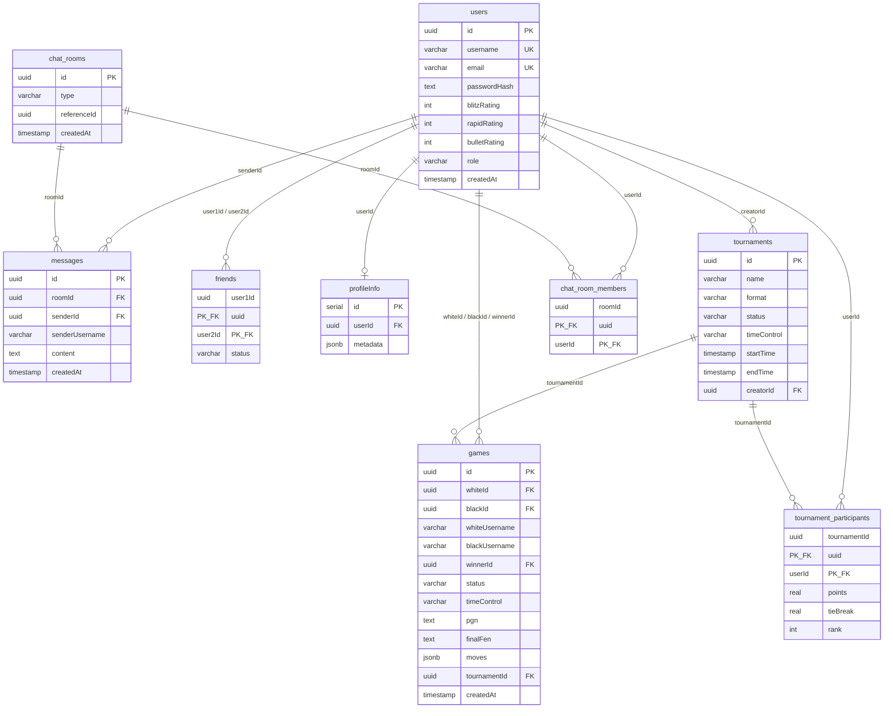

# Phân Tích Chuẩn Hóa Cơ Sở Dữ Liệu & Đề Xuất Index

> Ngày phân tích: 2026-06-19

---

## 1. Sơ Đồ Quan Hệ (Entity-Relationship Overview)



---

## 2. Phân Tích Chuẩn Hóa

### 2.1 First Normal Form (1NF) — Đạt ✅

| Tiêu chí | Trạng thái | Ghi chú |
|-----------|------------|---------|
| Mọi bảng có Primary Key | ✅ | Tất cả bảng đều có PK (`uuid` hoặc composite) |
| Giá trị atomic | ✅ | Không có cột nào chứa nhiều giá trị trong 1 ô |
| Không có nhóm lặp | ✅ | Không có cột `item1, item2, item3...` |

**Lưu ý về JSONB**:
- `games.moves` (jsonb): Lưu mảng nước đi. PostgreSQL coi JSONB là kiểu atomic. Đây là **design choice** phổ biến, vì tách ra bảng `moves` riêng sẽ phức tạp hóa query mà không mang lại lợi ích đáng kể (moves luôn được đọc/ghi nguyên cục theo game).
- `profileInfo.metadata` (jsonb): Tương tự, đây là dữ liệu bán cấu trúc (avatar, bio, preferences) — JSONB là lựa chọn phù hợp.

### 2.2 Second Normal Form (2NF) — Đạt ✅

Các bảng có **composite PK**:

| Bảng | PK | Non-prime attrs | Phụ thuộc vào toàn bộ PK? |
|------|-----|-----------------|---------------------------|
| `friends` | (user1Id, user2Id) | `status` | ✅ Status phụ thuộc vào cặp (user1, user2) |
| `tournament_participants` | (tournamentId, userId) | `points`, `tieBreak`, `rank` | ✅ Điểm số/tiebreak phụ thuộc vào (tournament, user) |
| `chat_room_members` | (roomId, userId) | *(không có)* | ✅ Không có non-prime attribute |

Các bảng còn lại có **single-column PK** → không thể có partial dependency → tự động 2NF.

### 2.3 Third Normal Form (3NF) — ⚠️ Vi Phạm Có Chủ Đích

**Phát hiện transitive dependency**:

| Bảng | Cột vi phạm | Phụ thuộc bắc cầu | Đánh giá |
|------|-------------|-------------------|----------|
| `games` | `whiteUsername` | `id` → `whiteId` → `whiteUsername` (từ `users.username`) | ⚠️ **Denormalize có chủ đích** |
| `games` | `blackUsername` | `id` → `blackId` → `blackUsername` (từ `users.username`) | ⚠️ **Denormalize có chủ đích** |
| `messages` | `senderUsername` | `id` → `senderId` → `senderUsername` (từ `users.username`) | ⚠️ **Denormalize có chủ đích** |

**Lý do denormalize**:
- Khi hiển thị danh sách game (`/archives`, `/live`, `/watch`), nếu không có `whiteUsername`/`blackUsername`, mỗi game cần **2 JOIN** với `users` chỉ để lấy tên.
- Khi load chat history, mỗi message cần **1 JOIN** với `users` để lấy `senderUsername`.
- Với hàng trăm nghìn games/messages, việc JOIN liên tục gây giảm hiệu năng đáng kể.
- **Trade-off**: Dư thừa dữ liệu nhỏ (username ít thay đổi) để đánh đổi tốc độ đọc.

**Kết luận**: Về mặt lý thuyết, schema vi phạm 3NF, nhưng đây là **denormalization có chủ đích và hợp lý** cho ứng dụng real-time.

---

## 3. Phân Tích & Đề Xuất Index

### 3.1 Hiện Trạng

Hiện tại schema **chưa có bất kỳ index nào** ngoài các index tự động từ:
- Primary Key (tất cả bảng)
- Unique Constraint (`users.username`, `users.email`)

Các FK trong migration SQL **không tự động tạo index** trong PostgreSQL (khác với MySQL/InnoDB). Đây là vấn đề nghiêm trọng về hiệu năng!

### 3.2 Đề Xuất Index — Phân Loại Theo Mức Ưu Tiên

#### 🔴 CRITICAL — FK không có index (ảnh hưởng JOIN/DELETE)

| # | Bảng | Cột | Lý do |
|---|------|-----|-------|
| 1 | `games` | `white_id` | Lọc game theo người chơi trắng; JOIN với users |
| 2 | `games` | `black_id` | Lọc game theo người chơi đen; JOIN với users |
| 3 | `games` | `winner_id` | Lọc game theo người thắng |
| 4 | `games` | `tournament_id` | Lọc game trong giải đấu |
| 5 | `messages` | `room_id` | **Cực kỳ quan trọng**: Load chat history (`WHERE room_id = ?`) |
| 6 | `messages` | `sender_id` | Lọc tin nhắn của user |
| 7 | `friends` | `user_id_2` | PK chỉ cover `(user1, user2)`, tìm theo `user2` không dùng được PK index |
| 8 | `chat_room_members` | `user_id` | PK là `(room_id, user_id)`, cần index riêng cho `user_id` để tìm room của user |
| 9 | `tournament_participants` | `user_id` | PK là `(tournament_id, user_id)`, cần index riêng cho `user_id` để tìm tournament của user |
| 10 | `profileInfo` | `userId` | **Nên có UNIQUE index** (1 user chỉ có 1 profile) + tra cứu nhanh |

#### 🟡 HIGH — Query thường xuyên

| # | Bảng | Cột | Lý do |
|---|------|-----|-------|
| 11 | `games` | `status` | Lọc game active (`WHERE status = 'active'`) cho `/live`, `/watch` |
| 12 | `games` | `created_at` | Sắp xếp game mới nhất (`ORDER BY created_at DESC`) |
| 13 | `messages` | `created_at` | Sắp xếp tin nhắn (`ORDER BY created_at`) |
| 14 | `tournaments` | `status` | Lọc giải đấu (`WHERE status = 'active'`) |
| 15 | `tournaments` | `creator_id` | Giải đấu của tôi |
| 16 | `chat_rooms` | `reference_id` | Tìm room theo game/friend (`WHERE reference_id = ? AND type = ?`) |

#### 🟢 MEDIUM — Composite Index cho query phổ biến

| # | Bảng | Cột | Lý do |
|---|------|-----|-------|
| 17 | `messages` | `(room_id, created_at)` | **QUAN TRỌNG**: Load 50 tin nhắn gần nhất (`WHERE room_id = ? ORDER BY created_at DESC LIMIT 50`). Composite index giúp tránh file sort. |
| 18 | `games` | `(white_id, status)` | Game đang đấu của user |
| 19 | `games` | `(black_id, status)` | Game đang đấu của user |
| 20 | `games` | `(tournament_id, created_at)` | Game trong giải theo thời gian |
| 21 | `chat_rooms` | `(type, reference_id)` | Tìm room theo loại + reference |

#### 🔵 LOW — Tối ưu bổ sung

| # | Bảng | Cột | Lý do |
|---|------|-----|-------|
| 22 | `games` | `time_control` | Nếu có filter game theo loại cờ |
| 23 | `tournaments` | `start_time` | Sắp xếp giải đấu sắp diễn ra |

### 3.3 DDL Index Script

```sql
-- ============================================
-- CRITICAL: FK Indexes
-- ============================================

-- games table
CREATE INDEX IF NOT EXISTS idx_games_white_id ON games(white_id);
CREATE INDEX IF NOT EXISTS idx_games_black_id ON games(black_id);
CREATE INDEX IF NOT EXISTS idx_games_winner_id ON games(winner_id);
CREATE INDEX IF NOT EXISTS idx_games_tournament_id ON games(tournament_id);

-- messages table
CREATE INDEX IF NOT EXISTS idx_messages_room_id ON messages(room_id);
CREATE INDEX IF NOT EXISTS idx_messages_sender_id ON messages(sender_id);

-- friends table: PK là (user_id_1, user_id_2), cần index cho user_id_2
CREATE INDEX IF NOT EXISTS idx_friends_user_id_2 ON friends(user_id_2);

-- chat_room_members: PK là (room_id, user_id), cần index cho user_id
CREATE INDEX IF NOT EXISTS idx_chat_room_members_user_id ON chat_room_members(user_id);

-- tournament_participants: PK là (tournament_id, user_id), cần index cho user_id
CREATE INDEX IF NOT EXISTS idx_tournament_participants_user_id ON tournament_participants(user_id);

-- profileInfo: Unique + index
CREATE UNIQUE INDEX IF NOT EXISTS idx_profileinfo_user_id ON "profileInfo"("userId");

-- ============================================
-- HIGH: Frequent Query Columns
-- ============================================

CREATE INDEX IF NOT EXISTS idx_games_status ON games(status);
CREATE INDEX IF NOT EXISTS idx_games_created_at ON games(created_at DESC);
CREATE INDEX IF NOT EXISTS idx_messages_created_at ON messages(created_at);
CREATE INDEX IF NOT EXISTS idx_tournaments_status ON tournaments(status);
CREATE INDEX IF NOT EXISTS idx_tournaments_creator_id ON tournaments(creator_id);
CREATE INDEX IF NOT EXISTS idx_chat_rooms_reference_id ON chat_rooms(reference_id);

-- ============================================
-- MEDIUM: Composite Indexes
-- ============================================

-- Chat: load history nhanh
CREATE INDEX IF NOT EXISTS idx_messages_room_created 
    ON messages(room_id, created_at DESC);

-- Game: tìm game active của user
CREATE INDEX IF NOT EXISTS idx_games_white_status 
    ON games(white_id, status);
CREATE INDEX IF NOT EXISTS idx_games_black_status 
    ON games(black_id, status);

-- Game trong tournament theo thời gian
CREATE INDEX IF NOT EXISTS idx_games_tournament_created 
    ON games(tournament_id, created_at DESC);

-- Chat room lookup
CREATE INDEX IF NOT EXISTS idx_chat_rooms_type_ref 
    ON chat_rooms(type, reference_id);

-- ============================================
-- LOW: Optional
-- ============================================

CREATE INDEX IF NOT EXISTS idx_games_time_control ON games(time_control);
CREATE INDEX IF NOT EXISTS idx_tournaments_start_time ON tournaments(start_time);
```

### 3.4 Cập Nhật Drizzle Schema

Để thêm index qua Drizzle ORM, cập nhật file schema như sau:

```typescript
// game.schema.ts
import { index } from 'drizzle-orm/pg-core';

export const games = pgTable('games', {
  // ... columns
}, (t) => ({
  // Indexes
  whiteIdIdx: index('idx_games_white_id').on(t.whiteId),
  blackIdIdx: index('idx_games_black_id').on(t.blackId),
  winnerIdIdx: index('idx_games_winner_id').on(t.winnerId),
  tournamentIdIdx: index('idx_games_tournament_id').on(t.tournamentId),
  statusIdx: index('idx_games_status').on(t.status),
  createdAtIdx: index('idx_games_created_at').on(t.createdAt.desc()),
  whiteStatusIdx: index('idx_games_white_status').on(t.whiteId, t.status),
  blackStatusIdx: index('idx_games_black_status').on(t.blackId, t.status),
  tournamentCreatedIdx: index('idx_games_tournament_created').on(t.tournamentId, t.createdAt.desc()),
  timeControlIdx: index('idx_games_time_control').on(t.timeControl),
}));

// Similar for other schema files...
```

---

## 4. Tổng Kết

| Khía cạnh | Kết quả |
|-----------|---------|
| **1NF** | ✅ Đạt |
| **2NF** | ✅ Đạt |
| **3NF** | ⚠️ Vi phạm có chủ đích (denormalize `username` trong `games` và `messages` để tối ưu hiệu năng đọc) |
| **Index** | 🔴 **Thiếu trầm trọng** — 0 index ngoài PK/UK. Khuyến nghị thêm **23 index** (10 Critical + 6 High + 5 Medium + 2 Low) |
| **Ưu tiên số 1** | Thêm index cho **tất cả FK** (10 cái) — đây là best practice của PostgreSQL |
| **Ưu tiên số 2** | Composite index `messages(room_id, created_at DESC)` — ảnh hưởng trực tiếp đến UX chat |
