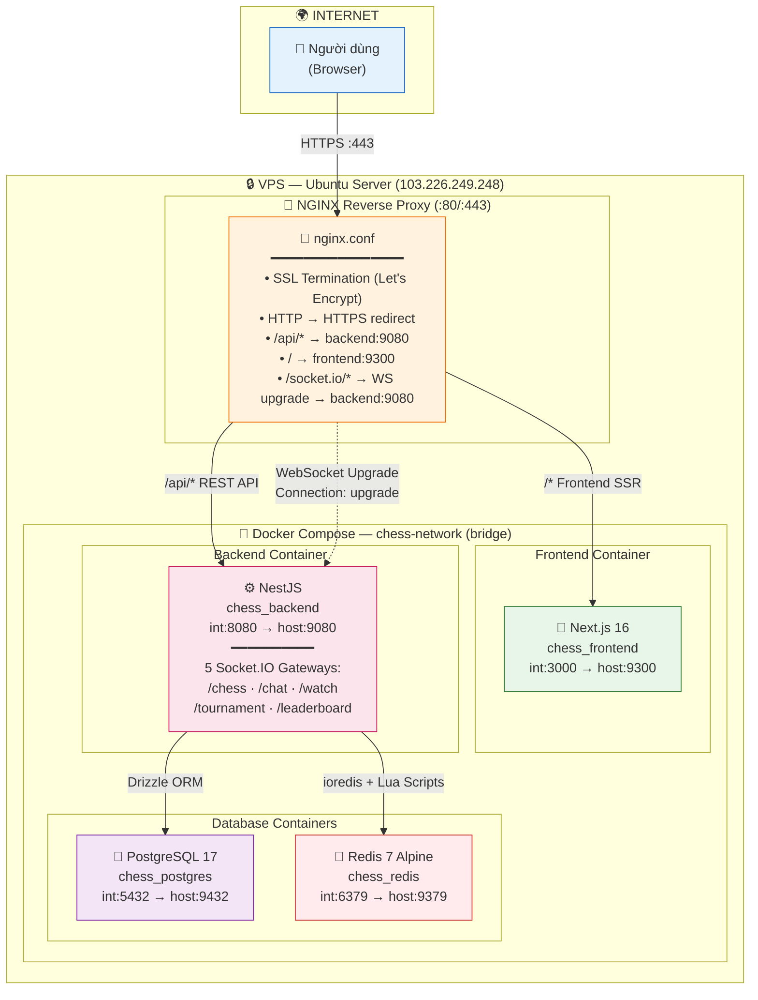
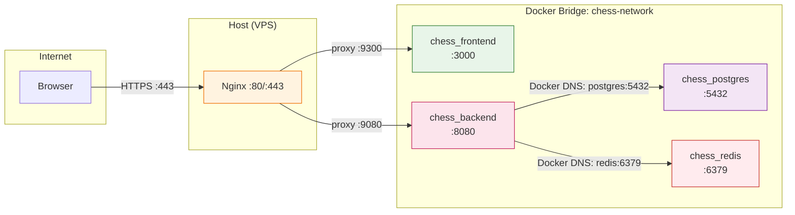

# Deployment Diagram — Hệ Thống Cờ Vua Online

> Cập nhật: 2026-06-20 — Thêm Nginx Reverse Proxy + HTTPS/SSL

---

## 1. Production Deployment — Tổng Quan



---

## 2. Port Mapping — Tránh Xung Đột VPS Công Ty

Tất cả port dùng đầu số **9** để né các port phổ biến đã bị chiếm:

| Service | Internal (Docker) | Host (VPS) | Expose Internet? |
|---------|-------------------|------------|------------------|
| **Nginx** | — | 80, 443 | ✅ (cổng duy nhất) |
| **Frontend** (Next.js) | 3000 | 9300 | ❌ (qua Nginx) |
| **Backend** (NestJS) | 8080 | 9080 | ❌ (qua Nginx) |
| **PostgreSQL** | 5432 | 9432 | ❌ (nội bộ) |
| **Redis** | 6379 | 9379 | ❌ (nội bộ) |

> Các port đã bị chiếm trên VPS: `3000`, `4003`, `4004`, `4100`, `4101`, `5192`, `27017`, `5001`, `5678`, `80`, `22`, `4024`, `6008`, `443`, `5454`.

---

## 3. Luồng Request — Chi Tiết

```
Browser (https://chess.example.com hoặc IP)
    │
    ▼
DNS → 103.226.249.248
    │
    ▼
Nginx (port 443, SSL termination)
    │
    ├── GET  /                     → proxy_pass http://127.0.0.1:9300   (Next.js SSR)
    ├── GET  /_next/static/*       → proxy_pass http://127.0.0.1:9300   (Static assets)
    ├── POST /api/auth/login       → proxy_pass http://127.0.0.1:9080   (REST API)
    ├── GET  /api/game/history     → proxy_pass http://127.0.0.1:9080   (REST API)
    ├── WS   /socket.io/*          → proxy_pass http://127.0.0.1:9080   (WebSocket upgrade)
    │                                  └── Upgrade: websocket
    │                                  └── Connection: upgrade
    │
    ▼
Backend (NestJS :9080)
    │
    ├── PostgreSQL (:9432) — users, games, tournaments, chat, friends
    └── Redis (:9379) — game state, matchmaking queue, leaderboard, online users
```

---

## 4. Cấu Hình Nginx — Production

```nginx
# /etc/nginx/sites-available/chess-app

# ─── HTTP → HTTPS Redirect ──────────────────────────────────
server {
    listen 80;
    server_name chess.yourdomain.com;   # hoặc IP VPS
    return 301 https://$host$request_uri;
}

# ─── HTTPS Server ───────────────────────────────────────────
server {
    listen 443 ssl http2;
    server_name chess.yourdomain.com;

    # SSL Certificates (Certbot / Let's Encrypt)
    ssl_certificate     /etc/letsencrypt/live/chess.yourdomain.com/fullchain.pem;
    ssl_certificate_key /etc/letsencrypt/live/chess.yourdomain.com/privkey.pem;

    # WebSocket Upgrade mapping
    map $http_upgrade $connection_upgrade {
        default upgrade;
        ''      close;
    }

    # ─── Frontend (Next.js SSR + Static) ────────────────────
    location / {
        proxy_pass http://127.0.0.1:9300;
        proxy_http_version 1.1;
        proxy_set_header Host $host;
        proxy_set_header X-Real-IP $remote_addr;
        proxy_set_header X-Forwarded-For $proxy_add_x_forwarded_for;
        proxy_set_header X-Forwarded-Proto $scheme;
    }

    # ─── Backend REST API ────────────────────────────────────
    location /api/ {
        proxy_pass http://127.0.0.1:9080;
        proxy_http_version 1.1;
        proxy_set_header Host $host;
        proxy_set_header X-Real-IP $remote_addr;
        proxy_set_header X-Forwarded-For $proxy_add_x_forwarded_for;
        proxy_set_header X-Forwarded-Proto $scheme;
    }

    # ─── Socket.IO WebSocket ─────────────────────────────────
    location /socket.io/ {
        proxy_pass http://127.0.0.1:9080;
        proxy_http_version 1.1;
        proxy_set_header Upgrade $http_upgrade;
        proxy_set_header Connection $connection_upgrade;
        proxy_set_header Host $host;
        proxy_set_header X-Forwarded-For $proxy_add_x_forwarded_for;
        proxy_read_timeout 86400s;   # WebSocket long-lived connection
        proxy_send_timeout 86400s;
    }
}
```

---

## 5. Docker Compose — Cấu Trúc

```yaml
version: '3.8'

services:
  postgres:
    image: postgres:17.4
    container_name: chess_postgres
    restart: unless-stopped
    ports:
      - "${POSTGRES_HOST_PORT}:5432"     # 9432:5432
    environment:
      POSTGRES_DB: ${POSTGRES_DB}
      POSTGRES_USER: ${POSTGRES_USER}
      POSTGRES_PASSWORD: ${POSTGRES_PASSWORD}
    volumes:
      - postgres_data:/var/lib/postgresql/data
    networks:
      - chess-network
    healthcheck:
      test: ["CMD-SHELL", "pg_isready -U ${POSTGRES_USER} -d ${POSTGRES_DB}"]
      interval: 5s
      timeout: 5s
      retries: 5

  redis:
    image: redis:7.4-alpine
    container_name: chess_redis
    restart: unless-stopped
    ports:
      - "${REDIS_HOST_PORT}:6379"        # 9379:6379
    command: redis-server --appendonly yes --requirepass ${REDIS_PASSWORD}
    volumes:
      - redis_data:/data
    networks:
      - chess-network
    healthcheck:
      test: ["CMD", "redis-cli", "-a", "${REDIS_PASSWORD}", "ping"]
      interval: 5s
      timeout: 5s
      retries: 5

  backend:
    build:
      context: ./backend
      dockerfile: Dockerfile
    container_name: chess_backend
    restart: unless-stopped
    ports:
      - "${BACKEND_HOST_PORT}:8080"      # 9080:8080
    environment:
      - DATABASE_URL=${DATABASE_URL}
      - REDIS_HOST=${REDIS_HOST}
      - REDIS_PORT=${REDIS_PORT}
      - REDIS_PASSWORD=${REDIS_PASSWORD}
      - JWT_ACCESS_SECRET=${JWT_ACCESS_SECRET}
      - JWT_REFRESH_SECRET=${JWT_REFRESH_SECRET}
      - JWT_ACCESS_EXPIRES_IN=${JWT_ACCESS_EXPIRES_IN}
      - JWT_REFRESH_EXPIRES_IN=${JWT_REFRESH_EXPIRES_IN}
      - FRONTEND_URL=${FRONTEND_URL}
      - PORT=${PORT}
    depends_on:
      postgres:
        condition: service_healthy
      redis:
        condition: service_healthy
    networks:
      - chess-network

  frontend:
    build:
      context: ./frontend
      dockerfile: Dockerfile
      args:
        NEXT_PUBLIC_API_URL: ${NEXT_PUBLIC_API_URL}
        NEXT_PUBLIC_BACKEND_URL: ${NEXT_PUBLIC_BACKEND_URL}
    container_name: chess_frontend
    restart: unless-stopped
    ports:
      - "${FRONTEND_HOST_PORT}:3000"     # 9300:3000
    environment:
      - NEXT_PUBLIC_API_URL=${NEXT_PUBLIC_API_URL}
      - NEXT_PUBLIC_BACKEND_URL=${NEXT_PUBLIC_BACKEND_URL}
    depends_on:
      - backend
    networks:
      - chess-network

volumes:
  postgres_data:
  redis_data:

networks:
  chess-network:
    driver: bridge
```

---

## 6. Biến Môi Trường (.env) — Production

```bash
# VPS Public IP
VPS_PUBLIC_IP=103.226.249.248

# PostgreSQL
POSTGRES_DB=testnest
POSTGRES_USER=postgres
POSTGRES_PASSWORD=<CHANGE_ME>

# Redis
REDIS_PASSWORD=<CHANGE_ME>

# Backend
DATABASE_URL=postgres://postgres:<PASS>@postgres:5432/testnest
REDIS_HOST=redis
REDIS_PORT=6379
JWT_ACCESS_SECRET=<CHANGE_ME_RANDOM_64_CHARS>
JWT_REFRESH_SECRET=<CHANGE_ME_RANDOM_64_CHARS>
JWT_ACCESS_EXPIRES_IN=15m
JWT_REFRESH_EXPIRES_IN=7d
FRONTEND_URL=http://103.226.249.248:9300
PORT=8080

# Frontend — QUAN TRỌNG: KHÔNG dùng localhost!
# NEXT_PUBLIC_* được nhúng vào JS chạy trên browser người dùng
NEXT_PUBLIC_API_URL=http://103.226.249.248:9080/api
NEXT_PUBLIC_BACKEND_URL=http://103.226.249.248:9080

# Host Ports (đầu số 9)
FRONTEND_HOST_PORT=9300
BACKEND_HOST_PORT=9080
POSTGRES_HOST_PORT=9432
REDIS_HOST_PORT=9379
```

> ⚠️ **Tuyệt đối không dùng `localhost` cho `NEXT_PUBLIC_*`**: Các biến này được Next.js nhúng cứng vào JavaScript bundle khi build. Nếu để `localhost`, browser của người dùng ngoài internet sẽ gọi API về chính máy họ — không đến được VPS.

---

## 7. Docker Network Topology



---

## 8. Cài Đặt HTTPS Với Certbot

```bash
# 1. Cài Certbot + Nginx plugin
sudo apt update
sudo apt install certbot python3-certbot-nginx -y

# 2. Lấy chứng chỉ SSL (tự động cấu hình Nginx)
sudo certbot --nginx -d chess.yourdomain.com

# 3. Kiểm tra tự động renew
sudo certbot renew --dry-run

# 4. Auto-renew timer (tự động cài khi install certbot)
systemctl status certbot.timer
```

---

## 9. Quy Trình Deploy

```bash
# ─── 1. Pull code mới nhất ──────────────────────────────────
cd /opt/web-datn
git pull

# ─── 2. Build lại Docker images ──────────────────────────────
docker-compose build --no-cache backend
docker-compose build --no-cache frontend

# ─── 3. Khởi động toàn bộ stack ─────────────────────────────
docker-compose up -d

# ─── 4. Reload Nginx (nếu cấu hình thay đổi) ────────────────
sudo nginx -t && sudo systemctl reload nginx

# ─── 5. Kiểm tra logs ──────────────────────────────────────
docker-compose logs -f backend
docker-compose logs -f frontend
```

---

## 10. Các File Liên Quan

| File | Vị trí | Mục đích |
|------|--------|----------|
| `.env` | `web-datn/` | Biến môi trường (secrets, ports, URLs) — **không commit** |
| `.env.example` | `web-datn/` | Template biến môi trường (placeholder) — **được commit** |
| `docker-compose.yml` | `web-datn/` | Định nghĩa Docker stack (4 services + network + volumes) |
| `backend/Dockerfile` | `web-datn/backend/` | Multi-stage build NestJS (deps → builder → runner Alpine) |
| `frontend/Dockerfile` | `web-datn/frontend/` | Multi-stage build Next.js (deps → builder → runner standalone) |
| `nginx.conf` | `/etc/nginx/sites-available/chess-app` | Nginx reverse proxy + SSL (trên VPS, cấu hình thủ công) |
