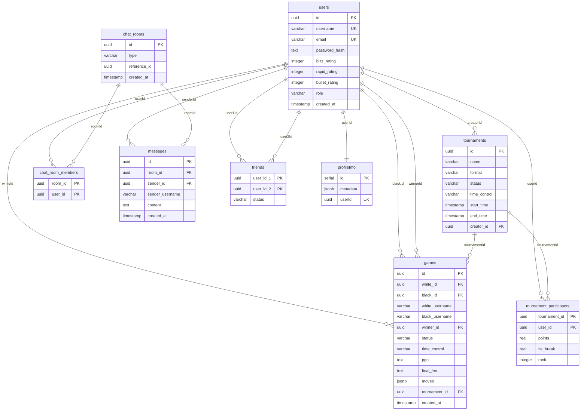

# ERD (Entity-Relationship Diagram) — Chess Platform

> **Cập nhật**: 2026-06-21  
> **Migration**: `0000_fearless_betty_brant.sql` + `0001_add_indexes.sql`

---

## Sơ Đồ ERD

---

## Chi Tiết Cột & Ràng Buộc

### `users`
| Cột | Kiểu | Ràng buộc | Ghi chú |
|-----|------|-----------|---------|
| id | uuid | PK | `defaultRandom()` |
| username | varchar(255) | UK, NOT NULL | |
| email | varchar(255) | UK, NOT NULL | |
| password_hash | text | NOT NULL | |
| blitz_rating | integer | DEFAULT 1200 | |
| rapid_rating | integer | DEFAULT 1200 | |
| bullet_rating | integer | DEFAULT 1200 | |
| role | varchar(50) | DEFAULT 'user' | 'user' \| 'admin' |
| created_at | timestamp | DEFAULT now() | |

### `games`
| Cột | Kiểu | Ràng buộc | Ghi chú |
|-----|------|-----------|---------|
| id | uuid | PK | `defaultRandom()` |
| white_id | uuid | FK → users.id | |
| black_id | uuid | FK → users.id | **nullable** (bot games) |
| white_username | varchar(255) | | Denormalized |
| black_username | varchar(255) | | Denormalized |
| winner_id | uuid | FK → users.id | nullable |
| status | varchar(50) | | 'active'\|'checkmate'\|'stalemate'\|'draw'\|'timeout'\|'resign' |
| time_control | varchar(50) | | 'bullet'\|'blitz'\|'rapid' |
| pgn | text | | Portable Game Notation |
| final_fen | text | | Final board position |
| moves | jsonb | DEFAULT '[]' | Verbose move list |
| tournament_id | uuid | FK → tournaments.id | nullable |
| created_at | timestamp | DEFAULT now() | |

### `tournaments`
| Cột | Kiểu | Ràng buộc | Ghi chú |
|-----|------|-----------|---------|
| id | uuid | PK | `defaultRandom()` |
| name | varchar(255) | NOT NULL | |
| format | varchar(50) | | 'swiss'\|'round-robin'\|'knockout' |
| status | varchar(50) | | 'pending'\|'active'\|'completed' |
| time_control | varchar(50) | | 'blitz'\|'rapid'\|'bullet' |
| start_time | timestamp | | |
| end_time | timestamp | | |
| creator_id | uuid | FK → users.id | |

### `tournament_participants`
| Cột | Kiểu | Ràng buộc | Ghi chú |
|-----|------|-----------|---------|
| tournament_id | uuid | PK, FK → tournaments.id | Composite PK |
| user_id | uuid | PK, FK → users.id | Composite PK |
| points | real | DEFAULT 0 | |
| tie_break | real | DEFAULT 0 | Buchholz / Sonneborn-Berger |
| rank | integer | | |

### `chat_rooms`
| Cột | Kiểu | Ràng buộc | Ghi chú |
|-----|------|-----------|---------|
| id | uuid | PK | `defaultRandom()` |
| type | varchar(50) | | 'private' \| 'game' |
| reference_id | uuid | | friendId hoặc gameId |
| created_at | timestamp | DEFAULT now() | |

### `chat_room_members`
| Cột | Kiểu | Ràng buộc | Ghi chú |
|-----|------|-----------|---------|
| room_id | uuid | PK, FK → chat_rooms.id | Composite PK |
| user_id | uuid | PK, FK → users.id | Composite PK |

### `messages`
| Cột | Kiểu | Ràng buộc | Ghi chú |
|-----|------|-----------|---------|
| id | uuid | PK | `defaultRandom()` |
| room_id | uuid | FK → chat_rooms.id | |
| sender_id | uuid | FK → users.id | |
| sender_username | varchar(255) | NOT NULL | Denormalized |
| content | text | NOT NULL | |
| created_at | timestamp | DEFAULT now() | |

### `friends`
| Cột | Kiểu | Ràng buộc | Ghi chú |
|-----|------|-----------|---------|
| user_id_1 | uuid | PK, FK → users.id | Composite PK |
| user_id_2 | uuid | PK, FK → users.id | Composite PK |
| status | varchar(50) | | 'pending' \| 'accepted' |

### `profileInfo`
| Cột | Kiểu | Ràng buộc | Ghi chú |
|-----|------|-----------|---------|
| id | serial | PK | Auto-increment |
| metadata | jsonb | | avatar, bio, preferences |
| userId | uuid | UK, FK → users.id, NOT NULL | 1 user = 1 profile |

---

### 🔴 CRITICAL: FK Indexes (10)

| # | Tên Index | Bảng | Cột | Ghi chú |
|---|-----------|------|-----|---------|
| 1 | `idx_games_white_id` | games | `white_id` | FK lookup |
| 2 | `idx_games_black_id` | games | `black_id` | FK lookup |
| 3 | `idx_games_winner_id` | games | `winner_id` | FK lookup |
| 4 | `idx_games_tournament_id` | games | `tournament_id` | FK lookup |
| 5 | `idx_messages_room_id` | messages | `room_id` | FK lookup |
| 6 | `idx_messages_sender_id` | messages | `sender_id` | FK lookup |
| 7 | `idx_friends_user_id_2` | friends | `user_id_2` | PK chỉ cover `(user_id_1, user_id_2)`, cần index riêng cho `user_id_2` |
| 8 | `idx_chat_room_members_user_id` | chat_room_members | `user_id` | PK chỉ cover `(room_id, user_id)`, cần index riêng cho `user_id` |
| 9 | `idx_tournament_participants_user_id` | tournament_participants | `user_id` | PK chỉ cover `(tournament_id, user_id)`, cần index riêng cho `user_id` |
| 10 | `idx_profileinfo_user_id` | profileInfo | `userId` | **UNIQUE** — 1 user = 1 profile |

### 🟠 HIGH: Frequent Query Columns (6)

| # | Tên Index | Bảng | Cột |
|---|-----------|------|-----|
| 11 | `idx_games_status` | games | `status` |
| 12 | `idx_games_created_at` | games | `created_at DESC` |
| 13 | `idx_messages_created_at` | messages | `created_at` |
| 14 | `idx_tournaments_status` | tournaments | `status` |
| 15 | `idx_tournaments_creator_id` | tournaments | `creator_id` |
| 16 | `idx_chat_rooms_reference_id` | chat_rooms | `reference_id` |

### 🟡 MEDIUM: Composite Indexes (5)

| # | Tên Index | Bảng | Cột | Mục đích |
|---|-----------|------|-----|----------|
| 17 | `idx_messages_room_created` | messages | `(room_id, created_at DESC)` | Load chat history nhanh |
| 18 | `idx_games_white_status` | games | `(white_id, status)` | Tìm active games của user (white) |
| 19 | `idx_games_black_status` | games | `(black_id, status)` | Tìm active games của user (black) |
| 20 | `idx_games_tournament_created` | games | `(tournament_id, created_at DESC)` | Game trong tournament theo thời gian |
| 21 | `idx_chat_rooms_type_ref` | chat_rooms | `(type, reference_id)` | Tìm chat room theo type + reference |

### 🟢 LOW: Optional (2)

| # | Tên Index | Bảng | Cột |
|---|-----------|------|-----|
| 22 | `idx_games_time_control` | games | `time_control` |
| 23 | `idx_tournaments_start_time` | tournaments | `start_time` |

---

## Tổng Quan Quan Hệ

| Bảng cha | Bảng con | Quan hệ | FK Column(s) | Ghi chú |
|----------|----------|---------|-------------|---------|
| `users` | `games` | 1:N (×3) | `whiteId`, `blackId`, `winnerId` | `blackId` nullable cho bot |
| `users` | `tournaments` | 1:N | `creatorId` | |
| `users` | `tournament_participants` | 1:N | `userId` | Composite PK |
| `users` | `messages` | 1:N | `senderId` | |
| `users` | `friends` | 1:N (×2) | `user1Id`, `user2Id` | Composite PK |
| `users` | `chat_room_members` | 1:N | `userId` | Composite PK |
| `users` | `profileInfo` | **1:1** | `userId` | Unique index |
| `tournaments` | `games` | 1:N | `tournamentId` | nullable |
| `tournaments` | `tournament_participants` | 1:N | `tournamentId` | Composite PK |
| `chat_rooms` | `messages` | 1:N | `roomId` | |
| `chat_rooms` | `chat_room_members` | 1:N | `roomId` | Composite PK |

> **Tổng**: 9 bảng · 11 quan hệ khóa ngoại · 23 indexes · 2 migrations
