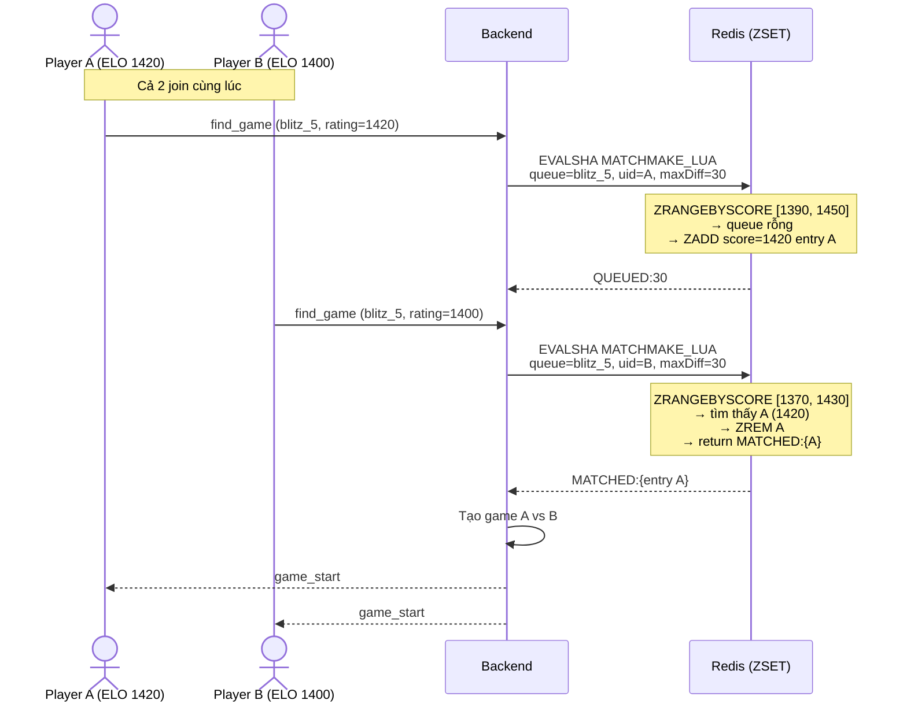

# Thuật Toán Matchmaking Theo ELO — Hệ Thống Ghép Trận

Tài liệu này mô tả chi tiết thuật toán ghép trận (matchmaking) mới, ưu tiên tìm đối thủ có trình độ ELO gần nhất. Code triển khai tại [`backend/src/game/game.service.ts`](../backend/src/game/game.service.ts) và [`backend/src/game/game.gateway.ts`](../backend/src/game/game.gateway.ts).

---

## 1. Tổng Quan

### 1.1. Mục Tiêu

- Ghép người chơi với đối thủ có **ELO gần nhất**
- Tránh tình trạng người chơi phải chờ quá lâu bằng cách **mở rộng phạm vi ELO theo thời gian**
- Đảm bảo **atomic** khi nhiều người cùng join queue (dùng Lua script trong Redis)
- Hiển thị **real-time** tiến trình tìm trận cho người chơi

### 1.2. So Sánh Với Thuật Toán Cũ

| Tiêu chí | Thuật toán cũ (FIFO) | Thuật toán mới (ELO-based) |
|----------|----------------------|---------------------------|
| Cấu trúc queue | Redis List | Redis ZSET (sorted set) |
| Tiêu chí ghép | Ai vào trước ghép trước | ELO gần nhất trong phạm vi |
| Phạm vi ELO | Không giới hạn | Mở rộng dần theo thời gian |
| Tránh race condition | Lua script (List) | Lua script (ZSET) |
| UI hiển thị | Spinner đơn giản | Radar + ELO range bar + stats |

---

## 2. Cấu Trúc Dữ Liệu

### 2.1. Redis ZSET Queue

```
Key:   chess:queue:{timeControl}
Type:  ZSET
Score: rating (ELO)
Member: JSON của MatchmakingEntry

Ví dụ:
ZADD chess:queue:blitz_5 1420 '{"userId":"u1","username":"Alice","rating":1420,...}'
ZADD chess:queue:blitz_5 1380 '{"userId":"u2","username":"Bob","rating":1380,...}'
```

### 2.2. MatchmakingEntry

```typescript
interface MatchmakingEntry {
  userId: string;
  username: string;
  socketId: string;
  timeControl: string;
  rating: number;      // ELO rating
  joinedAt: number;    // Timestamp khi vào queue (ms)
}
```

---

## 3. Thuật Toán Chi Tiết

### 3.1. Luồng Chính

```mermaid
flowchart TD
    A[Người chơi click Find Match] --> B[Client emit find_game]
    B --> C[Server tạo MatchmakingEntry]
    C --> D[Gọi Lua script MATCHMAKE_LUA<br/>với maxEloDiff = 30]
    
    D --> E{Kết quả?}
    E -->|MATCHED| F[Tạo game, emit game_start cho cả 2]
    E -->|QUEUED| G[Client hiển thị searching UI]
    
    G --> H[Mỗi 5 giây, server gọi<br/>reMatchWaitingPlayers]
    H --> I[Tính maxEloDiff mới<br/>= min(30 + 30*floor(elapsed/5s), 200)]
    I --> J[Gọi lại Lua script với range mới]
    J --> K{Tìm thấy đối thủ?}
    K -->|Có| F
    K -->|Không| L[Emit search_progress<br/>cho client cập nhật UI]
    L --> H
```

### 3.2. Lua Script: MATCHMAKE_LUA

Script chạy atomic trong Redis, nhận vào:

| Tham số | Mô tả |
|---------|-------|
| KEYS[1] | Queue key (vd: `chess:queue:blitz_5`) |
| ARGV[1] | userId của người đang tìm |
| ARGV[2] | JSON của MatchmakingEntry |
| ARGV[3] | maxEloDiff (phạm vi cho phép) |

**Các bước thực hiện:**

1. **Kiểm tra trùng lặp**: ZSCAN queue tìm entry có cùng userId. Nếu có → ZREM entry cũ, ZADD entry mới → return `ALREADY_QUEUED`

2. **Tìm đối thủ trong phạm vi**: 
   ```
   ZRANGEBYSCORE key (rating - maxDiff) (rating + maxDiff) LIMIT 0 20
   ```
   Lấy tối đa 20 ứng viên có rating nằm trong khoảng `[myRating - maxDiff, myRating + maxDiff]`

3. **Chọn đối thủ gần nhất**: Duyệt danh sách ứng viên, chọn người có `|opponent.rating - myRating|` nhỏ nhất (bỏ qua chính mình)

4. **Xử lý kết quả**:
   - Nếu tìm thấy → `ZREM` opponent khỏi queue → return `MATCHED:{opponentJson}`
   - Nếu không → `ZADD` entry vào queue với score = rating → return `QUEUED:{maxDiff}`

### 3.3. Công Thức Mở Rộng ELO

```
maxEloDiff = min(INITIAL_RANGE + EXPAND_PER_STEP * floor(elapsed / EXPAND_INTERVAL), MAX_RANGE)

Trong đó:
  INITIAL_RANGE     = 30   (phạm vi ban đầu ±30 ELO)
  EXPAND_PER_STEP   = 30   (mỗi bước mở rộng thêm 30 ELO)
  EXPAND_INTERVAL   = 5000 (mỗi 5 giây)
  MAX_RANGE         = 200  (giới hạn tối đa ±200 ELO)
```

### 3.4. Bảng Thời Gian & Phạm Vi

| Thời gian chờ | Công thức | maxEloDiff |
|---------------|-----------|------------|
| 0 - 5 giây | 30 + 30*0 | ±30 |
| 5 - 10 giây | 30 + 30*1 | ±60 |
| 10 - 15 giây | 30 + 30*2 | ±90 |
| 15 - 20 giây | 30 + 30*3 | ±120 |
| 20 - 25 giây | 30 + 30*4 | ±150 |
| 25 - 30 giây | 30 + 30*5 | ±180 |
| 30+ giây | capped | ±200 |

---

## 4. Periodic Re-Match (Server-driven)

### 4.1. Cơ Chế

Server duy trì `setInterval` mỗi 5 giây cho từng time control:

```typescript
setInterval(async () => {
  // 1. Emit search_progress cho tất cả người đang chờ
  await emitSearchProgress(tc);

  // 2. Nếu queue có >= 2 người, thử re-match
  if (queueSize >= 2) {
    const matches = await gameService.reMatchWaitingPlayers(tc);
    for (const { player, opponent } of matches) {
      await createGameFromMatch(player, opponent, tc);
    }
  }
}, 5000);
```

### 4.2. Hàm reMatchWaitingPlayers

```typescript
async reMatchWaitingPlayers(timeControl: string) {
  const entries = await getQueueEntries(timeControl);
  const matches = [];

  for (const entry of entries) {
    const expandedRange = getExpandedEloRange(entry.joinedAt);
    if (expandedRange <= INITIAL_RANGE) continue; // Chưa đến lúc mở rộng

    const opponent = await joinQueue(entry, expandedRange);
    if (opponent) matches.push({ player: entry, opponent });
  }
  return matches;
}
```

---

## 5. Tránh Race Condition

### 5.1. Vấn Đề

Khi nhiều người cùng join queue hoặc re-match xảy ra đồng thời, có thể xảy ra:
- 2 người cùng được ghép với cùng 1 đối thủ
- 1 người vừa bị cancel nhưng vẫn được ghép

### 5.2. Giải Pháp: Lua Script Atomic

Toàn bộ logic tìm đối thủ + xóa khỏi queue + thêm vào queue chạy trong **1 Lua script duy nhất** trên Redis. Redis đảm bảo:
- Lua script chạy **atomic** — không command nào khác xen vào giữa
- ZRANGEBYSCORE + ZREM là atomic — không thể có 2 script cùng ZREM 1 entry

### 5.3. Sequence Diagram



---

## 6. Giao Diện Người Dùng

### 6.1. Idle State

- 3 card chọn time control (Bullet/Blitz/Rapid)
- Mỗi card hiển thị: icon, thời gian, ELO của người chơi
- Nút "Find Match" gradient tím
- Hiệu ứng float knight animation

### 6.2. Searching State

- **Radar pulse animation**: 3 vòng tròn lan tỏa, quân cờ knight ở tâm
- **ELO Range Bar**: Thanh ngang hiển thị phạm vi đang tìm, animated mở rộng
- **Stats**: Thời gian đã chờ, thời gian dự kiến, số người trong queue
- **Cancel**: Nút hủy tìm trận

### 6.3. Events

| Event | Direction | Mô tả |
|-------|-----------|-------|
| `find_game` | Client → Server | Bắt đầu tìm trận |
| `searching` | Server → Client | Xác nhận đã vào queue |
| `search_progress` | Server → Client | Cập nhật tiến trình mỗi 5s |
| `game_start` | Server → Client | Đã tìm thấy đối thủ |
| `cancel_search` | Client → Server | Hủy tìm trận |
| `search_cancelled` | Server → Client | Xác nhận đã hủy |

---

## 7. Cấu Hình

Các tham số có thể điều chỉnh trong `game.service.ts`:

```typescript
private static readonly INITIAL_ELO_RANGE = 30;      // Phạm vi ban đầu
private static readonly ELO_EXPAND_PER_STEP = 30;    // Mở rộng mỗi bước
private static readonly ELO_EXPAND_INTERVAL_MS = 5000; // Chu kỳ (ms)
private static readonly MAX_ELO_RANGE = 200;          // Giới hạn tối đa
```

---

## 8. FAQ

**Q: Điều gì xảy ra nếu chỉ có 1 người trong queue?**
A: Người đó sẽ thấy elapsed time tăng dần, range bar mở rộng đến ±200 ELO, nhưng sẽ không có match cho đến khi có người khác join.

**Q: Nếu 2 người chênh nhau 400 ELO thì sao?**
A: Sau 30 giây, range đạt ±200 (tối đa). Nếu chênh 400 > 200, họ sẽ không được ghép với nhau trừ khi có người thứ 3 join có ELO nằm giữa.

**Q: Bot games có dùng thuật toán này không?**
A: Không. Bot games tạo game trực tiếp, không qua matchmaking queue.
