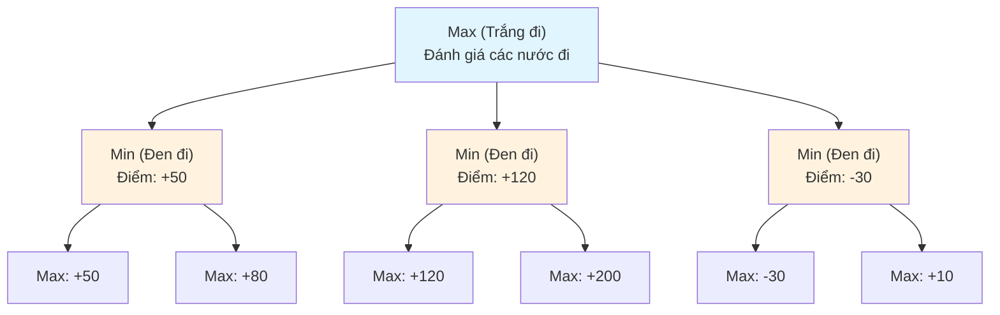
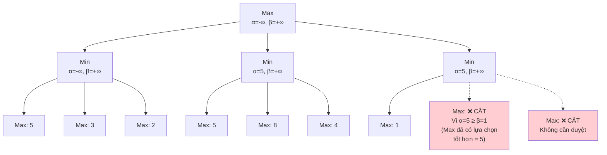
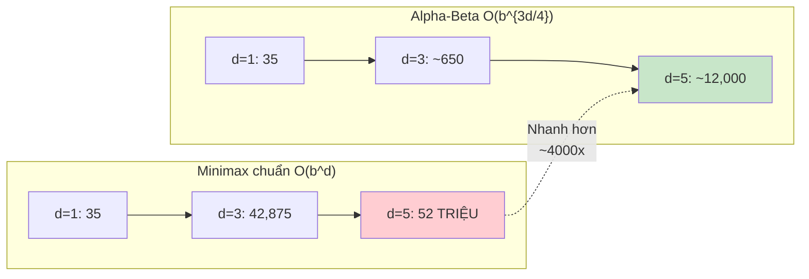
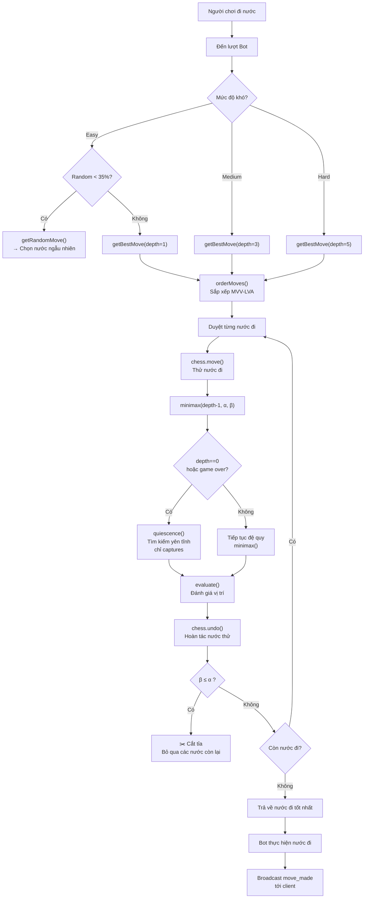

# Thuật Toán Minimax & Alpha-Beta Pruning — AI Bot Cờ Vua

Tài liệu này mô tả chi tiết thuật toán AI **tự cài đặt 100%** (không dùng engine cờ vua bên ngoài) để bot đưa ra nước đi. Code triển khai tại [`backend/src/ai/ai.service.ts`](../backend/src/ai/ai.service.ts).

> **Lưu ý quan trọng**: Toàn bộ AI của bot là code **tự viết**. Thư viện [`chess.js`](https://github.com/jhlywa/chess.js) CHỈ được dùng để:
> - Sinh danh sách nước đi hợp lệ (`chess.moves()`)
> - Quản lý trạng thái bàn cờ (FEN, PGN, undo move)
> - Kiểm tra kết thúc game (`isGameOver()`, `isCheckmate()`, `isDraw()`, v.v.)
>
> **chess.js không cung cấp bất kỳ thuật toán AI nào** — toàn bộ Minimax, Alpha-Beta, hàm đánh giá, sắp xếp nước đi đều do chúng tôi tự cài đặt.

---

## 1. Tổng Quan Kiến Trúc AI

Bot sử dụng duy nhất một engine tự cài đặt:

| Thành phần | Vị trí | Mục đích |
|------------|--------|----------|
| **Minimax + Alpha-Beta** (tự code) | `backend/src/ai/ai.service.ts` | Sinh nước đi cho bot ở 3 mức độ khó |

---

## 2. Cây Trò Chơi (Game Tree)

Trong cờ vua, mỗi trạng thái bàn cờ là một **nút** (node), mỗi nước đi hợp lệ là một **cạnh** (edge) dẫn đến nút con. Cây trò chơi phát triển theo lượt:

- **Nút Max** (lượt Trắng): Chọn nước đi có điểm đánh giá **cao nhất**
- **Nút Min** (lượt Đen): Chọn nước đi có điểm đánh giá **thấp nhất**



> **Nguyên lý Minimax**: Giả sử đối thủ luôn chọn nước đi tốt nhất cho họ (tệ nhất cho ta). Ta chọn nước đi **tối đa hóa lợi ích tối thiểu** (maximize the minimum gain).

---

## 3. Hàm Đánh Giá (Static Evaluation)

Hàm `evaluate()` trong `AiService` đánh giá một vị trí bàn cờ từ góc nhìn của **Trắng** (dương = Trắng có lợi, âm = Đen có lợi).

### 3.1. Giá Trị Quân Cờ (Piece Values)

| Quân | Ký hiệu | Giá trị (centipawn) |
|------|---------|---------------------|
| Tốt | p | 100 |
| Mã | n | 320 |
| Tượng | b | 330 |
| Xe | r | 500 |
| Hậu | q | 900 |
| Vua | k | 20000 |

### 3.2. Piece-Square Tables (PST)

Mỗi loại quân có một bảng 8×8 cho biết **giá trị vị trí** (positional value) — quân đứng ở ô tốt được thưởng điểm, đứng ở ô xấu bị phạt.

Ví dụ — PST cho quân Tốt (từ góc nhìn Trắng, hàng 1 ở dưới cùng):

```
   0    0    0    0    0    0    0    0      ← Hàng 8 (đã phong cấp)
  50   50   50   50   50   50   50   50      ← Hàng 7 (tốt sắp phong cấp → thưởng lớn)
  10   10   20   30   30   20   10   10      ← Hàng 6
   5    5   10   25   25   10    5    5      ← Hàng 5
   0    0    0   20   20    0    0    0      ← Hàng 4 (trung tâm)
   5   -5  -10    0    0  -10   -5    5      ← Hàng 3
   5   10   10  -20  -20   10   10    5      ← Hàng 2 (tốt mới xuất phát)
   0    0    0    0    0    0    0    0      ← Hàng 1
```

- Tốt ở trung tâm (d4, e4, d5, e5) được thưởng cao
- Tốt ở cột biên (a, h) bị phạt nhẹ
- Tốt gần phong cấp (hàng 7) được thưởng rất lớn

### 3.3. Kiểm Tra Kết Thúc

Hàm `evaluate()` kiểm tra các điều kiện kết thúc **trước khi** tính điểm vị trí:

```typescript
if (chess.isCheckmate()) {
  // Bên bị chiếu hết là bên vừa đi → bên kia thắng
  return chess.turn() === 'w' ? -99999 : 99999;
}
// Hòa: hết nước đi, không đủ quân chiếu hết, 50 nước, lặp 3 lần...
if (chess.isDraw() || chess.isStalemate() || chess.isInsufficientMaterial()) return 0;
```

### 3.4. Mobility Bonus

Ngoài giá trị quân + vị trí, hàm đánh giá còn cộng thêm **điểm Mobility**:

$$\text{Mobility} = (\text{số nước đi hợp lệ}) \times 5$$

Dấu phụ thuộc vào lượt đi: nếu đang là lượt Trắng thì cộng, lượt Đen thì trừ. Điều này khuyến khích bot chọn vị trí có nhiều lựa chọn chiến thuật.

### 3.5. Công Thức Tổng

$$V = \sum_{q \in \text{board}} \left[ \text{color}(q) \times \big( \text{PIECE\_VALUE}(\text{type}(q)) + \text{PST}(\text{type}(q), \text{square}(q)) \big) \right] + \text{Mobility}$$

Với $\text{color}(q) = +1$ nếu quân Trắng, $-1$ nếu quân Đen.

### 3.6. Code Thực Tế của Hàm `evaluate()`

```typescript
// Code đầy đủ từ backend/src/ai/ai.service.ts
private evaluate(chess: Chess): number {
  if (chess.isCheckmate()) {
    return chess.turn() === 'w' ? -99999 : 99999;
  }
  if (chess.isDraw() || chess.isStalemate() || chess.isInsufficientMaterial()) return 0;

  let score = 0;
  const board = chess.board();

  for (let rank = 0; rank < 8; rank++) {
    for (let file = 0; file < 8; file++) {
      const piece = board[rank][file];
      if (!piece) continue;

      const type = piece.type;   // 'p','n','b','r','q','k'
      const color = piece.color; // 'w' or 'b'

      // Lấy chỉ số PST: Trắng dùng trực tiếp, Đen lật ngược bảng
      const pstIdx = color === 'w' ? rank * 8 + file : (7 - rank) * 8 + file;
      const pst = PST_MAP[type] ?? [];
      const positional = pst[pstIdx] ?? 0;
      const value = PIECE_VALUE[type] + positional;

      score += color === 'w' ? value : -value;
    }
  }

  // Mobility bonus: thưởng cho bên có nhiều nước đi hợp lệ
  const mobilityBonus = chess.moves().length * (chess.turn() === 'w' ? 5 : -5);
  score += mobilityBonus;

  return score;
}
```

---

## 4. Thuật Toán Minimax

### 4.1. Ý Tưởng

Minimax mô phỏng trò chơi đến độ sâu $d$:

1. **Duyệt tất cả** nước đi hợp lệ ở mỗi tầng
2. **Đánh giá** vị trí tại các nút lá (khi $d=0$ hoặc game kết thúc)
3. **Lan truyền ngược** giá trị lên cây:
   - Nút Max (lượt ta): chọn giá trị **lớn nhất** từ các con
   - Nút Min (lượt đối thủ): chọn giá trị **nhỏ nhất** từ các con

### 4.2. Mã Giả (Pseudocode)

```
function minimax(position, depth, maximizingPlayer):
    if depth == 0 or game over:
        return evaluate(position)
    
    if maximizingPlayer:          // Lượt Trắng (Max)
        maxEval = -∞
        for each move in position:
            make(move)
            eval = minimax(position, depth - 1, FALSE)
            unmake(move)
            maxEval = max(maxEval, eval)
        return maxEval
    
    else:                          // Lượt Đen (Min)
        minEval = +∞
        for each move in position:
            make(move)
            eval = minimax(position, depth - 1, TRUE)
            unmake(move)
            minEval = min(minEval, eval)
        return minEval
```

### 4.3. Độ Phức Tạp (Tổng Quan)

- **Branching factor** $b \approx 35$ (trung bình ~35 nước đi hợp lệ mỗi lượt)
- **Độ sâu** $d$: 1 (easy), 3 (medium), 5 (hard)
- **Số nút phải duyệt (Minimax chuẩn)**: $\approx b^d$

> Xem **[Mục 7 — Đánh Giá Độ Phức Tạp](#7-đánh-giá-độ-phức-tạp)** để có phân tích chi tiết về thời gian và không gian cho từng thành phần trong code.

---

## 5. Alpha-Beta Pruning (Cắt Tỉa)

### 5.1. Ý Tưởng

Alpha-Beta là kỹ thuật **cắt bỏ các nhánh không cần thiết** trong cây Minimax mà **không ảnh hưởng đến kết quả cuối cùng**. Nó duy trì hai giá trị:

- **$\alpha$** (Alpha): Giá trị **tốt nhất** mà Max có thể đảm bảo cho đến hiện tại
- **$\beta$** (Beta): Giá trị **tốt nhất** mà Min có thể đảm bảo cho đến hiện tại

**Điều kiện cắt tỉa**: Khi $\alpha \geq \beta$, dừng duyệt nhánh hiện tại.

### 5.2. Trực Quan Hóa



> **Giải thích**: Khi duyệt nhánh D, nút con đầu tiên trả về 1. Đây là nút **Min**, nên $\beta = \min(+\infty, 1) = 1$. Lúc này $\alpha = 5$ (từ nhánh B) và $\beta = 1$, ta có $\alpha \geq \beta$ → **Cắt tỉa**! Max đã có lựa chọn tốt hơn (5) từ nhánh B, nên không cần duyệt tiếp các nút con còn lại của D.

### 5.3. Mã Giả (Pseudocode) — Khớp Với Code Thực Tế

```
function alphabeta(position, depth, α, β, maximizingPlayer):
    if depth == 0 or game over:
        return quiescence(position, α, β, maximizingPlayer, depth=3)
    
    moves = orderMoves(position)   // Sắp xếp MVV-LVA trước khi duyệt
    
    if maximizingPlayer:            // Lượt Trắng (Max)
        maxEval = -∞
        for each move in moves:
            make(move)
            eval = alphabeta(position, depth - 1, α, β, FALSE)
            unmake(move)
            maxEval = max(maxEval, eval)
            α = max(α, eval)
            if β ≤ α:               // ← CẮT TỈA BETA
                break
        return maxEval
    
    else:                            // Lượt Đen (Min)
        minEval = +∞
        for each move in moves:
            make(move)
            eval = alphabeta(position, depth - 1, α, β, TRUE)
            unmake(move)
            minEval = min(minEval, eval)
            β = min(β, eval)
            if β ≤ α:               // ← CẮT TỈA ALPHA
                break
        return minEval
```

> **Khác biệt so với Minimax chuẩn**: Khi đạt độ sâu tối đa, code **không** gọi `evaluate()` ngay mà gọi `quiescence()` — tìm kiếm yên tĩnh thêm 3 tầng chỉ với nước ăn quân. Đây là kỹ thuật nâng cao giúp tránh Horizon Effect.

### 5.4. Hiệu Quả Cắt Tỉa

Trong trường hợp **tốt nhất** (các nước đi được sắp xếp hoàn hảo), Alpha-Beta giảm số nút phải duyệt từ $O(b^d)$ xuống còn $O(b^{d/2})$, tức là **gấp đôi độ sâu tìm kiếm** với cùng chi phí tính toán.

---

## 6. Các Kỹ Thuật Tối Ưu Trong Dự Án

### 6.1. MVV-LVA Move Ordering

**MVV-LVA** = *Most Valuable Victim — Least Valuable Attacker*

Sắp xếp các nước đi **trước khi duyệt** để tăng khả năng cắt tỉa sớm:

```typescript
// Code từ backend/src/ai/ai.service.ts
private moveScore(move: Move): number {
  let score = 0;
  if (move.captured) {
    // Ăn quân giá trị cao bằng quân giá trị thấp → điểm cao
    score += 10 * (PIECE_VALUE[move.captured] ?? 0) - (PIECE_VALUE[move.piece] ?? 0);
  }
  if (move.promotion) score += PIECE_VALUE[move.promotion] ?? 0;  // Phong cấp
  if (move.flags.includes('k') || move.flags.includes('q')) score += 30; // Nhập thành
  return score;
}
```

- **Ăn Hậu bằng Mã**: $10 \times 900 - 320 = 8680$ điểm → ưu tiên cao nhất
- **Nhập thành**: $+30$ điểm → ưu tiên vừa phải
- **Nước đi yên tĩnh**: $0$ điểm → duyệt sau cùng

### 6.2. Quiescence Search (Tìm Kiếm Yên Tĩnh)

**Vấn đề**: Khi dừng tìm kiếm ở độ sâu $d$, có thể đang ở giữa một chuỗi ăn quân — dẫn đến **Horizon Effect** (ảo giác đường chân trời).

**Giải pháp**: Khi đạt đến độ sâu tối đa, tiếp tục tìm kiếm **chỉ các nước ăn quân và bắt tốt qua đường** (en passant) thêm 3 tầng nữa, đồng thời áp dụng **Stand-Pat pruning** để cắt tỉa sớm:

```typescript
// Code đầy đủ từ backend/src/ai/ai.service.ts
private quiescence(
  chess: Chess,
  alpha: number,
  beta: number,
  maximizing: boolean,
  depth = 3,         // ← tìm thêm 3 tầng captures
): number {
  const standPat = this.evaluate(chess);  // Điểm hiện tại nếu dừng luôn

  // Nếu game đã kết thúc → trả về kết quả cuối cùng
  if (chess.isGameOver()) {
    if (chess.isCheckmate()) return maximizing ? -99999 : 99999;
    return 0;
  }

  // Hết độ sâu quiescence → trả về điểm hiện tại
  if (depth === 0) return standPat;

  // Stand-Pat pruning: nếu điểm hiện tại đã đủ tốt, không cần tìm tiếp
  if (maximizing) {
    if (standPat >= beta) return beta;     // Điểm đã quá cao với Min
    alpha = Math.max(alpha, standPat);
  } else {
    if (standPat <= alpha) return alpha;   // Điểm đã quá thấp với Max
    beta = Math.min(beta, standPat);
  }

  // CHỈ duyệt captures + en-passant (không duyệt nước yên tĩnh)
  const captures = (chess.moves({ verbose: true }) as Move[]).filter(
    (m) => m.captured || m.flags.includes('e'),
  );

  for (const move of captures) {
    chess.move(move);
    const score = this.quiescence(chess, alpha, beta, !maximizing, depth - 1);
    chess.undo();

    if (maximizing) {
      alpha = Math.max(alpha, score);
      if (beta <= alpha) break;  // Cắt tỉa
    } else {
      beta = Math.min(beta, score);
      if (beta <= alpha) break;  // Cắt tỉa
    }
  }

  return maximizing ? alpha : beta;
}
```

**Giải thích Stand-Pat Pruning**: Giả sử đang ở nút Max, điểm hiện tại (`standPat`) đã $\geq \beta$. Điều này có nghĩa là ngay cả khi KHÔNG ăn thêm quân nào, vị trí đã quá tốt so với kỳ vọng của đối thủ (Min) → Min sẽ không bao giờ cho phép dẫn đến vị trí này → **cắt tỉa ngay**, không cần duyệt captures.

### 6.3. Piece-Square Tables (PST)

Như đã mô tả ở mục 3.2, PST giúp bot **hiểu vị trí chiến lược**:
- Tốt ở trung tâm → tốt
- Mã ở góc → xấu
- Vua nhập thành → an toàn
- Xe ở cột mở → mạnh

### 6.4. Mobility Bonus

Thưởng điểm cho bên có **nhiều lựa chọn chiến thuật** hơn, khuyến khích bot chơi linh hoạt thay vì bó hẹp.

---

## 7. Đánh Giá Độ Phức Tạp

Phần này phân tích **độ phức tạp thời gian (Time Complexity)** và **độ phức tạp không gian (Space Complexity)** cho từng thành phần trong code `AiService`, sử dụng ký hiệu **Big-O**.

### Ký Hiệu

| Ký hiệu | Ý nghĩa | Giá trị thực tế |
|---------|---------|-----------------|
| $b$ | Branching factor — số nước đi hợp lệ trung bình mỗi vị trí | $\approx 35$ |
| $d$ | Độ sâu tìm kiếm Minimax (theo `DEPTH_MAP`) | 1 / 3 / 5 |
| $c$ | Branching factor cho nước ăn quân (captures) | $\approx 5{-}8$ |
| $q$ | Độ sâu Quiescence Search (mặc định) | $3$ |
| $M$ | Số nước đi hợp lệ tại một vị trí | $\approx 35$ |

---

### 7.1. Hàm Đánh Giá Tĩnh — `evaluate()`

```typescript
private evaluate(chess: Chess): number {
  // Duyệt 64 ô bàn cờ
  for (let rank = 0; rank < 8; rank++) {
    for (let file = 0; file < 8; file++) {
      // O(1) mỗi ô: lookup PIECE_VALUE + PST_MAP
    }
  }
  // Mobility: chess.moves() sinh tất cả nước đi hợp lệ
  const mobilityBonus = chess.moves().length * 5;
}
```

| Độ phức tạp | Phân tích |
|-------------|-----------|
| **Thời gian** | $O(64 + M) = O(M)$ — 64 ô board ($O(1)$ vì hằng số) + `chess.moves()` sinh $M$ nước đi |
| **Không gian** | $O(1)$ — chỉ dùng biến scalar (`score`, `mobilityBonus`), không cấp phát mảng mới |

> **Thực tế**: $M \approx 35$, mỗi lần gọi `evaluate()` mất **< 0.1ms**.

---

### 7.2. Sắp Xếp Nước Đi — `orderMoves()` / `moveScore()`

```typescript
private orderMoves(moves: Move[], chess: Chess): Move[] {
  return moves.sort((a, b) => this.moveScore(b) - this.moveScore(a));
}

private moveScore(move: Move): number {
  // O(1): vài phép lookup PIECE_VALUE + so sánh flags
}
```

| Độ phức tạp | Phân tích |
|-------------|-----------|
| **Thời gian** | $O(M \log M)$ — JavaScript `Array.sort()` dùng TimSort |
| **Không gian** | $O(M)$ — `sort()` tạo bản sao tạm trong quá trình sắp xếp |

> **Thực tế**: $M \approx 35 \Rightarrow 35 \log_2 35 \approx 180$ phép so sánh, **< 1ms**.

---

### 7.3. Minimax Không Cắt Tỉa (Lý Thuyết)

$$
T(d) = b \cdot T(d-1) + O(M)
$$

| Độ phức tạp | Công thức |
|-------------|-----------|
| **Thời gian** | $O(b^d)$ — tại mỗi nút duyệt $b$ nước đi, đệ quy xuống $d$ tầng |
| **Không gian** | $O(d)$ — stack đệ quy sâu $d$ tầng, mỗi tầng lưu 1 `Chess` object (FEN string ~80 bytes) |

**Số nút phải duyệt theo độ sâu**:

| Độ sâu $d$ | Số nút ($b^d$) | Thời gian ước tính |
|-------------|-----------------|---------------------|
| 1 (Easy) | $35^1 = 35$ | < 1ms |
| 3 (Medium) | $35^3 \approx 42\,875$ | ~200ms |
| 5 (Hard) | $35^5 \approx 52\,521\,875$ | **~4 phút** ❌ |

> **Vấn đề**: Ở độ sâu 5, 52 triệu nút là quá chậm cho thời gian thực. **Cần Alpha-Beta!**

---

### 7.4. Alpha-Beta Pruning (Code Thực Tế)

$$
T(d) =
\begin{cases}
O(b^{3d/4}) & \text{trường hợp trung bình (MVV-LVA ordering)}\\
O(b^{d/2}) & \text{trường hợp tốt nhất (nước đi được sắp xếp hoàn hảo)}\\
O(b^d) & \text{trường hợp xấu nhất (không cắt tỉa được)}
\end{cases}
$$

| Độ phức tạp | Phân tích |
|-------------|-----------|
| **Thời gian (avg)** | $O(b^{3d/4})$ — MVV-LVA giúp tiệm cận trường hợp tốt |
| **Thời gian (best)** | $O(b^{d/2})$ — nếu mọi nước đi tốt nhất được duyệt đầu tiên |
| **Thời gian (worst)** | $O(b^d)$ — nếu các nước đi được duyệt theo thứ tự tệ nhất |
| **Không gian** | $O(d)$ — giống Minimax, chỉ thêm 2 biến $\alpha$, $\beta$ mỗi tầng |

**Số nút thực tế ước tính (với MVV-LVA)**:

| Độ sâu $d$ | Không cắt tỉa $b^d$ | Có Alpha-Beta $\approx b^{3d/4}$ | Thời gian thực tế |
|-------------|---------------------|-------------------------------|--------------------|
| 1 (Easy) | 35 | 35 | < 1ms |
| 3 (Medium) | ~42,875 | ~650 | **~5ms** ✅ |
| 5 (Hard) | ~52,521,875 | ~12,000 | **~80ms** ✅ |

> **Kết luận**: Alpha-Beta + MVV-LVA giảm số nút từ **52 triệu → ~12 nghìn** ở Hard mode — nhanh hơn **~4000 lần**!

---

### 7.5. Quiescence Search — `quiescence()`

$$
T(q, c) = c \cdot T(q-1, c) + O(M)
$$

| Độ phức tạp | Phân tích |
|-------------|-----------|
| **Thời gian (worst)** | $O(c^q)$ — $c$ captures mỗi tầng, sâu $q=3$ tầng |
| **Thời gian (avg)** | $O(c^{q/2})$ — nhờ Alpha-Beta + Stand-Pat pruning ngay trong quiescence |
| **Không gian** | $O(q) = O(3)$ — stack đệ quy sâu tối đa 3 |

**Số nút ước tính**:

| Kịch bản | Số nút | Ghi chú |
|----------|--------|---------|
| Xấu nhất | $8^3 = 512$ | Mọi nước đều là captures (rất hiếm) |
| Trung bình | $\approx 5^{1.5} \approx 11$ | Stand-Pat cắt gần như ngay lập tức |
| Có Stand-Pat | $\approx 3{-}5$ | Điểm hiện tại thường đã đủ tốt → return ngay |

> **Chi phí**: Mỗi lần gọi `quiescence()` mất **< 1ms** trong thực tế, nhưng loại bỏ hoàn toàn Horizon Effect.

---

### 7.6. Tổng Hợp — `getBestMove()`

Hàm `getBestMove()` duyệt từng nước đi ở gốc, với mỗi nước gọi `minimax(depth-1)` (có Alpha-Beta + Quiescence ở lá):

$$
T_{\text{total}} = O\big(M \cdot b^{3(d-1)/4} + M \cdot c^{q/2}\big)
$$

| Độ phức tạp | Phân tích |
|-------------|-----------|
| **Thời gian** | $O(M \cdot b^{3(d-1)/4})$ — duyệt $M$ nước đi ở gốc, mỗi nước gọi Alpha-Beta |
| **Không gian** | $O(d + q + M)$ — stack đệ quy Minimax ($d$) + Quiescence ($q$) + danh sách moves ($M$) |

**Bảng tổng kết thực tế**:

| Mức độ | $d$ | Số nút (xấp xỉ) | Thời gian | Không gian |
|--------|-----|------------------|-----------|------------|
| **Easy** | 1 | $M \times 1 = 35$ | < 1ms | ~2 KB |
| **Medium** | 3 | $M \times b^{2.25} \approx 35 \times 200 = 7\,000$ | ~5-10ms | ~5 KB |
| **Hard** | 5 | $M \times b^{3.75} \approx 35 \times 2\,500 = 87\,500$ | ~50-100ms | ~10 KB |

> **Ghi chú**: Thời gian thực tế có thể thay đổi tùy vào vị trí (trung cuộc nhiều nước hơn tàn cuộc). Số liệu trên là ước tính trung bình với MVV-LVA ordering.

---

### 7.7. Trực Quan Hóa Độ Phức Tạp



---

## 8. Các Mức Độ Khó

| Mức độ | Độ sâu Minimax | Chiến lược đặc biệt | Ghi chú |
|--------|---------------|---------------------|---------|
| **Easy** | 1 | 35% random move | Cố ý chơi yếu để người mới tập |
| **Medium** | 3 | Alpha-Beta + MVV-LVA | Cân bằng giữa tốc độ và sức mạnh |
| **Hard** | 5 | Alpha-Beta + MVV-LVA + Quiescence | Mạnh nhất, tìm sâu với đầy đủ tối ưu |

Code cấu hình:

```typescript
const DEPTH_MAP: Record<Difficulty, number> = {
  easy: 1,
  medium: 3,
  hard: 5,
};
```

Ở chế độ **Easy**, bot có 35% xác suất đi nước **ngẫu nhiên** thay vì dùng Minimax, tạo trải nghiệm thư giãn cho người mới chơi:

```typescript
if (difficulty === 'easy' && Math.random() < 0.35) {
  return this.getRandomMove(chess);
}
```

---

## 9. Luồng Sinh Nước Đi (Full Flow)



---

## 10. Tổng Kết

Hệ thống AI của bot là **code tự viết 100%**, bao gồm các thuật toán và kỹ thuật sau:

1. **Minimax + Alpha-Beta Pruning** — thuật toán tìm kiếm cây trò chơi có cắt tỉa
2. **MVV-LVA Move Ordering** — sắp xếp nước đi để tối ưu thứ tự duyệt, tăng khả năng cắt tỉa sớm
3. **Piece-Square Tables** — 6 bảng đánh giá vị trí cho từng loại quân (tốt, mã, tượng, xe, hậu, vua)
4. **Quiescence Search** — tìm kiếm yên tĩnh 3 tầng với Stand-Pat pruning để tránh Horizon Effect
5. **Mobility Bonus** — thưởng điểm cho bên có nhiều lựa chọn chiến thuật
6. **3 mức độ khó** — Easy (d=1 + 35% random), Medium (d=3), Hard (d=5)

**Thư viện bên ngoài**: Chỉ sử dụng [`chess.js`](https://github.com/jhlywa/chess.js) cho các thao tác **không liên quan đến AI**: sinh nước đi hợp lệ, kiểm tra hết cờ/hòa cờ, quản lý trạng thái FEN/PGN. **chess.js không có chức năng đánh giá bàn cờ hay tìm nước đi tốt nhất** — toàn bộ phần đó do chúng tôi tự cài đặt.

### Tài Liệu Tham Khảo

- [Chess Programming Wiki — Minimax](https://www.chessprogramming.org/Minimax)
- [Chess Programming Wiki — Alpha-Beta](https://www.chessprogramming.org/Alpha-Beta)
- [Chess Programming Wiki — Quiescence Search](https://www.chessprogramming.org/Quiescence_Search)
- [Chess Programming Wiki — MVV-LVA](https://www.chessprogramming.org/MVV-LVA)
- [Chess Programming Wiki — Piece-Square Tables](https://www.chessprogramming.org/Piece-Square_Tables)
- [Chess Programming Wiki — Stand Pat](https://www.chessprogramming.org/Stand_Pat)
