# Sơ Đồ Luồng Sequence Diagram - Hệ Thống Cờ Vua Trực Tuyến

> **Quy ước**: Tất cả sequence diagram đều thể hiện đầy đủ luồng **Người Chơi → Frontend (React) → Backend (NestJS) → Database/Redis**. 
> Mũi tên nét liền (`→`): Gọi trực tiếp. Mũi tên nét đứt (`⇢`): Phản hồi/callback. 
> Các thành phần tham gia: **Player** (Người chơi), **FE** (Frontend Next.js), **BE** (Backend NestJS), **Redis**, **PostgreSQL**, **Stockfish** (AI Engine).

---

## Mục Lục

1. [Xác Thực (Authentication)](#1-xác-thực-authentication)
 - [UC-A01: Đăng ký tài khoản](#uc-a01-đăng-ký-tài-khoản)
 - [UC-A02: Đăng nhập](#uc-a02-đăng-nhập)
 - [UC-A03: Refresh Token](#uc-a03-refresh-token)
2. [Ghép Trận & Chơi Cờ (Matchmaking & Game Play)](#2-ghép-trận--chơi-cờ-matchmaking--game-play)
 - [UC-G01: Ghép trận tự động](#uc-g01-ghép-trận-tự-động-matchmaking)
 - [UC-G02: Đi cờ](#uc-g02-đi-cờ-make-move)
 - [UC-G03: Đầu hàng](#uc-g03-đầu-hàng-resign)
 - [UC-G04: Đề nghị & Chấp nhận hòa](#uc-g04-đề-nghị--chấp-nhận-hòa-draw)
 - [UC-G05: Hết giờ](#uc-g05-hết-giờ-timeout)
3. [Chơi Với Bot (Play Bot)](#3-chơi-với-bot-play-bot)
 - [UC-B01: Chơi với AI](#uc-b01-chơi-với-ai-stockfish)
4. [Giải Đấu (Tournament)](#4-giải-đấu-tournament)
 - [UC-T01: Tạo giải đấu](#uc-t01-tạo-giải-đấu)
 - [UC-T02: Đăng ký tham gia giải đấu](#uc-t02-đăng-ký-tham-gia-giải-đấu)
 - [UC-T03: Bắt đầu giải đấu](#uc-t03-bắt-đầu-giải-đấu)
 - [UC-T04: Chơi trận trong giải đấu](#uc-t04-chơi-trận-trong-giải-đấu)
 - [UC-T05: Hoàn thành vòng & Countdown](#uc-t05-hoàn-thành-vòng--countdown-30s)
 - [UC-T06: Kết thúc giải đấu](#uc-t06-kết-thúc-giải-đấu)
5. [Xem Trận Đấu (Spectator)](#5-xem-trận-đấu-spectator)
 - [UC-W01: Xem trận đấu trực tiếp](#uc-w01-xem-trận-đấu-trực-tiếp)
6. [Chat (Chat)](#6-chat)
 - [UC-C01: Chat 1-1 (Room-based)](#uc-c01-chat-trực-tiếp-1-1-room-based)
 - [UC-C02: Chat 1-1 (Direct/Redis-based)](#uc-c02-chat-trực-tiếp-1-1-direct-redis-based)
 - [UC-C03: Chat trong game](#uc-c03-chat-trong-game-in-game-chat)
7. [Bảng Xếp Hạng & Bạn Bè (Leaderboard & Friends)](#7-bảng-xếp-hạng--bạn-bè-leaderboard--friends)
 - [UC-L01: Xem bảng xếp hạng](#uc-l01-xem-bảng-xếp-hạng)
 - [UC-F01: Gửi & Chấp nhận lời mời kết bạn](#uc-f01-gửi--chấp-nhận-lời-mời-kết-bạn)

---

## 1. Xác Thực (Authentication)

### UC-A01: Đăng Ký Tài Khoản

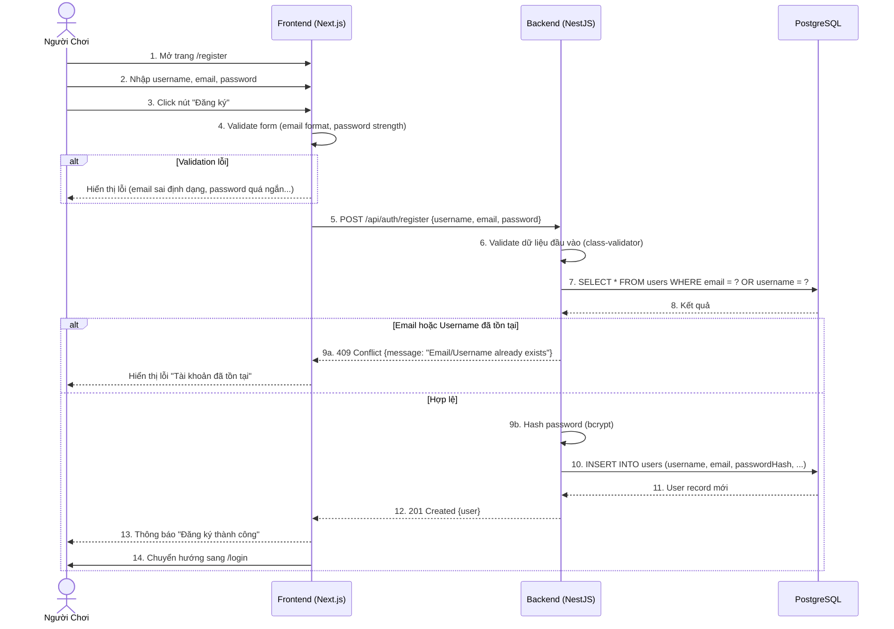
```mermaid
sequenceDiagram
 actor Player as Người Chơi
 participant FE as Frontend (Next.js)
 participant BE as Backend (NestJS)
 participant PG as PostgreSQL

 Player->>FE: 1. Mở trang /register
 Player->>FE: 2. Nhập username, email, password
 Player->>FE: 3. Click nút "Đăng ký"

 FE->>FE: 4. Validate form (email format, password strength)
 alt Validation lỗi
 FE-->>Player: Hiển thị lỗi (email sai định dạng, password quá ngắn...)
 end

 FE->>BE: 5. POST /api/auth/register {username, email, password}
 BE->>BE: 6. Validate dữ liệu đầu vào (class-validator)
 BE->>PG: 7. SELECT * FROM users WHERE email = ? OR username = ?
 PG-->>BE: 8. Kết quả

 alt Email hoặc Username đã tồn tại
 BE-->>FE: 9a. 409 Conflict {message: "Email/Username already exists"}
 FE-->>Player: Hiển thị lỗi "Tài khoản đã tồn tại"
 else Hợp lệ
 BE->>BE: 9b. Hash password (bcrypt)
 BE->>PG: 10. INSERT INTO users (username, email, passwordHash, ...)
 PG-->>BE: 11. User record mới
 BE-->>FE: 12. 201 Created {user}
 FE-->>Player: 13. Thông báo "Đăng ký thành công"
 FE->>Player: 14. Chuyển hướng sang /login
 end
```

### UC-A02: Đăng Nhập

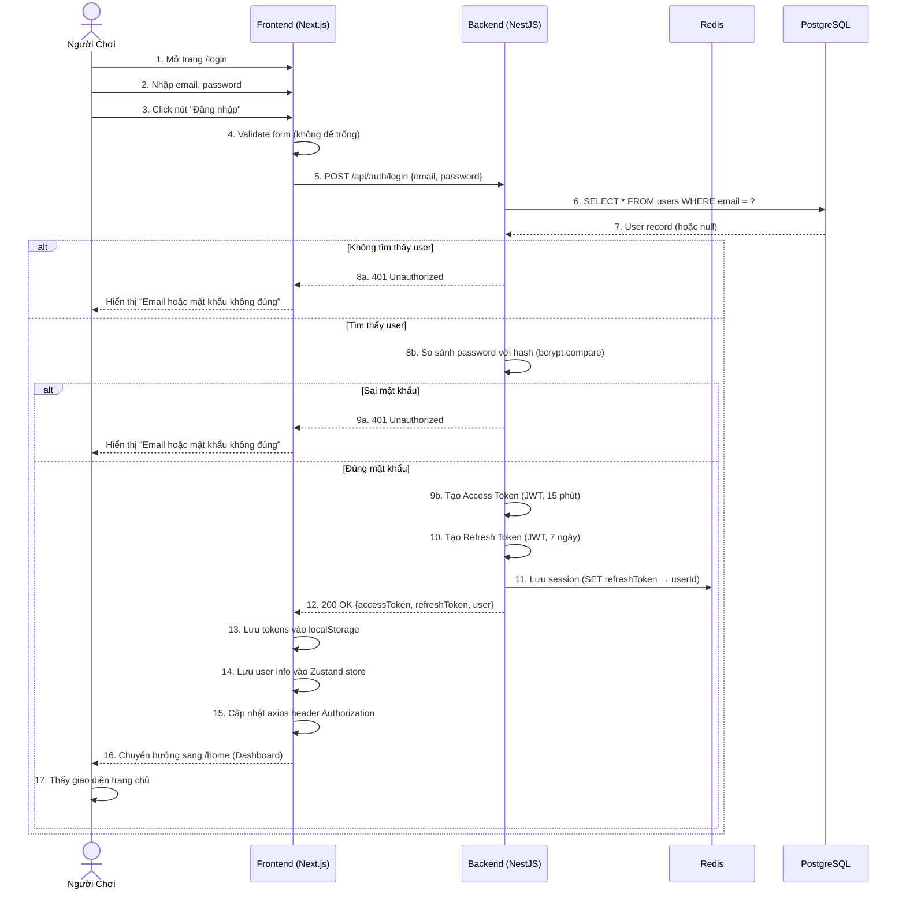
```mermaid
sequenceDiagram
 actor Player as Người Chơi
 participant FE as Frontend (Next.js)
 participant BE as Backend (NestJS)
 participant Redis as Redis
 participant PG as PostgreSQL

 Player->>FE: 1. Mở trang /login
 Player->>FE: 2. Nhập email, password
 Player->>FE: 3. Click nút "Đăng nhập"

 FE->>FE: 4. Validate form (không để trống)
 FE->>BE: 5. POST /api/auth/login {email, password}

 BE->>PG: 6. SELECT * FROM users WHERE email = ?
 PG-->>BE: 7. User record (hoặc null)

 alt Không tìm thấy user
 BE-->>FE: 8a. 401 Unauthorized
 FE-->>Player: Hiển thị "Email hoặc mật khẩu không đúng"
 else Tìm thấy user
 BE->>BE: 8b. So sánh password với hash (bcrypt.compare)

 alt Sai mật khẩu
 BE-->>FE: 9a. 401 Unauthorized
 FE-->>Player: Hiển thị "Email hoặc mật khẩu không đúng"
 else Đúng mật khẩu
 BE->>BE: 9b. Tạo Access Token (JWT, 15 phút)
 BE->>BE: 10. Tạo Refresh Token (JWT, 7 ngày)
 BE->>Redis: 11. Lưu session (SET refreshToken → userId)
 BE-->>FE: 12. 200 OK {accessToken, refreshToken, user}

 FE->>FE: 13. Lưu tokens vào localStorage
 FE->>FE: 14. Lưu user info vào Zustand store
 FE->>FE: 15. Cập nhật axios header Authorization

 FE-->>Player: 16. Chuyển hướng sang /home (Dashboard)
 Player->>Player: 17. Thấy giao diện trang chủ
 end
 end
```

### UC-A03: Refresh Token

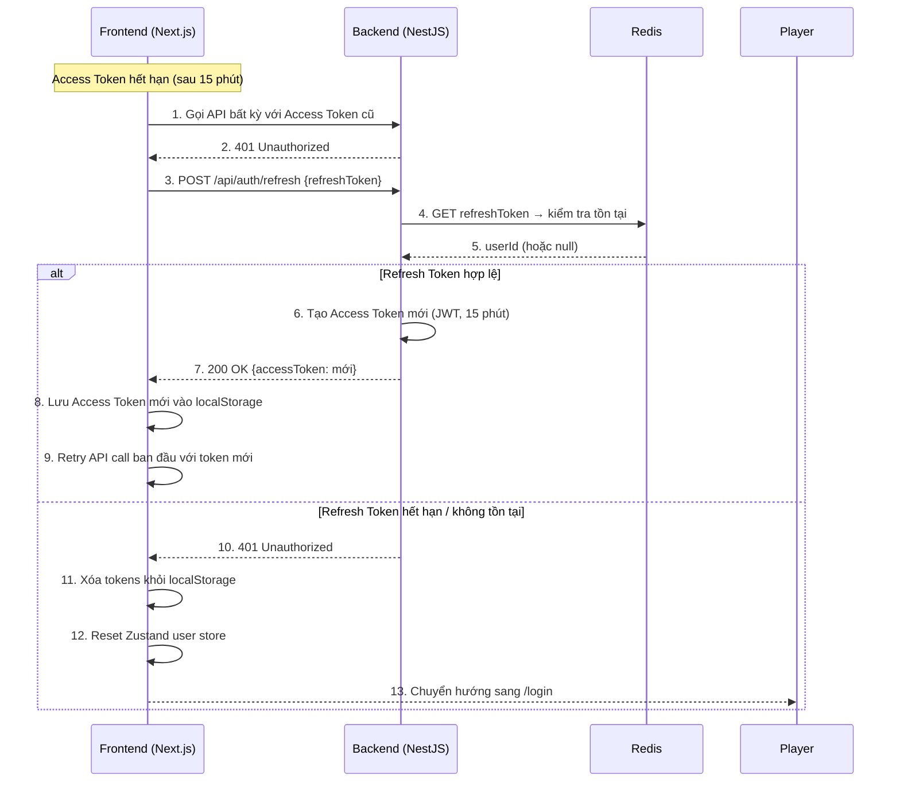
```mermaid
sequenceDiagram
 participant FE as Frontend (Next.js)
 participant BE as Backend (NestJS)
 participant Redis as Redis

 Note over FE: Access Token hết hạn (sau 15 phút)
 FE->>BE: 1. Gọi API bất kỳ với Access Token cũ
 BE-->>FE: 2. 401 Unauthorized

 FE->>BE: 3. POST /api/auth/refresh {refreshToken}
 BE->>Redis: 4. GET refreshToken → kiểm tra tồn tại
 Redis-->>BE: 5. userId (hoặc null)

 alt Refresh Token hợp lệ
 BE->>BE: 6. Tạo Access Token mới (JWT, 15 phút)
 BE-->>FE: 7. 200 OK {accessToken: mới}
 FE->>FE: 8. Lưu Access Token mới vào localStorage
 FE->>FE: 9. Retry API call ban đầu với token mới
 else Refresh Token hết hạn / không tồn tại
 BE-->>FE: 10. 401 Unauthorized
 FE->>FE: 11. Xóa tokens khỏi localStorage
 FE->>FE: 12. Reset Zustand user store
 FE-->>Player: 13. Chuyển hướng sang /login
 end
```

---

## 2. Ghép Trận & Chơi Cờ (Matchmaking & Game Play)

### UC-G01: Ghép Trận Tự Động (ELO-Based Matchmaking)

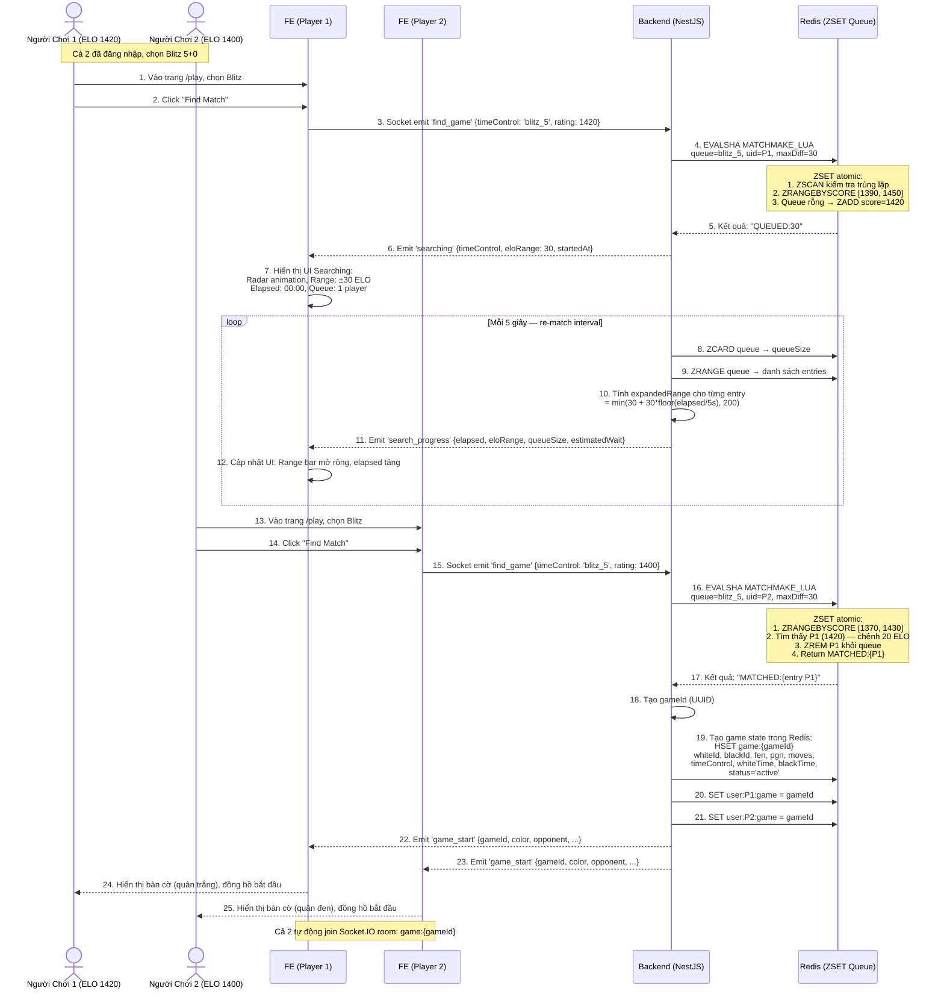
```mermaid
sequenceDiagram
 actor P1 as Người Chơi 1 (ELO 1420)
 actor P2 as Người Chơi 2 (ELO 1400)
 participant FE1 as FE (Player 1)
 participant FE2 as FE (Player 2)
 participant BE as Backend (NestJS)
 participant Redis as Redis (ZSET Queue)

 Note over P1, P2: Cả 2 đã đăng nhập, chọn Blitz 5+0

 %% Player 1 vào hàng đợi
 P1->>FE1: 1. Vào trang /play, chọn Blitz
 P1->>FE1: 2. Click "Find Match"
 FE1->>BE: 3. Socket emit 'find_game' {timeControl: 'blitz_5', rating: 1420}

 BE->>Redis: 4. EVALSHA MATCHMAKE_LUA<br/>queue=blitz_5, uid=P1, maxDiff=30
 Note over Redis: ZSET atomic:<br/>1. ZSCAN kiểm tra trùng lặp<br/>2. ZRANGEBYSCORE [1390, 1450]<br/>3. Queue rỗng → ZADD score=1420
 Redis-->>BE: 5. Kết quả: "QUEUED:30"

 BE-->>FE1: 6. Emit 'searching' {timeControl, eloRange: 30, startedAt}
 FE1->>FE1: 7. Hiển thị UI Searching:<br/>Radar animation, Range: ±30 ELO<br/>Elapsed: 00:00, Queue: 1 player

 %% Server periodic re-match (mỗi 5s)
 loop Mỗi 5 giây — re-match interval
  BE->>Redis: 8. ZCARD queue → queueSize
  BE->>Redis: 9. ZRANGE queue → danh sách entries
  BE->>BE: 10. Tính expandedRange cho từng entry<br/>= min(30 + 30*floor(elapsed/5s), 200)
  BE-->>FE1: 11. Emit 'search_progress' {elapsed, eloRange, queueSize, estimatedWait}
  FE1->>FE1: 12. Cập nhật UI: Range bar mở rộng, elapsed tăng
 end

 %% Player 2 vào hàng đợi
 P2->>FE2: 13. Vào trang /play, chọn Blitz
 P2->>FE2: 14. Click "Find Match"
 FE2->>BE: 15. Socket emit 'find_game' {timeControl: 'blitz_5', rating: 1400}

 BE->>Redis: 16. EVALSHA MATCHMAKE_LUA<br/>queue=blitz_5, uid=P2, maxDiff=30
 Note over Redis: ZSET atomic:<br/>1. ZRANGEBYSCORE [1370, 1430]<br/>2. Tìm thấy P1 (1420) — chênh 20 ELO<br/>3. ZREM P1 khỏi queue<br/>4. Return MATCHED:{P1}
 Redis-->>BE: 17. Kết quả: "MATCHED:{entry P1}"

 %% Server tạo game
 BE->>BE: 18. Tạo gameId (UUID)
 BE->>Redis: 19. Tạo game state trong Redis:<br/>HSET game:{gameId}<br/> whiteId, blackId, fen, pgn, moves,<br/> timeControl, whiteTime, blackTime,<br/> status='active'
 BE->>Redis: 20. SET user:P1:game = gameId
 BE->>Redis: 21. SET user:P2:game = gameId

 %% Thông báo cho cả 2
 BE-->>FE1: 22. Emit 'game_start' {gameId, color, opponent, ...}
 BE-->>FE2: 23. Emit 'game_start' {gameId, color, opponent, ...}

 FE1-->>P1: 24. Hiển thị bàn cờ (quân trắng), đồng hồ bắt đầu
 FE2-->>P2: 25. Hiển thị bàn cờ (quân đen), đồng hồ bắt đầu

 Note over FE1, FE2: Cả 2 tự động join Socket.IO room: game:{gameId}
```

**Điểm khác biệt so với thuật toán cũ:**
- Queue dùng **ZSET** (sorted set) thay vì List, index theo rating
- **ZRANGEBYSCORE** tìm đối thủ trong phạm vi ELO thay vì LPOP (FIFO)
- **Server-driven re-match**: Mỗi 5 giây, server tự động thử ghép lại với phạm vi ELO mở rộng
- Client nhận `search_progress` để cập nhật UI (elapsed time, ELO range bar, queue stats)
- Lua script chọn đối thủ có **rating gần nhất** trong phạm vi, không phải người vào trước

### UC-G02: Đi Cờ (Make Move)

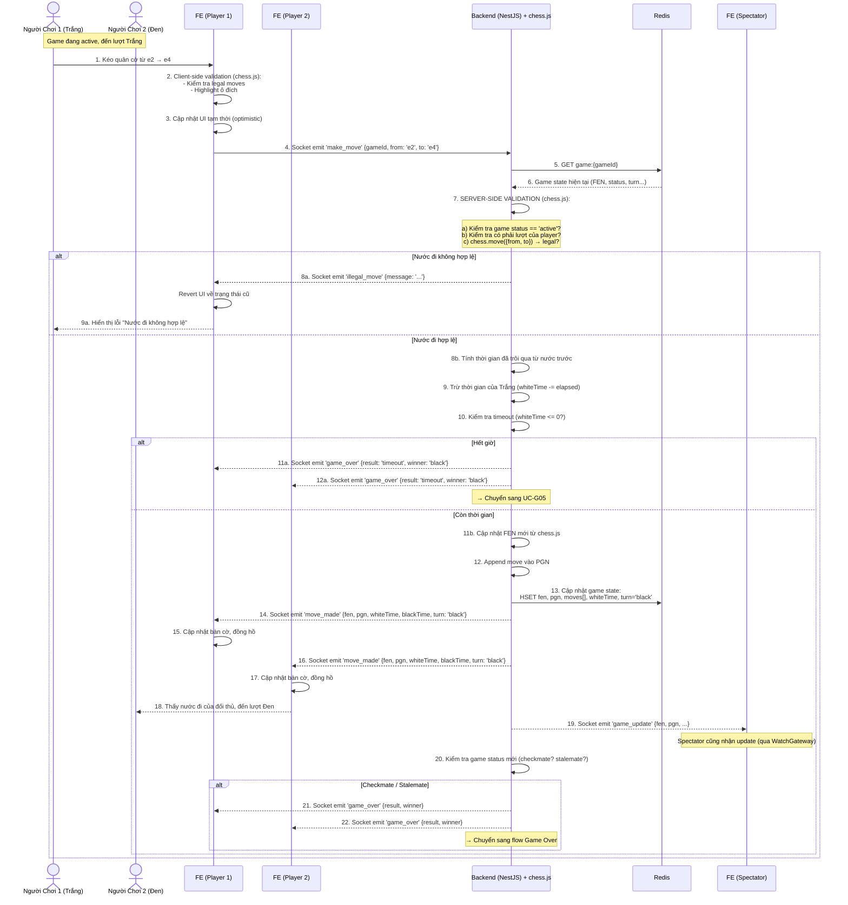
```mermaid
sequenceDiagram
 actor P1 as Người Chơi 1 (Trắng)
 actor P2 as Người Chơi 2 (Đen)
 participant FE1 as FE (Player 1)
 participant FE2 as FE (Player 2)
 participant BE as Backend (NestJS) + chess.js
 participant Redis as Redis
 participant WatchFE as FE (Spectator)

 Note over P1, P2: Game đang active, đến lượt Trắng

 P1->>FE1: 1. Kéo quân cờ từ e2 → e4
 FE1->>FE1: 2. Client-side validation (chess.js):<br/>- Kiểm tra legal moves<br/>- Highlight ô đích
 FE1->>FE1: 3. Cập nhật UI tạm thời (optimistic)
 FE1->>BE: 4. Socket emit 'make_move' {gameId, from: 'e2', to: 'e4'}

 BE->>Redis: 5. GET game:{gameId}
 Redis-->>BE: 6. Game state hiện tại (FEN, status, turn...)

 BE->>BE: 7. SERVER-SIDE VALIDATION (chess.js):
 Note over BE: a) Kiểm tra game status == 'active'?<br/>b) Kiểm tra có phải lượt của player?<br/>c) chess.move({from, to}) → legal?

 alt Nước đi không hợp lệ
 BE-->>FE1: 8a. Socket emit 'illegal_move' {message: '...'}
 FE1->>FE1: Revert UI về trạng thái cũ
 FE1-->>P1: 9a. Hiển thị lỗi "Nước đi không hợp lệ"
 else Nước đi hợp lệ
 BE->>BE: 8b. Tính thời gian đã trôi qua từ nước trước
 BE->>BE: 9. Trừ thời gian của Trắng (whiteTime -= elapsed)
 BE->>BE: 10. Kiểm tra timeout (whiteTime <= 0?)

 alt Hết giờ
 BE-->>FE1: 11a. Socket emit 'game_over' {result: 'timeout', winner: 'black'}
 BE-->>FE2: 12a. Socket emit 'game_over' {result: 'timeout', winner: 'black'}
 Note over BE: → Chuyển sang UC-G05
 else Còn thời gian
 BE->>BE: 11b. Cập nhật FEN mới từ chess.js
 BE->>BE: 12. Append move vào PGN
 BE->>Redis: 13. Cập nhật game state:<br/>HSET fen, pgn, moves[], whiteTime, turn='black'

 BE-->>FE1: 14. Socket emit 'move_made' {fen, pgn, whiteTime, blackTime, turn: 'black'}
 FE1->>FE1: 15. Cập nhật bàn cờ, đồng hồ

 BE-->>FE2: 16. Socket emit 'move_made' {fen, pgn, whiteTime, blackTime, turn: 'black'}
 FE2->>FE2: 17. Cập nhật bàn cờ, đồng hồ
 FE2-->>P2: 18. Thấy nước đi của đối thủ, đến lượt Đen

 BE-->>WatchFE: 19. Socket emit 'game_update' {fen, pgn, ...}
 Note over WatchFE: Spectator cũng nhận update (qua WatchGateway)

 BE->>BE: 20. Kiểm tra game status mới (checkmate? stalemate?)
 alt Checkmate / Stalemate
 BE-->>FE1: 21. Socket emit 'game_over' {result, winner}
 BE-->>FE2: 22. Socket emit 'game_over' {result, winner}
 Note over BE: → Chuyển sang flow Game Over
 end
 end
 end
```

### UC-G03: Đầu Hàng (Resign)

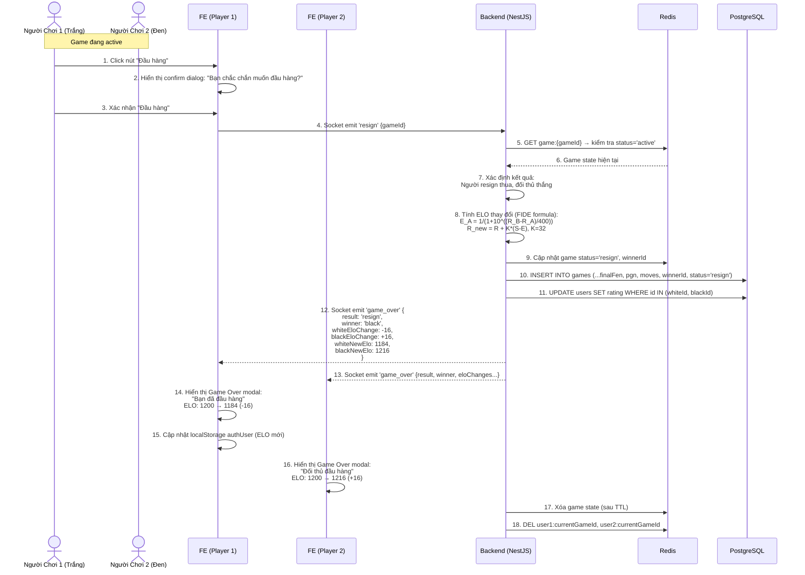
```mermaid
sequenceDiagram
 actor P1 as Người Chơi 1 (Trắng)
 actor P2 as Người Chơi 2 (Đen)
 participant FE1 as FE (Player 1)
 participant FE2 as FE (Player 2)
 participant BE as Backend (NestJS)
 participant Redis as Redis
 participant PG as PostgreSQL

 Note over P1, P2: Game đang active

 P1->>FE1: 1. Click nút "Đầu hàng"
 FE1->>FE1: 2. Hiển thị confirm dialog: "Bạn chắc chắn muốn đầu hàng?"
 P1->>FE1: 3. Xác nhận "Đầu hàng"

 FE1->>BE: 4. Socket emit 'resign' {gameId}

 BE->>Redis: 5. GET game:{gameId} → kiểm tra status='active'
 Redis-->>BE: 6. Game state hiện tại

 BE->>BE: 7. Xác định kết quả:<br/>Người resign thua, đối thủ thắng
 BE->>BE: 8. Tính ELO thay đổi (FIDE formula):<br/>E_A = 1/(1+10^((R_B-R_A)/400))<br/>R_new = R + K*(S-E), K=32

 BE->>Redis: 9. Cập nhật game status='resign', winnerId
 BE->>PG: 10. INSERT INTO games (...finalFen, pgn, moves, winnerId, status='resign')
 BE->>PG: 11. UPDATE users SET rating WHERE id IN (whiteId, blackId)

 BE-->>FE1: 12. Socket emit 'game_over' {<br/> result: 'resign',<br/> winner: 'black',<br/> whiteEloChange: -16,<br/> blackEloChange: +16,<br/> whiteNewElo: 1184,<br/> blackNewElo: 1216<br/>}
 BE-->>FE2: 13. Socket emit 'game_over' {result, winner, eloChanges...}

 FE1->>FE1: 14. Hiển thị Game Over modal:<br/>"Bạn đã đầu hàng"<br/>ELO: 1200 → 1184 (-16)
 FE1->>FE1: 15. Cập nhật localStorage authUser (ELO mới)

 FE2->>FE2: 16. Hiển thị Game Over modal:<br/>"Đối thủ đầu hàng"<br/>ELO: 1200 → 1216 (+16)

 BE->>Redis: 17. Xóa game state (sau TTL)
 BE->>Redis: 18. DEL user1:currentGameId, user2:currentGameId
```

### UC-G04: Đề Nghị & Chấp Nhận Hòa (Draw)

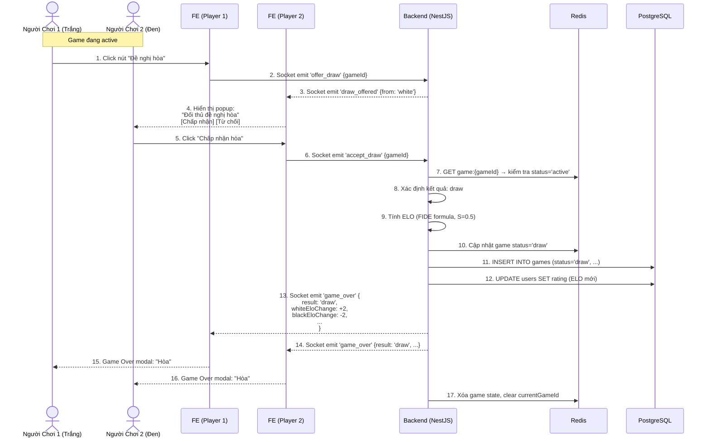
```mermaid
sequenceDiagram
 actor P1 as Người Chơi 1 (Trắng)
 actor P2 as Người Chơi 2 (Đen)
 participant FE1 as FE (Player 1)
 participant FE2 as FE (Player 2)
 participant BE as Backend (NestJS)
 participant Redis as Redis
 participant PG as PostgreSQL

 Note over P1, P2: Game đang active

 %% P1 đề nghị hòa
 P1->>FE1: 1. Click nút "Đề nghị hòa"
 FE1->>BE: 2. Socket emit 'offer_draw' {gameId}
 BE-->>FE2: 3. Socket emit 'draw_offered' {from: 'white'}
 FE2-->>P2: 4. Hiển thị popup:<br/>"Đối thủ đề nghị hòa"<br/>[Chấp nhận] [Từ chối]

 %% P2 chấp nhận
 P2->>FE2: 5. Click "Chấp nhận hòa"
 FE2->>BE: 6. Socket emit 'accept_draw' {gameId}

 BE->>Redis: 7. GET game:{gameId} → kiểm tra status='active'
 BE->>BE: 8. Xác định kết quả: draw
 BE->>BE: 9. Tính ELO (FIDE formula, S=0.5)

 BE->>Redis: 10. Cập nhật game status='draw'
 BE->>PG: 11. INSERT INTO games (status='draw', ...)
 BE->>PG: 12. UPDATE users SET rating (ELO mới)

 BE-->>FE1: 13. Socket emit 'game_over' {<br/> result: 'draw',<br/> whiteEloChange: +2,<br/> blackEloChange: -2,<br/> ...<br/>}
 BE-->>FE2: 14. Socket emit 'game_over' {result: 'draw', ...}

 FE1-->>P1: 15. Game Over modal: "Hòa"
 FE2-->>P2: 16. Game Over modal: "Hòa"

 BE->>Redis: 17. Xóa game state, clear currentGameId
```

### UC-G05: Hết Giờ (Timeout)

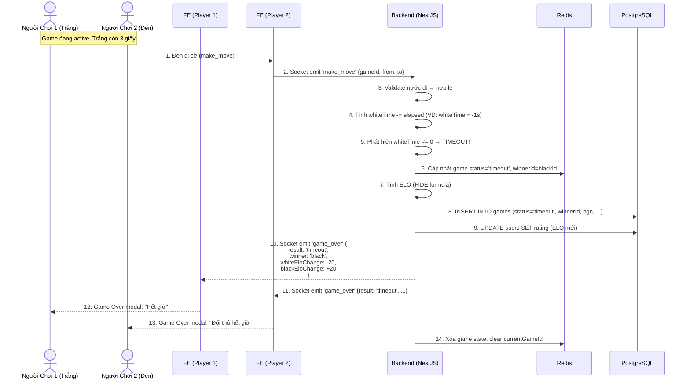
```mermaid
sequenceDiagram
 actor P1 as Người Chơi 1 (Trắng)
 actor P2 as Người Chơi 2 (Đen)
 participant FE1 as FE (Player 1)
 participant FE2 as FE (Player 2)
 participant BE as Backend (NestJS)
 participant Redis as Redis
 participant PG as PostgreSQL

 Note over P1, P2: Game đang active, Trắng còn 3 giây

 P2->>FE2: 1. Đen đi cờ (make_move)
 FE2->>BE: 2. Socket emit 'make_move' {gameId, from, to}

 BE->>BE: 3. Validate nước đi → hợp lệ
 BE->>BE: 4. Tính whiteTime -= elapsed (VD: whiteTime = -1s)
 BE->>BE: 5. Phát hiện whiteTime <= 0 → TIMEOUT!

 BE->>Redis: 6. Cập nhật game status='timeout', winnerId=blackId
 BE->>BE: 7. Tính ELO (FIDE formula)

 BE->>PG: 8. INSERT INTO games (status='timeout', winnerId, pgn, ...)
 BE->>PG: 9. UPDATE users SET rating (ELO mới)

 BE-->>FE1: 10. Socket emit 'game_over' {<br/> result: 'timeout',<br/> winner: 'black',<br/> whiteEloChange: -20,<br/> blackEloChange: +20<br/>}
 BE-->>FE2: 11. Socket emit 'game_over' {result: 'timeout', ...}

 FE1-->>P1: 12. Game Over modal: "Hết giờ"
 FE2-->>P2: 13. Game Over modal: "Đối thủ hết giờ "

 BE->>Redis: 14. Xóa game state, clear currentGameId
```

---

## 3. Chơi Với Bot (Play Bot)

### UC-B01: Chơi Với AI (Stockfish)

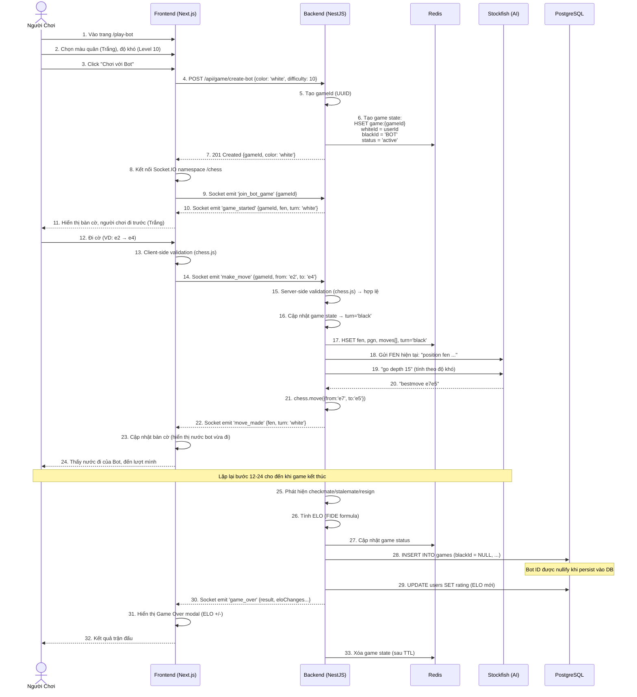
```mermaid
sequenceDiagram
 actor Player as Người Chơi
 participant FE as Frontend (Next.js)
 participant BE as Backend (NestJS)
 participant Redis as Redis
 participant Stockfish as Stockfish (AI)
 participant PG as PostgreSQL

 Player->>FE: 1. Vào trang /play-bot
 Player->>FE: 2. Chọn màu quân (Trắng), độ khó (Level 10)
 Player->>FE: 3. Click "Chơi với Bot"

 FE->>BE: 4. POST /api/game/create-bot {color: 'white', difficulty: 10}
 BE->>BE: 5. Tạo gameId (UUID)
 BE->>Redis: 6. Tạo game state:<br/>HSET game:{gameId}<br/> whiteId = userId<br/> blackId = 'BOT'<br/> status = 'active'
 BE-->>FE: 7. 201 Created {gameId, color: 'white'}

 FE->>FE: 8. Kết nối Socket.IO namespace /chess
 FE->>BE: 9. Socket emit 'join_bot_game' {gameId}
 BE-->>FE: 10. Socket emit 'game_started' {gameId, fen, turn: 'white'}
 FE-->>Player: 11. Hiển thị bàn cờ, người chơi đi trước (Trắng)

 %% Người chơi đi cờ
 Player->>FE: 12. Đi cờ (VD: e2 → e4)
 FE->>FE: 13. Client-side validation (chess.js)
 FE->>BE: 14. Socket emit 'make_move' {gameId, from: 'e2', to: 'e4'}
 BE->>BE: 15. Server-side validation (chess.js) → hợp lệ
 BE->>BE: 16. Cập nhật game state → turn='black'
 BE->>Redis: 17. HSET fen, pgn, moves[], turn='black'

 %% Bot phản hồi
 BE->>Stockfish: 18. Gửi FEN hiện tại: "position fen ..."
 BE->>Stockfish: 19. "go depth 15" (tính theo độ khó)
 Stockfish-->>BE: 20. "bestmove e7e5"
 BE->>BE: 21. chess.move({from:'e7', to:'e5'})

 BE-->>FE: 22. Socket emit 'move_made' {fen, turn: 'white'}
 FE->>FE: 23. Cập nhật bàn cờ (hiển thị nước bot vừa đi)
 FE-->>Player: 24. Thấy nước đi của Bot, đến lượt mình

 Note over Player, Stockfish: Lặp lại bước 12-24 cho đến khi game kết thúc

 %% Game kết thúc
 BE->>BE: 25. Phát hiện checkmate/stalemate/resign
 BE->>BE: 26. Tính ELO (FIDE formula)
 BE->>Redis: 27. Cập nhật game status
 BE->>PG: 28. INSERT INTO games (blackId = NULL, ...)
 Note over PG: Bot ID được nullify khi persist vào DB
 BE->>PG: 29. UPDATE users SET rating (ELO mới)

 BE-->>FE: 30. Socket emit 'game_over' {result, eloChanges...}
 FE->>FE: 31. Hiển thị Game Over modal (ELO +/-)
 FE-->>Player: 32. Kết quả trận đấu

 BE->>Redis: 33. Xóa game state (sau TTL)
```

---

## 4. Giải Đấu (Tournament)

### UC-T01: Tạo Giải Đấu

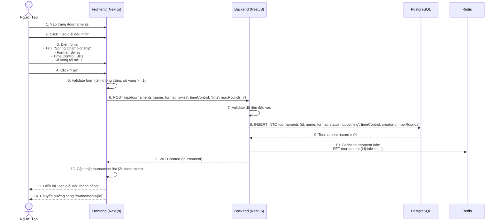
```mermaid
sequenceDiagram
 actor Creator as Người Tạo
 participant FE as Frontend (Next.js)
 participant BE as Backend (NestJS)
 participant PG as PostgreSQL
 participant Redis as Redis

 Creator->>FE: 1. Vào trang /tournaments
 Creator->>FE: 2. Click "Tạo giải đấu mới"
 Creator->>FE: 3. Điền form:<br/>- Tên: "Spring Championship"<br/>- Format: Swiss<br/>- Time Control: Blitz<br/>- Số vòng tối đa: 7
 Creator->>FE: 4. Click "Tạo"

 FE->>FE: 5. Validate form (tên không trống, số vòng >= 1)
 FE->>BE: 6. POST /api/tournaments {name, format: 'swiss', timeControl: 'blitz', maxRounds: 7}

 BE->>BE: 7. Validate dữ liệu đầu vào
 BE->>PG: 8. INSERT INTO tournaments (id, name, format, status='upcoming', timeControl, creatorId, maxRounds)
 PG-->>BE: 9. Tournament record mới
 BE->>Redis: 10. Cache tournament info:<br/>SET tournament:{id}:info = {...}
 BE-->>FE: 11. 201 Created {tournament}

 FE->>FE: 12. Cập nhật tournament list (Zustand store)
 FE-->>Creator: 13. Hiển thị "Tạo giải đấu thành công"
 FE-->>Creator: 14. Chuyển hướng sang /tournaments/[id]
```

### UC-T02: Đăng Ký Tham Gia Giải Đấu

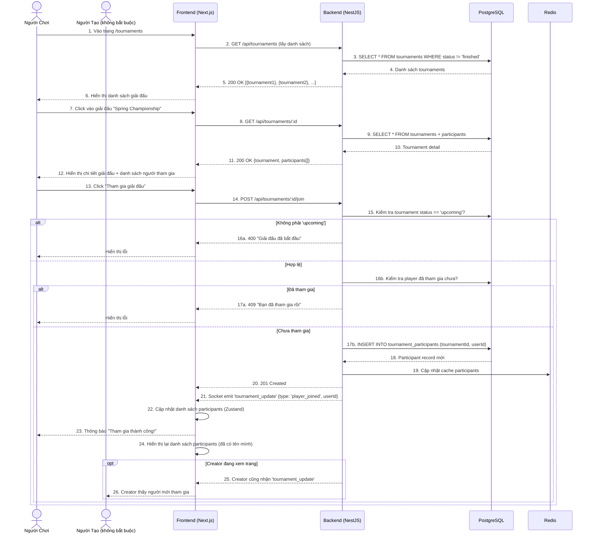
```mermaid
sequenceDiagram
 actor Player as Người Chơi
 actor Creator as Người Tạo (không bắt buộc)
 participant FE as Frontend (Next.js)
 participant BE as Backend (NestJS)
 participant PG as PostgreSQL
 participant Redis as Redis

 Player->>FE: 1. Vào trang /tournaments
 FE->>BE: 2. GET /api/tournaments (lấy danh sách)
 BE->>PG: 3. SELECT * FROM tournaments WHERE status != 'finished'
 PG-->>BE: 4. Danh sách tournaments
 BE-->>FE: 5. 200 OK [{tournament1}, {tournament2}, ...]
 FE-->>Player: 6. Hiển thị danh sách giải đấu

 Player->>FE: 7. Click vào giải đấu "Spring Championship"
 FE->>BE: 8. GET /api/tournaments/:id
 BE->>PG: 9. SELECT * FROM tournaments + participants
 PG-->>BE: 10. Tournament detail
 BE-->>FE: 11. 200 OK {tournament, participants[]}
 FE-->>Player: 12. Hiển thị chi tiết giải đấu + danh sách người tham gia

 Player->>FE: 13. Click "Tham gia giải đấu"
 FE->>BE: 14. POST /api/tournaments/:id/join

 BE->>PG: 15. Kiểm tra tournament status == 'upcoming'?
 alt Không phải 'upcoming'
 BE-->>FE: 16a. 400 "Giải đấu đã bắt đầu"
 FE-->>Player: Hiển thị lỗi
 else Hợp lệ
 BE->>PG: 16b. Kiểm tra player đã tham gia chưa?
 alt Đã tham gia
 BE-->>FE: 17a. 409 "Bạn đã tham gia rồi"
 FE-->>Player: Hiển thị lỗi
 else Chưa tham gia
 BE->>PG: 17b. INSERT INTO tournament_participants (tournamentId, userId)
 PG-->>BE: 18. Participant record mới
 BE->>Redis: 19. Cập nhật cache participants
 BE-->>FE: 20. 201 Created

 %% Real-time notify
 BE-->>FE: 21. Socket emit 'tournament_update' {type: 'player_joined', userId}
 FE->>FE: 22. Cập nhật danh sách participants (Zustand)

 FE-->>Player: 23. Thông báo "Tham gia thành công!"
 FE->>FE: 24. Hiển thị lại danh sách participants (đã có tên mình)

 opt Creator đang xem trang
 BE-->>FE: 25. Creator cũng nhận 'tournament_update'
 FE-->>Creator: 26. Creator thấy người mới tham gia
 end
 end
 end
```

### UC-T03: Bắt Đầu Giải Đấu

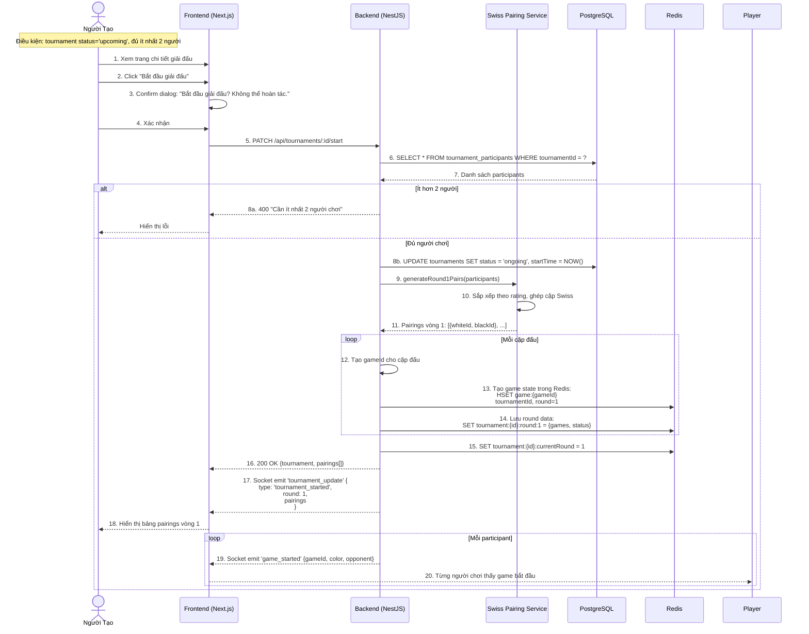
```mermaid
sequenceDiagram
 actor Creator as Người Tạo
 participant FE as Frontend (Next.js)
 participant BE as Backend (NestJS)
 participant SwissService as Swiss Pairing Service
 participant PG as PostgreSQL
 participant Redis as Redis

 Note over Creator: Điều kiện: tournament status='upcoming', đủ ít nhất 2 người

 Creator->>FE: 1. Xem trang chi tiết giải đấu
 Creator->>FE: 2. Click "Bắt đầu giải đấu"
 FE->>FE: 3. Confirm dialog: "Bắt đầu giải đấu? Không thể hoàn tác."

 Creator->>FE: 4. Xác nhận
 FE->>BE: 5. PATCH /api/tournaments/:id/start

 BE->>PG: 6. SELECT * FROM tournament_participants WHERE tournamentId = ?
 PG-->>BE: 7. Danh sách participants

 alt Ít hơn 2 người
 BE-->>FE: 8a. 400 "Cần ít nhất 2 người chơi"
 FE-->>Creator: Hiển thị lỗi
 else Đủ người chơi
 BE->>PG: 8b. UPDATE tournaments SET status = 'ongoing', startTime = NOW()
 BE->>SwissService: 9. generateRound1Pairs(participants)
 SwissService->>SwissService: 10. Sắp xếp theo rating, ghép cặp Swiss
 SwissService-->>BE: 11. Pairings vòng 1: [{whiteId, blackId}, ...]

 loop Mỗi cặp đấu
 BE->>BE: 12. Tạo gameId cho cặp đấu
 BE->>Redis: 13. Tạo game state trong Redis:<br/>HSET game:{gameId}<br/> tournamentId, round=1
 BE->>Redis: 14. Lưu round data:<br/>SET tournament:{id}:round:1 = {games, status}
 end

 BE->>Redis: 15. SET tournament:{id}:currentRound = 1
 BE-->>FE: 16. 200 OK {tournament, pairings[]}

 BE-->>FE: 17. Socket emit 'tournament_update' {<br/> type: 'tournament_started',<br/> round: 1,<br/> pairings<br/>}
 FE-->>Creator: 18. Hiển thị bảng pairings vòng 1

 %% Notify tất cả participants
 loop Mỗi participant
 BE-->>FE: 19. Socket emit 'game_started' {gameId, color, opponent}
 FE-->>Player: 20. Từng người chơi thấy game bắt đầu
 end
 end
```

### UC-T04: Chơi Trận Trong Giải Đấu

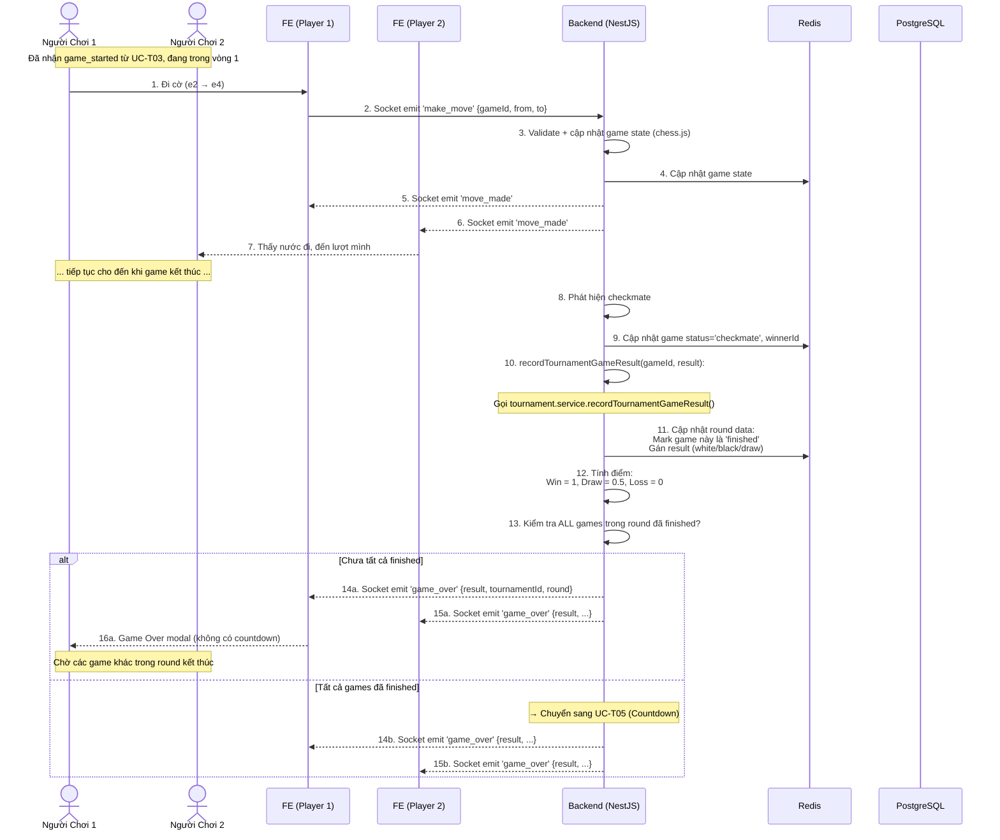
```mermaid
sequenceDiagram
 actor P1 as Người Chơi 1
 actor P2 as Người Chơi 2
 participant FE1 as FE (Player 1)
 participant FE2 as FE (Player 2)
 participant BE as Backend (NestJS)
 participant Redis as Redis
 participant PG as PostgreSQL

 Note over P1, P2: Đã nhận game_started từ UC-T03, đang trong vòng 1

 %% Game diễn ra bình thường (giống UC-G02)
 P1->>FE1: 1. Đi cờ (e2 → e4)
 FE1->>BE: 2. Socket emit 'make_move' {gameId, from, to}
 BE->>BE: 3. Validate + cập nhật game state (chess.js)
 BE->>Redis: 4. Cập nhật game state
 BE-->>FE1: 5. Socket emit 'move_made'
 BE-->>FE2: 6. Socket emit 'move_made'
 FE2-->>P2: 7. Thấy nước đi, đến lượt mình

 Note over P1, P2: ... tiếp tục cho đến khi game kết thúc ...

 %% Game kết thúc
 BE->>BE: 8. Phát hiện checkmate
 BE->>Redis: 9. Cập nhật game status='checkmate', winnerId

 %% GHI tournament result (KHÁC BIỆT so với game thường)
 BE->>BE: 10. recordTournamentGameResult(gameId, result):
 Note over BE: Gọi tournament.service.recordTournamentGameResult()
 BE->>Redis: 11. Cập nhật round data:<br/>Mark game này là 'finished'<br/>Gán result (white/black/draw)
 BE->>BE: 12. Tính điểm:<br/>Win = 1, Draw = 0.5, Loss = 0

 BE->>BE: 13. Kiểm tra ALL games trong round đã finished?

 alt Chưa tất cả finished
 BE-->>FE1: 14a. Socket emit 'game_over' {result, tournamentId, round}
 BE-->>FE2: 15a. Socket emit 'game_over' {result, ...}
 FE1-->>P1: 16a. Game Over modal (không có countdown)
 Note over P1, P2: Chờ các game khác trong round kết thúc
 else Tất cả games đã finished
 Note over BE: → Chuyển sang UC-T05 (Countdown)
 BE-->>FE1: 14b. Socket emit 'game_over' {result, ...}
 BE-->>FE2: 15b. Socket emit 'game_over' {result, ...}
 end
```

### UC-T05: Hoàn Thành Vòng & Countdown 30s

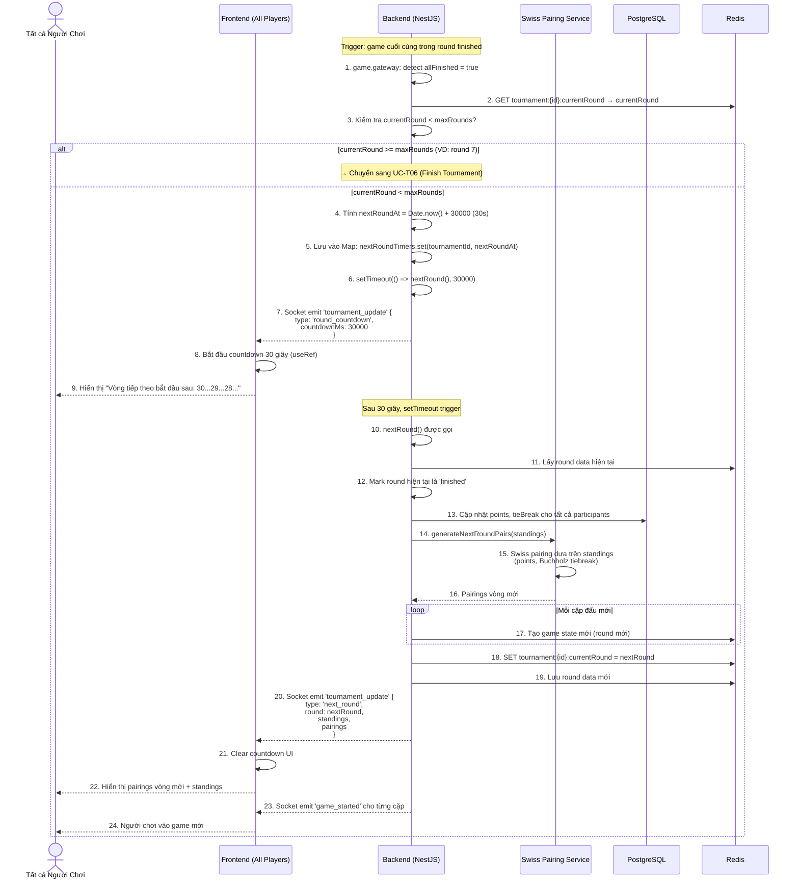
```mermaid
sequenceDiagram
 actor AllPlayers as Tất cả Người Chơi
 participant FE as Frontend (All Players)
 participant BE as Backend (NestJS)
 participant SwissService as Swiss Pairing Service
 participant PG as PostgreSQL
 participant Redis as Redis

 Note over BE: Trigger: game cuối cùng trong round finished

 BE->>BE: 1. game.gateway: detect allFinished = true
 BE->>Redis: 2. GET tournament:{id}:currentRound → currentRound
 BE->>BE: 3. Kiểm tra currentRound < maxRounds?

 alt currentRound >= maxRounds (VD: round 7)
 Note over BE: → Chuyển sang UC-T06 (Finish Tournament)
 else currentRound < maxRounds
 BE->>BE: 4. Tính nextRoundAt = Date.now() + 30000 (30s)
 BE->>BE: 5. Lưu vào Map: nextRoundTimers.set(tournamentId, nextRoundAt)
 BE->>BE: 6. setTimeout(() => nextRound(), 30000)

 BE-->>FE: 7. Socket emit 'tournament_update' {<br/> type: 'round_countdown',<br/> countdownMs: 30000<br/>}
 FE->>FE: 8. Bắt đầu countdown 30 giây (useRef)
 FE-->>AllPlayers: 9. Hiển thị "Vòng tiếp theo bắt đầu sau: 30...29...28..."

 Note over BE: Sau 30 giây, setTimeout trigger

 BE->>BE: 10. nextRound() được gọi
 BE->>Redis: 11. Lấy round data hiện tại
 BE->>BE: 12. Mark round hiện tại là 'finished'
 BE->>PG: 13. Cập nhật points, tieBreak cho tất cả participants
 BE->>SwissService: 14. generateNextRoundPairs(standings)
 SwissService->>SwissService: 15. Swiss pairing dựa trên standings<br/>(points, Buchholz tiebreak)
 SwissService-->>BE: 16. Pairings vòng mới

 loop Mỗi cặp đấu mới
 BE->>Redis: 17. Tạo game state mới (round mới)
 end

 BE->>Redis: 18. SET tournament:{id}:currentRound = nextRound
 BE->>Redis: 19. Lưu round data mới

 BE-->>FE: 20. Socket emit 'tournament_update' {<br/> type: 'next_round',<br/> round: nextRound,<br/> standings,<br/> pairings<br/>}
 FE->>FE: 21. Clear countdown UI
 FE-->>AllPlayers: 22. Hiển thị pairings vòng mới + standings

 BE-->>FE: 23. Socket emit 'game_started' cho từng cặp
 FE-->>AllPlayers: 24. Người chơi vào game mới
 end
```

### UC-T06: Kết Thúc Giải Đấu

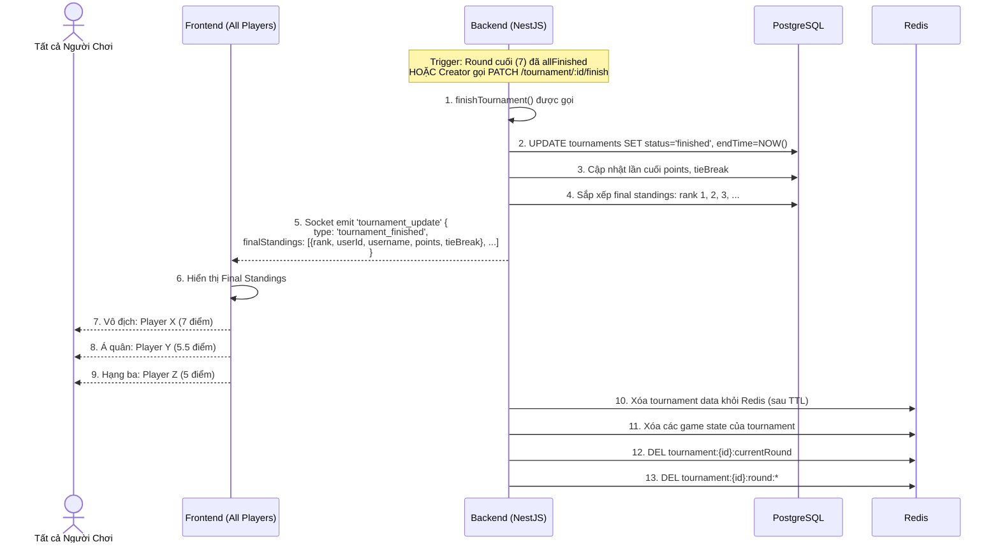
```mermaid
sequenceDiagram
 actor AllPlayers as Tất cả Người Chơi
 participant FE as Frontend (All Players)
 participant BE as Backend (NestJS)
 participant PG as PostgreSQL
 participant Redis as Redis

 Note over BE: Trigger: Round cuối (7) đã allFinished<br/>HOẶC Creator gọi PATCH /tournament/:id/finish

 BE->>BE: 1. finishTournament() được gọi
 BE->>PG: 2. UPDATE tournaments SET status='finished', endTime=NOW()
 BE->>PG: 3. Cập nhật lần cuối points, tieBreak
 BE->>PG: 4. Sắp xếp final standings: rank 1, 2, 3, ...

 BE-->>FE: 5. Socket emit 'tournament_update' {<br/> type: 'tournament_finished',<br/> finalStandings: [{rank, userId, username, points, tieBreak}, ...]<br/>}

 FE->>FE: 6. Hiển thị Final Standings
 FE-->>AllPlayers: 7. Vô địch: Player X (7 điểm)
 FE-->>AllPlayers: 8. Á quân: Player Y (5.5 điểm)
 FE-->>AllPlayers: 9. Hạng ba: Player Z (5 điểm)

 BE->>Redis: 10. Xóa tournament data khỏi Redis (sau TTL)
 BE->>Redis: 11. Xóa các game state của tournament
 BE->>Redis: 12. DEL tournament:{id}:currentRound
 BE->>Redis: 13. DEL tournament:{id}:round:*
```

---

## 5. Xem Trận Đấu (Spectator)

### UC-W01: Xem Trận Đấu Trực Tiếp

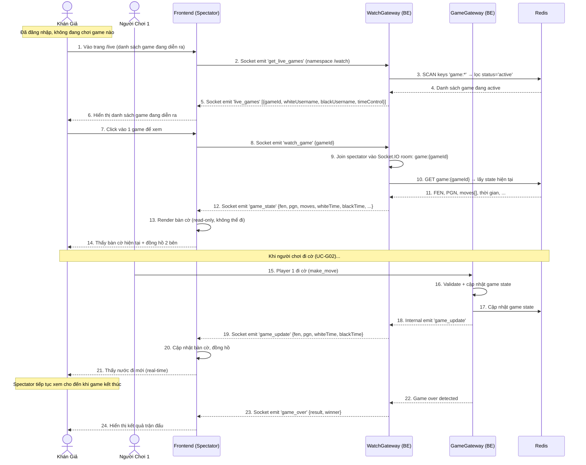
```mermaid
sequenceDiagram
 actor Spectator as Khán Giả
 actor P1 as Người Chơi 1
 participant FE as Frontend (Spectator)
 participant WatchBE as WatchGateway (BE)
 participant GameBE as GameGateway (BE)
 participant Redis as Redis

 Note over Spectator: Đã đăng nhập, không đang chơi game nào

 Spectator->>FE: 1. Vào trang /live (danh sách game đang diễn ra)
 FE->>WatchBE: 2. Socket emit 'get_live_games' (namespace /watch)
 WatchBE->>Redis: 3. SCAN keys 'game:*' → lọc status='active'
 Redis-->>WatchBE: 4. Danh sách game đang active
 WatchBE-->>FE: 5. Socket emit 'live_games' [{gameId, whiteUsername, blackUsername, timeControl}]
 FE-->>Spectator: 6. Hiển thị danh sách game đang diễn ra

 Spectator->>FE: 7. Click vào 1 game để xem
 FE->>WatchBE: 8. Socket emit 'watch_game' {gameId}
 WatchBE->>WatchBE: 9. Join spectator vào Socket.IO room: game:{gameId}
 WatchBE->>Redis: 10. GET game:{gameId} → lấy state hiện tại
 Redis-->>WatchBE: 11. FEN, PGN, moves[], thời gian, ...
 WatchBE-->>FE: 12. Socket emit 'game_state' {fen, pgn, moves, whiteTime, blackTime, ...}
 FE->>FE: 13. Render bàn cờ (read-only, không thể đi)
 FE-->>Spectator: 14. Thấy bàn cờ hiện tại + đồng hồ 2 bên

 Note over Spectator, Redis: Khi người chơi đi cờ (UC-G02)...

 P1->>GameBE: 15. Player 1 đi cờ (make_move)
 GameBE->>GameBE: 16. Validate + cập nhật game state
 GameBE->>Redis: 17. Cập nhật game state
 GameBE-->>WatchBE: 18. Internal emit 'game_update'
 WatchBE-->>FE: 19. Socket emit 'game_update' {fen, pgn, whiteTime, blackTime}
 FE->>FE: 20. Cập nhật bàn cờ, đồng hồ
 FE-->>Spectator: 21. Thấy nước đi mới (real-time)

 Note over Spectator: Spectator tiếp tục xem cho đến khi game kết thúc

 GameBE-->>WatchBE: 22. Game over detected
 WatchBE-->>FE: 23. Socket emit 'game_over' {result, winner}
 FE-->>Spectator: 24. Hiển thị kết quả trận đấu
```

---

## 6. Chat

### UC-C01: Chat Trực Tiếp 1-1 (Room-based)

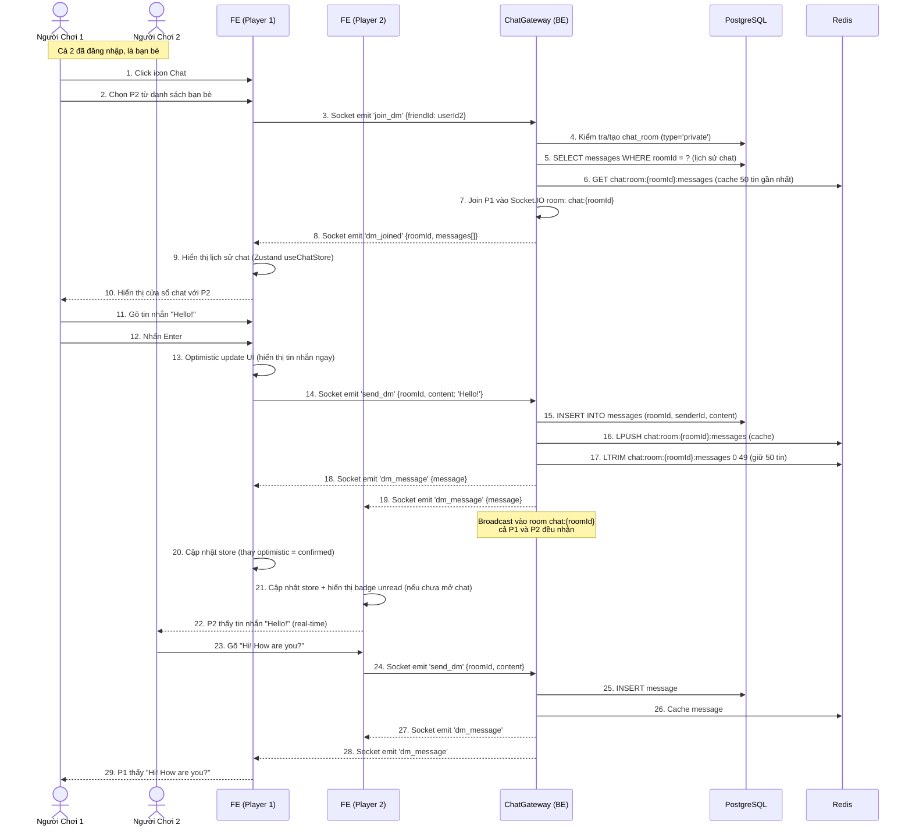
```mermaid
sequenceDiagram
 actor P1 as Người Chơi 1
 actor P2 as Người Chơi 2
 participant FE1 as FE (Player 1)
 participant FE2 as FE (Player 2)
 participant ChatBE as ChatGateway (BE)
 participant PG as PostgreSQL
 participant Redis as Redis

 Note over P1, P2: Cả 2 đã đăng nhập, là bạn bè

 %% P1 mở chat với P2
 P1->>FE1: 1. Click icon Chat
 P1->>FE1: 2. Chọn P2 từ danh sách bạn bè

 FE1->>ChatBE: 3. Socket emit 'join_dm' {friendId: userId2}
 ChatBE->>PG: 4. Kiểm tra/tạo chat_room (type='private')
 ChatBE->>PG: 5. SELECT messages WHERE roomId = ? (lịch sử chat)
 ChatBE->>Redis: 6. GET chat:room:{roomId}:messages (cache 50 tin gần nhất)
 ChatBE->>ChatBE: 7. Join P1 vào Socket.IO room: chat:{roomId}
 ChatBE-->>FE1: 8. Socket emit 'dm_joined' {roomId, messages[]}
 FE1->>FE1: 9. Hiển thị lịch sử chat (Zustand useChatStore)
 FE1-->>P1: 10. Hiển thị cửa sổ chat với P2

 %% P1 gửi tin nhắn
 P1->>FE1: 11. Gõ tin nhắn "Hello!"
 P1->>FE1: 12. Nhấn Enter

 FE1->>FE1: 13. Optimistic update UI (hiển thị tin nhắn ngay)
 FE1->>ChatBE: 14. Socket emit 'send_dm' {roomId, content: 'Hello!'}

 ChatBE->>PG: 15. INSERT INTO messages (roomId, senderId, content)
 ChatBE->>Redis: 16. LPUSH chat:room:{roomId}:messages (cache)
 ChatBE->>Redis: 17. LTRIM chat:room:{roomId}:messages 0 49 (giữ 50 tin)

 ChatBE-->>FE1: 18. Socket emit 'dm_message' {message}
 ChatBE-->>FE2: 19. Socket emit 'dm_message' {message}
 Note over ChatBE: Broadcast vào room chat:{roomId}<br/>cả P1 và P2 đều nhận

 FE1->>FE1: 20. Cập nhật store (thay optimistic = confirmed)
 FE2->>FE2: 21. Cập nhật store + hiển thị badge unread (nếu chưa mở chat)
 FE2-->>P2: 22. P2 thấy tin nhắn "Hello!" (real-time)

 %% P2 gửi phản hồi
 P2->>FE2: 23. Gõ "Hi! How are you?"
 FE2->>ChatBE: 24. Socket emit 'send_dm' {roomId, content}
 ChatBE->>PG: 25. INSERT message
 ChatBE->>Redis: 26. Cache message
 ChatBE-->>FE2: 27. Socket emit 'dm_message'
 ChatBE-->>FE1: 28. Socket emit 'dm_message'
 FE1-->>P1: 29. P1 thấy "Hi! How are you?"
```

### UC-C02: Chat Trực Tiếp 1-1 (Direct/Redis-based)

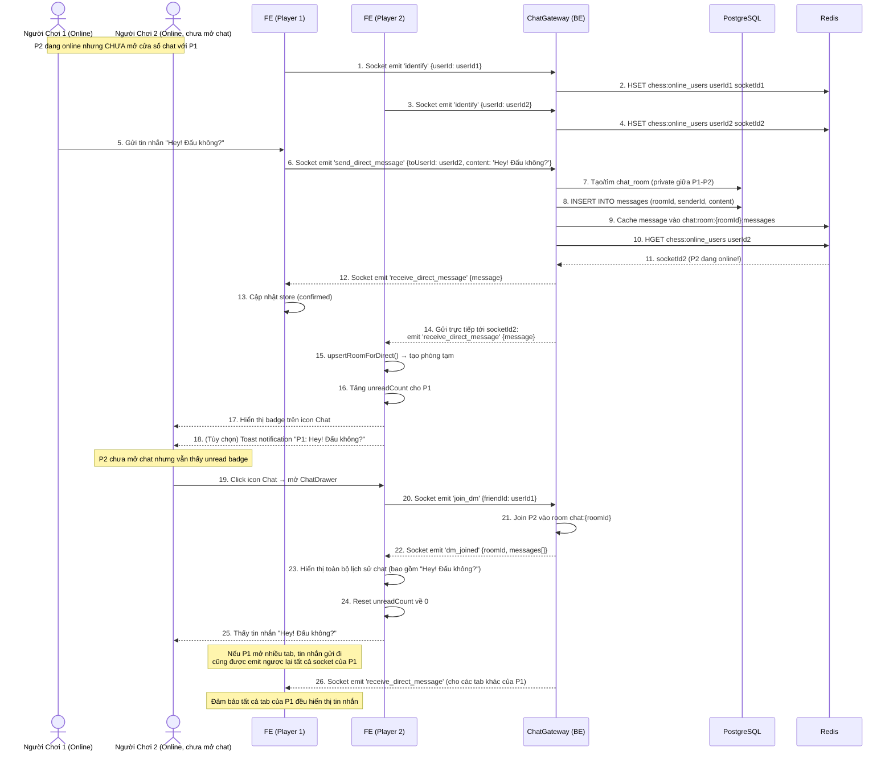
```mermaid
sequenceDiagram
 actor P1 as Người Chơi 1 (Online)
 actor P2 as Người Chơi 2 (Online, chưa mở chat)
 participant FE1 as FE (Player 1)
 participant FE2 as FE (Player 2)
 participant ChatBE as ChatGateway (BE)
 participant PG as PostgreSQL
 participant Redis as Redis

 Note over P1, P2: P2 đang online nhưng CHƯA mở cửa sổ chat với P1

 %% Setup: Cả 2 đã identify
 FE1->>ChatBE: 1. Socket emit 'identify' {userId: userId1}
 ChatBE->>Redis: 2. HSET chess:online_users userId1 socketId1
 FE2->>ChatBE: 3. Socket emit 'identify' {userId: userId2}
 ChatBE->>Redis: 4. HSET chess:online_users userId2 socketId2

 %% P1 gửi tin nhắn cho P2 (không join room trước)
 P1->>FE1: 5. Gửi tin nhắn "Hey! Đấu không?"
 FE1->>ChatBE: 6. Socket emit 'send_direct_message' {toUserId: userId2, content: 'Hey! Đấu không?'}

 ChatBE->>PG: 7. Tạo/tìm chat_room (private giữa P1-P2)
 ChatBE->>PG: 8. INSERT INTO messages (roomId, senderId, content)
 ChatBE->>Redis: 9. Cache message vào chat:room:{roomId}:messages
 ChatBE->>Redis: 10. HGET chess:online_users userId2
 Redis-->>ChatBE: 11. socketId2 (P2 đang online!)

 ChatBE-->>FE1: 12. Socket emit 'receive_direct_message' {message}
 FE1->>FE1: 13. Cập nhật store (confirmed)

 ChatBE-->>FE2: 14. Gửi trực tiếp tới socketId2:<br/>emit 'receive_direct_message' {message}
 FE2->>FE2: 15. upsertRoomForDirect() → tạo phòng tạm
 FE2->>FE2: 16. Tăng unreadCount cho P1
 FE2-->>P2: 17. Hiển thị badge trên icon Chat
 FE2-->>P2: 18. (Tùy chọn) Toast notification "P1: Hey! Đấu không?"

 Note over P2: P2 chưa mở chat nhưng vẫn thấy unread badge

 %% P2 mở chat sau đó
 P2->>FE2: 19. Click icon Chat → mở ChatDrawer
 FE2->>ChatBE: 20. Socket emit 'join_dm' {friendId: userId1}
 ChatBE->>ChatBE: 21. Join P2 vào room chat:{roomId}
 ChatBE-->>FE2: 22. Socket emit 'dm_joined' {roomId, messages[]}
 FE2->>FE2: 23. Hiển thị toàn bộ lịch sử chat (bao gồm "Hey! Đấu không?")
 FE2->>FE2: 24. Reset unreadCount về 0
 FE2-->>P2: 25. Thấy tin nhắn "Hey! Đấu không?"

 %% Đồng bộ multi-tab
 Note over FE1: Nếu P1 mở nhiều tab, tin nhắn gửi đi<br/>cũng được emit ngược lại tất cả socket của P1
 ChatBE-->>FE1: 26. Socket emit 'receive_direct_message' (cho các tab khác của P1)
 Note over FE1: Đảm bảo tất cả tab của P1 đều hiển thị tin nhắn
```

### UC-C03: Chat Trong Game (In-Game Chat)

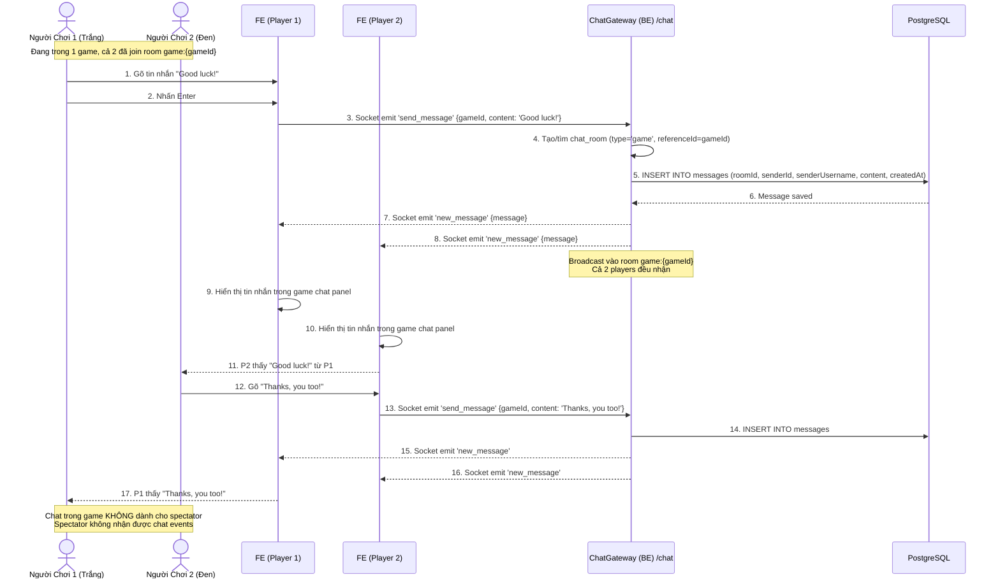
```mermaid
sequenceDiagram
 actor P1 as Người Chơi 1 (Trắng)
 actor P2 as Người Chơi 2 (Đen)
 participant FE1 as FE (Player 1)
 participant FE2 as FE (Player 2)
 participant ChatBE as ChatGateway (BE) /chat
 participant PG as PostgreSQL

 Note over P1, P2: Đang trong 1 game, cả 2 đã join room game:{gameId}

 P1->>FE1: 1. Gõ tin nhắn "Good luck!"
 P1->>FE1: 2. Nhấn Enter

 FE1->>ChatBE: 3. Socket emit 'send_message' {gameId, content: 'Good luck!'}

 ChatBE->>ChatBE: 4. Tạo/tìm chat_room (type='game', referenceId=gameId)
 ChatBE->>PG: 5. INSERT INTO messages (roomId, senderId, senderUsername, content, createdAt)
 PG-->>ChatBE: 6. Message saved

 ChatBE-->>FE1: 7. Socket emit 'new_message' {message}
 ChatBE-->>FE2: 8. Socket emit 'new_message' {message}
 Note over ChatBE: Broadcast vào room game:{gameId}<br/>Cả 2 players đều nhận

 FE1->>FE1: 9. Hiển thị tin nhắn trong game chat panel
 FE2->>FE2: 10. Hiển thị tin nhắn trong game chat panel
 FE2-->>P2: 11. P2 thấy "Good luck!" từ P1

 %% P2 phản hồi
 P2->>FE2: 12. Gõ "Thanks, you too!"
 FE2->>ChatBE: 13. Socket emit 'send_message' {gameId, content: 'Thanks, you too!'}
 ChatBE->>PG: 14. INSERT INTO messages
 ChatBE-->>FE1: 15. Socket emit 'new_message'
 ChatBE-->>FE2: 16. Socket emit 'new_message'
 FE1-->>P1: 17. P1 thấy "Thanks, you too!"

 Note over P1, P2: Chat trong game KHÔNG dành cho spectator<br/>Spectator không nhận được chat events
```

---

## 7. Bảng Xếp Hạng & Bạn Bè (Leaderboard & Friends)

### UC-L01: Xem Bảng Xếp Hạng

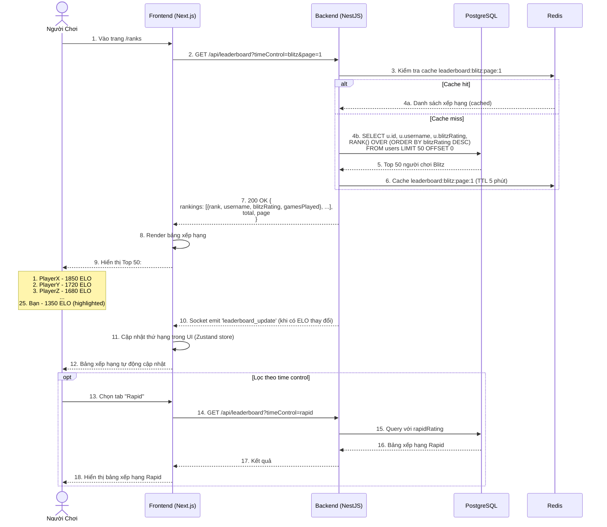
```mermaid
sequenceDiagram
 actor Player as Người Chơi
 participant FE as Frontend (Next.js)
 participant BE as Backend (NestJS)
 participant PG as PostgreSQL
 participant Redis as Redis

 Player->>FE: 1. Vào trang /ranks
 FE->>BE: 2. GET /api/leaderboard?timeControl=blitz&page=1

 BE->>Redis: 3. Kiểm tra cache leaderboard:blitz:page:1
 alt Cache hit
 Redis-->>BE: 4a. Danh sách xếp hạng (cached)
 else Cache miss
 BE->>PG: 4b. SELECT u.id, u.username, u.blitzRating,<br/> RANK() OVER (ORDER BY blitzRating DESC)<br/> FROM users LIMIT 50 OFFSET 0
 PG-->>BE: 5. Top 50 người chơi Blitz
 BE->>Redis: 6. Cache leaderboard:blitz:page:1 (TTL 5 phút)
 end

 BE-->>FE: 7. 200 OK {<br/> rankings: [{rank, username, blitzRating, gamesPlayed}, ...],<br/> total, page<br/>}

 FE->>FE: 8. Render bảng xếp hạng
 FE-->>Player: 9. Hiển thị Top 50:
 Note over Player: 1. PlayerX - 1850 ELO<br/> 2. PlayerY - 1720 ELO<br/> 3. PlayerZ - 1680 ELO<br/>...<br/>25. Bạn - 1350 ELO (highlighted)

 %% Real-time update qua WebSocket
 BE-->>FE: 10. Socket emit 'leaderboard_update' (khi có ELO thay đổi)
 FE->>FE: 11. Cập nhật thứ hạng trong UI (Zustand store)
 FE-->>Player: 12. Bảng xếp hạng tự động cập nhật

 opt Lọc theo time control
 Player->>FE: 13. Chọn tab "Rapid"
 FE->>BE: 14. GET /api/leaderboard?timeControl=rapid
 BE->>PG: 15. Query với rapidRating
 PG-->>BE: 16. Bảng xếp hạng Rapid
 BE-->>FE: 17. Kết quả
 FE-->>Player: 18. Hiển thị bảng xếp hạng Rapid
 end
```

### UC-F01: Gửi & Chấp Nhận Lời Mời Kết Bạn

```mermaid
sequenceDiagram
 actor P1 as Người Chơi 1
 actor P2 as Người Chơi 2
 participant FE1 as FE (Player 1)
 participant FE2 as FE (Player 2)
 participant BE as Backend (NestJS)
 participant PG as PostgreSQL
 participant Redis as Redis

 Note over P1, P2: Cả 2 đã đăng nhập

 %% P1 gửi lời mời
 P1->>FE1: 1. Xem profile của P2 (từ bảng xếp hạng / game)
 P1->>FE1: 2. Click "Gửi lời mời kết bạn"

 FE1->>BE: 3. POST /api/friends/request {toUserId: userId2}

 BE->>PG: 4. Kiểm tra đã có lời mời/friend chưa?
 alt Đã là bạn / đã gửi lời mời
 BE-->>FE1: 5a. 409 Conflict
 FE1-->>P1: Hiển thị lỗi "Đã gửi lời mời rồi"
 else Hợp lệ
 BE->>PG: 5b. INSERT INTO friends (user1Id, user2Id, status='pending')
 PG-->>BE: 6. Friend request created
 BE-->>FE1: 7. 201 Created {status: 'pending'}
 FE1-->>P1: 8. Hiển thị "Đã gửi lời mời kết bạn"

 %% Notify P2
 BE->>Redis: 9. HGET chess:online_users userId2
 Redis-->>BE: 10. socketId2 (nếu online)
 alt P2 đang online
 BE-->>FE2: 11. Socket emit 'friend_request_received' {fromUserId, fromUsername}
 FE2->>FE2: 12. Cập nhật friend store (Zustand)
 FE2-->>P2: 13. Hiển thị badge "Lời mời kết bạn mới từ P1"
 end
 end

 %% P2 chấp nhận
 P2->>FE2: 14. Mở danh sách lời mời kết bạn
 FE2->>BE: 15. GET /api/friends/requests (lấy pending requests)
 BE->>PG: 16. SELECT * FROM friends WHERE user2Id = ? AND status = 'pending'
 PG-->>BE: 17. [{from: P1, status: 'pending'}]
 BE-->>FE2: 18. 200 OK [{request}]
 FE2-->>P2: 19. Hiển thị lời mời từ P1: [Chấp nhận] [Từ chối]

 P2->>FE2: 20. Click "Chấp nhận"
 FE2->>BE: 21. PATCH /api/friends/accept {fromUserId: userId1}

 BE->>PG: 22. UPDATE friends SET status = 'accepted' WHERE user1Id=? AND user2Id=?
 PG-->>BE: 23. Updated
 BE-->>FE2: 24. 200 OK {status: 'accepted'}
 FE2->>FE2: 25. Cập nhật friend store: thêm P1 vào danh sách bạn bè
 FE2-->>P2: 26. "Bạn và P1 đã trở thành bạn bè"

 %% Notify P1
 BE->>Redis: 27. HGET chess:online_users userId1
 alt P1 đang online
 BE-->>FE1: 28. Socket emit 'friend_request_accepted' {byUserId, byUsername}
 FE1->>FE1: 29. Cập nhật friend store
 FE1-->>P1: 30. Thông báo "P2 đã chấp nhận lời mời kết bạn!"
 end

 %% Giờ cả 2 có thể chat với nhau
 Note over P1, P2: P1 và P2 giờ có thể chat 1-1 (UC-C01/UC-C02)
```

---

## Tổng Quan Hệ Thống - Component Diagram

```mermaid
graph TB
 subgraph "Frontend (Next.js + React)"
 UI[React Components]
 Zustand[Zustand Stores]
 SocketClient[Socket.IO Client]
 ChessJS[chess.js Validation]
 StockfishWASM[Stockfish WASM]
 end

 subgraph "Backend (NestJS)"
 AuthController[Auth Controller]
 GameGateway[Game Gateway<br/>namespace: /chess]
 TournamentGateway[Tournament Gateway<br/>namespace: /tournament]
 ChatGateway[Chat Gateway<br/>namespace: /chat]
 WatchGateway[Watch Gateway<br/>namespace: /watch]
 LeaderboardGateway[Leaderboard Gateway]
 GameService[Game Service]
 TournamentService[Tournament Service]
 SwissService[Swiss Pairing Service]
 ChatService[Chat Service]
 AIService[AI Service]
 LeaderboardService[Leaderboard Service]
 RedisModule[Redis Module]
 DrizzleModule[Drizzle Module]
 end

 subgraph "Data Layer"
 Redis[(Redis<br/>Game State<br/>Queue<br/>Cache<br/>Online Users)]
 PostgreSQL[(PostgreSQL<br/>Users<br/>Games<br/>Tournaments<br/>Messages)]
 end

 subgraph "External"
 Stockfish[Stockfish Engine]
 end

 UI --> Zustand
 UI --> SocketClient
 UI --> ChessJS
 SocketClient --> GameGateway
 SocketClient --> TournamentGateway
 SocketClient --> ChatGateway
 SocketClient --> WatchGateway
 SocketClient --> LeaderboardGateway

 GameGateway --> GameService
 GameGateway --> TournamentService
 TournamentGateway --> TournamentService
 ChatGateway --> ChatService
 WatchGateway --> GameService
 LeaderboardGateway --> LeaderboardService

 GameService --> RedisModule
 GameService --> DrizzleModule
 TournamentService --> SwissService
 TournamentService --> RedisModule
 TournamentService --> DrizzleModule
 ChatService --> RedisModule
 ChatService --> DrizzleModule
 AIService --> Stockfish
 LeaderboardService --> DrizzleModule

 RedisModule --> Redis
 DrizzleModule --> PostgreSQL

 AuthController --> DrizzleModule
 AuthController --> RedisModule

 StockfishWASM --> Stockfish
```

---

> **Tài liệu tham khảo**: 
> - [01-project-overview.md](../.claude/rules/01-project-overview.md) — Tổng quan dự án 
> - [04-architecture-realtime.md](../.claude/rules/04-architecture-realtime.md) — Socket.IO Gateways 
> - [05-architecture-matchmaking.md](../.claude/rules/05-architecture-matchmaking.md) — Matchmaking 
> - [06-architecture-game-flow.md](../.claude/rules/06-architecture-game-flow.md) — Game Flow 
> - [07-architecture-tournament.md](../.claude/rules/07-architecture-tournament.md) — Tournament 
> - [13-architecture-chat.md](../.claude/rules/13-architecture-chat.md) — Chat 
> - [10-patterns.md](../.claude/rules/10-patterns.md) — Patterns
