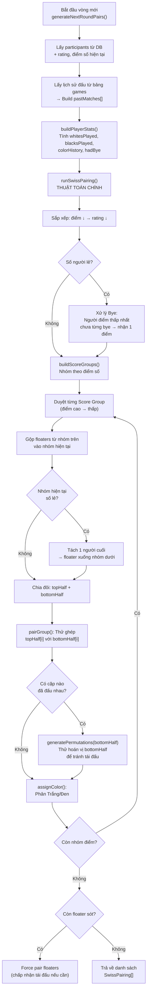
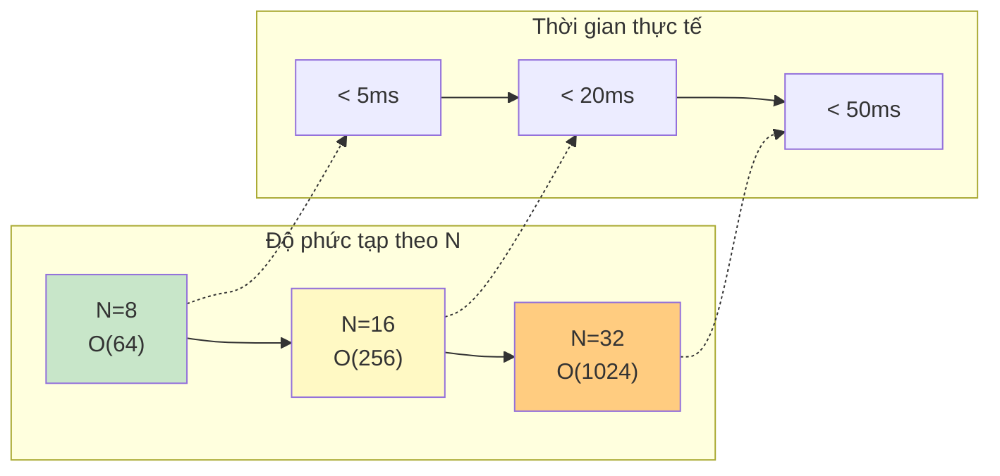

# Thuật Toán Xếp Cặp Hệ Thụy Sĩ (Swiss Pairing) — Giải Đấu

Tài liệu này mô tả chi tiết thuật toán **Swiss Pairing** tự cài đặt trong dự án, dùng để ghép cặp các kỳ thủ trong giải đấu cờ vua. Code triển khai tại [`backend/src/tournament/tournament-swiss.service.ts`](../backend/src/tournament/tournament-swiss.service.ts).

> **Lưu ý**: Đây là code **tự viết 100%**, không dùng bất kỳ thư viện xếp cặp bên ngoài nào. Thuật toán mô phỏng quy tắc Hệ Thụy Sĩ của FIDE, có tối ưu hóa cho quy mô giải đấu nhỏ đến trung bình (≤ 32 người).

---

## 1. Tổng Quan Về Hệ Thụy Sĩ

### 1.1. Hệ Thụy Sĩ là gì?

Hệ Thụy Sĩ (Swiss System) là thể thức thi đấu **không loại trực tiếp**, phổ biến trong cờ vua. Khác với đấu loại (knockout), mọi kỳ thủ đều thi đấu tất cả các vòng. Khác với vòng tròn (round-robin), không phải ai cũng đấu với tất cả mọi người.

**Đặc điểm chính**:
- Số vòng cố định (tối đa 7 vòng trong dự án này)
- Mỗi vòng, các kỳ thủ được ghép cặp với người có **cùng điểm số**
- Không ai gặp cùng một đối thủ quá 1 lần
- Cân bằng màu quân (Trắng/Đen) qua các vòng

### 1.2. Quy Tắc Ghép Cặp

| Quy tắc | Mô tả |
|---------|-------|
| **Cùng điểm** | Ghép người cùng điểm số (win=1, draw=0.5, loss=0) |
| **Không tái đấu** | Không ghép 2 người đã đấu với nhau |
| **Cân bằng màu** | Mỗi người nên có số ván Trắng ≈ số ván Đen |
| **Tránh 3 màu liên tiếp** | Không ai cầm cùng màu 3 vòng liên tiếp |
| **Xếp hạng** | Trong nhóm điểm, xếp theo rating rồi ghép nửa trên vs nửa dưới |
| **Bye** | Nếu số lẻ → người điểm thấp nhất (chưa bye) được nghỉ, nhận 1 điểm |

---

## 2. Cấu Trúc Dữ Liệu

### 2.1. SwissPlayer — Đại Diện Kỳ Thủ

```typescript
interface SwissPlayer {
  userId: string;           // UUID
  username: string;         // Tên hiển thị
  tournamentPoints: number; // Điểm hiện tại (1, 0.5, 0)
  rating: number;           // ELO tương ứng với time control
  whitesPlayed: number;     // Số ván đã cầm Trắng
  blacksPlayed: number;     // Số ván đã cầm Đen
  colorHistory: Array<'w' | 'b' | 'bye'>;  // Lịch sử màu từng vòng
  hadBye: boolean;          // Đã từng nhận Bye chưa
}
```

### 2.2. SwissPairing — Kết Quả Một Cặp Đấu

```typescript
interface SwissPairing {
  gameId: string;
  tournamentId: string;
  round: number;
  whiteId: string;
  whiteUsername: string;
  blackId: string;        // 'BYE' nếu là bye game
  blackUsername: string;
  type: 'regular' | 'bye';
}
```

### 2.3. pairedSet — Tra Cứu Nhanh Cặp Đã Đấu

Sử dụng `Set<string>` với key format `"id1:id2"` (đã sort 2 ID):

```typescript
private pairKey(id1: string, id2: string): string {
  return [id1, id2].sort().join(':');
}
```

Tra cứu **O(1)** — không phân biệt thứ tự trắng/đen.

---

## 3. Thuật Toán Chi Tiết

### 3.1. Luồng Tổng Quan



### 3.2. Bước 1: Sắp Xếp & Xử Lý Bye

```typescript
// Sắp xếp: điểm giảm dần, nếu bằng điểm thì rating giảm dần
const sorted = [...players].sort(
  (a, b) =>
    b.tournamentPoints - a.tournamentPoints ||
    b.rating - a.rating,
);

// Nếu số lẻ → tìm người điểm thấp nhất chưa từng bye
if (sorted.length % 2 !== 0) {
  const byeCandidate = [...sorted]
    .reverse()
    .find((p) => !p.hadBye);

  if (byeCandidate) {
    // Tạo bye pairing: nhận 1 điểm, không cần đấu
    pairings.push({ ... byeCandidate, blackId: 'BYE', type: 'bye' });
    paired.add(byeCandidate.userId);
  }
}
```

> **Quy tắc Bye**: Mỗi kỳ thủ chỉ được nhận bye **tối đa 1 lần** trong giải. Nếu tất cả đều đã bye, người điểm thấp nhất nhận lại.

### 3.3. Bước 2: Tạo Score Groups

Nhóm các kỳ thủ theo điểm số bằng nhau:

```typescript
private buildScoreGroups(players: SwissPlayer[]): SwissPlayer[][] {
  const map = new Map<number, SwissPlayer[]>();
  for (const p of players) {
    const key = p.tournamentPoints;
    if (!map.has(key)) map.set(key, []);
    map.get(key)!.push(p);
  }
  // Trả về các nhóm, điểm cao nhất trước
  return [...map.entries()]
    .sort(([a], [b]) => b - a)
    .map(([, group]) => group);
}
```

**Ví dụ**: 8 người với điểm [3, 3, 2.5, 2, 2, 1.5, 1, 0] → 6 nhóm: `[[3,3], [2.5], [2,2], [1.5], [1], [0]]`

### 3.4. Bước 3: Ghép Cặp Trong Nhóm — Thuật Toán "Fold"

Đây là **trọng tâm** của thuật toán. Với mỗi Score Group:

```
1. Gộp floaters (người chưa ghép được từ nhóm trên) vào pool
2. Nếu pool lẻ → tách người cuối làm floater cho nhóm dưới
3. Chia pool thành topHalf (nửa trên) và bottomHalf (nửa dưới)
4. Thử ghép topHalf[i] với bottomHalf[i]
5. Nếu cặp đã đấu nhau → thử hoán vị bottomHalf (backtracking)
6. Nếu không hoán vị nào hợp lệ → chấp nhận tái đấu (rematch)
```

**Minh họa Fold Pairing** với nhóm 6 người cùng 2 điểm:

```
Trước khi ghép:  [A, B, C, D, E, F]  (đã sắp xếp rating ↓)
                  └─ topHalf ─┘└── bottomHalf ──┘

Fold:             A  B  C
                  │  │  │
                  D  E  F

→ Các cặp: A-D, B-E, C-F
```

Nếu **A đã đấu D** → thử hoán vị bottomHalf: [D,E,F] → [E,F,D] → [F,D,E]... cho đến khi tìm được cấu hình không trùng.

### 3.5. Bước 4: Sinh Hoán Vị (Backtracking)

```typescript
private generatePermutations<T>(arr: T[]): T[][] {
  if (arr.length <= 1) return [arr];

  // GIỚI HẠN: nếu bottomHalf > 7 người → chỉ thử rotation (O(n))
  // thay vì full permutation (O(n!)) để tránh quá tải
  if (arr.length > 7) {
    return Array.from({ length: arr.length }, (_, i) => [
      ...arr.slice(i),
      ...arr.slice(0, i),
    ]);
  }

  // n ≤ 7: sinh toàn bộ n! hoán vị (tối đa 5040)
  const result: T[][] = [];
  const permute = (current: T[], remaining: T[]) => {
    if (remaining.length === 0) {
      result.push(current);
      return;
    }
    for (let i = 0; i < remaining.length; i++) {
      permute(
        [...current, remaining[i]],
        [...remaining.slice(0, i), ...remaining.slice(i + 1)],
      );
    }
  };
  permute([], arr);
  return result;
}
```

> **Tối ưu**: Với nhóm > 7 (rất hiếm trong giải nhỏ), thay vì duyệt $7! = 5040$ hoán vị, chỉ thử $n$ phép **rotation** để đảm bảo thời gian thực thi.

### 3.6. Bước 5: Phân Màu Quân — `assignColor()`

Quy tắc phân Trắng/Đen theo FIDE:

```typescript
private assignColor(playerA, playerB): { white, black } {
  const diffA = playerA.whitesPlayed - playerA.blacksPlayed;
  const diffB = playerB.whitesPlayed - playerB.blacksPlayed;

  // 1. Ai "nợ" Trắng nhiều hơn → cầm Trắng
  if (diffA < diffB) return { white: playerA, black: playerB };
  if (diffB < diffA) return { white: playerB, black: playerA };

  // 2. Hiệu số bằng nhau → xét chuỗi màu liên tiếp cuối cùng
  const lastColorA = this.lastConsecutiveColor(playerA.colorHistory);
  const lastColorB = this.lastConsecutiveColor(playerB.colorHistory);

  // Ai vừa cầm Đen nhiều lần liên tiếp hơn → cầm Trắng
  if (lastColorA.color === 'b' && lastColorB.color === 'w')
    return { white: playerA, black: playerB };
  if (lastColorB.color === 'b' && lastColorA.color === 'w')
    return { white: playerB, black: playerA };

  // 3. Fallback: rating cao hơn cầm Trắng
  return playerA.rating >= playerB.rating
    ? { white: playerA, black: playerB }
    : { white: playerB, black: playerA };
}
```

**Minh họa**:

| Tình huống | diffA | diffB | Kết quả |
|------------|-------|-------|---------|
| A đã cầm Trắng 3, Đen 1 → diff = +2 | +2 | -1 | B cầm Trắng (B "nợ" Trắng hơn) |
| Cả 2 cùng diff = 0, A vừa cầm Đen 2 lần | 0 | 0 | A cầm Trắng (để tránh 3 Đen liên tiếp) |
| Mọi yếu tố bằng nhau | 0 | 0 | Rating cao hơn cầm Trắng |

---

## 4. Đánh Giá Độ Phức Tạp

### Ký Hiệu

| Ký hiệu | Ý nghĩa | Giá trị thực tế |
|---------|---------|-----------------|
| $N$ | Số kỳ thủ trong giải đấu | 2–32 |
| $R$ | Số vòng đã đấu (để tính lịch sử) | 1–7 |
| $G$ | Số Score Group | ≤ $N$ |
| $k$ | Kích thước một Score Group | ≤ $N$ |
| $P$ | Số trận đã đấu trong giải | $O(N \cdot R)$ |

---

### 4.1. `buildPlayerStats()` — Xây Dựng Thống Kê Kỳ Thủ

```typescript
for (const p of participantRows) { /* O(N) */ }
for (const match of pastMatches) { /* O(P) */ }
```

| Độ phức tạp | Phân tích |
|-------------|-----------|
| **Thời gian** | $O(N + P) = O(N \cdot R)$ — duyệt participants + duyệt lịch sử trận |
| **Không gian** | $O(N)$ — mảng `players[]` |

---

### 4.2. `runSwissPairing()` — Thuật Toán Chính

#### a) Sắp xếp kỳ thủ

```typescript
const sorted = [...players].sort((a, b) =>
  b.tournamentPoints - a.tournamentPoints || b.rating - a.rating);
```

| Độ phức tạp | Phân tích |
|-------------|-----------|
| **Thời gian** | $O(N \log N)$ — JavaScript TimSort |
| **Không gian** | $O(N)$ — bản sao mảng |

#### b) Xử lý Bye

```typescript
const byeCandidate = [...sorted].reverse().find((p) => !p.hadBye);
```

| Độ phức tạp | Phân tích |
|-------------|-----------|
| **Thời gian** | $O(N)$ — duyệt mảng 1 lần |
| **Không gian** | $O(1)$ |

#### c) `buildScoreGroups()`

```typescript
const map = new Map<number, SwissPlayer[]>();
for (const p of players) { /* O(N) */ }
```

| Độ phức tạp | Phân tích |
|-------------|-----------|
| **Thời gian** | $O(N)$ — duyệt players + sort groups $O(G \log G)$ |
| **Không gian** | $O(N)$ — Map chứa toàn bộ players |

#### d) `pairGroup()` — Ghép Cặp Một Nhóm

Đây là phần **nặng nhất** của thuật toán:

```typescript
// 1. Sinh hoán vị bottomHalf
const bottomPermutations = this.generatePermutations(bottomHalf);

// 2. Thử từng hoán vị
for (const perm of bottomPermutations) {
  for (let i = 0; i < topHalf.length; i++) {
    // O(k/2) kiểm tra pairedSet.has()
  }
}
```

| Trường hợp | Số hoán vị | Số lần kiểm tra | Tổng |
|------------|-----------|----------------|------|
| $k/2 \leq 7$ | $\leq 7! = 5040$ | $\frac{k}{2} \times 5040$ | $O(k \cdot 5040) = O(k)$ giới hạn hằng số |
| $k/2 > 7$ | $k/2$ (rotations) | $\frac{k}{2} \times \frac{k}{2}$ | $O(k^2)$ |
| Không cần backtrack | 1 | $\frac{k}{2}$ | $O(k)$ |

**Trường hợp tệ nhất**: Mọi cặp trong nhóm đều đã đấu nhau → phải duyệt toàn bộ hoán vị.

| Độ phức tạp | Phân tích |
|-------------|-----------|
| **Thời gian (worst, $k \leq 14$)** | $O(k!)$ — nhưng bị chặn bởi 5040 → $O(1)$ hằng số |
| **Thời gian (worst, $k > 14$)** | $O(k^2)$ — chỉ thử rotation, không full permutation |
| **Thời gian (avg)** | $O(k)$ — thường tìm được permutation hợp lệ ngay lần đầu |
| **Không gian** | $O(k! \cdot k)$ nếu $k \leq 14$ (lưu tối đa 5040 hoán vị × 7 phần tử), $O(k^2)$ nếu $k > 14$ |

#### e) `assignColor()` — Phân Màu

```typescript
const diffA = playerA.whitesPlayed - playerA.blacksPlayed;
const lastColorA = this.lastConsecutiveColor(playerA.colorHistory);
```

| Độ phức tạp | Phân tích |
|-------------|-----------|
| **Thời gian** | $O(R)$ — `lastConsecutiveColor` duyệt `colorHistory` dài tối đa $R$ vòng |
| **Không gian** | $O(1)$ |

---

### 4.3. Bảng Tổng Hợp Độ Phức Tạp

| Thành phần | Thời gian | Không gian |
|------------|-----------|------------|
| Sắp xếp kỳ thủ | $O(N \log N)$ | $O(N)$ |
| Build player stats | $O(N \cdot R)$ | $O(N)$ |
| Build score groups | $O(N)$ | $O(N)$ |
| Bye handling | $O(N)$ | $O(1)$ |
| Pair 1 group (k người) | $O(k^2)$ worst / $O(k)$ avg | $O(k! \cdot k)$ worst |
| Pair all groups | $O(N^2)$ worst / $O(N)$ avg | $O(N^2)$ worst |
| Assign colors (mỗi cặp) | $O(R)$ | $O(1)$ |
| **Tổng toàn bộ** | $\mathbf{O(N^2 + N \cdot R)}$ | $\mathbf{O(N^2 + N \cdot R)}$ |

> **Thực tế**: Với $N \leq 32$, $R \leq 7$:
> - $N^2 = 1024$, $N \cdot R = 224$ → rất nhỏ
> - Thời gian thực thi **< 50ms** cho giải 32 người
> - Backtracking hiếm khi xảy ra vì xác suất 2 người cùng nhóm điểm đã đấu nhau là thấp

---

### 4.4. Trực Quan Hóa



---

## 5. Ví Dụ Minh Họa

### Giải đấu 8 người, Vòng 1

**Dữ liệu đầu vào** (sắp xếp theo rating):

| # | Kỳ thủ | Điểm | Rating |
|---|--------|------|--------|
| 1 | Alice | 0 | 1800 |
| 2 | Bob | 0 | 1750 |
| 3 | Carol | 0 | 1700 |
| 4 | Dave | 0 | 1650 |
| 5 | Eve | 0 | 1600 |
| 6 | Frank | 0 | 1550 |
| 7 | Grace | 0 | 1500 |
| 8 | Hank | 0 | 1450 |

**Thuật toán**:
1. Tất cả cùng 0 điểm → 1 Score Group
2. Không ai đã đấu → không cần backtracking
3. Fold: topHalf = [Alice, Bob, Carol, Dave], bottomHalf = [Eve, Frank, Grace, Hank]

**Kết quả Vòng 1**:
| Cặp | Trắng (lý do) | Đen |
|-----|---------------|-----|
| 1 | Alice (rating cao nhất → trắng) | Eve |
| 2 | Frank (Bob diff=0, Frank chưa đấu → Bob trắng) | Bob |
| 3 | Carol | Grace |
| 4 | Dave | Hank |

> Màu được phân để mỗi người có 1 trắng/1 đen sau vòng 2.

---

### Giải đấu 8 người, Vòng 3 (có lịch sử)

**Bảng điểm sau 2 vòng**:

| Kỳ thủ | Điểm | Rating | Đã đấu với |
|--------|------|--------|-------------|
| Alice | 2.0 | 1800 | Eve, Dave |
| Bob | 1.5 | 1750 | Frank, Eve |
| Carol | 1.5 | 1700 | Grace, Hank |
| Dave | 1.0 | 1650 | Hank, Alice |
| Eve | 1.0 | 1600 | Alice, Bob |
| Frank | 0.5 | 1550 | Bob, Grace |
| Grace | 0.5 | 1500 | Carol, Frank |
| Hank | 0.0 | 1450 | Dave, Carol |

**Score Groups**: `[[Alice(2.0)], [Bob, Carol(1.5)], [Dave, Eve(1.0)], [Frank, Grace(0.5)], [Hank(0.0)]]`

**Xử lý**:
1. **Nhóm 2.0**: [Alice] — 1 người → floater xuống nhóm 1.5
2. **Nhóm 1.5 + floater**: [Alice, Bob, Carol] — 3 người → floater Carol xuống nhóm 1.0
3. **Nhóm 1.5 còn**: [Alice, Bob] → Alice chưa đấu Bob ✅ → Alice-Bob
4. **Nhóm 1.0 + floater**: [Carol, Dave, Eve] → 3 người → floater Eve xuống
5. **Nhóm 1.0 còn**: [Carol, Dave] → Carol chưa đấu Dave ✅ → Carol-Dave
6. **Nhóm 0.5 + floater**: [Eve, Frank, Grace] → 3 người → floater Grace
7. **Nhóm 0.5 còn**: [Eve, Frank] → **Eve đã đấu Frank** ❌ → backtracking...

**Backtracking**: Vì chỉ có 2 người, không thể hoán vị → chấp nhận rematch Eve-Frank hoặc float Frank xuống. Trong code, nếu `totalPlayers < 8`, rematch được phép → Eve-Frank vẫn được ghép.

8. **Nhóm 0.0 + floater**: [Grace, Hank] → Grace chưa đấu Hank? Grace đã đấu Carol, Frank; Hank đã đấu Dave, Carol → Grace-Hank ✅

**Kết quả Vòng 3**: Alice-Bob, Carol-Dave, Eve-Frank (rematch), Grace-Hank.

---

## 6. Tổng Kết

| Đặc điểm | Mô tả |
|----------|-------|
| **Thuật toán** | Fold pairing + Score Groups + Backtracking permutations |
| **Phân màu** | Cân bằng diff(trắng-đen) + tránh 3 màu liên tiếp |
| **Bye** | Mỗi người tối đa 1 bye, ưu tiên người điểm thấp nhất |
| **Tái đấu** | Không cho phép (trừ giải < 8 người hoặc fallback) |
| **Tối ưu** | Giới hạn permutation 7! (5040), rotation cho nhóm lớn |
| **Thời gian** | $O(N^2)$ worst — dưới 50ms với $N \leq 32$ |
| **Không gian** | $O(N^2)$ worst — dưới 1MB với $N \leq 32$ |
| **Code** | 100% tự viết, không dùng thư viện ngoài |

### Tài Liệu Tham Khảo

- [FIDE Handbook — Swiss System](https://handbook.fide.com/chapter/C0403)
- [Wikipedia — Swiss-system Tournament](https://en.wikipedia.org/wiki/Swiss-system_tournament)
- [Chess Programming Wiki — Swiss Pairing](https://www.chessprogramming.org/Swiss_Pairing)
