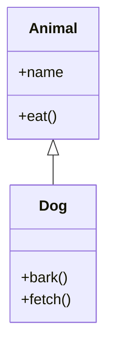
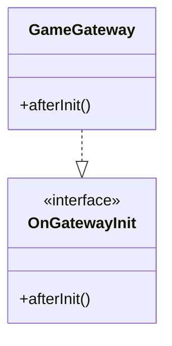
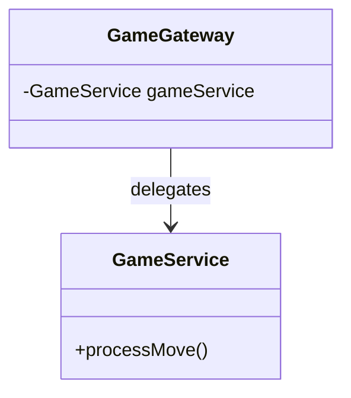
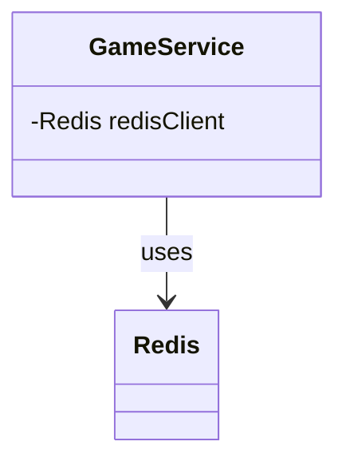
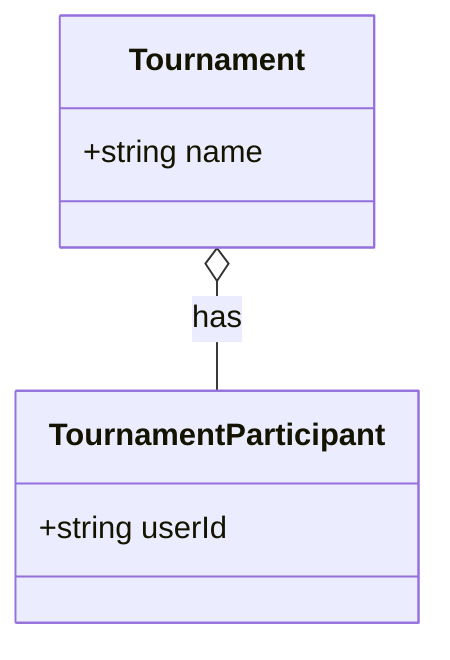
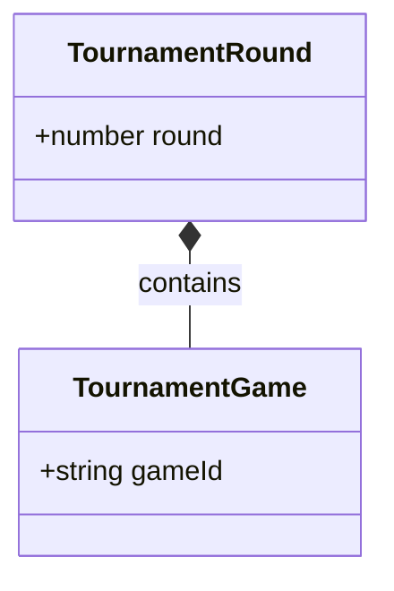
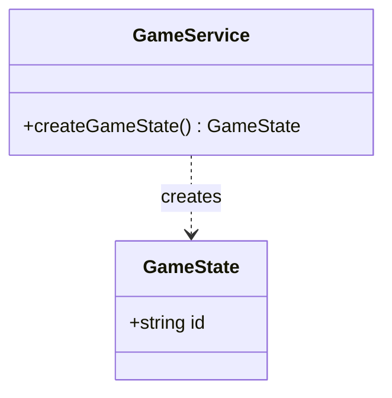
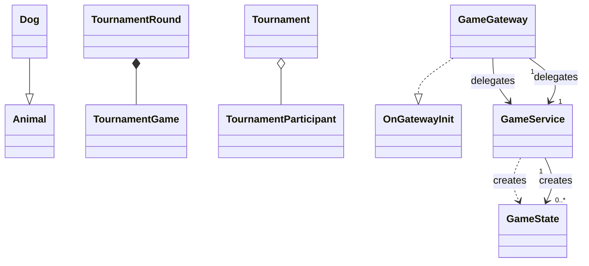

# UML Class Diagram — Toàn Tập Về Mũi Tên Quan Hệ (Relationship Arrows)

> Tài liệu mô tả **TẤT CẢ** các loại mũi tên quan hệ trong UML Class Diagram,  
> bao gồm ký hiệu Mermaid, ký hiệu UML chuẩn, ý nghĩa, và ví dụ cụ thể từ dự án Cờ Vua.

---

## Mục Lục

1. [Tổng quan 6 loại quan hệ](#1-tổng-quan-6-loại-quan-hệ)
2. [Chi tiết từng loại](#2-chi-tiết-từng-loại)
   - [2.1 Inheritance (Kế thừa)](#21-inheritance-kế-thừa)
   - [2.2 Interface Implementation (Hiện thực Interface)](#22-interface-implementation-hiện-thực-interface)
   - [2.3 Association (Liên kết)](#23-association-liên-kết)
   - [2.4 Directed Association (Liên kết có hướng)](#24-directed-association-liên-kết-có-hướng)
   - [2.5 Aggregation (Tập hợp)](#25-aggregation-tập-hợp)
   - [2.6 Composition (Hợp thành)](#26-composition-hợp-thành)
   - [2.7 Dependency (Phụ thuộc)](#27-dependency-phụ-thuộc)
3. [Bảng so sánh nhanh](#3-bảng-so-sánh-nhanh)
4. [Cách chọn đúng mũi tên](#4-cách-chọn-đúng-mũi-tên)
5. [Multiplicity (Số lượng)](#5-multiplicity-số-lượng)

---

## 1. Tổng quan 6 loại quan hệ

Trong UML Class Diagram có **6 loại quan hệ** chính, phân biệt qua **hình dạng mũi tên** và **kiểu đường nét** (liền/đứt):

```
┌──────────────────────────────────────────────────────────────────┐
│  Mạnh nhất                                                       │
│  ┌──────────┐ ┌──────────────┐ ┌──────────┐ ┌──────┐ ┌────────┐ │
│  │Kế thừa   │ │Implementation│ │Hợp thành  │ │Tập hợp│ │Liên kết│ │
│  │───▷      │ │- - -▷       │ │◆───      │ │◇───  │ │────→  │ │
│  │Inheritance│ │(Interface)  │ │Composition│ │Aggreg.│ │Assoc.  │ │
│  └──────────┘ └──────────────┘ └──────────┘ └──────┘ └────────┘ │
│                                                        ┌────────┐ │
│                                                        │Phụ thuộc│ │
│                                                        │- - -→  │ │
│                                                        │Dependency│ │
│                                                        └────────┘ │
│  Yếu nhất                                                        │
└──────────────────────────────────────────────────────────────────┘
```

| # | Tên quan hệ | Mermaid | UML chuẩn | Đường | Mũi tên | Ý nghĩa |
|---|------------|---------|-----------|-------|---------|---------|
| 1 | **Kế thừa** (Inheritance) | `--|>` | ────▷ | Liền | Tam giác rỗng | **IS-A**: Class con LÀ MỘT class cha |
| 2 | **Hiện thực** (Implementation) | `..|>` | - - -▷ | Đứt | Tam giác rỗng | **CAN-DO**: Class thực thi interface |
| 3 | **Hợp thành** (Composition) | `*--` | ◆─── | Liền | Hình thoi đặc | **IS-PART-OF** (mạnh): Bộ phận KHÔNG tồn tại độc lập |
| 4 | **Tập hợp** (Aggregation) | `o--` | ◇─── | Liền | Hình thoi rỗng | **HAS-A** (yếu): Bộ phận CÓ THỂ tồn tại độc lập |
| 5 | **Liên kết** (Association) | `-->` | ────→ | Liền | Mũi tên mở | **USES-A**: Class này BIẾT VỀ class kia |
| 6 | **Phụ thuộc** (Dependency) | `..>` | - - -→ | Đứt | Mũi tên mở | **USES** (tạm thời): Class này DÙNG class kia tạm thời |

---

## 2. Chi tiết từng loại

### 2.1 Inheritance (Kế thừa)

> **Mermaid**: `Child --|> Parent`  
> **UML**: Đường liền + tam giác rỗng (hướng về class cha)  
> **Câu hỏi**: "Class con CÓ PHẢI LÀ class cha không?" (IS-A)

```
    ┌──────────┐          ┌──────────┐
    │  Animal  │◁─────────│   Dog    │
    │ +name    │  extends │ +bark()  │
    │ +eat()   │          │ +fetch() │
    └──────────┘          └──────────┘
```



**Khi nào dùng**: Class con kế thừa TOÀN BỘ thuộc tính & phương thức của class cha.  
**Ví dụ trong dự án**: NestJS dùng DI thay vì kế thừa, nên ít dùng `--|>`.

---

### 2.2 Interface Implementation (Hiện thực Interface)

> **Mermaid**: `Class ..|> Interface`  
> **UML**: Đường đứt + tam giác rỗng (hướng về interface)  
> **Câu hỏi**: "Class này CÓ THỂ LÀM ĐƯỢC những gì interface yêu cầu không?" (CAN-DO)

```
    ┌───────────────┐            ┌──────────────┐
    │«interface»    │            │ GameGateway  │
    │ OnGatewayInit │◁-----------│              │
    │ +afterInit()  │ implements │ +afterInit() │
    └───────────────┘            └──────────────┘
```



**Khi nào dùng**: Class triển khai (implements) một interface trong NestJS.  
**Ví dụ trong dự án**: Tất cả Gateway đều implements `OnGatewayInit`, `OnGatewayConnection`, `OnGatewayDisconnect`.

---

### 2.3 Association (Liên kết)

> **Mermaid**: `ClassA --> ClassB`  
> **UML**: Đường liền + mũi tên mở (Open Arrowhead)  
> **Câu hỏi**: "Class A có BIẾT VỀ class B không?" (USES-A / KNOWS-A)

Đây là quan hệ **phổ biến nhất** trong dự án. Thể hiện class A **giữ một tham chiếu** (reference) đến class B.

```
    ┌──────────────┐          ┌──────────────┐
    │ GameGateway  │─────────→│ GameService  │
    │ -gameService │ delegates│              │
    └──────────────┘          └──────────────┘
```



**Khi nào dùng**:
- Gateway → Service (Gateway giữ reference đến Service)
- Controller → Service (Controller giữ reference đến Service)
- Service → Service (Service gọi Service khác)
- Service → Infrastructure (Service giữ reference đến Redis/DB client)

**Ví dụ trong dự án**:
```
GameGateway "1" --> "1" GameService : delegates
AuthController "1" --> "1" AuthService : REST calls
GameService "1" --> "1" LeaderboardService : updateELO
```

---

### 2.4 Directed Association (Liên kết có hướng)

Là biến thể của Association, nhưng chỉ một chiều biết về chiều kia.

```
    ┌──────────────┐          ┌──────────────┐
    │ GameService  │─────────→│    Redis     │
    │ -redisClient │   uses   │              │
    └──────────────┘          └──────────────┘
```



> **Lưu ý**: Mermaid không phân biệt Association có hướng và vô hướng — cả 2 đều dùng `-->`.

---

### 2.5 Aggregation (Tập hợp)

> **Mermaid**: `Whole o-- Part`  
> **UML**: Đường liền + hình thoi RỖNG (hướng về class chứa)  
> **Câu hỏi**: "Bộ phận CÓ THỂ tồn tại ĐỘC LẬP với tổng thể không?" (HAS-A yếu)

```
    ┌──────────────┐          ┌──────────────┐
    │  Tournament  │◇────────→│ Tournament   │
    │              │  has     │ Participant  │
    └──────────────┘          └──────────────┘
        (Tổng thể)                (Bộ phận)
```



**Khi nào dùng**: Bộ phận có thể tồn tại độc lập. Ví dụ: Người chơi tồn tại ngay cả khi tournament bị xóa.  
**Ví dụ trong dự án**: `Tournament o-- TournamentParticipant` (người chơi vẫn tồn tại nếu tournament bị xóa).

---

### 2.6 Composition (Hợp thành)

> **Mermaid**: `Whole *-- Part`  
> **UML**: Đường liền + hình thoi ĐẶC (hướng về class chứa)  
> **Câu hỏi**: "Bộ phận KHÔNG THỂ tồn tại nếu thiếu tổng thể?" (IS-PART-OF mạnh)

```
    ┌──────────────┐          ┌──────────────┐
    │TournamentRound│◆────────→│TournamentGame│
    │              │ contains │              │
    └──────────────┘          └──────────────┘
        (Tổng thể)                (Bộ phận)
```



**Khi nào dùng**: Bộ phận KHÔNG thể tồn tại nếu tổng thể bị hủy. Ví dụ: `TournamentGame` không có ý nghĩa nếu `TournamentRound` bị xóa.  
**Ví dụ trong dự án**: `TournamentRound *-- TournamentGame` (game đấu không tồn tại nếu round bị xóa).

---

### 2.7 Dependency (Phụ thuộc)

> **Mermaid**: `Client ..> Supplier`  
> **UML**: Đường đứt + mũi tên mở (Open Arrowhead)  
> **Câu hỏi**: "Class này có DÙNG TẠM class kia không?" (USES temporarily)

Đây là quan hệ **yếu nhất**. Class A dùng class B nhưng **không giữ tham chiếu lâu dài**.

```
    ┌──────────────┐          ┌──────────────┐
    │ GameService  │- - - - -→│  GameState   │
    │              │ creates  │  (DTO)       │
    └──────────────┘          └──────────────┘
```



**Khi nào dùng**:
- Service tạo/trả về DTO (dùng tạm thời, không giữ reference)
- Gateway gửi event đến Gateway khác (giao tiếp gián tiếp qua event)
- Service gọi một utility function

**Ví dụ trong dự án**:
```
GameService "1" ..> "0..*" GameState : creates (trả về DTO, không lưu)
GameGateway "1" ..> "0..1" WatchGateway : broadcast event
```

---

## 3. Bảng so sánh nhanh

| Loại | Mermaid | Đường | Đầu mũi tên | Sức mạnh | Ví dụ thực tế |
|------|---------|-------|-------------|----------|--------------|
| Kế thừa | `--|>` | Liền | △ rỗng | ★★★★★ | `Dog --|> Animal` |
| Implementation | `..|>` | Đứt | △ rỗng | ★★★★☆ | `GameGateway ..|> OnGatewayInit` |
| Composition | `*--` | Liền | ◆ đặc | ★★★★☆ | `Round *-- Game` |
| Aggregation | `o--` | Liền | ◇ rỗng | ★★★☆☆ | `Tournament o-- Participant` |
| Association | `-->` | Liền | → mở | ★★☆☆☆ | `Gateway --> Service` |
| Dependency | `..>` | Đứt | → mở | ★☆☆☆☆ | `Service ..> DTO` |

---

## 4. Cách chọn đúng mũi tên

Dùng cây quyết định sau để chọn loại quan hệ phù hợp:

```
                          ┌─────────────────┐
                          │ Class A có liên  │
                          │ quan đến Class B?│
                          └────────┬────────┘
                                   │
                    ┌──────────────┼──────────────┐
                    │ Có                          │ Không
                    ▼                             ▼
          ┌──────────────────┐            ┌──────────────┐
          │ A có phải LÀ MỘT │            │  Không vẽ    │
          │ (IS-A) B không?  │            │  quan hệ     │
          └────────┬─────────┘            └──────────────┘
                   │
        ┌──────────┼──────────┐
        │ Có                  │ Không
        ▼                     ▼
  ┌───────────┐     ┌────────────────────┐
  │ KẾ THỪA   │     │ A có chứa B như    │
  │ ───▷      │     │ một BỘ PHẬN không? │
  └───────────┘     └────────┬───────────┘
                             │
                  ┌──────────┼──────────┐
                  │ Có                  │ Không
                  ▼                     ▼
        ┌──────────────────┐   ┌──────────────────┐
        │ B có tồn tại     │   │ A có GIỮ THAM    │
        │ ĐỘC LẬP với A?   │   │ CHIẾU đến B?     │
        └────────┬─────────┘   └────────┬─────────┘
                 │                      │
      ┌──────────┼──────────┐    ┌──────┼──────┐
      │ Có       │ Không    │    │ Có   │ Không│
      ▼          ▼          │    ▼      ▼      │
┌──────────┐ ┌──────────┐   │ ┌────┐ ┌──────┐  │
│ TẬP HỢP  │ │ HỢP THÀNH│   │ │LIÊN│ │PHỤ   │  │
│ ◇───     │ │ ◆───     │   │ │KẾT │ │THUỘC │  │
│Aggregation│ │Composition│  │ │──→ │ │- -→ │  │
└──────────┘ └──────────┘   │ └────┘ └──────┘  │
                             └──────────────────┘
```

**Quy tắc ngón tay cái (rule of thumb)**:

| Nếu... | Thì dùng... | Mermaid |
|--------|-------------|---------|
| A **là một** B | Kế thừa | `--|>` |
| A **thực thi** interface B | Implementation | `..|>` |
| B **là một phần không thể tách rời** của A | Composition | `*--` |
| B **là một phần có thể tách rời** của A | Aggregation | `o--` |
| A **giữ tham chiếu** đến B (field/property) | Association | `-->` |
| A **chỉ dùng B tạm thời** (tham số, return type) | Dependency | `..>` |

---

## 5. Multiplicity (Số lượng)

Multiplicity đặt trên mỗi đầu của quan hệ để chỉ **có bao nhiêu đối tượng** tham gia:

| Ký hiệu | Ý nghĩa | Ví dụ |
|---------|---------|-------|
| `"1"` | Đúng 1 | Mỗi game có đúng 1 trạng thái |
| `"0..1"` | 0 hoặc 1 | Game có thể có hoặc không có winner |
| `"0..*"` hoặc `"*"` | 0 hoặc nhiều | User có 0 hoặc nhiều game |
| `"1..*"` | Ít nhất 1 | Tournament có ít nhất 2 người chơi |
| `"n..m"` | Từ n đến m | Round-robin: 5..10 players |

**Cách đọc**:
```
GameService "1" --> "0..*" GameState : creates
              │               │
              ▼               ▼
      1 GameService     0..nhiều GameState
```

Đọc là: **"1 GameService tạo ra 0 hoặc nhiều GameState"**

---

## Phụ lục: Mermaid Syntax Cheat Sheet



---

> **Cập nhật**: 17/06/2026 — Tạo mới, mô tả toàn bộ 6 loại mũi tên UML Class Diagram.
